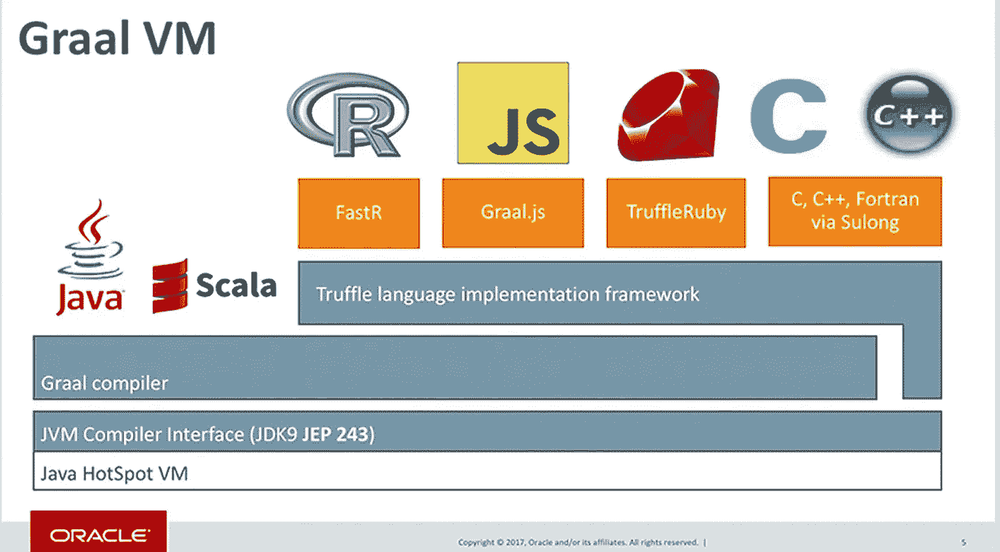
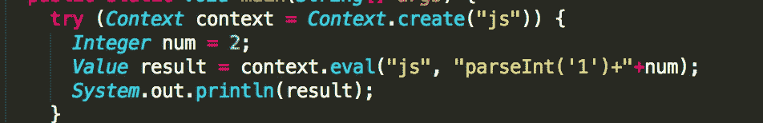
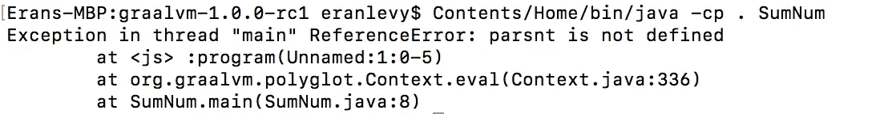
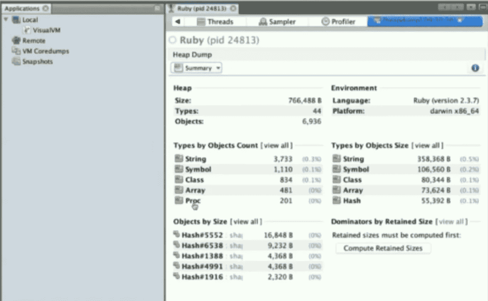
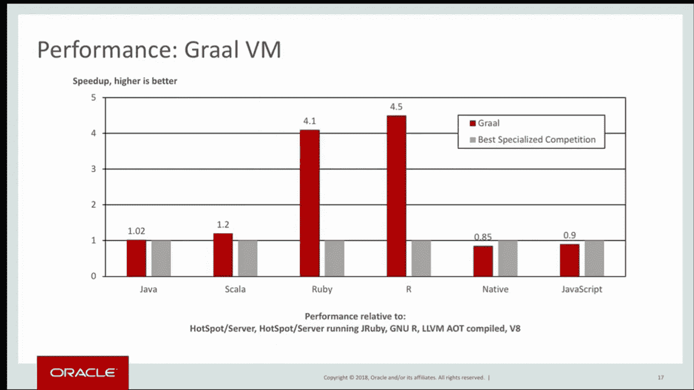
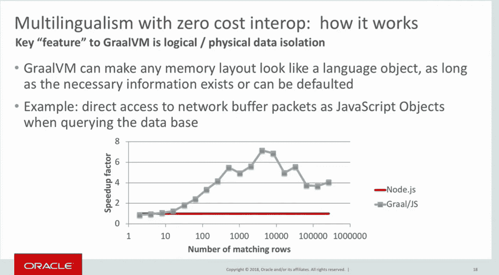
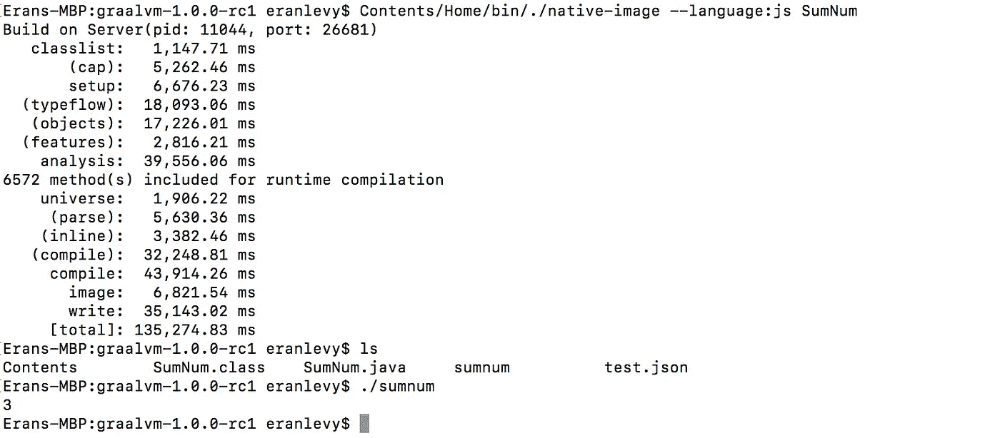

# 为什么 Java 社区应该接受 GraalVM

> 原文：<https://medium.com/hackernoon/why-the-java-community-should-embrace-graalvm-abd3ea9121b5>

Java 发展成为一个[厂商中立的平台](https://blogs.oracle.com/theaquarium/opening-up-ee-update)，[移动到六个月发布一次](https://jcp.org/aboutJava/communityprocess/ec-public/materials/2017-08-15/JCP-EC-Minutes-August-2017.html)，在最近的版本中平台的进步是非常受欢迎的。作为一个社区，我们见证了 Java 平台的有趣转变——从一个每两年发布一次新特性的非常稳定的平台(即参见 Java 7 & Java 8 发布日期)转变为一个快速发展的平台，并且必须与快速发展的新玩家竞争。从我的角度来看，阅读这场辩论并了解企业在很长一段时间后将如何采用这些快速创新真的很有趣，他们已经习惯了在支持创新和不可预测的变化的稳定性之间进行权衡。

尽管 Java 9 在去年的发布中带来了巨大的进步(即模块化——T4 项目拼图)，但我认为围绕两个真正有趣的 jep——[JEP 243](http://openjdk.java.net/jeps/243)和 [JEP 295](http://openjdk.java.net/jeps/295) 并没有太多的讨论。两者都带来了令人敬畏的新功能，可以使 Java 平台领先于其他平台几个步骤！

# 如果你有一个通用的虚拟机会怎么样？

[**GraalVM**](http://graalvm.org) 是 Oracle 实验室开发的一个研究项目，已经在 Twitter 上投入使用，他们甚至为这个非常棒的项目做出了贡献(参见 Christian Thalinger 的这篇 [JavaOne talk](https://www.youtube.com/watch?v=G-vlQaPMAxg) 关于为什么 Graal 非常适合 Twitter)。Graal 是一个可以插入 Hotspot VM 的 JIT 编译器。JIT 基本上是将 JVM 字节码(由您的 *javac* 命令生成)翻译成机器码的组件，机器码是您的底层执行环境(即您的处理器)可以理解的语言——所有这些都是在运行时动态发生的！Graal 的目标是取代用 C++编写的旧的 C2 编译器。Java 社区的主要贡献者明确表示，维护现有的编译器代码已经成为一项艰巨的任务。GraalVM 之所以吸引人，是因为最终您可以在您日常使用的标准开发环境中调试 JIT 编译器，因为它是用 Java 编写的，开发人员可以更容易地投入其中。

那么，我们怎么会有另一个可以插入甚至用 Java 编写的 JIT 编译器呢？！

Slide from [Devoxx talk](https://www.youtube.com/watch?v=mMmOntDWSgw) by Thomas Wurethinger

这一切都要感谢 JDK 9 中提供的 **JVMCI** (Java 级 JVM 编译器接口)。编译器接口允许您将附加的 Java 编译器(如 Graal)插入到 JVM 中。最重要的是，你会发现 **Truffle** 框架，它使你能够为除 Java & Scala 之外的其他语言构建解释器和实现。如果你想运行一种新的编程语言，你只需将它与 Truffle 集成，框架就会为你生成优化的机器代码。如你所见，已经有了 R、Ruby、Javascript 甚至 C/C++的语言实现。在写这篇文章的时候，我看到 Golang 支持的 GitHub 有一个问题，看起来不用花太多时间，我们就会看到它与 Truffle 的集成。在性能方面，GraalVM 团队在几次会谈中展示了他们的一些语言实现甚至比现有的更快。

# 为什么我对 GraalVM 如此热情？

**多语言** —所有语言(甚至基于 LLVM 的语言)共享相同的 VM 及其功能。在这里，您可以看到我如何在 Java 中嵌入一个 Javascript 内置函数并打印结果:

我使用的是 GraalVM 1.0(基于 JDK 8)。让我们编译并运行:

*bin/javac ~/apps/graal VM-1 . 0 . 0-rc1/sum num . Java*

*java -cp。SumNum*

它打印结果:3

我很好奇在运行时异常的情况下会发生什么——我将调用一些未定义的函数，而不是调用 *parseInt* :

这只是一个简单的例子，但你可以做得更深入。最后，我可以使用 R 提供的强大的可视化库和我的 Javascript 数据结构——是的，就是这么简单！使用 Graal，在平台之间共享对象要容易得多；)您不必再包装或重写您的库。

显然，Graal 中的互操作性是在为我的任务选择最佳语言和编译时静态代码分析之间的权衡。

**语言不可知工具** —除了 Java & Scala，所有语言都与 Truffle 框架对话。因此，您可以使用同一套工具来进行监控、调试和分析。厉害！就性能而言，它使开发体验变得更加容易。目前，Graal 实现它的方式非常有限。它们与 Chrome 开发工具协议集成在一起。调试正在运行的虚拟机非常容易。你需要做的就是用 *inspect* 参数运行你的脚本，它会打开一个端口，你可以使用 Chrome 开发工具调试任何你想调试的语言:R，Python 等等。查看他们的[文档](https://www.graalvm.org/docs/reference-manual/tools/)了解更多信息。

**在[中引起我注意的事情](https://www.youtube.com/watch?v=wBegU4d4GRc)**Oracle 的一次演讲是关于 Chris 如何使用 *jvisualvm* 工具来剖析一个 Ruby 应用程序，他甚至可以进行线程转储。很酷，不是吗？！；)

[Oracle Developers](https://www.youtube.com/watch?v=wBegU4d4GRc) — Run Programs Faster with GraalVM

这表明拥有一个抽象平台是多么强大。现在你所要做的就是闭上你的眼睛，梦想用如此强大的能力可以实现伟大的事情。

**性能** — Graal 基准测试报告显示，由于 GraalVM 执行对象分配的方式，其几乎所有实现都实现了巨大的性能提升:

[Thomas Wuerthinger talk at Devoxx](https://www.youtube.com/watch?v=8AYESZIaacg)

Thomas 提到他们[看到了 Java Streams](http://www.graalvm.org/docs/examples/java-performance-examples/) 的巨大改进，lambdas 和他们最近的基准测试甚至显示了各种实现的更好的数字。Chris Seaton 在博客中写道“TruffleRuby 无疑是最快的 Ruby 实现，通常比其他实现快 10 倍，同时仍然实现了几乎所有的语言和标准库”。Twitter 在产品中运行 GraalVM，特别是因为它在 Scala 服务中的性能改进。他们说这为他们省了钱。

就互操作性而言，Thomas 在 Devoxx 的演讲中展示了在同一过程中调用一种语言到另一种语言的优势。基准测试清楚地表明，您可以削减上下文切换和对象编组/解组的成本:

GraalVM 的一个更有趣的项目是底层 VM。我把它作为“性能”部分的一部分，但是**比那个**更有野心。**底层 VM** 是用 Java 编写的 **AOT** (超前)编译器(参见[JEP 295](http://openjdk.java.net/jeps/295)——JDK 9 中集成的 AOT 编译器比较老，我不确定 JDK 10 和 JDK 11 中集成了什么)。它使用 GraalVM 提前创建一个可执行的二进制 Mach-O 或 ELF 映像，该映像不需要在 [Hotspot VM](https://hackernoon.com/tagged/hotspot-vm) 上运行，而是在底层 VM 本身上运行。编译需要一些时间，但是最终你有了一个可执行的二进制文件，你可以在任何你想运行的地方运行:服务器，移动设备，等等。这里很酷的一点是，它提前执行了所有的优化和打包，因此生成的映像启动时间要快得多(根据他们的文档，您将有更低的运行时内存开销，因为它在编译时执行所有的优化):

AOT my polyglot sample program

正如您在上面的截图中看到的，编译我的示例多语言程序花费了 2 分多钟，但是它的执行时间要快得多(查看基准测试的 [GraalVM 参考](http://www.graalvm.org/docs/reference-manual/aot-compilation/))。据我所知，有各种各样的限制，但我立即想到的第一个优势是，随着我的系统扩展，我可以比以前更快地旋转新容器。我看到[这篇](/graalvm/instant-netty-startup-using-graalvm-native-image-generation-ed6f14ff7692)博客文章解释了如何创建一个即时的 Netty 启动映像；所以想象一下你可以用它做多少伟大的事情。

为了推动 JVM 平台向前发展，Oracle 似乎正朝着正确的方向前进。根据 [JEP 317](http://openjdk.java.net/jeps/317) ，Graal 在 JDK 10 中变得更加完整。现在，只需添加几个命令行选项，编译器之间的转换就变得更加简单。如果您没有使用 JDK 10，您可以从 GraalVM 网站下载其中一个版本(在编写 GraalVM 1.0 时，它是基于 JDK 8 的)，并且已经与其他语言运行时打包在一起，因此您可以轻松地尝试多语言编程。

我希望你有足够的信息来帮助你开始。我希望甲骨文将继续在这个伟大的项目上投入时间。

玩得开心！

埃兰