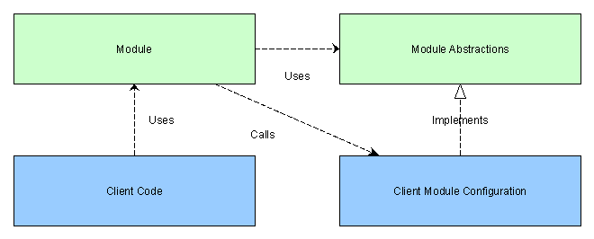

# 为什么开闭原则是你需要知道却不知道的原则

> 原文：<https://medium.com/hackernoon/why-the-open-closed-principle-is-the-one-you-need-to-know-but-dont-176f7e4416d>



因为它的定义措辞不当，开/闭原则可能是 5 个坚实原则中最容易被误解的。然而，当正确应用时，它可以通过良好的体系结构比其他任何方法节省更多的开发工作。

Bertrand Meyer 提出的原则是:

> 软件实体(类、模块、函数等。)应该对扩展开放，但对修改关闭

后来，当他把它纳入他的坚实的原则，鲍伯·马丁表达得更好:

> 您应该能够扩展系统的行为，而不必修改该系统。

这在编写许多第三方使用的软件包或库的上下文中是最容易理解的。本质上，你希望这个库被它的用户在最广泛的上下文中使用(开放扩展)，但是你希望尽可能少地改变它，因为每次你做的时候你都迫使你的用户更新他们的版本，在最坏的情况下，修复破坏改变的后果。此外，这有助于提高可靠性，因为理想情况下，随着时间的推移，代码将通过在许多环境中的使用得到越来越好的测试，并且越来越不频繁地更改，因此不太容易被这些更改破坏。

同样的情况在较小程度上也适用于当你在应用程序中的一个地方编写代码而在其他地方使用时:如果你可以通过编写新的代码来使它适应不同的目的，这比修改它更好，因为修改它可能会导致在使用它的任何地方都需要进行更改。

你可以看到第二个原则就像是关于最小化未来代码变更的后果的单一责任原则。就像 SRP 一样，您在实践中遵循这一原则的方式是由对您的软件需求在未来可能如何变化的有根据的猜测决定的。在 SRP 中，您对分解以及在代码中何处绘制封装边界做出判断。在 OCP 中，你判断在你的模块中你将使*抽象*并留给你的模块的消费者去具体化，以及给你自己提供什么具体的功能。

与 SRP 一样，这不是一条单行道，您必须编写永远不需要修改并且总是可以扩展的代码。唯一不需要修改的代码是如下所示的类:

```
public class TotallyAbstract<TArg, TRes>
{
  private Func<TArg, TRes> f; public TotallyAbstract(Func<TArg, TRes> f)
  {
    this.f = f;
  } public TRes Apply(TArg a)
  {
    return f(a);
  }
}
```

你会注意到它实际上没有任何功能！这里是相反的:你只能让它做一件事，你必须修改它做任何其他事情:

```
public class TotallyConcrete
{
  public int Apply()
  {
    return 2 + 2;
  }
}
```

任何合理的模块都必须位于这两个极端之间:要做有用的事情，它必须是部分具体的，然而要在一系列的上下文中使用，它必须是部分抽象的。所以不要有极端的想法，认为你的代码永远不应该改变，只应该扩展！

功能或程序可以根据其接收的参数和配置数据改变其功能。然而，当谈到“扩展”时，开闭原则似乎并没有谈到这种功能的适应。这听起来像是写代码而不是写数据:然而这两者之间的界限或多或少总是模糊的。模块的配置可以使用数据文件或代码来完成。

用参数调用函数是简单编程的一部分。但是，用其他代码扩展代码更高级。然而，这可能是作为一名程序员要学习的最重要的技能，因为它能让你写更少的代码！它通过让您在更广泛的上下文中使用相同的代码来做到这一点。这里的技巧不仅仅在于编写易于扩展的代码，还在于发现这样做的机会。

这种工作方式的一个非常有力的例子是插件架构。一个典型的应用是在图像编辑器中，你可以插入第三方制作的滤镜。图像编辑器对任何过滤器一无所知:它有一个契约，这个契约是一个抽象，定义了一段代码作为图像过滤器的最低要求，然后它对插件不做任何进一步的假设，除了它们满足这个契约。这允许图像编辑器在不改变其任何代码的情况下通过其他代码扩展其功能。鲍伯·马丁在这里写到了这些:[https://8 thlight . com/blog/uncle-bob/2014/05/12/theopenclosedprinciple . html](https://8thlight.com/blog/uncle-bob/2014/05/12/TheOpenClosedPrinciple.html)。

这当然是依存倒置的一个例子，实中的 D。事实上，用代码对一个模块的所有扩展都是一种依赖倒置的形式:区别在于你用什么样的抽象来指定将被注入的依赖:

1.  **函数参数(无数据)**
    模块在其 API 中有参数，允许函数传入并在模块操作的上下文中执行，以指定或修改其功能。在我看来，这在面向对象编程中没有得到充分利用，它提供了一种清晰而简单的方式来注入代码，这种方式在函数不需要在其他上下文中重用的情况下工作得最好，并且不会像在类中那样自然地与一组相关的函数组合在一起。
2.  **完全抽象类参数(接口或完全抽象基类)**
    与上述类似，除了注入模块的代码现在是以类的形式，将自定义方法和可能的数据组合在一起。这是面向对象编程中最推荐的方法，但是如果合适的话，提供单个函数会更简单，并且通常忽略的一点是，与基类不同，接口没有给模块作者机会来限制和控制如何提供任何功能，这可能会导致问题。
3.  **部分抽象类参数(实现继承)**
    客户端代码利用类继承创建一个子类，这个子类继承了模块中一个父类的数据和一些方法，根据需要增加或改变一些方法，增加数据。在有更专业的相关类的层次结构的情况下使用很好，但管理起来会变得复杂，因此许多作者不鼓励这样做。

事实上，从根本上来说，它们之间没有太大的区别，它们都是将客户端代码注入模块的不同方式。在函数式语言中，你只有第一个。在面向对象的语言中，这三者你都有(根据函数变量实现的好坏，第一个可能有点难)。

希望这篇文章能提供一些提示，让我们重新审视关闭代码的方式，以适应和重用更改和打开代码的需要，因为这方面的成功可以在可维护性和效率方面获得巨大的收益。

本系列中关于单一责任原则的上一篇文章位于[https://hacker noon . com/you-don-understand-the-Single-respons ibility-Principle-ab FDD 005 b 137](https://hackernoon.com/you-dont-understand-the-single-responsibility-principle-abfdd005b137)。

本系列中关于 Liskov 替代原则的下一篇文章位于[https://medium . com/@ Jim _ EJ/the-lis kov-Substitution-Principle-and-why-you-may-want-enforce-it-6 F5 BBB 05 c 06d](/@jim_ej/the-liskov-substitution-principle-and-why-you-might-want-to-enforce-it-6f5bbb05c06d)。

推特:@jim_ej