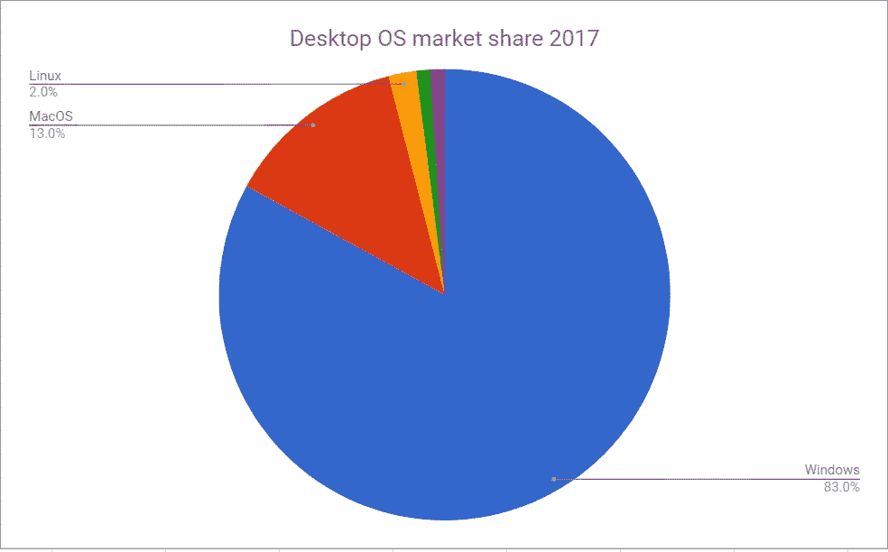

# 为什么对软件开发者来说完美的操作系统不存在

> 原文：<https://medium.com/hackernoon/why-the-perfect-os-for-a-software-developer-doesnt-exist-412559314ebd>

Desktop Operating System Market Share 2017

# 为什么选择 Windows 10

Windows 10 相比 Windows 8/7 提升了很多。以前缺乏虚拟桌面真的让我用了很长时间的 Linux。有了 HyperV，虚拟机比以前更快了。与 Linux 相比，它是重量级的，并且随着时间的推移而变慢。开发者使用它的原因和黑客为它开发病毒的原因一样；超过 80%的人使用它。还有，**的近况。NET 核心标准和基于 T4 cmdlet 的强大脚本语言 T2 Powershell T3 使得为 windows 构建脚本变得更加容易。**

# 为什么选择 Mac OS

苹果。他们很好。善于让消费者使用他们的整个生态系统；苹果电脑、苹果手机、苹果手表……它们都不能很好地与安卓和 Windows 等其他操作系统兼容。如果我告诉你**你需要拥有一台 Mac 来开发 Mac OS 应用和 iOS 应用**呢？你可以编写一个 Xamarin Forms 应用程序，但仍然需要一台 Mac 来编译和测试 iOS 上的应用程序。几乎所有的移动开发者都在某个时候被迫使用 Mac OS。谢谢苹果☹️.

# 为什么选择 Linux

Mac 和 Windows 都没有对虚拟窗口如此丰富的支持。总是在顶端，保持在所有的工作区和各种各样的快捷方式，使 Linux 开发更加愉快。

Linux =开源=免费。对于后端 python、ruby 和 php 开发人员来说绝对是非常棒的。

由于发行版本不同，Linux 非常灵活。从桌面消费发行版(如 Ubuntu)到高级渗透测试 Linux 发行版(如 Kali Linux)。这大概就是你看到‘黑客’使用 Linux 的原因；你根本无法在 Windows 和 Mac OS 上做这些事情。众所周知，Linux 的 bash 命令行也很棒，但是最近许多人开始转向运行在所有操作系统上的 Powershell，默认安装在 Windows 10 上。

# 结论

如果你是一个在许多领域都很有经验的软件开发人员，那么没有一个操作系统会仅仅为你工作。那你怎么选择你的操作系统呢？Y **你不用挑一个操作系统**。你几乎可以买到任何一台电脑，并安装这三个软件。但是请记住，苹果声明在非苹果硬件上安装 Mac OS 是违反他们的政策的，所以我不鼓励这样做。

如果你打算使用 Linux、Windows 和 Mac OS，考虑购买至少 256 GB 的固态硬盘。在硬盘上运行操作系统真的很糟糕，相信我，128 GB 的固态硬盘绝对不够 2 个系统使用。

然而，并不是每个人都在开发原生的 iOS / Windows 应用。Linux 可以很好地用于网络开发，但是当涉及到用 unity 开发游戏时，我不会用它。就我个人而言，我使用的是戴尔 XPS 13，我同时运行所有 3 个程序；Windows 是我主要的开发/教育/办公机器(visual studio 很棒)，MacOS 用于 iOS 测试/部署，最后，Kali Linux 用于……社会工程和‘道德黑客’。