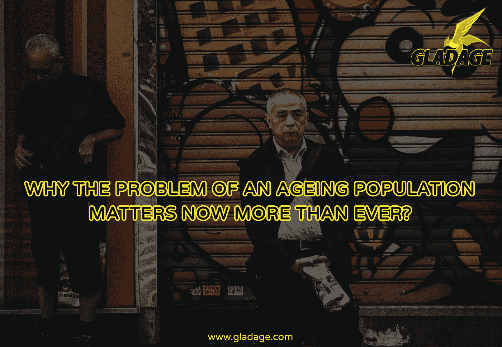

# 为什么人口老龄化问题比以往任何时候都重要？

> 原文：<https://medium.com/hackernoon/why-the-problem-of-an-aging-population-matters-now-more-than-ever-acaa9ccab043>

世界每分钟都在变老。根据联合国的一份报告，老年抚养比(65 岁以上的人与 100 名 15 岁至 64 岁的人的比率)多年来一直在急剧上升。2005 年，这一比率为 11.3，2010 年为 11.7，预计将进一步增长，到 2020 年将达到 14.4，到 2030 年将达到 18。在你有其他想法之前，让我们告诉你这是一个全球性的问题。每个国家都在经历人口老龄化的增长，并将相应地受到影响。

我们现在可能没有意识到这一点，但人口老龄化将成为人类时代最重大的社会变化之一。整体生活质量的提高和医学的进步帮助老年人活得更长。虽然老龄化是一个世界性问题，但在欧洲和亚洲的一些国家，老龄化进程比美国更为深入。无论在哪个地区，人口老龄化都会影响日常生活的各个方面——医疗保健、养老金、退休、住房、交通等等。

让我们更深入地研究这些问题-

**当前医疗保健系统负担过重**

根据世卫组织的数据，65 岁或以上的人口数量预计将从 2010 年的 5.24 亿增长到 2050 年的 15 亿。大多数老龄化人口的增长发生在发展中国家，这些国家的医疗体系面临崩溃。过了某个年龄，一个人就像传染病一样需要 24 小时的医疗救助，慢性病成为一种生活方式。心脏病、癌症、高血压、痴呆症对老龄人口的影响最大。当前的医疗保健系统准备好管理这些情况并被永远改变了吗？

**养老基金不可行**

想象一下，由于确保老年人经济安全的压力，一场经济危机悄然而至。很难想象，不是吗？让我们面对现实吧——许多年龄在 15 岁到 64 岁之间的人要么失业，要么根本不参加社会养老金计划。再加上提前退休人数的增加，很难补偿养老金计划不断增长的成本。取消养老金福利也不是一个选择，因为这可能导致老年人口的贫困问题。

**退休年龄下降**

一方面，平均预期寿命多年来一直在快速增长，而政府每隔一年就出台降低退休年龄的政策。在美国，截至 2015 年，平均预期寿命为 78 岁，退休年龄为 66 岁。一般公众可能倾向于接受世界各地更高的退休年龄，但这并不否认这样一个事实，即大多数人将面临一个退休时期，他们别无选择，只能依靠他们积累的财富生活。我们还能在多长时间内同时适应预期寿命的延长和退休年龄的下降？

**缺少养老院**

经济结构的变化、社会价值观的磨损以及核心家庭的迅速崛起重新定义了社会角色。年轻一代忙于追求他们的梦想，缺乏时间或兴趣来照顾他们的父母。由于缺乏足够的疗养院，几代人之间的纽带被进一步削弱。老年人口要么遭受子女的虐待，要么在护理院恶劣的生活条件下沦为空壳，度过最后的日子。

除了这些更广泛的问题，我们不能忽视老年人在变老时不得不经历的丑陋经历。很难想象当他们的身体在任何时候都要放弃时，他们会如何面对身体和情感上的忽视、虐待和暴力。人口老龄化不再仅仅是政府的沉重问题，我们每个人都直接或间接地受到它的影响。

**并非一切都失去了**

人口老龄化的一个积极结果是，一个新的护理市场敞开了大门，对有经验的护理员的需求越来越大。我们没有满足老年公民对我们的唯一要求----照顾他们的监护人。当政策制定者仍在绞尽脑汁想出最合适的方案来解决这个棘手的问题时，

格拉德奇意识到需要立即采取行动。现有的护理院实在既不能容纳这么多的人，也不符合规定的标准。GladAge 承担了建设由区块链技术驱动的分散式护理院的艰巨任务，从而确保整个生态系统更加高效和有效。它将创造一个生态系统，通过彻底审查的家园，提供一个老年人友好的氛围，最好的照顾者。

*“对衰老有帮助的是严肃的认知——思考和理解。你必须真正理解每个人都会变老。每个人都会死。时光无法倒流。所以生活中的问题变成了:你在这里要做什么？”——戈尔迪·霍恩，女演员*

人口老龄化的影响将会影响到我们社会和经济生活的方方面面。人类一直在实施各种技术来延缓逼近的死亡幽灵，但现在是时候将技术用于更重要的目的了。世界人口中的老龄化部分急需我们的帮助——格拉德奇随时准备为他们挺身而出。是吗？