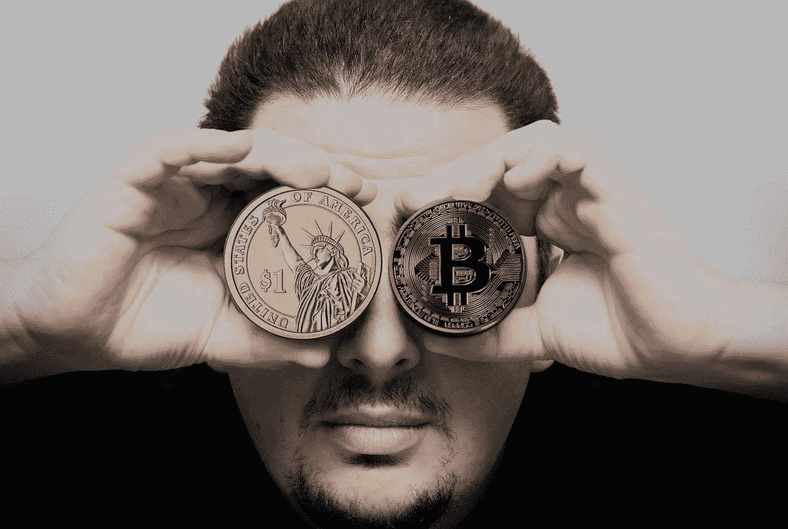

# 为什么银背加密货币可能代表着加密货币价值的重要转变

> 原文：<https://medium.com/hackernoon/why-the-silverback-cryptocurrency-could-represent-an-important-shift-in-how-cryptocurrencies-are-c763b38eb03a>

## 尽管加密货币前景光明，但众所周知，它们很难估值。

(Source: [Pixabay](https://pixabay.com/en/hand-man-bitcoin-dollar-3051988/))

自从人类开始交易商品以来，货币就被用来代表实物。无论是在古代美索不达米亚可以兑换食物的代币，还是由它可以购买的商品和服务支持的美元，硬币的价值都是由其他东西支持的。像[比特币](https://hackernoon.com/tagged/bitcoin)这样的加密货币也被设计来充当价值储存手段，一些人吹捧它们甚至能够取代现有的货币系统。

[加密货币](https://hackernoon.com/tagged/cryptocurrency)的问题在于很难评估它们的价值。美元可能没有任何东西支持，但你知道你可以用它来交易商品和服务——而比特币主要是由投机者赋予它的任何价值支持的。过去一年，人们试图利用加密货币的想法来解决比特币的不稳定性，加密货币由某种实物资产支持，而不仅仅是感知价值。

# **资产支持加密货币比传统加密货币更稳定**

围绕比特币实际价值的不确定性可以说是许多加密货币经历的剧烈价格波动的一部分。比特币固有的不稳定性引发了围绕其作为支付方式的可行性的质疑，并可能阻碍鼓励进一步采用的努力。

这个问题的一个潜在解决方案是用真实世界的资产支持加密货币。最引人注目的例子之一是委内瑞拉政府计划的石油代币。尽管委内瑞拉当局试图提振其衰退的经济存在伦理和道德方面的担忧，但这一概念确实有可取之处。每一笔“石油”都将得到委内瑞拉丰富的石油、天然气和钻石储备的支持。这在理论上意味着每个代币的价值至少和支持它的资产一样多。

一些公司已经看到了这种方法的潜力，并选择创造一种有物理支持的加密货币。一个有趣的例子是屈有限公司的银背 ICO。这是一种可兑换成白银的加密货币。计划是用 1 盎司支持每个代币。0.999 银，使其价值永远不会低于支持代币的银资产的价值。

银背令牌的白银将与[曼斯菲尔德-马丁勘探采矿公司](http://www.mansfieldmartin.com/) ( [OTCMKTS: MCPI](https://www.google.com/search?tbm=fin&ei=NW2VWvOAL8bJwQLg-aKYAw&q=MCPI&oq=MCPI&gs_l=finance-immersive.3..81l2.1496.1905.0.2325.6.6.0.0.0.0.92.318.4.4.0....0...1.1.64.finance-immersive..2.4.315.0...0.Ta9m1ijt5fs#scso=uid_OG2VWpaxONHdwAL3yLWYDg_2:0) )合作获得。每一枚银背硬币将会得到 1 盎司的支持。银色的。MCPI 已经同意提供 500 万盎司。(14，174.76 千克)白银，以作为其新加密货币的后盾。作为回报，MCPI 将获得用银背币或美元支付的选择权。

事实证明，这种合作对曼斯菲尔德-马丁公司非常有利。他们已经在亚利桑那州墓碑镇的土地上建立了采矿业务。墓碑镇是一个历史悠久的银矿区，历史证明是一个有利可图的黄金和白银生产区。这笔交易让 MCPI 加快了他们的生产周期。他们的历史矿区估计拥有超过 6500 万美元的银、金和其他金属，该公司还有其他财产，他们可以在后期投入到该项目中。

银背硬币具有潜力，因为稳定性可能有助于更多支付提供商将加密货币视为一个可行的选择。就目前情况来看，用比特币支付不一定可取。价格波动可能会导致您支付的金额明显高于或低于您最初的购买金额。通过将价格与白银挂钩，Silverback 有助于缓解许多问题。