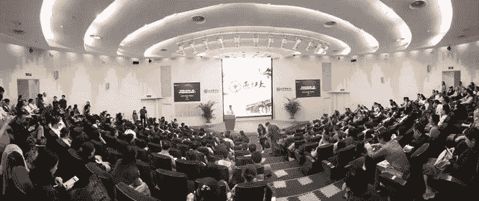

# 为什么区块链的幽灵会比人工智能对人类更重要

> 原文：<https://medium.com/hackernoon/why-the-specter-of-blockchain-will-be-more-important-to-humankind-than-ai-47f5351c0303>

## 著名中国区块链投资家汪峰在北京大学的演讲翻译

我带着另一个翻译回来了，这一次是 2018 年 5 月 5 日在北京大学用中文做的讲座，主讲人是[汪峰](https://baike.baidu.com/item/%E7%8E%8B%E5%B3%B0/3556661)，[火星 24](http://www.huoxing24.com/) (一家中国[区块链](https://hackernoon.com/tagged/blockchain)新闻网站)、 [LineKong](http://new.linekong.com/) (一家中国媒体和娱乐产品公司)和[极客创始人](https://www.geekfounders.com/)(一家科技投资公司)的合伙人。

我发现他对区块链的观点是对区块链历史及其意义的主要思想的一个坚实而简明的整合。他解释的方式既阐明了全球对技术的思考方式，也阐明了中国人对这种思考意味着什么的看法...)

我自己也从事人工智能产品的工作，这是对人工智能相对于区块链的重要性的全新认识，以及为什么人们对这两种颠覆性技术的影响有强烈的感受。

请注意，我并不是以直接转录的方式来翻译这篇文章，而是作为一个叙述，所以我跳过了所有向观众致辞的部分，比如“你好，校友”之类的。我会从头到尾发表我的想法和评论，所以请一定要和我一起思考和讨论:)

再次向原创者致敬，你只能相信我的翻译，戏剧的华丽和上下文的评论。

1848 年:卡尔·马克思在他的《共产党宣言》中写道:“一个幽灵正在欧洲游荡——共产主义的幽灵。”

这篇演讲发表的那一天，2018 年 5 月 5 日，正好是马克思诞生 200 周年。作为一名数学家，王在中学历史课上常常为要记住各种生日而犹豫不决；然而，他记得的少数几个包括马克思的，因为它很容易被记为 1818.5.5。他有一种倾向，认为名人的生日是一个密码，充满了有待破译的秘密；他想知道上帝是否以他们出生日期的形式给了这些人秘密钥匙，恳求他们每个人都来在不同时期搅动世界上的一些重大事件:马克思、爱因斯坦、乔布斯，以及今天的中本聪。

比特币和区块链是当今世界的科技幽灵，正稳步渗入我们所知的现实，改变着我们之前认为不可动摇的真理和信念。许多人轻视和轻视它；有的抱着，揣测着；更多的人无所事事，只是观察周围的世界变化。

通过通信协议 TCP/IP 和标准文本标记语言 HTML，互联网在 30 年的时间里改变了人类社会的进程，推动了人类历史上最高效和最具生产力时期的革命。特别是在中国，政府对进入信息时代给予了大力支持，在过去 30 年的改革和贸易开放中，企业家们真正喜欢上了互联网。中国人的生活，从购物、吃饭、娱乐、拼车、支付以及各种日常情况，无一例外地被提高到了效率的极致，令全球无数观察家惊叹不已。

> **评论**:我同意这种观点。你可以一直呆在家里，永远不需要任何东西——所有东西，从食物到衣服到你能想到的任何东西，都可以在几小时内或第二天送到你手中。当你离开家的时候，你不需要钱包。可以用脸来买东西。你可以在办公室走来走去，它会根据你的身份调整你的访问权限。

过去，当中国人去欧洲、美国和日本时，他们经常感叹西方文明的发展如何远远超过他们国家的发展。今天，中国人去这些地方，最大的抱怨是那里的互联网景观不方便，无法与中国相比。所以，也许在今天的中国，我们不禁要问:既然互联网对我们来说已经这么好了，我们到底为什么还需要一个叫区块链的东西呢？

区块链和互联网背后的哲学是两个平行的世界。有人说，区块链最大的支持者是 90 后，甚至 95 后的人；作为终身的互联网公民，如果我们真的想了解区块链，我们几乎必须睁开我们的“天眼”。

> **Comment**: The Chinese have a saying “开天眼”, which people believe is an extraterrestrial eye for foresight or insight. Loosely, it just means having those qualities to unveil the mysteries of the universe that seem elusive at a glance.

我们也看到了区块链带来的弊病:比特币的全球性、跨境性与国家主权相冲突；比特币在黑市上使用；由于参与采矿的人数众多，POW(工作证明)现在每年消耗超过 42 万亿千瓦时——而所有这些，全球只有大约 1000 万早期采用者。

那么，这种区块链技术的幽灵能与今天的互联网社会和谐相处吗？

首先，比特币崛起的幕后推手是谁？

2008 年 11 月 1 日，一个自称为中本聪的人在一个秘密的加密论坛上发布了一份白皮书，陈述了他对电子货币的新愿景——建立一个点对点的电子现金系统。该文件详细描述了如何创建一个分散的电子交易系统，以及该系统如何能够在交易各方之间相互信任的基础上存在，而不依赖于第三方。紧接着这份白皮书，2009 年 1 月 3 日，他开发并发布了第一个实现比特币算法的程序，并进行了第一次挖掘操作，获得了第一批 50 个比特币。这标志着比特币金融体系正式诞生。

在不到十年的时间里，比特币的崛起令人惊叹，其价值已升至 19000 美元的高度。在过去的两年里，比特币的价值增长了近 30 倍，流通中的比特币价值已经接近 1700 亿美元，比麦当劳的市值还高。

到底是什么支撑了比特币的崛起？它是如何从不值钱到可以和黄金媲美的价格——支撑它的基本面是什么？有三个因素:

1.  首先，比特币拥有一批坚定的技术信徒。自由、平等、反商业化是比特币的重要属性。比特币将是一个像 Linux 一样不朽的开源自由软件项目，每天都有更多的技术信徒加入这项事业；这些人的支持形成了比特币的坚实基础。因此，信仰是一切伟大事物发展的基本因素。技术信仰、政治信仰、宗教信仰都是如此。很多常青基金会的根是来自于信仰，而不是来自于物质或者私利。
2.  **Second, there will only ever be 21 million bitcoins in existence.** Today, already more than half have been mined, and people are just beginning to realize the increasing importance of bitcoin as a valuable investment asset. Wensheng Cai, a well-known internet investor, previously set a goal of owning 10,000 bitcoins of his own, and revealed that he had already acquired this target; Chandler Guo, also known as Bao Er Ye (宝二爷, a nickname referring to his investment persona), advised everyone to buy a single bitcoin, and give it to their child when he/she gets married. Even the Silicon Valley investment guru Tim Draper said recently that he believed bitcoin prices will reach US$250,000 by 2022\. A growing tide of people are optimistic about Bitcoin’s long-term value potential.
3.  **第三，比特币已经引起了投机者的注意，他们已经借此机会把比特币炒得屁滚尿流。**在中国，我们的“跳舞阿姨”和“温州帮”与韩国的年轻人一起，大举进军比特币领域，他们都在为全球最高水平的投机做出贡献。多亏了他们，比特币价格持续攀升。

> **评论**:在这里，“跳舞阿姨”指的是中国的退休家庭主妇，她们经常聚集在游行广场和购物中心的空地上一起练习文化舞蹈。“温州帮”指的是来自中国一个叫温州的地区的人，温州有着中国骗子谷的美誉。有人告诉我:“哦，温州——历史上，那里一直都有贩卖儿童和性交易发生。”嗯，是啊，哇。

此外，一些国家的政府已经开始立法保护比特币和数字货币交易所。许多亚洲国家已经开始准备向从事加密货币交易和兑换的公司发放许可证，特别是在日本和东南亚。在中国，中央直属机构没有表达强烈的立场。然而，我们注意到，杭州、海南和中国其他省份的地方政府已经开始重视其管辖下的区块链公司。例如，著名的比特币投资者李笑来前往杭州，与当地政府合作，为专注于区块链的安雄全球区块链创新基金铺平了道路。我们也刚刚了解到，火币交易所母公司旗下的孵化器火币实验室打算在海南开发一个[工业园](https://www.ccn.com/crypto-exchange-huobi-to-build-blockchain-lab-in-chinas-hainan-province/)。

然而，尽管许多人听说过比特币，但很少有人了解其底层技术区块链。

事实上，区块链技术是比特币的底层技术，比特币自诞生以来一直在没有任何中央机构控制或管理的情况下运行。我们可以认为比特币是区块链的第一个应用，在它逐渐扩展到除了点对点支付之外的更多和其他行业之前。我们经常将比特币描述为区块链 1.0，将以太坊及其智能合约技术描述为区块链 2.0，因为它已经使更多区块链项目分发自己的令牌和后续链成为可能。

今天，更多的区块链项目已经开始鼓吹区块链 3.0——促进应用程序的成熟，以及区块链技术在工业和消费市场的应用。EOS，由连续区块链企业家 BM *(字节大师，又名丹·拉里默)*创立，通过为区块链打造操作系统的理念，发布激动人心的公开测试网，引入著名的 21 block 制作人*(在中国更为人熟知的是* ***超级节点*** *)* 模式，再次点燃了中国的区块链产业。

除了比特币，一些人认为，区块链最大的价值在于科技带来的“思想交汇”。这是一个有趣的视角；比特币是引发这场革命的原始“圣经”，但区块链教堂的大门已经被敲开，但只是一条小缝。接下来会发生什么——现在说还为时过早。然而，我们不能粗心大意；这不是我们以前所知道的世界。

在 **互联网过度集中的现状下，区块链的诞生可以解释为“天时、地利、人和”**

> **Comment**: Original text was *区块链的诞生可谓符合“天时地利人和”, a reference to the Art of War by Sun Tzu, stating that you need the right factors to fall into place, namely: timely opportunities bestowed by heaven, situational advantages afforded by land, and unity powered by the accord of man.*

1989 年，蒂姆·伯纳斯·李提议建立一个全球超文本项目，即万维网(WWW)，其初衷是让每个人都可以方便地在网上获取和分享信息。然而，互联网在今天已经被巨头们垄断了。集权导致了互联网不再开放的不幸结果。脸书是一个封闭的系统，微信是一个封闭的系统。这些封闭的系统造成了信息孤岛，彼此疏远，严重阻碍了信息在互联网上的自由流动，背叛了其创造者的最初希望。

**在现实世界中，经济基本面决定了建设什么基础设施；在互联网的虚拟世界中，技术基础决定了构建什么样的基础设施。**

区块链技术模型由 6 层结构组成，包括自下而上的数据层、网络层、共识层、激励/经济层、合同层和应用层。许多科技企业家对这种模式不屑一顾，认为这种技术没有任何新意——这只是披着闪亮新外衣的旧 P2P(点对点)技术，Napster、NetAnts 甚至中国视频播放器 QVOD 都是建立在这种模式上的。但是，如果你研究得更深入、更仔细，你会意识到这是一种新的模式。这种新模式的意义在于在其结构设计中发现了“开源共识激励”，这是一种由系统设计、集成数据、计算和治理组成的多层次架构；并由此构建了新的科技文明和社会文明体系。区块链将带给我们一个更自由、更透明和更公平的世界。

在过去的 30 年里，互联网文明取得了巨大的成功，就像一匹脱缰的马。在过去的 30 到 40 年里——让我们忘记移动互联网超越传统互联网的无聊趋势——我们已经有了互联网+和工业 4.0，它们都是下一波重要发展的起点:智能手表、智能手环、智能眼镜、辅助/人形机器人、无人驾驶汽车、智能医疗、自然语言生成、机器翻译……不可避免地，我们的人工智能研究已经取得了成果。

如果从较长的历史时间尺度来看事情，一切都是从偶然的转折发展到必然的。没有人能预测偶然，但我们肯定能创造必然。互联网、大数据、云计算、IOT 和人工智能是渐进的进步，是世界上偶然和随机的必然发展。人工智能只是简单地遵循了人类历史上生产力提高和增长的趋势。

人工智能包括机器人、语音识别、计算机视觉、自然语言处理、专家系统等，它增强的是生产力——让机器做工作，让人类做更少的工作，甚至根本不做工作。

如果你在未来不必成为生产者，因为你不再拥有与一台配备有数据和处理能力的机器相匹敌的生产力，你就可以忘记在这个世界上做一个合法的消费者。恩格斯说过，劳动造就人，生产力是人类的本质——但如果你再也不能工作，那你的继续存在又意味着什么呢？

如果我们达到了信息处理和技术实力的极端，但失去了生产能力，完全被机器取代，并被少数拥有人工智能系统的垄断者控制，那么我们该怎么办？我们是应该简单地接受我们目前的观点，即人类的繁荣总是来自持续的生产力增长，还是应该考虑在我们与生产力增长的关系中进行一次技术革命？

区块链将给我们的生产关系带来这场革命；未来，它将把人类从机器人统治和劳动力无能的魔掌中解放出来，并带来生产力增长的新繁荣。例如:在今天的商业中，大多数情况下，渠道是王道。如果你销售 FMCGs(快速消费品),你的利润非常微薄，但在你赚到几个便士之前，你已经在为商场和超市工作了。如果你拥有一家购物中心或超市，在你赚到几美元之前，你就已经把大部分的钱花在房租上了。互联网摧毁了传统的商业和渠道，但它自己的入口是最强大、最集中的渠道。如果你是小电商卖家，你把利润交给电商平台；如果你创作了游戏，你的用户和流量就受到你所在的互联网渠道的支配。

有些人甚至说，互联网现在是巨头们的“用户屠宰场”，任何个人或公司都无法逃脱在他们的竞技场上成为牛或羊的命运，在被剥皮和屠宰之前等待时机。

有了区块链，制片人第一次可以直接推广他们的产品和内容，只根据观众的共识来判断。如果内容是好的，每个人都会愿意分享，因为他们也可以因此得到回报。他们不受制于传统渠道，也不受制于互联网渠道或互联网的用户入口。好的产品和内容自然会传播，其价格也会上涨。这样，生产者和使用者终于在同一条船上，在一条乘着分布式和公平的技术基础的风航行的船上。

因此，**区块链的意义在于通过改变价值在全球的分配方式来增加人类的繁荣，它对我们的意义远远超过人工智能在提高生产力方面所能带来的意义**。

2015 年 10 月 31 日《经济学人》的封面是“信任机器”，其解读远不止加密货币的影响。它使那些一开始可能没有信任的人能够达成共识，而不需要中间人，并以这种方式建立真正的信任。

如果蒸汽机解放了人类的生产力，电力满足了日常生活的基本需求，互联网从根本上改变了信息传播的方式，那么区块链作为信任机器将彻底改变人类之间的价值交换方式。因此，区块链技术被视为蒸汽机、电力和互联网的继承者，被视为下一个颠覆性技术。

这项技术的核心是建立在信任的基础上，无论是像比特币的点对点支付账本这样的窄应用，还是像区块链共识机制这样的大应用。这种共识机制是区块链在分布式节点之间建立信任的独特能力，这是一种推动权利和利益交换的算法。区块链的基础支持系统是一个纯粹的逻辑，比运行在物理系统和基础设施上的计算机和移动互联网设备更具雄心和活力。区块链可以存在于 PC 和手机上，运行在大型机服务器上，甚至在未来的量子计算平台上。

我们今天的互联网模式中的极端中心化最终将导致更多的负面社会效应和外部性。今年 3 月，由于管理不善，脸书导致超过 5000 万用户的私人信息被泄露，更严重的是，这些数据被用于干预政治选举。今年 4 月，继脸书之后，推特也被曝涉嫌向剑桥分析公司研究员亚历山大·科岗出售数据收集。这些高效率的集中平台已经产生了这种信任危机，而且这种危机越来越严重。

区块链的出现，以其分布式和去中心化的解决方案，及时解决了互联网的痛点。

**有一个众所周知的“不可能的三难困境”理论，认为目前的区块链技术无法同时解决*效率*、*去中心化*和*安全性*。**

然而，即使现在可能有这样一个不可能的难题限制我们，区块链工业仍然必须向前迈进和改进。毕竟对于我们人类社会来说，安全和多节点、分散参与比效率更重要。

最后，我们很多业内人士认为，区块链公司和互联网公司之间不需要如此严格的区分。未来三年，或许每一家互联网公司都会将区块链技术融入到自己的产品中；同样，每一个好的区块链公司无疑会结合现有的互联网技术和用户群，这样他们才能真正大规模扩张。

如果我们从我们目前的存在中放大，从宏观的角度来看，互联网和区块链的诞生只占据了人类历史上短短几十年的时间跨度。如果区块链和互联网重叠，将从根本上同时解决信息所有权和价值传递的双重挑战。

那么区块链是互联网的革命和颠覆吗？用那种方式描述它可能很难自圆其说。在以前的时代，如果你拒绝给我我想要的东西，我只能发动一场革命，夺走你的财富和生命，之后我可以按照我想要的方式建立世界秩序。然而，人们后来意识到，在这种狗咬狗的模式下，更多的混乱随之而来——在许多情况下，这实际上不是一个利益问题，而是一个感知问题。

人类文明发展迅速。新技术的使用提高了社区的认知能力和共识水平。因此，当有人问区块链是否能彻底改变今天的互联网时，也许更好的回答是**区块链和互联网，今天生活在两个平行的世界，将来会逐渐融合**。希望我们中的许多人会更加关注区块链，更加重视它的价值，理解它在发展中不可避免地会遇到的困难和机遇。

## (￣^￣)ゞ ☆ END。*:ʕ•ᴥ•ʔ:*.

## 感谢阅读！

我很想听听你对这里提出的观点的看法！

不要忘记与任何需要一个好的区块链基本面解释者分享它，并在未来关注更多内容。