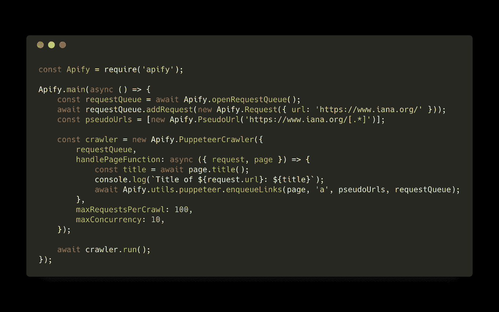
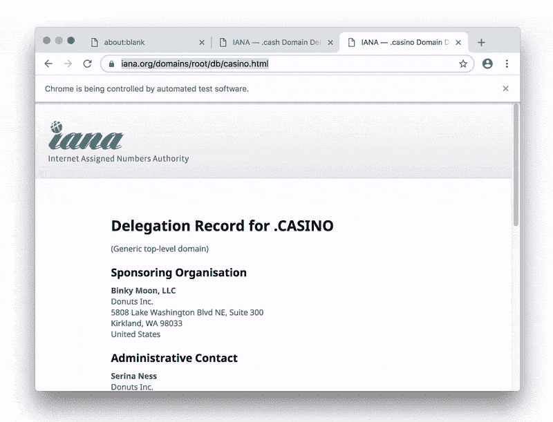

# 为什么世界需要一个通用的 JavaScript 抓取库

> 原文：<https://medium.com/hackernoon/why-the-world-needs-a-universal-web-scraping-library-for-javascript-21c6b3390e02>

*TL；DR:我们发布了*[*Apify SDK*](https://github.com/apifytech/apify-js)*——一个用于抓取和网页抓取的开源 Node.js 库。有一个用于 Python 的库，但是直到现在，还没有这样一个用于 web 语言 JavaScript 的库。*

在 Python 中有 [Scrapy](https://scrapy.org/) ，这是一个事实上的标准工具包，用于构建网页抓取器和爬虫。但是在 [JavaScript](https://hackernoon.com/tagged/javascript) 中，没有类似的全面和通用的库。但这是不对的。越来越多的网站使用 JavaScript 来获取和呈现用户内容。要从这些网站提取数据，您通常需要使用实际的 web 浏览器来解析 HTML 并运行页面脚本，然后注入将在浏览器上下文中运行的数据提取代码，也就是说，您需要 JavaScript。那么，使用另一种编程语言来管理爬虫的“服务器端”有什么意义呢？

根据 [2018 StackOverflow 调查](https://insights.stackoverflow.com/survey/2018#most-popular-technologies)，让我们忽略一个事实:JavaScript 是世界上使用最广泛的编程语言。我们不会在这篇博文中提到这个事实。

使用 JavaScript 进行网络抓取还有另一个很好的理由。2017 年 4 月，谷歌推出了[无头 Chrome](https://developers.google.com/web/updates/2017/04/headless-chrome) ，不久后他们发布了[木偶师](https://github.com/GoogleChrome/puppeteer)——一个用于无头 Chrome 的 Node.js API。这无疑是网络抓取世界的一场革命，因为以前装备全功能网络浏览器的唯一选择是使用已经严重过时的 [PhantomJS](http://phantomjs.org/) ，使用基于 QtWebKit 并且只有 Python SDK 的 [Splash](https://github.com/scrapinghub/splash) ，或者使用 [Selenium](https://www.seleniumhq.org/) ，其 API 受限于需要支持所有浏览器，包括 Internet Explorer、Firefox、Safari 等。虽然 headless Chrome 使得在服务器上运行 web 浏览器而不需要使用 X 虚拟帧缓冲区(Xvfb)成为可能，但 Puppeteer 为 web 浏览器提供了有史以来最简单、最强大的高级 API。

# 木偶师是不够的

尽管在 Puppeteer 中为一些网页编写数据提取代码很简单，但事情可能会变得更加复杂。例如，当您尝试使用 URL 的持久队列对整个网站执行深度爬网或从 CSV 文件中爬网 100k 个 URL 的列表时。这就是为什么需要一个图书馆的原因。

Apify SDK 是一个开源库，它简化了网络爬虫、抓取器、数据提取器和网络自动化作业的开发。它提供了[工具](https://hackernoon.com/tagged/tools)来管理和自动扩展无头 Chrome/puppeter 实例池，维护要抓取的 URL 队列，将抓取结果存储到本地文件系统或云中，轮换代理等等。该库在 NPM 上以`[apify](https://www.npmjs.com/package/apify)`包的形式提供。它既可以在你自己的应用中独立使用，也可以在运行于 [Apify Cloud](https://www.apify.com/) 上的 [actors](https://www.apify.com/docs/actor) 中使用。

但是不像其他的网络抓取库，比如无头 Chrome Crawler，Apify SDK 不仅仅局限于 Puppeteer。例如，您可以轻松创建使用 [cheerio](https://www.npmjs.com/package/cheerio) HTML 解析库甚至 [Selenium](https://www.seleniumhq.org/) 的网络爬虫。许多类型的爬行器的基本构造块是相同的。简而言之，Apify SDK 包含了我们在过去四年里从数千个网站中获得的经验。我们试图以这样一种方式设计 SDK 组件，以便在简单性、性能和可定制性之间取得适当的平衡。

# 给我看看代码

好了，说够了，让我们看看代码。要运行它，你需要在电脑上安装 [Node.js](https://nodejs.org/) 8 或更高版本。首先，通过运行以下命令将 [Apify SDK](https://github.com/apifytech/apify-js) 安装到您的项目中:

```
npm install apify --save
```

现在，您可以运行以下示例脚本:



Hello crawler example. Source code on [GitHub](https://gist.github.com/jancurn/3cc2f1c4c61ab2c99315d44147cfc071)

该脚本使用木偶师对[https://www.iana.org](https://www.iana.org)进行递归深度爬行。根据系统中可用的 CPU 和内存，可以自动控制木偶进程和选项卡的数量。顺便说一下，这个功能是作为`[AutoscaledPool](https://www.apify.com/docs/sdk/apify-runtime-js/latest#AutoscaledPool)`类单独公开的，因此您可以使用它来管理任何其他资源密集型异步任务池。

这是它在“终端”中的样子:


Recursive crawl of [https://www.iana.org](https://www.iana.org) using Apify SDK — Terminal view

当你在 headful 模式下运行 crawl 时，你会看到 Apify SDK 如何自动启动和管理 Chrome 浏览器和标签:



Recursive crawl of [https://www.iana.org](https://www.iana.org) using Apify SDK — Chrome browser view

Apify SDK 提供了许多实用程序类，有助于常见的 web 抓取和自动化任务，例如管理要抓取的 URL、数据存储和各种爬虫框架。为了更好地理解，请看一下[组件概述](https://github.com/apifytech/apify-js#overview)。

# 这有什么意义？

我们相信每个人都有权利以他们想要的方式访问公开的网络，而不仅仅是作者想要的方式。正是以这种方式，互联网成长为今天的样子——通过让人们创造性地使用现有的东西，并在其上建立新的层，而不管它的设计目的是什么。这就是为什么网络抓取很重要的原因，因为它允许你在现有的工具或服务之上创建以前无法想象的工具或服务，并在互联网之上添加一个新的层。为什么网站只允许自动访问 Google 和 Bing 这样的巨头，而不允许访问你的代码？

我们真的很期待看到你能用 Apify SDK 构建什么。当然，我们很想听听你对此的看法，或者回答你可能有的任何问题。在[推特](https://twitter.com/apify)上让我们知道。

JavaScript 爬行愉快！