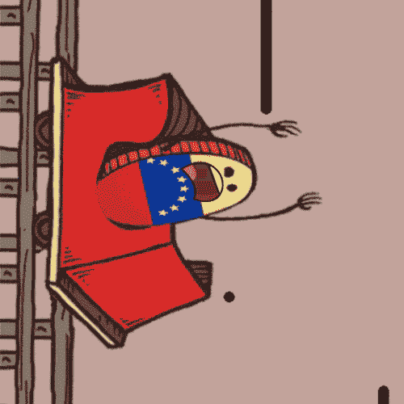
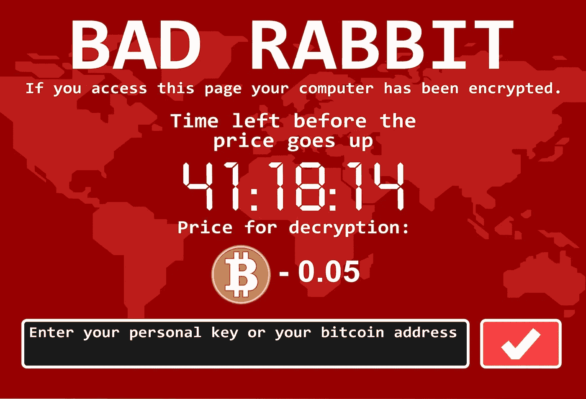
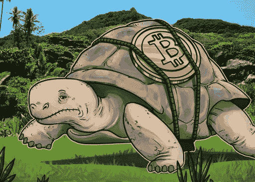
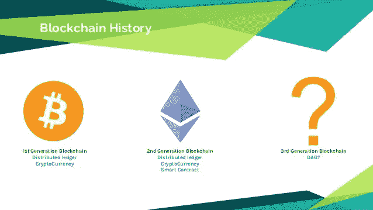
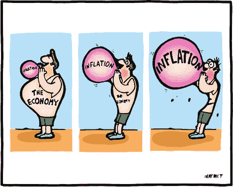
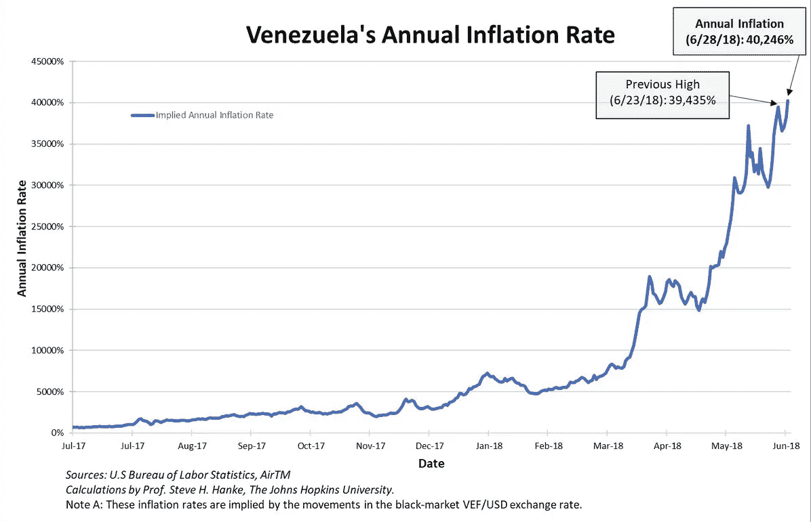
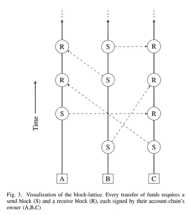
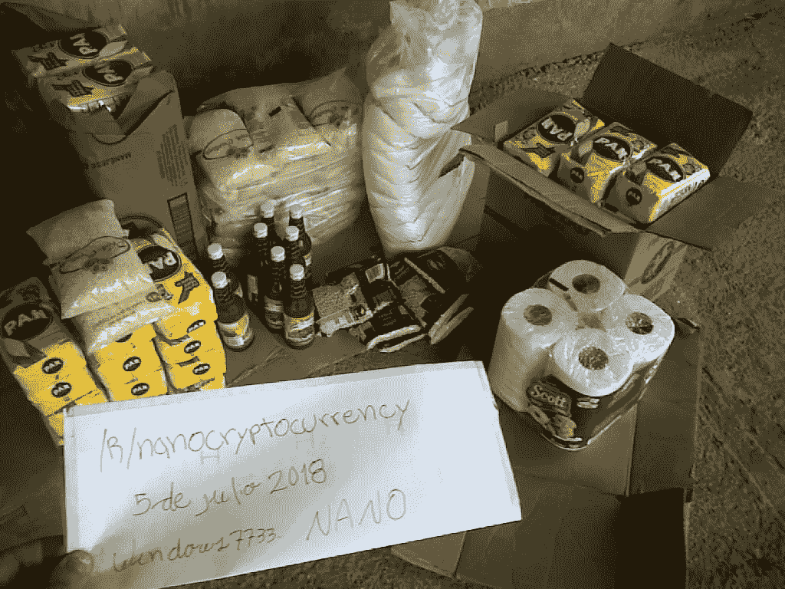

# 为什么第三代加密货币改变了委内瑞拉的游戏规则

> 原文：<https://medium.com/hackernoon/why-third-generation-cryptocurrencies-are-game-changers-for-venezuela-cb8c9b016f9d>

The Bolivar’s value is rapidly decreasing as each day passes

大多数最新的消费技术进步都表明，利弊是一揽子计划的一部分。手机让我们可以随时联系，这在需要的时候可以救命。然而，它们会分散人们对更重要的事情的注意力，比如学习、做作业，甚至是过马路。研究表明，如果孩子们在过马路时打电话或发短信，他们更有可能被车撞。此外，一方面，互联网使沟通在全球范围内实时发生**。**现在，我们可以跨越地理界限，以更低的成本、更便捷的方式进行交流。另一方面，互联网上共享的个人信息数量如此巨大，以至于个人隐私处于危险之中**。****由此可见，新兴技术的道路并不平坦。**

**加密货币属于完全相同的类别，特别是因为它们中的许多都是完全分散的。用一句话解释什么是加密货币是不可能的。一个雄心勃勃的尝试是，加密货币是一种通过互联网在人与人之间以安全和不信任的方式转移价值的手段。本文的目的是展示这些硬币(尤其是“第三代”硬币)对生活在新兴国家的人们有多大的好处。**

**每个硬币都有两面**

**尽管这并不新鲜，但截至目前，即使该行业在 2017 年底出现增长，普通民众也很少意识到这一点。从 2009 年比特币诞生开始，现在**超过 1500 种加密货币**处理不同的现实问题。由于大量误用，在今天，一大群人自动将加密货币与过度耗能和洗钱联系在一起。这群人将比特币和其他替代币称为黑客在获得不属于他们的资金时用来逃避法律的工具。**

****

**Hackers demanding ransomware money in the form of Bitcoin**

**不可否认，加密货币为不当行为打开了一扇大门。尽管如此，它们确实提供了过去没有的创新解决方案。对于遭受恶性通货膨胀打击的国家(如委内瑞拉)的公民来说，不需要银行或政府等中央集权机构就能有效地储存和转移价值是一项重大进步。**

****加密货币的产生——简要概述****

**第一代加密货币专门用于存储和转移价值。他们使用区块链作为数据结构，因此由于其过于简单的架构而存在可扩展性问题。反过来，这种发展导致了高确认时间、高费用和低交易吞吐量(以每秒交易数衡量)。这使得大多数第一代加密货币不能用作数字现金。最著名的例子就是比特币、莱特币、Monero 和比特币现金。**

**第二代加密货币大多是平台，专用于分散应用(dApps)。第二代加密货币不再只关注价值交易，而是使用图灵完整编码语言提供新的编程逻辑。简单地说，这意味着完全应用所需的逻辑是完全可能的。这个逻辑正在通过使用智能合约来处理。合同通常用某种高级语言编写，然后编译成平台的虚拟机字节码，上传到区块链上。**

**然而，大多数第二代加密货币都面临着源自其区块链架构的相同可扩展性问题。一些例子是以太坊、Neo、QTUM、Lisk。**

****为什么一个区块链存在高费用、长确认时间、低交易吞吐量的问题？****

****

**Blockchain is rarely the solution for a problem**

**当一个事务被创建时，它被发送到一个等待事务的池中。然后，世界各地的矿工们将一批批这样的钻石收集起来，存放在一个街区内。每个矿工与所有其他人竞争谁将发布他们自己的区块。当一个区块发布后，发布他的区块的矿工得到奖励，他和所有其他矿工开始下一个有限大小的区块。**

**将固定数量的事务存储在块中会给 TPS 带来非常有限的限制。在比特币中，交易处理能力最大值估计在每秒 3.3 到 7 次交易之间。相比之下， ***签证*** 平均每秒处理约 2000 笔交易。**

**另一个需要考虑的重要方面是矿工费用。这些成本会激励矿商将你的具体交易添加到他们将要开发的下一个区块。因此，需要在确认时间和费用金额之间进行权衡。**

**不同的数字硬币有不同的系统，因此转移需要时间。对于比特币来说，直到一个区块被确认，平均需要 10 分钟的时间。对于更大的金额，一次确认是不够的，因为在交易被批准之前需要大约六次确认，这可能导致一个小时的等待时间。**

****问题****

**高费用、长确认时间和低交易吞吐量阻碍了加密货币的大规模采用，因为其主要功能-作为货币使用没有得到优化。**

****

**超市的队伍实在是太长了。我不喜欢等待几分钟，直到我的付款被批准，这样我就可以被原谅。此外，支付这笔交易的费用对一些人来说可能是微不足道的，但对其他人来说，这些费用可能超过一个月的工资。我们很快就会回到这个问题上来。**

****什么是第三代加密货币？****

**当指出区块链可伸缩性问题的影响时，难怪必须找到解决方案。下一代货币旨在解决这些确切的问题。第三代加密货币的正式定义尚未形成。有许多方法和技术可以解决这些问题，但没有一种是明显的领先者。**

****

**一些新加入者利用 DAG(直接非循环图)作为主要的数据结构。区块链使用顺序机制来存储事务，而有向无环图使用异步方法。通过使用 DAG，由于技术的异步特性，即时事务是可能的。每笔交易本身就是一个模块，这大大减少了确认时间。**

**这一过程从等式中排除了矿工，将系统推出了共识协议所导致的 PoW 界限。费用也不存在，因为矿商的动机和安全运营的网络之间没有关联。利用 DAG 数据结构的第三代加密货币的例子是字节球、Iota 和 NANO。**

****委内瑞拉经济一瞥****

**关于委内瑞拉的经济状况，尤其是过去十年的经济状况，有很多可以说的。2001 年，委内瑞拉是拉丁美洲最富有的国家，这主要是因为它拥有世界上最大的已知石油储量。政治体制建立在民主原则的基础上，为全球许多人所羡慕。然而，今天，委内瑞拉的民主制度和经济都处于混乱之中。这个国家有世界上最高的通货膨胀率**，使得生活在这个国家的大多数公民无法获得食物和药品。****

****

**2018 年 6 月 28 日，委内瑞拉的通胀率达到 40，000%以上，而且这一趋势没有停止的迹象。一些经济学家说，只要当前的政治制度不改变，经济就会继续螺旋式上升。**

****

**委内瑞拉的货币玻利瓦尔正以惊人的速度贬值。如前所述，目前的通货膨胀率超过 40，000%。相比之下，美国的通胀率为 2.4%。委内瑞拉的最低工资为 5，196，000 玻利瓦尔，以美元计算(目前 1 美元= 3，003，000 玻利维亚诺)，最低工资为 1.73 美元。是的，一个月工作 30 天，每天工作 8 小时，只需 1.73 美元。**

**金融系统被政府机构严格控制，委内瑞拉中央银行(BCV)只有名义上的自主权。所有的政策、发展以及对市场的改进，在实施之前都需要经过国家的政治精英。因此，严格控制的做法扼杀了金融行业(以及所有其他部门)的创新。再加上普通民众面临的越来越多的问题，很明显，即使有严格的控制，当前的经济体系也很难实现稳定。**

**根据世界银行的数据，石油价格指数的崩溃带来了一系列新的问题，促使政府承担更大的债务，从 250 亿美元和 350 亿美元的外部融资。从人们的角度来看，这意味着更高的税率，更高的价格，而工资保持不变。银行业认为竞争对手之间的差别很小，银行服务对委内瑞拉人的购买力来说非常昂贵。**

****答案:纳米无感觉和即时加密货币****

****

**[NANO](http://www.nano.org) 是第三代加密货币，它正在实现自己的 DAG 版本，称为 block-lattice。block-lattice 为每个用户提供了自己的区块链，称为账户链。该解决方案提供了无费用且几乎即时的交易，交易吞吐量更高。这意味着我可以站在南极，向站在北极的朋友传递 10 纳米，他将在大约 3 秒钟内收到正好 10(甚至不是 9.9999)纳米。**

****

****这和委内瑞拉有什么关系？****

**委内瑞拉居民兼 NANO 用户 Hector 分享了他最近的故事。**

**这一切都始于 NANO 的 [subreddit](http://reddit.com/r/nanocurrency) 上的一个“谢谢你”主题，针对的是一个向他捐赠了 0.5 纳米(约 1 美元)的用户。赫克托承认这比他上个月赚的还多。这个帖子变得流行起来，越来越多的人渴望为这项事业捐款。赫克托的第二个帖子是几天后发布的，名为“委内瑞拉用户:我今天买了+102 公斤的食物”。**

> **我感到非常高兴，因为今天我能够说服我信任的人接受纳米来交换食物。他卖给我 102 公斤(224 磅)的食物，包括玉米粉、肉、大米、糖、豆类、酱类和鳄梨。这太好了，因为我希望给人们送去合适的食物。今天早上有人来我家问我要食物，我当然给了他们几公斤。她的脸上充满了喜悦。这对其他 10 个家庭来说也是一样的，他们今晚将从你们那里得到爱和食物。**

**赫克托说他用 29 纳米或 80 美元买了 102 公斤的食物，这比他以前买的任何东西都多得多。**

**2018 年 7 月 12 日，赫克托的第三个帖子被发布，名为“更新:委内瑞拉人准备好与你合作。今天分发了超过 300 公斤(660 磅)的食物。”**

> **三天前，我用 61 纳米和上次不同的商人交换了 300 公斤的食物。四十个家庭从这次捐赠中受益。当收到我和家人帮忙打包的食物袋时，几个人高兴得哭了。**
> 
> **总的来说，我们已经能够在 402 千克(884.2 磅)的食物上投资 90.1 纳米(相当于投资时的 230 美元)。**

**赫克托分享了一些他最近疯狂购物的照片:**

****

**在这些事件之后，一个名为“领养一个家庭”的新项目启动了。该项目的目标是通过纳米捐赠帮助委内瑞拉的家庭。你可以在其[官方线程](https://www.reddit.com/r/nanocurrency/comments/8vcmv7/venezuela_17_adopt_a_family/)中找到更多关于该项目的信息。**

**赫克托的故事是加密货币如何帮助委内瑞拉人民的一个很好的例子。然而，他并不是第一个以低延迟支付平台的形式接受援助的人。不幸的是，这样的故事每周都会出现。人们可以在另一种第三代加密货币的官方聊天平台上见证这种故事。你可能会惊讶地知道哪一个是领头的。**

****巴纳诺——不仅仅是一枚迷因币****

****

**声明:我参与了 Banano。**

**Banano 是 nano 的第一个官方分支，旨在提供免费、几乎即时的微交易。Banano 最初是一群忠实的 nano 贡献者之间的玩笑，结果产生了一枚投入大量精力而又不太认真对待自己的硬币。**

**Banano 的目标不是取代比特币成为数字现金的主导形式。相反，它蓬勃发展，成为对加密货币一无所知或认为进入门槛太高的人的门户，因为它需要一些技术技能。Banano 通过使用几种不同的媒介来自由方便地分发硬币，从而解决了这些问题。**

**Banano 之所以能改变委内瑞拉的游戏规则，是因为与 nano 不同， **Banano 仍处于分销阶段**。目前，3，402，853，669 枚巴拿诺硬币的总供应量中只有不到 10%被分发，这意味着新用户可以毫不费力地获得一些。**

**2018 年 6 月 10 日，发生了第一次 Banano airdrop(向特定的硬币持有者自由分发硬币)。这种纳米瞄准空投仅仅是未来许多空投中的第一个。另一种分发方法是使用小费机器人。通过活跃在 Reddit 上的社区，尤其是 T2 的 Discord 服务器上，很容易就能得到 Banano。**

**尽管如此，Banano 的主要发行方式还是 3D 游戏。Banano 是历史上首批通过游戏发行硬币的加密货币之一。名为“Banano Runner”的游戏中，用户控制一只猴子在躲避障碍物的同时抓住香蕉。这些香蕉对应于真正的香蕉，在玩家完成游戏后被发送给玩家。**

**Banano Runner example gameplay**

**是的，参与者通过控制一只捕捉虚拟香蕉的虚拟猴子来赚真钱。**

****一个迷因硬币到底能帮委内瑞拉什么？****

**自 4 月 1 日推出其主要网络以来，Banano 的每日用户数量大幅增长，其中许多用户来自委内瑞拉。巴拿诺目前的美元价格为 0.0022 美元，1 巴拿诺价值 7000 BsF。这意味着 786 巴拿诺相当于委内瑞拉的最低月工资。**

**换个角度来看，第一次空投给每个用户平均赚了 20，000 巴拿诺。这是在委内瑞拉超过 25 个月的全职工作。玩 Banano runner 游戏每小时可赚取约 1，200 Banano。玩一个小时，一个委内瑞拉人的收入超过了该国的最低月工资。**

**5 月 25 日，来自 Banano 社区的一位名叫 Mayrapina 的委内瑞拉用户得到了 10，000 块 Banano，并被告知用这些钱购买食物并记录购买过程。**

**Mayrapina 第二天的消息:**

> **“嗨，这是我能用 10，000 块香蕉买的东西的清单:**

****

> **2 公斤根
> 1 公斤番茄
> 1 公斤洋葱
> 3 公斤香蕉
> 1 公斤帕帕
> 1 公斤大米
> 1 公斤玉米粉
> 1 公斤杂鱼
> 1 公斤糖
> 1 公斤肉
> 2 公斤什锦
> 1 包饼干
> 1 片麦片
> 1/2 公斤人造黄油
> 1 份番茄酱
> 1 份米糊
> 2 块沐浴皂**
> 
> **我用 10，000 个香蕉换来了 15，000，000 BsF。你不会相信所有来我家的人，家人朋友等等，我告诉他们关于巴拿诺和他们所做的一切，他们非常感兴趣，但对游戏更感兴趣。**

**Mayrapina 甚至制作了一个视频，描述了用杂货交换巴纳诺斯的过程(打开字幕):**

**可悲的是，这发生在 5 月 25 日，当时委内瑞拉的通胀率在 25，000%左右。随着巴纳诺价格的上涨和玻利瓦尔价格的大幅下跌，Mayrapina 本可以用她收到的钱买更多的东西。**

**可以看出，收到数字硬币并使用它们来购买商品和服务的好处为贫困的个人和企业创造了奇迹。**

****一些最后的想法****

**之前讨论的主题中的加密货币辅助并不是全新的。你将能够找到许多关于委内瑞拉接受比特币现金的商家的故事。然而，当你面对这种恶性通货膨胀和贫困时，即时和免费的交易才是正确的选择。NANO 和 Banano 是 Cryptos 的两个例子，它们提供了一个很好的机会来帮助委内瑞拉和其他处于类似情况或即将处于类似情况的国家，如阿根廷。**

**人们需要下一代技术来跨越他们目前无法跨越的障碍。以后当你的家人/朋友开始谈论比特币挖矿占用多少能源的时候，告诉他们有些货币不需要挖矿，而且环保。第三代加密货币有能力让全世界数百万人的生活变得更好。**