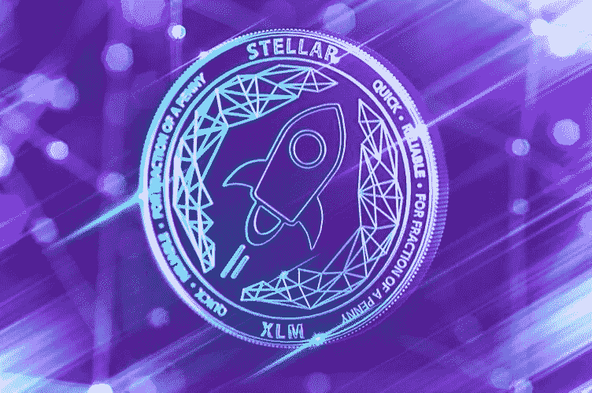

# 为什么这种加密货币会有美好的未来

> 原文：<https://medium.com/hackernoon/why-this-cryptocurrency-may-have-a-good-future-ahead-of-it-12cdd29db29d>

## 恒星流明从众多加密货币中脱颖而出

## **恒星流明(XLM)**

这个项目确实使自己与许多其他项目不同，它的功能是加密货币和开发平台，在许多方面它类似于以太坊，但它更快，更便宜，这允许应用程序和智能合同建立在它的合同上，以更快的速度运行，几乎没有成本。

Stellar Lumens (XLM)是由 Ripple 的联合创始人开发的，因此毫不奇怪它们也很相似，它们都有超快的交易速度和极低的费用。

这就是为什么我相信 Stellar 有一个美好的未来:

1.  **完成一笔交易只需不到 1 美分** **的费用**，这意味着你可以以非常低的管理成本汇款、执行智能合同和运营 ICO。想象一下，向另一个国家的亲戚汇去 1000 美元，而这笔交易只支付了不到 0.01 美元。
2.  **交易需要 2-4 秒钟完成**，这也是货币转账以及超快速智能合同和 ICO 流程等业务应用的一大优势。
3.  **现在，您可以以不到 0.01 美元的价格向另一个国家的亲戚汇去 1000 美元，这笔钱不到 5 秒钟就会到账**，相比之下，银行转账至少要花费 25 美元，至少需要 2-3 天才能完成。
4.  **Stellar 可能成为以太坊的主要竞争对手，**它的速度和低成本加上能够执行以太坊的相同功能，可以将 Stellar 定位为一个潜在的竞争对手，它甚至被一些人称为“以太坊黑仔”，但我认为这两个项目可以和平共存。

恒星流明(XLM)目前为 30 美分(0.31 美元)，可以使用现金在[**【CEX】**](https://goo.gl/CPCJoN)**上购买和存储，因此投资者不需要购买 BTC 或瑞士联邦理工学院并将其交易为 XLM，这种直接的投资方式降低了交易费用，降低了投资者的准入门槛，从而有助于增加采用率。**

**Stellar Lumens 就像是 Ripple 和 Ethereum 之间的交叉，甚至是由 Ripple 的联合创始人启动的，在我看来，这个项目有很大的潜力，因为它的技术和声誉良好的团队。**

**将这一页加入书签，明年再来查看，你可能会感到惊讶。**