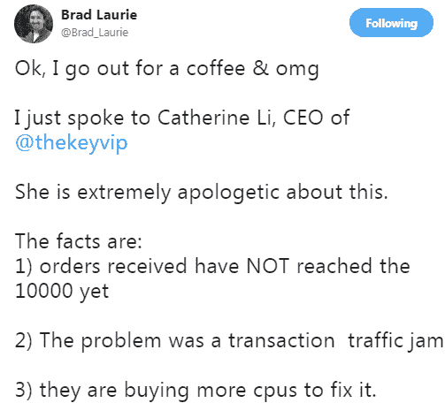
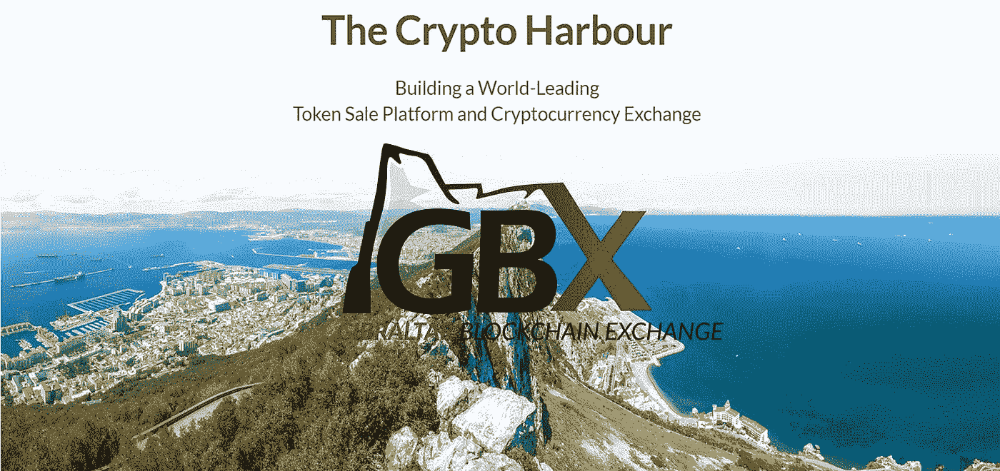
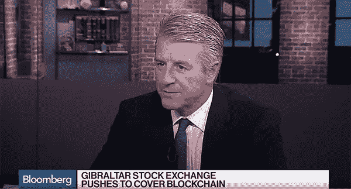

# 为什么这个新的密码交换会让你变得更强

> 原文：<https://medium.com/hackernoon/why-this-new-cryptocurrency-exchange-might-just-make-you-rock-hard-51b3a5916c0a>

# 你厌倦了…

*   反复输入相同的 KYC 信息？
*   注册白名单时，垃圾邮件刷新只会遇到空白 404 页面？
*   或者被告知公共众筹现在已经被取消，因为球队通过私人预售填补了他们的硬帽？
*   那些自恋的攫取金钱的创始人又如何呢？他们试图通过荷兰式拍卖来筹集大量的资金，而他们的社区却通过做大量的粗活来为他们免费工作。
*   以免我们忘记，当 ico 没有完全按照计划进行时，还有电报色情垃圾邮件(lol 让我们不要欺骗自己，我知道你实际上并不讨厌这个)

TheKey ICO Fail — Hmm you need more “CPUs” to handle increased traffic hey?

好吧，如果你厌倦了上面的，那么我有东西给你，它肯定会让你比电报色情更难对付，而且它…

# **直布罗陀区块链交易所！**

## 什么鬼#@！是直布罗陀吗？

如果你不知道，直布罗陀是位于西班牙南部海岸的英国海外领地，它也是以一块令人敬畏的岩石命名的，叫做…你猜对了，直布罗陀！

The Rock of Gibraltar in Gibraltar where the Gibraltar Blockchain Exchange will operate from. (No, they won’t operate on the rock but they will operate from within Gibraltar if you didn’t catch that.)

除了因这块岩石而闻名，直布罗陀还有一个充满活力的金融科技社区，这是他们自 1995 年以来大约 20 多年的进步思想和行动的结果，当时政府致力于围绕电子游戏(又称在线赌博)建立法律和银行基础设施。

由于他们的前瞻性思维，直布罗陀现在是世界上卓越的电子游戏中心之一，有 20 多家直布罗陀公司占世界电子游戏市场的 40%以上。

## **好的..谁在乎呢？**

你应该关心，因为他们正在寻求重复历史，因为他们现在将重点转向加密，希望使直布罗陀**【加密港】**，就像他们在互联网被广泛采用之前很久对电子游戏和赌博所做的那样。

## **到目前为止，他们为此做了些什么**

直布罗陀政府早在 2016 年 1 月(大约 20 年前)就发布了一份关于监管数字货币的咨询文件，经过 18 个月的咨询期后，他们于 2018 年 1 月发布了[分布式账本技术(DLT)监管框架](http://www.gfsc.gi/dlt)

这一监管框架基本上允许那些使用区块链技术开展业务的人以获得许可和受监管的方式开展业务。

直布罗陀政府的下一个目标是为 ico 和代币销售发放许可证和进行监管。

在不深入兔子洞的情况下，您需要了解的主要信息是:

1.  直布罗陀政府非常看好和支持 crypto。直布罗陀商务部长 Albert Isola 阁下甚至提到，直布罗陀政府正在考虑是否可能将区块链/分布式账本技术用于未来的选举。

Hon. Albert Isola, Minister for Financial Services and Gaming

## ***现在……这就是直布罗陀区块链交易所(GBX)发挥作用的地方！***

直布罗陀区块链交易所(GBX)是 [GSX 集团有限公司](http://www.fsc.gi/regulated-entity/gsx-limited-17566)的子公司，后者拥有直布罗陀证券交易所(GSX)，该证券交易所自 2015 年在 Q1 成立以来一直运营，是直布罗陀第一家获得许可的证券交易所。

他们不仅是第一家获得许可的证券交易所，而且 GSX 还是第一家提供比特币支持的交易所交易工具 BitcoinETI 的交易所，该工具专门投资于比特币，也是第一个受欧洲监管的比特币产品。

# **直布罗陀区块链交易所的目标是什么**

具体来说，GBX 的两个主要核心目标是:

1.  世界领先的机构级代币销售和 ICO 平台，在直布罗陀监管框架下运营；和
2.  一个高质量的加密交易所，包括一个市场，公用令牌的发行者、交易者和投资者可以充满信心和信任地参与一个平台，在该平台上，所列令牌已经过机构级批准流程。

除此之外，GSX 集团的目标还包括成为全球第一家令牌化证券交易所。

# **GBX 让我坚定并看好的 5 个理由**

## ***1。合作伙伴和参与更广泛的区块链社区***

这些人不仅仅是传统的金融人士，他们希望进入 crypto 来接管，轻松赚钱，然后把其他人都搞砸。

他们实际上正在寻求与区块链社区的整合和合作，以帮助进一步的加密运动。

2017 年第三季度，GBX 区块链创新中心成立，以帮助促进区块链创新，促进新 DApps 的创建，并开发新的协议和区块链软件。

除此之外，GSX 还于 2017 年 9 月加入了 Linux 基金会的 Hyperledger 项目，随后于 2017 年 11 月加入了以太坊企业联盟。

他们还与 QUOINE 建立了战略合作伙伴关系，QUOINE 是交易量最大的加密交易所之一，也是日本第一家受监管并获得许可的加密交易所之一。

## **②*。词汇组学***

我不是在谈论代币指标(即，硬上限、已分配代币百分比、归属期等)，我是在谈论代币在 GBX 生态系统中的实际经济效益，以及如何使用代币。

这种代币最好的一点是它的代号是 RKT。

我认为他们会选择 RKT，因为如果你全押，获得 REKT 的可能性很小……(开玩笑，它实际上代表 Rock Token——请记住，这些都不构成财务或投资建议！)

从白皮书中可以清楚地看到，RKT 令牌将如何在 GBX 生态系统中提供效用和价值，这是一个很好的想法。换句话说，RKT 不仅仅是一个无用的象征。

对于想发行 ICO 并出售其代币的人，暂定申请费为 10，000 美元，仅在 RKT 支付，不可退还。

只有在 RKT 才需要支付上市费，在那里，上市费总额的 15%需要至少 24 个月，以确保代币发行人遵守其义务，不做任何不正当或可疑的事情。

除此之外，RKT 还将按照其他正常的加密交换硬币使用……支付交易费用，对社区的发展进行投票，提前获得 ICO 销售，以及支付 GBX 提供的其他金融服务，最后，赞助商持有 RKT 的股份，以确保他们的行为符合所有参与者的最佳利益。

(保荐人本质上就像 IPO 领域的投资银行。因此，希望发行或销售代币的人将与赞助商匹配，赞助商将帮助他们遵循适当的程序履行义务，并指导他们完成 ICO 流程，从白皮书到在交易所上市代币。)

RKT 令牌的所有这些不同用途本质上意味着，如果更多的 ICO 使用这个平台来做他们的 ICO，RKT 令牌将会由于生态系统中每个人的需求而升值，从 ICO 发行者、赞助商到买家和交易商。

A short 1 minute video on RKT and how it serves as a utility token for GBX.

## ***3。政府支持和法规***

如前所述，直布罗陀政府看好加密，这可能是 GBX 领先于其他加密交易所的唯一 X 因素。

这在很大程度上是一种合作和思想的融合，而不是政府和 GBX 相互对抗，或者 GBX 需要说服政府监管加密技术的好处。

> *“本届政府成功推出了于 2018 年 1 月初生效的 DLT 法规。我对 GFSC 收到的申请的数量和质量感到非常高兴和鼓舞。我于去年宣布，我们将引入涵盖代币销售的补充但不同的立法，并已要求 GFSC 尽早完成这项工作。* *我们将继续全力确保保护消费者和我们司法管辖区的声誉。”*
> 
> 直布罗陀商务部长 Albert Isola 阁下

## ***4。这个团队太正统了，不能退出***

自从成立直布罗陀证券交易所(GSX)以来，GBX 团队已经一起工作了几年，他们中的许多人在各自的领域，无论是金融、法律还是技术领域，都拥有几十年的经验。

随着员工和创始人令牌授予超过 3 年，这些家伙显然是长期致力于。他们还拥有直布罗陀证券交易所的最佳形式的概念证明。

在他们的白皮书中，他们表示，如果他们无法达到 ICO 硬资本上限，他们将从 GSX 撤出资金，以帮助资助剩余的里程碑。

幸运的是，他们在 9 秒钟内就售罄了，所以他们不必求助于此，但只要知道，如果他们遇到麻烦，GSX 会在那里帮助他们摆脱困境。

最后但并非最不重要的是，在看了对首席执行官尼克·考恩的几次采访后，这家伙给人的印象是一个真正的病态 k*nt，而且正是我希望看到的为如此规模的项目带路的人。

CEO Nick Cowan on Bloomberg discussing GBX

# ***5。对 GBX*** 的需求可能会很大

## **买家会想在 GBX 上购买和交易，因为:**

*   GBX 将为买家提供多种交易选择的一体化解决方案，包括菲亚特到加密、加密到加密，以及参与最新和最佳 ico 的平台。
*   不再有反复输入 KYC 的详细信息到不同 ico 的白名单的麻烦，因为这些都在 GBX。
*   您的 KYC 详细信息被黑客攻击或泄露的风险低得多，因此您不必担心您的身份被列入黑名单，并且当您访问某个随机的外国国家时会被关进监狱。*(如果发生这种情况，只要记住，不要把肥皂弄掉。)*
*   更少需要执行研究和尽职调查，以确定一个项目是一个总的骗局，抢钱，还是只是纯粹的狗屎，因为 GBX 和他们的赞助商系统会为你处理腿的工作。

## **ico 背后的项目团队想要加入，因为:**

*   它有助于消除运行 ICO 时必须处理的一切问题，从 KYC/白名单到智能合同，再到管理基金和其他需要处理的事情。这也意味着他们避免或最大限度地减少在 ICO 期间发生诈骗和黑客攻击的可能性。
*   ICO 是在受监管的交易所和司法管辖区下进行的，因此这将有助于保护他们，并确保他们不会违反任何可能会回来困扰他们的法律。
*   由于主要交易所需要 3 个月的等待名单才能上市，许多项目不得不满足于在不知名的低交易量交易所上市。然而，对于 GBX 的 ico 发行者来说，他们保证会在 GBX 的加密交易所上市
*   申请和上市费用是合理的，相当于节省了大量的时间和金钱，律师，外部 KYC 服务和其他要求，可以更好地用于开发他们的产品和进一步建立他们的社区
*   如果 GBX 起飞，其他交易所也将希望在 GBX 上市，因为他们不想失去市场份额或交易商。由于 GBX 的目标是吸引最高质量和水平的 ico，你可以打赌其他主要交易所也会想让它们上市，因为每个人都想买它们！

## **对于机构投资者:**

直布罗陀证券交易所(GSX)计划成为世界上第一个受监管的证券交易所。

这是巨大的，因为安全令牌本质上是一个灰色地带的加密，现在没有监管交易所可用于交易“令牌化证券”。

GSX 计划转向一个可审计的、总部位于区块链的交易所，所有参与者都将是证券代币的注册持有人，以满足监管机构对代币化证券的担忧。

GSX 计划从 2018 年第三季度开始运营GSX，作为一个集中的令牌化证券交易所，然后在 2018 年第四季度过渡到一个基于区块链的系统。

有了受监管的交易所和可供机构投资者交易的环境，这意味着那些想要进入 crypto 的人最终可以进入市场，因为他们不会违反任何规则、法律或法规。

另一个好处是，当 GSX 转而使用区块链的系统时，股票结算的时间将会减少。在传统市场中，交易的结算日从 2 天到 3 天不等，而在区块链系统中，它是即时的。

# **这块石头真的像它看起来那样坚固吗？**

列出了优点之后，现在是时候拆开这个项目，给你一些 FUD 了。与任何项目一样，都有一些相关的风险，不分享这些风险是不公平的。

## **比赛**

泽罗是我能看到的最接近 GBX 的竞争对手，然而他们希望筹集 2.5 亿美元，而不是 GBX 的 2700 万美元的硬性上限。

除了提到将在今年晚些时候推出外，tZero 还没有公开说明他们计划何时推出他们的交易所。GBX 的目标是在 2018 年 Q1 推出他们的密码交易所，因此如果他们执行，将有先发优势。

许多其他主要的加密交易所都想做 GBX 设定要做的事情，但这对他们来说是一个真正的挑战，因为他们有现成的交易基础设施，以及他们的心态和快速行动的能力。如果他们连开设新账户的速度都跟不上，我们怎么能指望他们也能运营并遵守监管规定呢？

然而，这些交易所的真正障碍是缺乏各自管辖区的监管支持，而直布罗陀似乎对加密有很强的抵抗力。

## **ICO 市场的现状**

随着越来越多精明的投资者涌入这一领域，根据当前 ICO 市场的发展趋势，我们需要考虑高质量的 ICO 项目是否会继续公开销售。

许多最有前途的 ico 目前正设法通过私募销售填补其基金分配的大部分(如果不是全部)资金，因此选择放弃公开众筹销售的需要。

在未来，我们可能会看到越来越多的 DApp 项目出现，因为平台解决了他们的可扩展性问题，从而使 dapp 具有更大的生存能力。

如果出现这种情况，那么这些项目可能会希望他们的公用事业代币掌握在那些在其生态系统中实际使用代币的人手中，而不是那些只希望翻转、出售或持有代币来赚钱的投资者手中。

## **集中化**

我询问了这个团队，GBX 和 GSX 是将被集中管理，也就是被允许的区块链，还是被分散管理，没有被允许的区块链。他们不能给我一个直截了当的回答。

然而，根据一些基本的逻辑推理，GSX 和 GBX 区块链最有可能至少会以私人区块链的形式开始，这意味着 GSX 和 GBX 将作为中央实体和交易所。

这本身并不像一些人认为的那样无用或愚蠢，因为不管许多人怎么想，区块链技术仍然可以工作并提供好处，而无需令牌来刺激对节点的需求。

这纯粹是我的猜测，但这是需要考虑的事情，因为加密社区对集中式实体的信任和信念对于采用它们是很重要的。

众所周知，在集中式交换机上已经发生了几起黑客攻击事件，并且集中式实体可能会带来其他不便，例如“有计划的”维护以及在此期间不允许撤销密码。

然而，具有讽刺意味的是，这种集中化的另一面是，它可能会允许机构投资者和传统金融进入这一领域，因为他们更信任旧的传统经营方式，而不是区块链，后者通过让位于世界各地的匿名个人节点合作来运作。

也可能是为了满足关于加密的管理规则，首先需要一个集中的实体。

## **厨房里厨师太多？**

从宏观的角度来看，GBX 的目标是什么，整个画面可能会显得有些力不从心和雄心勃勃。

要使整个 GBX 生态系统和密码交易所很好地融合并协同工作，需要考虑许多移动部件、因素和各方。

比特币基地、双子座或 GDAX 等交易所没有列出大量不同的对以便菲亚特加密或在其交易所引入加密交易的主要原因是因为它们是最符合监管要求的交易所。这意味着，他们在能够提供什么方面受到更严格的审查，如果事情变得不可收拾，他们将受到严厉的惩罚。

然而，在直布罗陀政府的支持下，如上所述，这可能是真正的游戏规则改变者和 X 因素，允许 GBX 建立整套加密产品，包括菲亚特到加密，加密到加密，以及 ico 发行和买家参与的监管平台。

## **MVP — MVP — MVP**

目前我还没有看到 GBX 的 github。从技术上来说，你可以说这只是一个白皮书项目，但是你也可以说他们有一个以直布罗陀证券交易所为形式的 MVP。

白皮书中还提到，他们目前有 43 名全职开发人员和 it 人员在 GBX 项目中工作。

## **古博特**

尽管直布罗陀政府支持加密，但这并不意味着政府繁文缛节的正常障碍不会摆在他们面前。

与政府的情况一样，GBX 和 GSX 项目的进展有可能被拖延。

直布罗陀政府打算将 ICO 监管框架提交 Q2 2018 年奥运会进行投票。如果这项法规因为任何原因被否决或推迟，这将不可避免地推迟 GBX 在路线图上的进展。

房间里的另一只大象是直布罗陀是英国的海外领土，英国退出欧盟将于 2019 年英国退出欧盟时发生。目前还不清楚这对直布罗陀制定的加密法律和法规意味着什么。

# **总之**

如果 GBX 成功地解决了他们开始要做的事情，迈出了正确的第一步，并建立了 ICO 上市平台，使其运作良好。

他们很可能能够吸引顶级质量的项目，这将吸引最好的投资者和买家到交易所，导致更大规模的采用，因为其他人也想在最好的 ico 上投资。

GBX 背后的需求和信心似乎已经响亮而清晰，他们的公开销售在 9 秒内售罄。

GBX RKT 代币将于 2 月 26 日 12:00:00 (UTC)开始在 QUONEX Global 和 Qryptos 交易所交易。

## 欲了解更多信息，请访问:

网址:[https://gbx.gi/](https://gbx.gi/)
文件和白皮书:[https://gbx.gi/documents/](https://gbx.gi/documents/)
博客:[https://medium.com/@Gibraltar.Blockchain.Exchange](/@Gibraltar.Blockchain.Exchange)