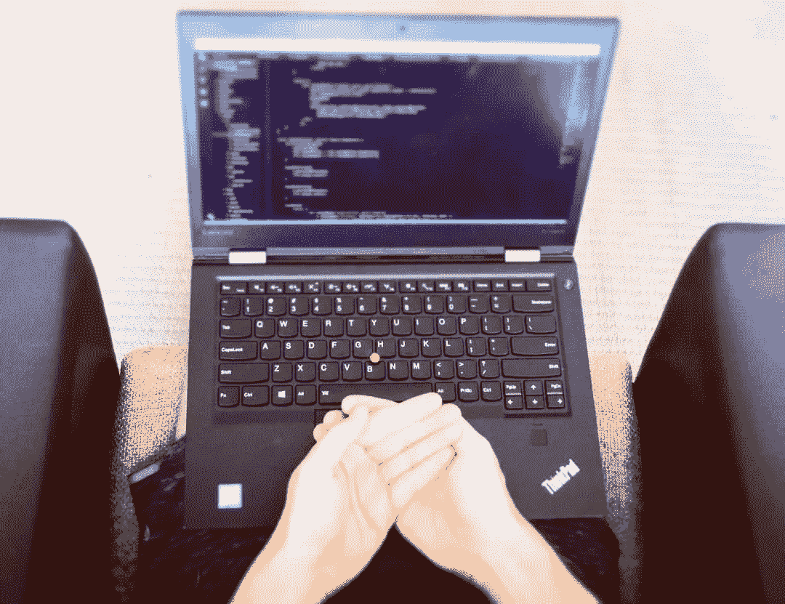

# 为什么这位软件开发者教授冥想

> 原文：<https://medium.com/hackernoon/why-this-software-developer-teaches-meditation-2c54238621cb>

## 我是一个迷茫的少年。

这是一种相当普遍的现象，尤其是在有技术头脑的人当中。这是一个动荡的时代，所有的荷尔蒙和我们新生身份的形成，新的想法，学校，运动，青春痘，荷尔蒙，父母，朋友和荷尔蒙…有很多事情在发生。

有很多事情让人困惑。从一个孩子的思维到一个完全成熟、独立的成年人(或给人一种成年人的印象)之间的转变，在这种转变中，规则看起来很简单，你的预期行为被合理地定义，同时你在行动中保持一种自由感，拥有各种新的信息和责任——嗯，有很多东西需要理解，所以有很多东西需要理解。

然而，最让我困惑的是人。看起来社会互动是一个游戏，有规则、边界和微妙之处，它们都是隐藏的，并且不断变化。我费了好大劲才搞清楚这一切。

我可能把青少年时期看得有点创伤，但是那段时间你生活中奇妙的一面是你会接触到大量的新信息。比如历史。还有文学。还有艺术。

和科学。

大约就在这个时候，我意识到自己是一个理性主义者。

> 这个故事最早出现在[CodingMindfully.com](http://codingmindfully.com/why-this-software-developer-teaches-meditation/)—[编码倦怠清单](http://codingmindfully.com/burnout-checklist/)的所在地。

现在你可能不同意，但高中物理是有道理的，我的头和心都被它带走了。

我喜欢那个层次的物理逻辑。与人类互动的不确定性相反，这是一种看待我们周围世界的方式，承诺了一定程度的可预测性。欧姆定律(描述了电阻器中电压和电流之间的简单关系，事实上风扇)的简单性有一种美，我可以理解并从中获得庇护。

我喜欢物理学大胆地宣布，只要你以足够的强度思考、观察和分析事物，你就能开始理解这个世界。

当然，我继续在大学学习物理，并了解到有微妙、复杂和不确定性(感谢海森堡！)内置于整个框架的结构中。尽管如此，我仍然坚持科学探索的基本优雅和大胆——即使在接下来的几年里，我对人和关系的工作方式有了更好的理解(实际上，在我人生的这个阶段，人和关系已经变成了我的激情，但那是另一个故事了……)。

## 用我的思想谋生

当我完成我的物理学本科学位时，我考虑了很久，也很努力地想继续深造，但是研究生的生活是艰难的，充满了不安全感(对不起，研究生们！)我有一个女朋友，对未来有很大的计划，也需要钱，因此需要一份真正的工作。

碰巧的是，[软件](https://hackernoon.com/tagged/software)和科学一样令人感兴趣——我喜欢代码的可预测性，就像我喜欢物理一样(不要笑！哦我是怎么学会的…)。当我在世纪之交离开大学的时候，正是软件工程师的繁荣时期(这里面有黄金——thar bits！)，所以我成了一名[程序员](https://hackernoon.com/tagged/programmer)——就像在爱丁堡大学物理学院发生的那样。

我的职业生涯在投资银行、数字机构和成功的网络创业公司(HotelsCombined.com)的世界里编织了有趣的路径，还担任过各种角色，包括开发和团队领导、数据库工作和一般的“实干家”。我很幸运地在一些真正具有挑战性的领域工作，用我的头脑解决困难的技术问题，这是一种非常令人满意的谋生方式！

我用我的能力在我的职业生涯中思考，我真的很喜欢它。当我的大脑运作良好的时候…

Meditation makes you a better programmer by teaching you to work with your mind

## 思考的问题

当我大约 27 岁的时候，我开始思考我的心灵的本质，它开始给我带来一些问题。幸运的是，我曾经嫁给了一个治疗师(完全是另一回事……)。

我生活中的一些问题，包括我父亲在很小的时候就去世了(他，还有我，真的！)，让我陷入了不舒服的精神领域。我开始意识到我有焦虑的问题。

在那个时候，这表现为不断担心会有不好的事情发生。我特别担心我的健康——我的父亲因癌症去世了，我感觉到的每一点刺痛都注定是我身上这种可怕疾病的第一个迹象！疑病症是我生活中的一个特征…

后来，我的焦虑以其他形式出现——害怕自己不够好，害怕被发现不能胜任这份工作——尤其是我的老板会认出我是冒名顶替者……如果听起来耳熟，请举手！事实上，我已经写了一整篇文章，你可以在这里阅读。

这是我第一次听说正念。我当时的妻子很幸运地与乔恩·卡巴特·津恩(他是一个真正的坏蛋，他的使命是在全世界创造平静的头脑，非常尊重，看看他)一起训练，她在与客户的临床工作中使用了基于正念的方法。

你可能已经意识到我是一个思考的爱好者，尤其是清晰的思考。

当你的思维有点扭曲时，问题就开始了。焦虑让你认为事情比实际情况更糟。因此，在你看来，消化不良几乎肯定会导致胃癌……但事实并非如此。

或者害怕自己的工作很糟糕，而实际上你做得很棒…

现在，事实证明这种情况的发生有一些非常好的原因，我将在这个网站的后续文章中详细解释为什么会出现这种情况——你可以订阅我的时事通讯来了解最新情况。

我解决过度活跃的头脑的方法是正念。

## 正念是如何工作的

正念基本上意味着把注意力放在当下，同时把你头脑中所有疯狂的判断放在一边几秒钟。

你有意识地练习尽你所能专注于你当下经历的一个方面。

你开始意识到你的呼吸，你的身体感觉，你的情绪状态，甚至你的思想内容——但是你练习不要被这些压倒，而是让它简单地发生，看它如何展开。听起来很简单，对吧？

这对焦虑有好处，因为你学会了让自己远离你的思考，不那么严肃地对待它。

对于像我这样的极客来说，这可能有点困难。我们倾向于接受笛卡尔的说法——“我思故我在”。

其实更像是反过来——“我在，故我思”。我们的思想在我们的身份中起着很大的作用，特别是当我们得到报酬时，你知道，思考问题和解决问题。

可能有点难以释怀。

当你思考思考的时候，你开始意识到你头脑中的很多东西都是关于过去和未来的。又有多少是可以放心放手的。

我听说，每天在我们脑海中闪过的 60，000 个左右的想法中，90%是前一天重复的(我怀疑这是否特别科学，但检查一下我自己的思想流，我可以说这是有一定道理的)。

因此，放开你的思维的实践可以改变游戏规则，尤其是当这种思维给你带来麻烦的时候——就像我的焦虑倾向一样。

谢天谢地，有许多技巧——包括冥想——可以帮助你——是的，就是你！—变得更加专注。

冥想是终极实验，在这个实验中，你既是观察者，也是被研究的系统。作为一个以科学为基础的人，我认为这其中有一些奇妙的东西。

## 为什么我学习并教授正念

正念是一种可以通过实践培养的生活态度，它有几大好处。我们将在这个博客上的一系列文章中深入探讨这个问题，但现在我只想向你介绍其中的几个，因为我已经看到它们为我发挥了作用。

在我的个人和职业生活中，我从三个重要方面受益:

1.  与我的头脑建立更好的关系——我用来谋生和与周围世界互动的工具。这些天来，我变得更平静，更不容易焦虑和紧张，我想得更清楚，感觉自己可以掌控生活中的许多需求——这一切都是通过我的正念练习。这并不是说我从来没有陷入紧张的境地，或者感到紧张——我的生活一如既往地忙碌——只是现在我已经做好了应对它们的准备。
2.  增强的生活体验。不是开玩笑——消除生活中过多的压力会让事情变得无限美好。一旦你让神经系统稍微平静下来——这是正念练习的一个核心好处——你就会开始注意到生活是多么丰富多彩。简单的事情变得更令人愉快。你发展了品味你活着的经历的能力，努力对抗我们每个人固有的消极偏见。如果你是“活着”的粉丝，这就是正念练习的真正价值所在。
3.  把自我保健放在首位，结果会更有效。在我人生的这个阶段，我有很多责任——在一家初创公司担任软件开发主管，教授瑜伽和冥想，经营几家在线企业。你会认为我几乎没有时间从一天中抽出 20 分钟来冥想……那么你错了。事实上，只有把自我保健作为我生活的主要焦点，我才能以最小的压力做到以上所有的事情。

我从正念原则和技巧中受益匪浅，以至于几年前我开始向同事们传授这些原则和技巧。除了蓬勃发展的咨询业务，我还是阳光明媚的澳大利亚悉尼的一名兼职冥想教师，在公开场合、私人课程和网上授课。老实说，教人们如何冥想是我一生中做过的最好的事情之一。

我相信，通过简单的注意力调节练习(也叫冥想)，几乎任何人都能从变得更加专注中受益。这个网站的一个目的是帮助像我一样的人——你！—学会用同样的方式照顾自己的思想。冥想和正念是答案的一部分。

喜欢你刚刚读的吗？如果你访问我的网站，注册我的列表，我会免费送你这三样东西:

1.  [程序员冥想的终极指南](http://www.codingmindfully.com/ultimate-guide)
2.  [编码倦怠检查表](http://www.codingmindfully.com/burnout-checklist)
3.  三次引导音频冥想