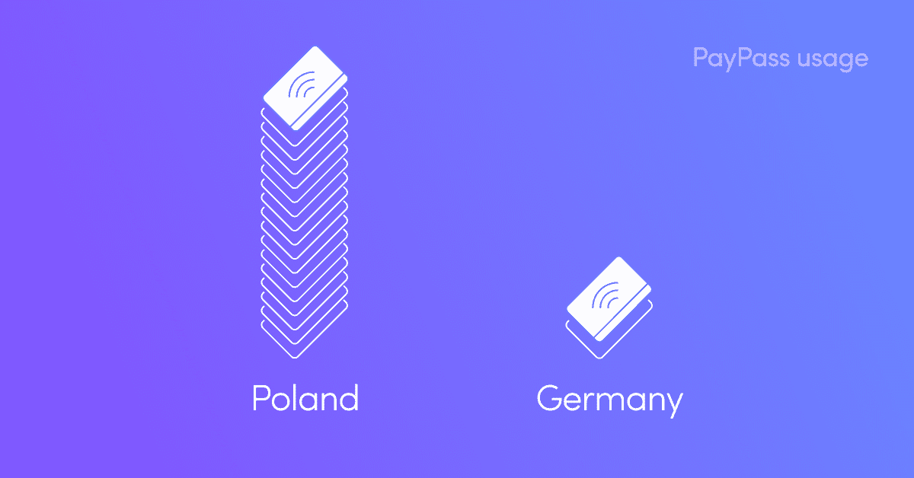
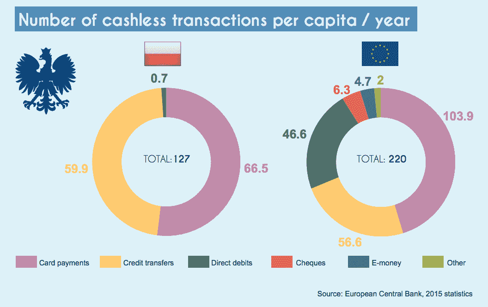
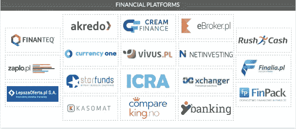
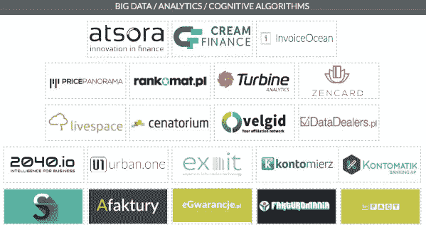
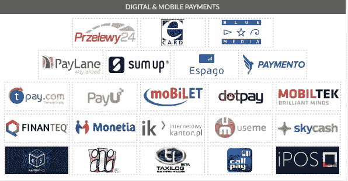
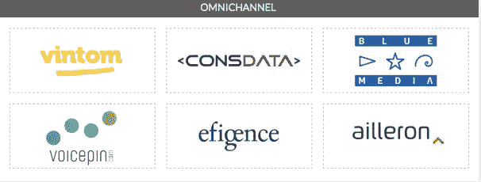
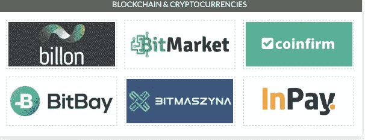
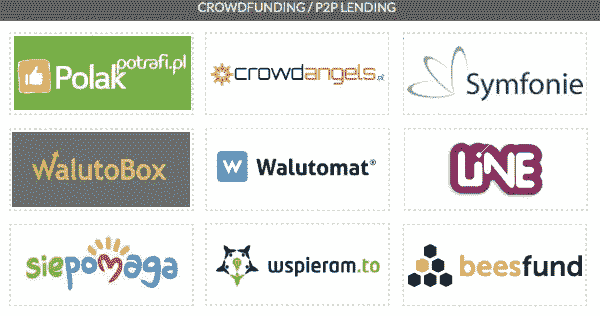
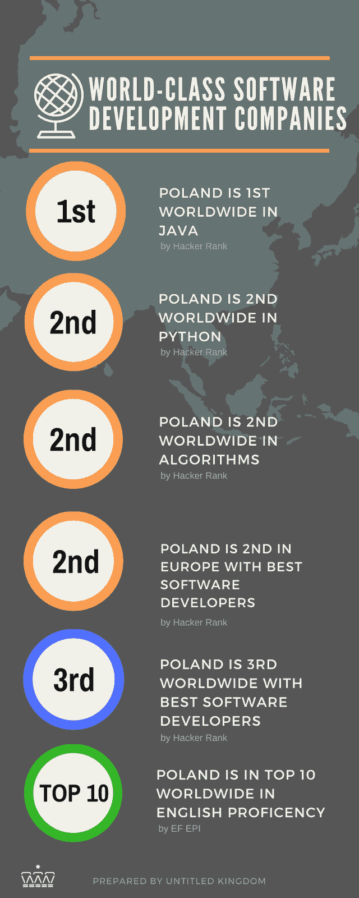

# 为什么要在波兰开发金融科技解决方案

> 原文：<https://medium.com/hackernoon/why-to-develop-your-fintech-solution-in-poland-15b91777e66c>

从立法、教育、基础设施和创新文化来看，波兰是金融科技行业最具发展前景的国家之一。

金融科技行业继续成熟，T2 每年以数百万美元的规模增长。这种兴趣的快速增长使得金融科技初创公司蜂拥至波士顿、硅谷或纽约，这些地方都是世界上最大的科技中心。在欧洲，同样的角色被自动分配给伦敦、都柏林或柏林，这些地方也聚集了[初创企业](https://hackernoon.com/tagged/startup)的所有者、创新者和商业投资者。以克拉科夫(Cracow)为“中东欧硅谷”(CEE Silicon Valley)的波兰(T7)是另一颗新星，出于多种原因，它有可能成为下一个金融科技(FinTech)的黄金国。

# **立法**

金融科技行业的动态发展明显受到法律法规的影响。在波兰，这包括当地法律和欧盟指令。这些都很有希望。

波兰政府目前正在制定“沙盒法规”，以软化将金融科技解决方案推向市场的方式。换句话说，他们将改善用户安全，消除对金融科技初创公司的限制。

金融监督委员会(Financial Supervisory Commission)最近推出的创新中心计划带来了更进一步的承诺:根据该计划，委员会成员将与金融科技企业家展开对话，为整个金融科技行业制定立法解决方案。鉴于这一切，波兰很有可能在几个月内出现大量金融科技初创公司。

考虑到立法，我们还需要记住由欧盟委员会管理的[支付服务修订指令(PSD2)](https://en.wikipedia.org/wiki/Payment_Services_Directive#Revised_Directive_on_Payment_Services_(PSD2)) 。该指令将允许非银行机构从银行数据库中获取客户信息(只有这些客户同意)。从[金融科技初创公司](http://untitledkingdom.com/services)的角度来看，这部法律将带来显著的改善，并加快适合市场的产品的交付。

# **金融科技** **基础设施**

波兰是一个真正的 FinTech 实验多边形，也是测试 FinTech 解决方案的所谓“发射台”。让我们考虑一下 **PayPass 的例子。**

根据万事达卡的报告， **25%的波兰人声称他们每天都使用 PayPass。**这意味着我们使用非接触式支付**的频率是德国人的 20 倍**和欧洲平均水平的 3 倍。除此之外，85%的波兰受访者声称他们的支付卡具有 PayPass 功能。

当我们回顾历史时，我们看到波兰 WBK 银行作为中欧第一家实施 Maestro paypass 卡的机构(2007 年)。在欧洲范围内，波兰 paypass 支付的蓬勃发展是成功的。

**或 Blik。**

波兰发明的 Blik innovatory 解决方案让数百万波兰人安全地使用智能手机从自动取款机中提取现金，在传统商店付款，并立即将钱转移到其他用户的电话号码，而无需知道他们的银行账户。该系统是一个全国性的通用支付标准，也是最快的购物方式。Blik 存在 2 年的余额是 1000 万个交易和 350 万个用户。据估计，70%的波兰社会使用该解决方案。

该系统在许多欧洲国家受到赞赏，这些国家看重波兰金融科技的水平及其市场吸收的强度。这个解决方案可能也是苹果公司最喜欢的，他们希望苹果公司在今年下半年将苹果支付引入波兰市场。是的，在 Blik 的帮助下，这可能会发生。

在为外国和本土公司开发和测试金融科技应用时，波兰对金融科技解决方案的吸收给了我们巨大的优势。

例如，在《无题王国》,我们提出自己的想法，并建议最佳解决方案。如果我们不能在现实生活中测试这些解决方案，我们显然不会超越猜测阶段。但随着金融科技 ICT 基础设施的出现，我们可以提出行之有效的选择，尽管我们的客户以前甚至没有考虑过这些选择。

波兰的潜力正受到海外知名金融科技公司的关注(比如 [Revolut](https://www.revolut.com/pl/) ，它在克拉科夫设立了一个办事处)。随着波兰社会像海绵一样吸收金融科技，[本地金融创业公司的数量也在飙升](https://www.cashless.pl/in-english/3040-the-polish-fintech-alphabet-66-companies-changing-the-financial-industry-in-poland)。在开发产品时，初创公司只是在当地测试他们的解决方案，收集反馈，实施用户认可的改进，并在全球范围内扩展业务。

*Polish* FinTech *scene via* FinTech [*Poland report*](http://fintechpoland.com/wp-content/uploads/2016/12/FinTech_w_Polsce_bariery_i_szanse_rozwoju.pdf)

我们在欧洲金融科技领域的领先地位得到了世界上最知名的研究和咨询公司之一——[Forrester Research](https://go.forrester.com/research/)的证实，并得到了包括[美国银行家](https://www.americanbanker.com/)在内的外国行业媒体的强调。我们的金融科技解决方案领先于趋势，是外国银行机构的灵感来源。

# **波兰程序员的潜力**

波兰是顶尖软件专家的圣地，这让我们在其他国家中脱颖而出。我们在[顶级程序员排名](https://community.topcoder.com/stat?c=country_avg_rating)中排名世界第四，在[黑客排名](https://neoteric.eu/why-poland-is-one-of-the-best-places-to-outsource-software-development)中的多个类别中排名前三。

排名不会说谎——波兰程序员是欧洲领先的专家。如果我们在金融科技领域利用这种潜力，该行业很快就会达到前所未有的高度。

即使是现在，波兰的 IT 专家也因其独创性、可靠性和专业技能而受到全世界的推崇。他们被鼓励出国旅行，加入外国金融科技公司的团队，或远程支持他们。

同样在[无题王国](http://untitledkingdom.com/services)，我们注重质量，所以我们聚集了[顶尖人才专家](http://untitledkingdom.com/services)的精明团队，这使我们在竞争对手中脱颖而出。我们是探索者，总是投身于挑战，不断追求改进和创新。
我们相信在金融科技领域利用这种力量。

# **创新文化**

波兰热爱测试。我们也珍惜新的想法，并赞扬创新。这给企业提供了一片沃土来验证他们的发明，并在全球范围内扩大规模，重复 [Azimo](https://azimo.com/pl/) 、 [Atsora](http://atsora.com/) 以及其他数十家在波兰诞生并在全球蓬勃发展的金融科技初创公司的成功。我们不害怕商业风险——波兰企业家创建的创业公司受到全球的认可和赞赏。所有这些结合在一起，使波兰成为投资和开发世界级金融科技解决方案的绝佳地点，这些解决方案可以起飞、扩展并带来真正的影响。

➡️Check our [Privacy Policy](https://untitledkingdom.com/privacy-policy)⬅️

阅读更多来自[无题王国](http://untitledkingdom.com/services):

*   [app 开发如何选择公司？](https://blog.untitledkingdom.com/https-blog-untitledkingdom-com-how-to-choose-a-company-for-app-development-ae4555d8ec14?source=collection_category---7------5----------------)
*   [精益产品开发是可能的，在企业环境中也是如此](https://blog.untitledkingdom.com/lean-product-development-is-possible-also-in-corporate-environment-198461bf32f7?source=collection_category---7------4----------------)
*   [可以丰富您的数字产品的 4 种机器学习类型](https://blog.untitledkingdom.com/https-medium-com-untitledkingdom-4-types-machine-learning-for-digital-product-84aa06580a00?source=collection_category---7------2----------------)
*   [为什么你不想让自由职业者为你的产品服务](https://blog.untitledkingdom.com/why-you-dont-want-outsourcing-for-your-product-59523679dc60?source=collection_category---7------1----------------)

# 记得[访问我们的网页](http://untitledkingdom.com)！