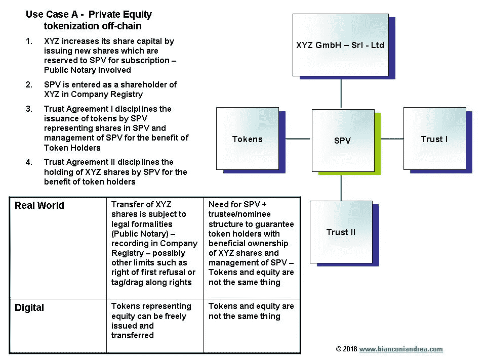
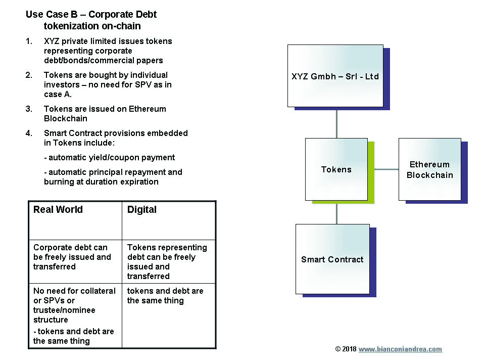

# 为什么标记化仍然是一个幻想

> 原文：<https://medium.com/hackernoon/why-tokenization-is-still-a-chimera-2f149734f68f>

the “chimera” in Greek mythology — the fantasy, the illusion

**标记化并不是什么新鲜事**

术语“令牌化”主要与证券、股票和实物资产相关联，表示创建数字令牌，该令牌代表基础资产的所有权，并在区块链上发行。

但是令牌化本身并不是什么新鲜事儿。它是衍生工具和证券化资产如 [ABS](https://en.wikipedia.org/wiki/Asset-backed_security) 的演变。

例如，处于 2009 年金融危机中心的 [CDO](https://en.wikipedia.org/wiki/Collateralized_debt_obligation) 和 [MBS](https://en.wikipedia.org/wiki/Mortgage-backed_security) 实质上是代表债务的代币。证券化的第一个例子可以追溯到 17 和 18 世纪。

尽管[我也分享了关于 sto 的潜力的承诺](https://www.ccn.com/the-future-of-icos/)以及过去 12 个月中涌现的几十个令牌化平台，以及许多愿意尝试用它筹集资金的企业，但迄今为止几乎没有取得任何实际进展。尽管宣布即将发行代表股票或实物资产的代币，但实际上还没有发行任何代币。

**感知标记化的优势**

治理参与机制和自动股息支付(可以嵌入智能合同中)经常被认为是最大的优势，此外还有后台工作的减少、发行公司成本的降低和 24/7 交易。

部分所有权确实也很重要，因为它有助于投资民主化，但它也不是新的，象征化只是一种新的工具，通过房地产的部分所有权或俱乐部交易来实现过去已经完成的事情。

**证券化 vs 令牌化**

那么实际上，证券化和记号化有什么不同呢？

本质上有两件事:

(I)在区块链上发行令牌，以及

(ii)代币在数字二级市场上的可交易性/流动性。

但区块链有一个基本范围:实现数字价值的点对点可信传输，同时为这种传输提供确定性和不变性。有史以来第一个区块链——比特币的区块链——是为了允许比特币的点对点转移而创建的，而不是实物资产。根据定义，它的使用可以很容易地扩展到其他数字资产或权利——例如数码照片、音乐或电子书——这将极大地受益于区块链固有的确定性和不变性。但就实物资产或股票而言，转让和所有权受法律管制。每个管辖区都有自己的授权和认证这种转让的法律机构。房地产和土地转让通常在土地登记处登记后有效(至少在大陆法系国家，而在美国等国家情况更复杂，在这些国家，采用基于公共区块链的系统可能会引入所有权的确定性并降低运输成本和风险)，汽车销售在进入机动车辆登记处时有效，私营公司股权销售在进入公司登记处时有效。在大多数司法管辖区，所有这些交易都有可能得到公证人的认证。这里的问题不是主张未来区块链的采用是否可能增强任何单个司法管辖区的现有公共房地产系统或公司所有权——这也可能是真的——而是简单地评估区块链在现有系统内是否有一些用于标记实物资产或私人股权的范围。

因此，真正需要回答的问题是:实物资产和私募股权的链上令牌化相对于更简单的链外令牌化会带来更多优势还是更多问题？

**标记化用例**

让我们看两个用例:用例 A 是发行代表私募股权的代币，而用例 B 是由同一家私人公司发行公司债券/商业票据或其他公司债务工具。

在情况 A 中，需要 SPV 作为所有令牌持有者在 XYZ cap 表中具有单一条目的载体。特殊目的公司认购 XYZ 的增资并拥有发行的股份。为了代币持有人的利益，特殊目的公司将由一名提名董事根据信托协议 I 的条款进行管理。为了代币持有人的利益，信托 I 将拥有 SPV 的 100%股份。信托协议一发行代表 100% SPV 股本的代币。根据信托协议二，特殊目的公司持有的 XYZ 股份为代币持有人的实益所有权。请注意，在这种情况下，法律要求可信的第三方(如公证人和公司注册处)来验证交易。因此，在我看来，区块链的使用不必要地使事情复杂化，而不会带来明显的优势。

相反，在案例 B 中，同一家私人公司发行了公司债券。因为对于发行债务工具的第三方验证没有法定要求，例如需要在公共登记处记录，所以代币和债务工具实质上是相同的东西，在相同的水平上起作用。因此，XYZ 可以直接向单一买家发行代表其债务的代币。以太坊区块链上可以发行代币。智能合同将在代币中嵌入债务发行的条款，例如自动支付息票/收益，以及在期限到期时偿还本金，随后燃烧所有赎回的代币。因此，情况 B 是链上令牌化的一个很好的候选。

**链外实物资产令牌化**

如上面的用例 A 所示，当与合法信任的机构(如土地或公司注册处)打交道时，区块链的主要功能(保证信任、透明、不变性、数据不损坏和不复制)已经由这些机构执行。区块链因此是多余的。

我们仍然需要一些行之有效的传统法律结构，如特殊目的公司、受托人、代理人和托管人(由抵押或质押等抵押品支持)，以向投资者(买方)保证发行的代币与现实世界的资产相关联。这是因为合同承诺——即使嵌入在智能合同中——仍然只是一种“无担保合同承诺”，在没有抵押担保的情况下，仍然会产生任何无担保(合同)承诺的所有可执行性问题。除非这些公共注册中心不在区块链上，否则智能合同的实际应用有限。对于实物资产，强制执行/执行发生在链外，因此必须通过只能在链外发挥作用的传统担保进行保护。

此外，在如此复杂的交易结构中，错误和争议时有发生，需要及时纠正或解决。有了公共注册管理机构或可信方，可以轻松纠正错误和解决争议。相反，区块链的不变性和不可逆性特征则成为缺点。如果没有适当的争议解决和可逆性机制，区块链可能会导致真实资产交易无法管理。

因此，在我看来，链上真实资产令牌化的实际方面通常仍然没有得到足够的重视，但当这样做时，似乎在许多情况下，离线令牌化/数字化真实资产更有效。

**保证流动性是关键前提**

最重要的是，画面中仍然缺少的是有保证的流动性和投资者有效交易代币的可能性，这当然是任何链上或链下代币化的必要前提。令人惊讶的是，在这个非常基本的问题上没有取得多少进展。

只有引入大量流动性以确保充分的做市，令牌化资产才有可能在未来扩大规模，与传统金融工具相匹配。

**结论**

总结一下:

1.最重要的是，数字二级市场的深度流动性是任何令牌化的先决条件。

2.我们可以标记链上或链下的资产。

3.并非每个资产都适合在链上进行令牌化。

4.当资产可以自由转移而不需要第三方链外验证时，链上令牌化是可取的(例如企业债务，如上述情况 B，或者，作为一个例子，未注册的实物资产，如艺术品或普通数字资产，如数码照片、音乐、密码设备等)。在这里，区块链完全履行其主要功能，即保证信任、透明、不变性、数据不损坏和不复制。

5.当法定需要第三方对交易进行链外验证时，建议使用链外令牌化(如私募股权(如上述案例 A ),或房地产、汽车、船只、飞机等)。这里，区块链是多余的，因为它的主要功能已经由第三方验证链外执行。

6.当然，如果这些法定登记册本身也在链上，那么实际资产也可以进行链上交易，智能合同将能够关闭环路，并使链外实际资产的所有权与链上的数字令牌(代表资产)相一致。

7.当然，上述结论可能会因管辖区域而异(例如，房地产链上标记化在美国可能是可取的，而在德国或意大利则不是)。

**法律免责声明**:本文仅供一般指导，不构成法律意见。因此，它不应被用来替代就具体问题与律师的磋商。本文中的所有信息均按“原样”提供，不保证完整性、准确性、及时性或任何形式的明示或暗示的担保。

#令牌化#加密资产# bianconi andrea # STOs #区块链