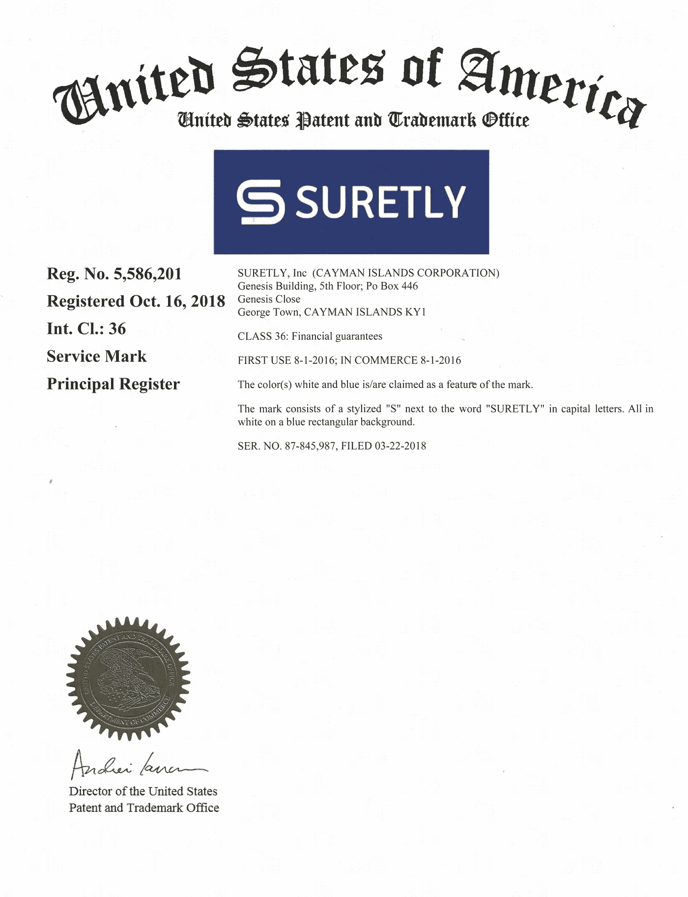

# 为什么要给你的手机应用打上商标？又是怎么做到的？

> 原文：<https://medium.com/hackernoon/why-trademark-your-mobile-app-and-how-1458491eb2eb>

坦率地说，你实际上不需要为你的应用程序注册商标。如果你不介意它变成铲子，那就没什么好烦恼的。但是，如果你认为它很大，你最好站起来注册商标。

让我们提醒你游戏 Flappy Bird 的情况。曾经有一天，AppStore 上发布的几乎三分之一的应用都是这款游戏的克隆版！根据*卫报*的调查，其中一个克隆体在 24 小时内被下载了 644000 次。

复制应用程序越来越受欢迎，注册商标是保护您的应用程序安全的方法之一。如果你不关心你的知识产权，你就有失去利润和信誉的风险。

**做还是不做**

如果你还不相信，让我们告诉你注册你的应用程序的一些优势。

> 1.**资本化上升。你可以出售你的知识产权，分配给临时使用，或者作为贷款的担保。**
> 
> 2.**投资吸引力增强。知识产权可能会记录在公司的资产负债表上。**
> 
> 3.**额外收入。**知识产权可以根据许可协议进行转让，也可以作为特许经营的一部分进行转让。
> 
> 4.**专有权的法律保护。**如果你的权利受到侵犯，例如你的应用被克隆，法律会站在你这边。

以及*不*注册你的应用的一些风险。

> 1.**利润减少。如果有人克隆你的应用，你可能会失去市场份额。**
> 
> 2.**专利钓鱼。如果其他人注册了你的商标或申请了专利，他们将有权要求赔偿或要求损害赔偿。**
> 
> 3.货币化的局限性。该应用不得根据许可协议或作为特许经营权的一部分进行转让。
> 
> 4.**非法克隆。如果你的应用程序没有被注册商标，那么将违法者绳之以法的机会就会减少到零。**

最重要的是，商标让你的顾客知道他们使用的是你的公司生产的产品，而不是假货。这是一种产品质量保证。然而，选择权真的在你。

**商标注册:如何注册你的 App**

**第一步。选择要注册商标的项目。**

有几种知识产权可能与手机 app 有关，商标只是其中之一。当我们谈论商标时，我们不是指功能代码。相反，我们谈论的是徽标、图标、字符，主要是应用程序的标题或名称。

然而，并不是所有的商品都可以注册商标。你要找的商标必须与众不同:它必须足够独特，这意味着它不是一个常见的短语或描述性术语。

例如，如果你的应用程序是某种旅行者地图，你可能无法将这样的名称注册为“旅行者地图”。像这样的名字对于搜索引擎的推广来说是很棒的，但是如果你想注册它就不那么聪明了。

另一方面，这个名字应该与你的应用或业务的核心相关，这样用户就不必去猜测或计算它可能是什么。

我们放心地调用我们的应用程序。这个名字是独一无二的，商标注册没有任何问题。这也反映了我们业务的核心:“肯定”和“保证”这两个词的组合涉及到以少量费用为他人贷款提供担保的过程。

**第二步。确认你的*可以通过*注册你的物品。**

说到标题，你需要在 AppStore 和 Google Play 中进行搜索，然后进行一般的互联网搜索。你最好去看看商标数据库，你肯定应该使用相关的数据库。如果一切正常，并且您的图书尚未注册，您可以进入下一步。

**第三步。确定你的权限。**

列出你希望你的应用程序受到保护的所有国家。律师通常建议你在你计划工作的每个国家注册你的应用程序。然而，这可能要花费一枚炸弹。

更合理的做法是选择最重要的市场，并在那里开始商标注册程序。例如，我们从美国、英国和俄罗斯开始。如果你的应用程序开始流行，你可以随时获得商标注册。

**第四步。确定商标的类别。**

第四步是选择要申请的商标类别。商标有四十多种不同的类别，但是，请记住，每增加一个类别，您需要支付更多的费用。

通常，公司申请两到三类商标。就移动应用程序而言，值得考虑的是与计算机程序相关的应用程序，包括与移动电话和便携式设备软件相关的应用程序。您可以根据您的特定应用程序实际执行的任务来选择其他类。

**第五步。准备好你的文件并提交申请。**

下一步取决于你在哪个国家注册。根据不同的地方，可能会有不同的标准和程序。你也可以考虑申请国际注册，使用马德里系统。在这种情况下，你的商标将在 118 个国家受到保护。

你需要做一些研究来决定你的下一步行动。例如，在美国，仅仅提交申请并支付费用是不够的:你还需要遵守一系列条件(例如，证明应用的商业用途)。没有必要——也不总是可能——自己完成这个过程，但是你可以找一个乐意帮忙的律师。

所以，在整理好所有的论文后，你需要提交它们。在此之后，等待时间可能从几个月到一年半不等，视国家而定。同时，你的申请将被仔细审查。经过这几个月漫长的等待，你将最终收到珍贵的文件。

> 申请商标是一个复杂、耗时且昂贵的过程。但是如果你计划做出一些杰出的事情，这是非常值得做的。商标本身不会让你的应用程序变得伟大，但它会帮助你保护你的业务免受无良竞争对手和现代数字盗版的侵害。除了努力工作、天赋和坚持不懈，它可能会成为你的应用成功的主要部分。