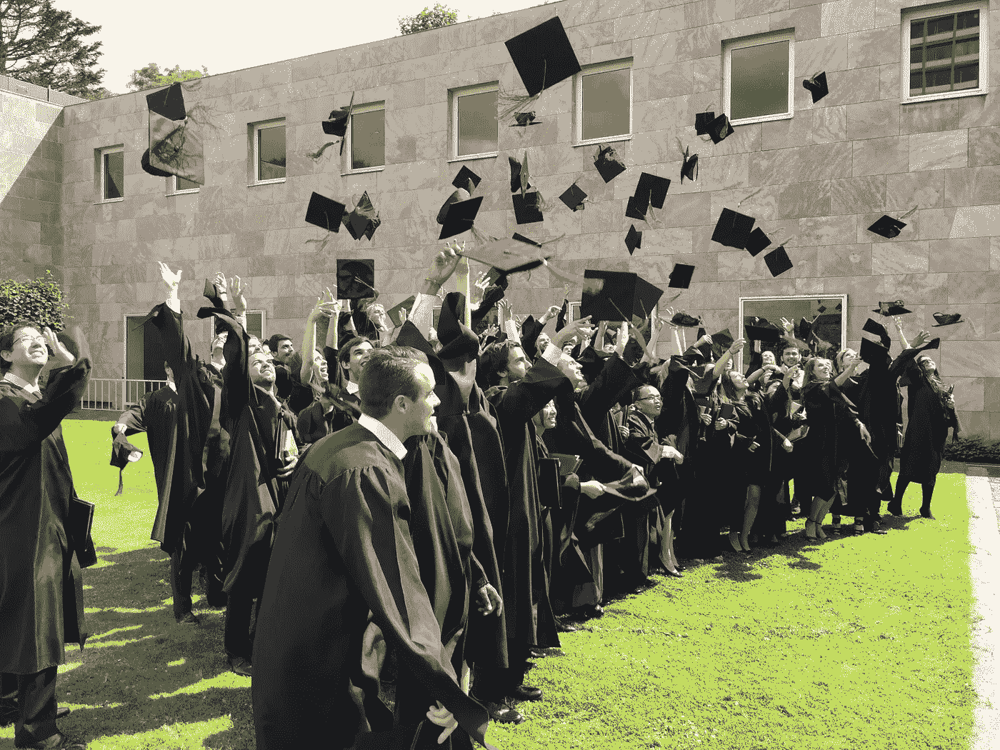

# 为什么大学会在数字世界中被颠覆

> 原文：<https://medium.com/hackernoon/why-universities-will-be-disrupted-in-a-digital-world-52bdc3f05782>

## 在人工智能和机器人时代“重新定义”教育

我喜欢当大学教授。

数字技术、人工智能和机器人的新世界使其成为参与高等教育的一个特别好的时机。

为什么？

因为这些新技术开始扰乱大学，这种扰乱在教学和研究方面创造了新的令人兴奋的机会。

首先，如今年轻人(“千禧一代”)的期望正在迅速变化。我的经验是，学生们不再满足于“老式”的讲座或学术文章。

> 千禧一代需要一种更有活力、更具参与性的教育形式。

教学和研究总是非常有益的。大学提供了创造“遗产”的自由和资源，并为社会的未来发展做出了宝贵的贡献。

但是我们新的数字社会有潜力让大学变得更好。

今天成为一名教授给了我们一个极好的机会去“深入”我们快速变化的世界。我真正感兴趣的是新技术如何创造新的教学模式，以及如何将教学和研究结合起来。

现在，我比以往任何时候都更加感觉到，成为一名“大学教授”不仅仅是一份工作。这是一种生活方式和冒险。回想一下“印第安纳·琼斯”——我们许多 80 年代长大的人的童年英雄——也是一名大学教授。

# “大学中断”的三个原因

我认为大学，尤其是大学教育现在被打乱有三个主要原因。

## (1)数字技术创造的新教育机会

新技术意味着内容可以用新的不同的方式传递给学生。

内容可以变得更容易访问。例如，可以用一种更适合快速发展的数字一代的方式来组织和安排课程。

教育材料的“消费”也可以更加灵活。现在越来越多的大学提供远程学习课程的可能性。

最后，多媒体和在线资源(想想 *YouTube，Coursera* 等。)提供有趣且有用的内容，可以轻松融入课堂。

当然，有必要“管理”所有这些新内容，但技术提供了一个“解决方案”。根据我的经验，“群体智慧”和“用户”评论是**通常是**一个相当可靠的质量指标。

## (2)市场的外部需求

新技术正在改变全球经济。结果是，大学发现自己承受着更大的外部压力，要适应这些新的现实。

丹尼尔·扎勒在评论我之前写的一篇文章时写道:

> “你很好地概述了工作场所文化的转变，以及平台公司如何吸引创意艺术家来推动创新。在我看来，仍然有未开发的机会来识别和招募这些自由精神，特立独行的类型。我们已经从旧经济的信号机制(常春藤联盟学位、华尔街血统)转向自由职业市场、众筹活动和 Instagram 投资组合。在这个世界上，最成功的平台需要以创新、互利的方式找到并吸引有创造力的思考者。”

他指出了大学的潜在风险。如果他们不重新思考教育，他们会发现大学学位不再是它曾经提供的人才“信号机制”。

因此，大学将被迫适应。“市场”将要求教育提供适合数字时代的技能和知识。

## (3)大学内部的主动性

当然，大学意识到，为了让自己“经得起未来考验”，它们必须做出改变。

但是，这种变化往往只是装点门面(空话)或者涉及中央管理者(来自大学或政府)施加更多的控制。

我发现尤其令人沮丧(也极具讽刺意味)的是，至少在大学里，向数字化和去中心化世界的过渡往往导致更集中地创建“程序”。

在教育环境中尤其如此，在那里“质量控制”经常导致乏味的标准化，限制了快速变化或任何创新和实验。

当然，我们需要有流程和系统来保证质量，但这种“程序”的效果往往是扼杀了提供千禧一代今天需要为明天做准备的课程所必需的创业精神和速度。

# 变化正在发生

然而，如果做得好，“未来的大学”有可能让我们所有人更具创业精神，并有助于与更广泛的全球受众接触。

> 这样，“大学颠覆”可以帮助年轻一代创造一个“更好”的数字未来。

但是我们需要意识到“颠覆”不会在一夜之间发生。这是一个逐渐形成势头的过程。

我越来越多的同事选择脱离传统的大学结构，开始在大学之外运作。在技术的推动下，他们使用更开放的通信和媒体手段来试验新的教学模式并传播他们的思想。

正是这些“影响者”在数字时代重新定义了大学教育。

我确信大学将再次成为“大学”。也就是说，一个为未来做好社会准备的地方或社区:

*   为了达到“共同创造”的期望水平，面对面的会议是必要的，并且
*   课堂互动培养了有效应对新的人工智能和互联世界的机遇和挑战所需的技能。

*感谢您的阅读！请按住*👏*下面，还是留下评论吧。*

*每周都有新的故事。因此，如果你关注我，你不会错过我关于数字时代如何改变我们生活和工作方式的最新见解。*