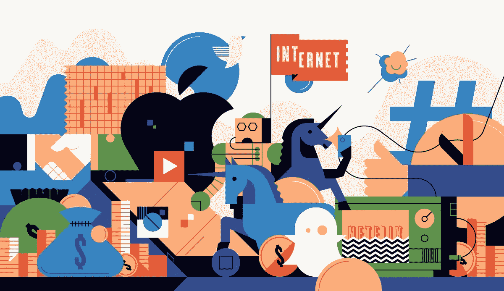

# 为什么风险投资已死，我们将如何为大众社会利益取代它

> 原文：<https://medium.com/hackernoon/why-venture-capital-is-dead-and-how-we-will-replace-it-for-societal-benefit-c66a7faeebe9>

如果我们改变帮助公司发展的标准会怎么样？

我们不再将经济援助作为衡量成功与否的唯一标准，而是转向了人、关注和参与。

如果给予新兴公司的唯一推动力不是通过大量开拓性营销渠道购买客户的手段，而是专注于为客户提供使公司能够更快地在实际市场中测试产品和服务的手段，那会怎样？

## 风险投资是一个奇怪的游戏

使公司成长的最有效的机制来自于投向他们的大量资金。我们可以在许多不同的地方看到这一点，但最引人注目的可能是软银愿景基金的崛起。公司越大，他们就有越多的资金来支持他们的发展。我们没有看到商业模式的创新，而是看到资金雄厚的风投公司补贴企业，以此来扼杀竞争对手。

# 为什么 Nexves 与众不同

我们以不同的方式看待这个世界——我们的目标是以前所未有的规模实现财富的民主化，而不仅仅是让最富有的人参与到这一资产类别中。这意味着每天街上的男男女女都能拥有未来最激动人心的公司。不仅仅是拥有他们，而是实际参与创造让他们成功的引力。

## 这与已经存在的大相径庭

目前，这些基金钱包鼓鼓，资金雄厚，财力雄厚，我们根本无法与之竞争。我们能与之竞争的是同一枚硬币的另一面。在这些基金支付注意力的地方——客户获取成本——我们可以通过创建一个平台来显著降低这一成本，在这个平台上，那些不在最富有的 1%的人可以聚集在一起，为每个人的共同集体利益而行动。你和所有你认识的人。

## 这就是 Nexves

一种前所未有的参与方式。对消费者来说，这是一场革命。它给了没有力量的人力量。这为他们打开了一扇大门，让他们走进去为每个人创造一个新的未来。

# 这是完全不同且强大的

当人们无法参与这个世界时，我们给他们提供了一个以他们从未有过的方式积累财富的途径。

风险投资行业关门是因为他们害怕了。这种模式的创新有限，因为它让一部分人变得异常富有。他们永远也不可能转向一种更具流动性的模式，让普通人也能参与进来。原因在于，大型投资者撤出一只基金的信号风险太大。

# 他们不会改变，但我们可以为他们改变

我们可以创造新的东西，他们必须坐下来尊重和理解。

我们不能继续看着贫富差距扩大到有史以来的最大值，并允许它继续扩大。

我们不能让最富有的 1%从专为他们保留的投机性资产类别中获益。

你已经不能仅仅通过工资来充实自己了。人力资源部门认为这是一门科学，他们付给你尽可能低的工资以获得最高的利润，而给那些帮助公司成功的员工的奖励却很少。

创造财富的唯一途径是所有权和公平。是在睡觉的时候积累财富的东西里。

## 这就是我们给你的机会

# 这就是 Nexves

Nexves 不仅是未来，因为我们说我们是，我们是，因为我们正在围绕您已经熟悉的产品和服务进行创新。不涉及转换成本，不需要改变你现有的行为。Nexves 使您能够继续以完全相同的方式运营，同时赋予您让您的资金为您服务的机会。

Nexves 为人们创造了积累财富的新机制。

## 这意味着新的参与方式

我们一起所能做的比最富有的 1%的人自己所能做的还要多。

## 他们只有钱

他们只有投资。

# 我们拥有的是彼此

# 我们创造的是一个网络

# 我们提供的是一个支持平台

我们不想成为问题的一部分，也不想制造更大的问题。这就是为什么它必须被民主和分配。

我们看到了加密存在的问题——大部分所有权落在极少数人手中。我们有责任找到限制这种情况的方法，同时确保每一个额外的用户增加我们可以利用的网络影响和我们可以部署的力量。

我们需要以财政上负责任的方式做到这一点，保护消费者，同时使他们能够同时在其他方面受益。

我们可以创造新的范式，让人们了解数据和财富可以实现什么。

## [今天加入革命](http://www.nexves.com)

# www.Nexves.com