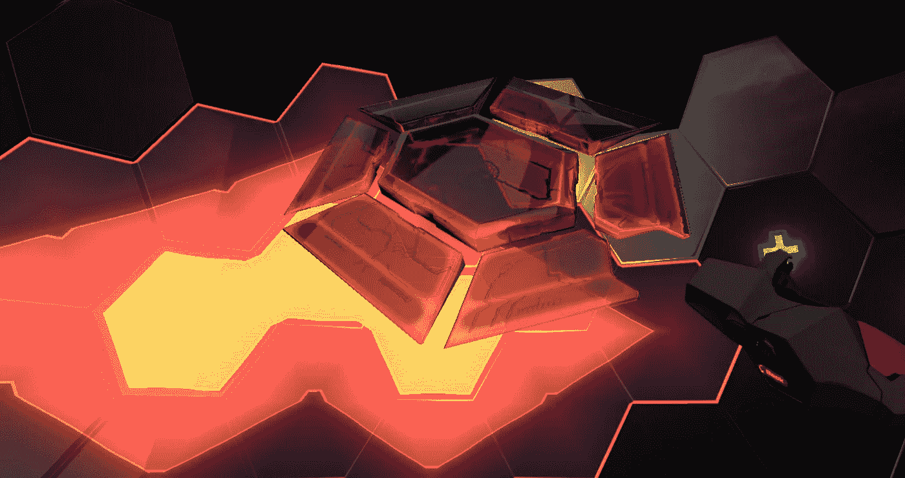
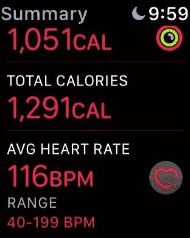
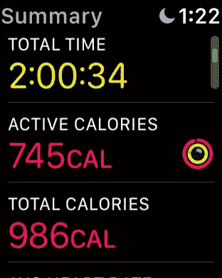
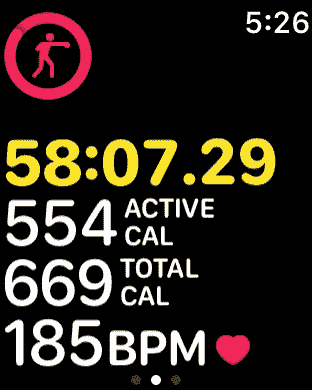

# 为什么虚拟现实将融合游戏和体育(最终)

> 原文：<https://medium.com/hackernoon/why-vr-will-blend-gaming-athletics-eventually-b2def76465c3>

The quintessential VR racquet-ball simulator, Racket: Nx

啊对，虚拟现实。在任何一次常规的饮水机聊天中提起这件事，你可能会收到来自你同事的各种[的回复](https://www.cnn.com/2017/12/13/health/virtual-reality-vr-dangers-safety/index.html)。现在，让我们假设虚拟现实让你感兴趣，否则你会在不在这里的某个地方。

如果你对跳入虚拟现实池持观望态度，你可能会有一些反复出现的想法:是什么让[在虚拟现实中与彼此的数字化身互动](https://www.youtube.com/watch?v=BsbutWcPEJg) ***比与彼此的数字化身互动*** 更酷？

还有[最好的](https://www.oculus.com/rift/)是哪个虚拟现实平台？还有[应该买什么软件](http://store.steampowered.com/app/496240/Onward/)？你能期待什么样的体验？真的没有“真正的”游戏吗？你需要一个大的游戏空间，还是你的橱柜够用？！

停下来深呼吸一会儿。一二三四。呼气。现在好些了吗？可爱！

对我们俩来说幸运的是，这篇文章没有回答那些措辞可疑的问题。**而不是**，请允许我阐明虚拟现实的一个主要好处，那就是 ***超级棒的****任何还没有臣服于我们 c̶u̶l̶t̶辉煌生活方式的人都完全不可能想到这一点。*

# *虚拟现实抨击你最喜欢的 HIIT 类，一周的任何一天。*

*我会把这一点唱给高天[凡](http://vrhealth.institute/portfolio/thrill-of-the-fight/) [单](https://www.reddit.com/r/Vive/comments/4dvyrf/dont_gloss_over_holopoint/) [机缘](https://www.youtube.com/watch?v=84hiY79AxjE) [那个](https://uploadvr.com/boxvr-vr-gym/) [我](https://www.youtube.com/watch?v=grUc75ELfvE&t=1s) [得到](https://www.vrfitnessinsider.com/review/sparc-game-review-dodgeball-workout/)。*

**

*A 2 hour back-to-back session of Eleven: Table Tennis, Sparc, and Thrill of the Fight in ascending order*

*“但是加布里埃尔，有了健身房会员资格，我可以一边进行举重训练，一边笨拙地请求其他健身房会员的友谊，然后我可以在淋浴前偷偷泡在热水浴缸里，没有人叫我出来！”*

**是的*，你绝对可以。我永远不会责怪任何保持这种生活方式的人。但是为什么我要为一次间歇训练支付 10 到 20 美元或者更多的钱呢？在虚拟现实中，几乎任何事情都是 100%的有氧运动，100%的时间。*

*尽管 VR 最近受到了媒体的关注，但大多数人(没有玩过该平台的人)并没有立即意识到 VR 游戏与平板电脑游戏完全相反。*

*虚拟现实让你在房间里走来走去，弯腰从地板上捡起虚拟物体，使用重复的手臂动作与环境互动，弯曲你的臀部以投掷更重的拳头，闪避子弹，在地板上蹲下或爬行以蹲伏。*

*在简单的虚拟现实应用中，身体剧烈运动甚至没有被优先考虑，你仍然在燃烧卡路里。只是为了在你的游戏空间里闲逛。*

**

*The result of 2 hours spent playing zero-gravity frisbee in Echo Arena*

*区别在于:**使用** **虚拟现实相当于花几个小时站起来，用你的身体在生活环境中导航，而不是花几个小时坐着。更不用说当你舒舒服服地坐在座位上时，更容易大吃高脂肪垃圾食品。***

*值得注意的是，当你迷失在完全可以被视为韦斯·克雷文度假屋的地方，一个你自然需要双手远离奶酪粉的地方，你就更难找到任何东西。你知道，万一你被吓到了什么的。*

## *说重点吧！*

*好吧，好吧。花很长时间，认真地看看那些应用程序，比如《战斗的颤栗》，或者[《全息点》](https://www.vrfitnessinsider.com/review/holopoint-vr-game-review/)，或者[《听力盾牌》](https://www.vrfitnessinsider.com/shield-music-get-super-fit-audioshield/)，或者 [Sparc](https://www.reddit.com/r/PSVR/comments/6wzav0/sparc_is_one_hell_of_a_workout/) 。告诉我，鉴于当今市场上商业级 VR 的原始性质，我们还没有扰乱标准健身房模式的手段。*

*这些都是“游戏”,玩家为了得分或与其他玩家竞争，扭曲和撕碎你的手臂和核心。如果 Sparc 的大厅被编码为同时容纳 3 个以上的其他人，那么 SPARC 可能是一项真正的运动。*

*拳击是一种刺激的战斗，但是你永远不会掉牙齿或遭受不可逆转的脑损伤([除非你小于 13 岁](https://www.digitaltrends.com/virtual-reality/is-vr-safe-for-kids-we-asked-the-experts/))。*

**

*On average, I burn between 650 to 725 calories within roughly an hour spent playing Thrill of the Fight*

*我明白了-不是所有的健身房经历都是生来平等的。有的收费多，有的收费少。一些收费较高的蹩脚服务和一些收费较低的最好的 goddang 健身训练，你会发现在你的生活。*

*在我看来，最好的健身房是符合你生活方式的健身房。句号。那么我为什么会选择 VR 而不是会员呢？*

*简而言之:我选择提高我的电脑的边际效用。我让我的 GPU 保持最新，因为我已经是一个电脑游戏玩家了。我说的“玩家”是指极客。这意味着我在以一个极客的权威对我亲爱的极客们说话。我*理解*你！*

*一个好的 [HMD](https://en.wikipedia.org/wiki/Head-mounted_display) 的额外价格为 350-600 美元，再加上你想用来锻炼的任何应用程序或游戏的一次性费用，你可以在舒适的卧室里自由完成全身锻炼。你想待多久就待多久，想什么时候就什么时候。*

*如果你加上一套可调节的 [Bowflex 哑铃](https://www.walmart.com/ip/Bowflex-SelectTech-552-Dumbbells/14660327?wmlspartner=wlpa&selectedSellerId=0&adid=22222222227000505670&wl0=&wl1=g&wl2=c&wl3=40331979752&wl4=aud-273067695102:pla-78291749792&wl5=9032878&wl6=&wl7=&wl8=&wl9=pla&wl10=8175035&wl11=online&wl12=14660327&wl13=&veh=sem)(售价 250 美元左右)，然后你还可以利用你的跑鞋，实际上 [*和它们一起去跑步*](https://zenhabits.net/how-to-go-from-sedentary-to-running-in-five-steps/)，你会被覆盖很多年。当然，除非你的健身目标需要一套[长凳](https://www.google.com/search?q=bench+weight&rlz=1C1GIWA_enUS757US757&source=univ&tbm=shop&tbo=u&sa=X&ved=0ahUKEwjolZn4oazZAhUJ72MKHekRBzIQsxgIKg&biw=1920&bih=949)。或者你的 [PC 炸了](http://www.tomshardware.com/forum/316740-28-computer-blew)。*

*在这种情况下，你只能靠自己了。*

## *结论*

*在目前的形式下，虚拟现实占用了像我这样的懒人通常久坐不动的时间。而且它提供了一个奇妙的激励去…嗯，*不是*久坐。*

*不仅如此，它还提供了一种合法的健身方法，以换取花时间玩游戏。我的意思是看看这个家伙，他在玩 Skyrim VR 的一周内瘦了 10 磅！当然，我认为这项技术有很大的潜力被职业运动员所采用。*

*我们可能最终会看到电子竞技成为体育娱乐产业的一部分。使用一对光学透镜和两只“手”，我们可以顺利地模拟乒乓球。我们目前可能不会看到外围设备的扩散，如虚拟现实跑步机(T21)或模拟阻力的触觉套装(T23)，但技术已经存在。*

*然而，在虚拟现实真正升温之前，需要对现有技术进行更广泛的采用，并对市场容量进行大幅提升(T2)。通过这种方式，头盔显示器的价格可能会下降，虚拟现实友好的基础系统将变得更加可用/可用/实惠。*

*谁知道呢，也许到 2030 年，电视直播的电子竞技会成为一个价值数十亿美元的产业。或者，也许不是。无论如何，一旦虚拟现实像智能手机一样蓬勃发展，预计将看到该平台的运动能力突飞猛进。*

**你有没有把虚拟现实融入到你的健身养生中？**