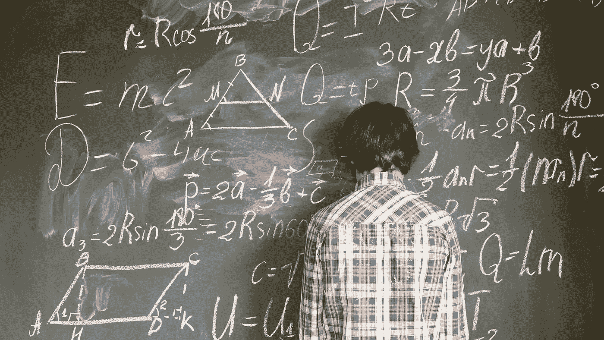

# 如果我们不改变教育，为什么我们会有麻烦

> 原文：<https://medium.com/hackernoon/why-we-are-all-in-trouble-345ff13e790>

## *如何为未来的工作做准备*

[Source](http://www.shutterstock.com)

> *“开发者将成为解决世界上最紧迫挑战的中心。”*

上周，我在[数字领跑者](https://www.nesta.org.uk/project/digital-frontrunners/)活动上发表演讲时引用了微软首席执行官[塞特亚·纳德拉](https://blogs.microsoft.com/blog/2018/06/04/microsoft-github-empowering-developers/)的话。其他一些与会者也表达了类似的想法。

逻辑很明显。在数字时代，包含越来越多代码的设备越来越多。为了提供消费者现在期望和要求的便捷和互联的用户体验，他们必须这样做。这种对代码的依赖使得开发人员成为一切的中心。

例如，一辆现代高端汽车目前有大约 1 亿行代码。随着对更大的车辆自主性的推动继续进行，这个数字预计在不久的将来会增长到 2 亿到 3 亿。我们的“驾驶”体验越来越多地被代码“给予”我们的可能性所构建。

更一般地说，我们正在走向一个代码主导我们决策过程的世界。例如，算法将决定我们买什么，谁被雇用，我们在哪里吃饭，我们去哪里度假，和谁联系，等等。

> 代码无处不在。

代码提供了看不见也不被注意的“架构”,构成了我们的数字存在。结果呢？开发者是新的社会基础设施的建筑师，组织并决定我们现在的生活方式。

# **《工作的未来》**

我上周的活动聚焦于这一变化对“工作的未来”意味着什么，以及我们现在需要做些什么来为这一快速出现的现实做准备。

有一个想法我听过好几次。这相当简单，并且基于数字革命与以前的技术变革时期没有太大不同的想法:

*   首先，我们需要更多的程序员和软件工程师来开发更好的程序和应用。我们需要确保教育的重点是吸引和培养更多的“技术专家”。
*   其次，我们需要确保每个人都能使用这些新程序和应用。“非技术专家”需要获得必要的技术“知识”，以便在数字世界中有效地发挥作用。
*   最后，政府、企业和其他组织都需要抓住数字时代的机遇。例如，他们必须利用社交媒体，变得更加透明，并为共享服务建立基于云的系统。

这样，每个人都会收获数字技术的回报。

当我坐在那里听这种想法时，我越来越确信这个论点中缺少了一些东西。这次情况不同了，如果我们想避免造成巨大的社会问题，我们需要一种完全不同的方法。

# **新的“数字鸿沟”**

当然，我同意在这个日益数字化的世界里，技术应该在任何教育议程中占据重要位置。这很明显。事实上，数学可能是目前最好的学习科目。此外，我们应该注重培养所有学生的 ICT 知识和技能。让我一直感到惊讶的是，有多少“千禧一代学生”仍然没有真正懂电脑。

但是教育方面更根本的改变也是必要的。事实上，上周的经历让我想起了马云在 2018 年达沃斯世界经济论坛上的评论:

> “如果我们不改变教学方式，30 年后我们会有麻烦。我们教给孩子的东西是过去 200 年的东西——它是基于知识的。我们不能教我们的孩子与机器竞争，他们更聪明。”

 [## 马云谈爱情智商——以及他在达沃斯接受采访时的其他顶级语录

### 在达沃斯，阿里巴巴创始人兼执行主席马云公开详细地谈到了一些关键挑战…

www.weforum.org](https://www.weforum.org/agenda/2018/01/jack-ma-davos-top-quotes/) 

如果我们只专注于创造更多的“技术专家”和更多的数字技术“用户”，我们将创造一个新的“数字鸿沟”，这将潜在地伤害我们。

风险在于，一方面,“非技术专家”根本不会在足够深的层次上理解技术。当我们生活的每一个方面都是围绕代码构建的时候，做一个称职的“用户”是不够的。为了成为完全知情和负责任的公民，我们需要更多地了解驱动我们世界的潜在技术(和数学)。

另一方面,“技术专家”(编码人员、程序员和其他开发人员)对数字技术(代码行)开发的当前经济、社会或法律环境没有必要的了解。

不需要太多的想象力就可以看出，新技术的不协调、分散和脱节的发展可能会导致不必要的和不可预见的结果。

风险已经很明显了。想想缺乏隐私、网络安全问题、数字压力、加密货币骗局、算法偏见、克隆人伦理等等。

有时，我会参加一些活动，在这些活动中，有人试图通过辩称当前的经济、社会和法律环境是数字技术负面影响的“天然”屏障来解决这种脱节。例如，这些事件讨论了区块链或人工智能的法律含义，认为法规和法律实践可能会禁止某些技术应用。

然而，这些事件往往忽略了数字创新的速度，不断增加的“技术采用率”，数字技术相互加速的事实，以及这些技术的颠覆性潜力。新的市场和组织正在被创造，当前的经济、社会和法律模式在我们新的数字时代/世界将不再适用。

在当前的第四次技术革命中，我们必须听听马云的话，彻底改变我们在数字时代对教育的看法。

# **那么，我们应该教什么呢？**

在达沃斯，马云被问及同样的问题。这是他的回答:

> “我们应该教我们的孩子体育、音乐、绘画——艺术——以确保他们与众不同。我们教的一切都应该让它们不同于机器。”

他关注的是“软技能”，比如创造性思维、创造性解决问题、果断、足智多谋、适应力、同理心等等。在这一点上，他是正确的。但是我们必须把这放在上下文中，以避免我们只练习公开演讲、交流和人际交往技巧。

今年，我尝试了一种被称为“T4”的通用数字培训本培训包括三个部分:

## ***# 1——了解数字技术如何工作***

这部分培训可以比作“应用数学”重点是让每个人(包括“非技术专家”)更好地理解数字技术背后的数学，如机器学习、深度学习和区块链。

## ***# 2——将数字技术应用于社会问题(新旧都有)***

培训的第二部分是关于在数字时代教学生一种“新的思维方式”。重点是开发、实施和应用“新”理论和模型来解决数字社会的社会问题。学生评估和分析新技术是否以及如何解决社会问题。它们还解决了规则和条例在多大程度上以及如何嵌入技术本身的问题。

## ***#3 —软技能***

培训的最后一部分是培养“软技能”在数字时代，最好的沟通方式是什么？“大数据分析”告诉你消费者的期望是什么？这一部分的重点是“讲故事”的技能，也是关于发展人类技能，使人类能够与他人和机器一起生活和工作。

# **关键外卖**

关于“工作的未来”的讨论很快变成了关于“教育的未来”的讨论

在当前的数字环境中，我们需要从“基于知识”的教育向“基于技能”的培训转变。

我已经试验了“通用数字训练”，第一批结果非常有希望。

学生们学习如何“**连接**、“**协作**、“**共创**”我在之前写过[关于这些能力和过程如何最大化对社会负责的技术创新的机会。](https://hackernoon.com/automation-and-the-creation-of-a-new-world-494996b66932)

拥有这种共享的“通用数字理解”是在设计未来的“技术专家”和“非技术专家”之间建立强大社区的必要条件。

正是在这些社区中，我们可以看到“工作的未来”

*感谢您的阅读！请点击*👏*下面，还是留个评论吧。*

每周都有新的故事。因此，如果你关注我，你不会错过我关于数字时代如何改变我们生活和工作方式的最新见解。