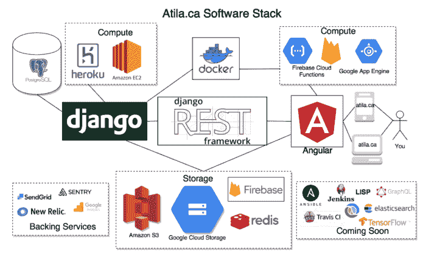
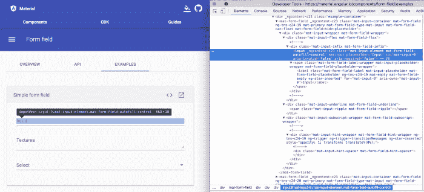

# 为什么我们选择 Angular 而不是 React，选择 Django 而不是 Ruby on Rails:如何选择软件创业技术栈

> 原文：<https://medium.com/hackernoon/why-we-chose-angular-over-react-and-django-over-ruby-on-rails-for-atila-ca-77ac03d542cf>

在 [Atila](https://atila.ca/) ，我们试图为所有学生提供获得优质教育的资金。对于许多移动部件来说，这是一个大问题，挑战可能非常复杂。本文将向您介绍我们用来解决这一问题的软件堆栈，以及如何为您的公司选择软件堆栈的一些建议。

目录

# 高层架构

*   设计原则
*   分散
*   渐进式网络应用

# 前端

*   为什么有棱角而没有反应？

# 后端

*   为什么是 Python Django 而不是 Ruby on Rails？
*   基础设施

# 后续步骤

*   口齿不清
*   我们需要更好的开发工具
*   对人员和项目管理缺乏经验
*   更多的机器学习
*   结论

# 什么是 Atila？

[Atila](https://atila.ca/) 是一个平台，允许学生从一个网站[自动查找并申请](http://blog.tomiwa.ca/building-atila-essential-software-startup-tech-stack/atila/what-is-atila)奖学金。我们自动化了许多不同类型的奖学金申请，从网页到 pdf，我们试图自动化整个申请过程(寻找奖学金，填写表格，甚至[写电子邮件](https://www.youtube.com/watch?v=c_K4342WMwQ))。我们还为学生提供了一个发布[博客](http://blog.tomiwa.ca/building-atila-essential-software-startup-tech-stack/blog/)和[论坛](http://blog.tomiwa.ca/building-atila-essential-software-startup-tech-stack/forum/)的平台，让他们分享关于学校、职业和生活话题的信息和建议。

# 高层架构

Atila 的前端是一个建立在 [Angular 框架](https://angular.io/)上的[渐进式 Web App](https://developers.google.com/web/progressive-web-apps/) 。通过使用 Firebase 云功能，前端是部分无服务器的。后端是一个 RESTful API，构建在 [Python 的 Django](https://www.djangoproject.com/) 框架上，服务于 [Django REST 框架](http://www.django-rest-framework.org/)。核心数据库是一个 PostgreSQL 数据库。该基础设施是 Heroku、亚马逊网络服务(AWS)和谷歌云平台(GCP)服务的结合。

# 设计原则

在构建 Atila 的过程中，我们试图建立一些高层次的设计原则来推动我们的决策。

# 分散

我们试图尽可能独立地设计驱动 Atila 运行的各种服务。这意味着我们的前端应用程序和后端应用程序完全相互独立，理论上可以作为两家独立的公司运行。12 因子应用程序是我们考虑构建应用程序的灵感来源。

就在发表这篇文章之前，我们偶然发现的另一个非常有趣的帖子是[史蒂夫·耶格在亚马逊和谷歌平台上的咆哮](https://plus.google.com/+RipRowan/posts/eVeouesvaVX)。史蒂夫提到了杰夫·贝索斯是如何要求亚马逊的所有服务被设计成好像它们将被外部化给外部开发者，并且进程间的通信将通过服务接口来完成。这听起来有点奇怪，但是它确实改变了你设计系统的方式。这可能是我看过的最有影响力的关于系统架构设计的论文。

# 渐进式网络应用

在 Atila，我们相信，尽管目前移动应用程序盛行，但 web 应用程序将被证明是许多软件公司向前发展的最佳选择:

1.  人们越来越不愿意从 app store 下载新应用。“下载”一个网络应用程序只是在 URL 中输入几个字母。
2.  作为一家初创公司，你不想失败，因为在他们发现你的应用是好是坏之前，没人愿意下载你的应用。
3.  随着浏览器变得越来越强大，网络应用能够提供与本地应用相同的能力、速度和功能。
4.  减少对把关者安卓和苹果及其应用审查流程的依赖。
5.  单一代码库以及在所有设备和操作系统上推广的能力。
6.  人们说移动应用程序的一个共同优势是更高的参与度，这通常是由于原生应用程序的功能，如推送通知、离线支持和主屏幕放置；通过渐进式应用程序，这些功能现在可以在 web 应用程序上使用。

# 前端

我们的前端是一个基于 Angular 框架的渐进式 Web 应用程序。

# 为什么有棱角而没有反应？

选择 Angular 作为我们的前端框架，本质上是在骑师而不一定是马身上下注。谷歌可以说是推动许多关于互联网未来的架构决策的主要私营公司。如果我们想建立一个互联网创业公司，使用最了解互联网的公司所创造和推荐的工具和策略是有意义的。令人欣慰的是，许多谷歌网站都在使用 Angular，尽管如此多的网站仍然使用 Angularjs 有点令人不快。虽然 Angular 的优势也是它的弱点。

Angular 是一个框架而不是一个库，所以它有一种非常固执己见的方式来做一些事情。虽然 Google/Angular 团队非常能干，并且通常非常支持开发人员社区；坦率地说，我们仍然宁愿让开源社区来决定构建某些东西的最佳方式，而不是遵循一家公司的法令。

材料设计也有很多 HTML 膨胀，所以像文本输入字段这样的简单事情将使用大约 3 个不同的嵌套在其中的自定义元素，其中没有一个可以在 IDE 中编辑，只有在浏览器中构建应用程序后才可见。

Material Design also has a lot of HTML bloat. All that markup for a simple form input.

当选择使用任何软件时，一个主要的好处是社区支持。React ( [91K github stars](https://github.com/facebook/react/stargazers) )比 Angular ( [34K github stars](https://github.com/angular/angular/stargazers) )更受欢迎，而且似乎越来越受欢迎。这是我们有时担心的事情，并问自己是否错过了可能即将起飞的反应火箭船。

# 后端

我们的后端是一个 RESTful API，构建在 Python 的 Django 框架上，服务于 Django REST 框架。

# 为什么是 Python Django 而不是 Ruby on Rails？

> 框架能力的上限，大约是语言能力的上限。

类似于 Angular vs. React，我们选择赌骑师而不是马。然而，现在的骑师是编程语言。Python 是一种比 Ruby 更普遍的编程语言，在我们看来，它更强大。如果你要分析一个框架能力的上限，它是语言能力上限的近似值。

我们还计划在各种产品中大力开发机器学习和数据科学功能。例如，更智能的奖学金推荐和改进自动化引擎。Python 还为这些更加科学严谨的任务提供了更多的库和社区支持。

> 好的系统设计胜过好的框架。

最后，我们试图留意“好的系统设计胜过好的框架”这句格言。因此，只要我们构建一个设计良好的系统，我们选择什么样的框架并不重要。话虽如此，我们从未让逻辑妨碍一篇好的博文。

# 基础设施

我们的前端由静态文件和 CDN 托管，CDN 是 GCP 和 firebase 托管和 AWS S3 的组合。我们有一个特殊的 dockerized 谷歌应用程序引擎实例，为一些服务器端渲染，以帮助搜索引擎优化。

我们的后端基础设施托管在 AWS EC2/Heroku 实例上，PostgreSQL 作为我们的关系数据存储。我们还在 Firebase nosql 数据库中存储了一些分析和事件数据，并使用 REDIS 的内存数据存储作为 websockets 实时自动化通知的通信层。

我们使用 Sentry、New Relic 和 Logentries 的组合进行错误报告和性能管理，并使用 Sendgrid 进行编程电子邮件。

# 后续步骤

# 口齿不清

向 Atila 的新工程师推荐阅读保罗·格拉厄姆的[黑客和画家](https://www.amazon.com/Hackers-Painters-Big-Ideas-Computer/dp/1449389554)的书和他博客上的[的文章。对我们来说，特别鼓舞人心的是](http://www.paulgraham.com/articles.html)[打破了平均水平](http://www.paulgraham.com/avg.html)。文章中的一个关键点是，聪明的初创公司应该用 LISP 编写代码。我们还发现 LISP 在学术界和机器学习研究中非常流行，这使得它对我们更有吸引力。经过大量的研究和讨论，我们计划在 LISP 中为这个网站推出一些功能，并特别关注 Clojure 方言。

# 我们需要更好的开发工具

我们需要改进的领域是 devops。我们需要更加严格地控制发布新功能的速度，并确保我们分配时间来偿还技术债务，并使我们的工程师更加高效和多产。像 travis CI、Jenkins CD、GraphQL 和 Github Webhooks 这样的工具是我们一直远远关注的，但说实话，我们可能应该更加努力地集成这些工具。

# 对人员和项目管理缺乏经验

随着公司的发展，我们也在考虑如何最有效地处理项目管理以及我们的团队和文化。我们团队的大多数人还是学生，所以我们在这方面没有太多经验。我们目前正在研究 Asana 之类的东西，甚至研究敏捷之类的开发方法，但仍然没有真正理解它。如果你对创业公司的项目和人员管理有任何建议，请告诉我们。

# 更多的机器学习

我们还计划投入更多时间在我们网站的更多产品中添加机器学习功能。我们目前关注的关键用例包括为我们的用户提供更加个性化和有用的信息，以及使自动化引擎更加健壮。我们内部的一个常见争论是构建还是购买。虽然我们希望快速行动并使用成熟的解决方案，但有一种观点认为，应该在智能推荐系统等方面投入时间，这是让人们参与到你的网站中的很大一部分。

# 结论

希望你已经了解了一些我们是如何努力解决加拿大教育经费问题的。我们是一家试图解决大问题的年轻公司，所以我们总是试图尽可能多地学习。如果这里有你感兴趣的东西，你应该考虑[加入](mailto:tomiwa@atila.ca)我们的[团队](http://blog.tomiwa.ca/building-atila-essential-software-startup-tech-stack/team)。如果你对我们的堆栈或我们应该考虑的事情有任何建议或意见，我们很乐意在评论中听到你的想法，或者你可以发推特给我 [@tomiwa1a](https://twitter.com/tomiwa1a) 。

> **[**原帖**](https://atila.ca/blog/tomiwa/why-we-chose-angular-over-react-and-django-over-ruby-on-rails-for-atila-the-essential-software-startup-techstack) **可在** [**我们的博客**](https://atila.ca/blog/atila/) **上找到。****

**在推特上关注我，tomiwa1a :**

****