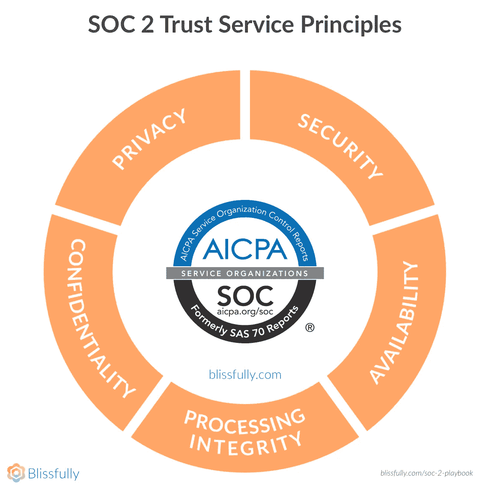
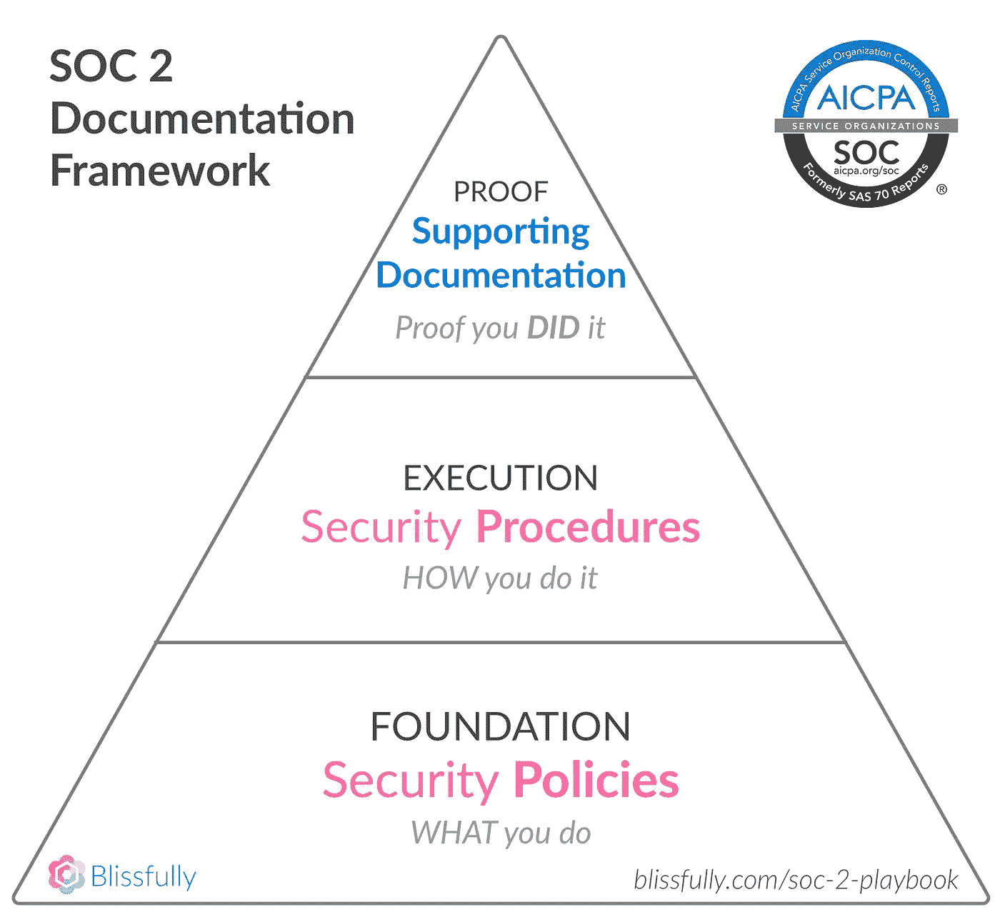
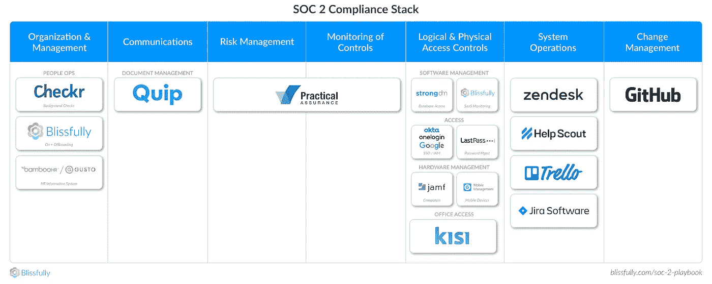
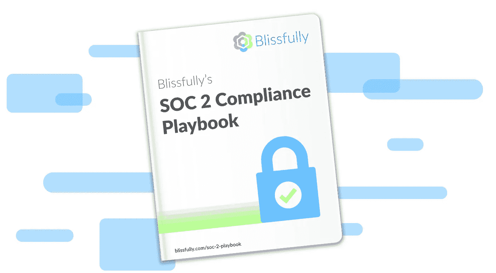

# 为什么我们在种子期后一个月做足球 2

> 原文：<https://medium.com/hackernoon/why-we-did-soc-2-a-month-after-our-seed-round-cbb606d65ced>

大多数公司等到他们的 B 或 C 轮(或更晚)才开始处理关键的行业安全审计和合规认证。

我认为这是一个错误。

事实上，我们在结束种子期后一个月就开始了 SOC 2 Type II 流程。

# 数据安全和隐私比以往任何时候都更加重要

信息安全和数据隐私甚至比什么都重要。黑客(俄罗斯人)最近已经攻破了[座城市](https://www.nytimes.com/2018/03/27/us/cyberattack-atlanta-ransomware.html)、[家公司](https://www.cbsnews.com/amp/news/boeing-ransomware-virus-computer-system-today-2018-03-28/)、[家信用机构](http://www.zdnet.com/article/equifax-confirms-more-americans-were-affected-by-hack-than-first-thought/)、[场选举](https://www.reuters.com/article/us-usa-trump-russia-election/russians-compromised-election-systems-in-seven-states-nbc-news-idUSKCN1GC01E)。此外，人们对脸书有问题的[隐私政策](https://abcnews.go.com/Technology/wireStory/facebooks-privacy-policy-surprise-53999155)、[控制](https://www.nytimes.com/2018/03/28/technology/facebook-privacy-security-settings.html)和[、](https://www.theguardian.com/news/2018/mar/18/breach-leaves-facebook-users-left-wondering-how-safe-is-my-data)违规行为的反弹越来越强烈。忽视这些趋势和风险对你的企业来说简直是鲁莽。

# 尽早开始将它嵌入到你的文化和流程中

强大的安全性是我们想要建立的公司愿景的基础。我们的使命是简化组织管理 IT 的方式，这意味着深入组织内部，并能够访问敏感信息。让公司与我们合作需要信任。实现 SOC 2 合规性有助于我们向客户证明我们值得信赖，并认真对待安全性、隐私性和合规性，从而在这方面进行投资。我们在公司生命周期的早期就这么做了，因为我们想创造一种文化，从一开始就把安全作为一个核心原则，而不是几年后我们与一些外部顾问一起强加的东西。

# 了解 SOC 2:不要被吓倒

我们准备的第一步是很好地理解审计需要什么。我们花了数周时间来弄清楚合规对我们公司意味着什么。对我们来说，在早期阶段实现 SOC 2 合规性意味着我们真正将这些政策和程序内在化，并将其融入我们的企业精神，而不仅仅是完成一份清单。等到以后再经历这个过程对我们来说似乎要困难得多，因为我们必须开始打破坏习惯，而不是从一开始就建立好习惯。

## SOC 2 概述

我们选择启动 SOC 2 是因为它广泛适用于 SaaS 公司，在整个行业得到广泛认可，并为建立和潜在增加其他公司(如 ISO 27001)创造了良好的基础。

SOC 2 是一个基于 5 个关键“信任原则”的框架:

所有原则都有一套标准(“通用标准”)，还有一些特定于每个原则的附加标准，具体取决于您的审计范围。

## 文档框架

总体而言，在完成 SOC 2 合规性审计时，有三种主要类型的文档:

*   **安全策略(您要做的事情):**这记录了您如何实现所有合规性要求，以及您的目标和计划。通常，这在(大规模)“信息安全政策”文档中定义。我们的是一万字。老练的供应商会要求看到这一点。审计员也一样。
*   **程序(你如何做)**:这些定义了你如何实际做你在政策中概述的事情的细节。例如，谁负责传达安全漏洞，您如何加强笔记本电脑的安全性，以及您使用哪些工具来执行。我们建议尽可能多地使用软件来自动化这个过程。
*   **支持文件(证明你做了你说过要做的事情)**:有哪些证据表明你建立的程序符合你作为一家公司制定的政策？

# 为审计做准备

我们决定完成第二类 SOC 2 审计，而不是第一类审计，因为我们知道我们最终想要争取第二类认证(第二类意味着在一段时间内审计您的合规性，通常为 6 个月或更长时间，第一类在某个时刻进行)。从长远来看，选择直接进行第二类审核对我们来说更快、更便宜，因为如果您完成了两项审核，您最终花费的成本将是第一次进行六个月审核的 1.5 倍。

下一阶段，我们着眼于我们自己的内部流程。我和我的共同创始人起草并修订了一项安全政策，该政策与合规框架的各个领域相一致。然后，我们检查了人员运营(HR+IT)领域的工作流程，包括[员工入职](https://www.blissfully.com/employee-onboarding-guide/)和[离职](https://www.blissfully.com/practical-guide-to-employee-offboarding/)，插件工程流程和[安全](https://www.blissfully.com/practical-guide-to-saas-security/)。我们深入到每个领域，花了几周时间检查各种事情，包括我们的入职和培训流程，我们如何监控和检查代码更改，以及我们如何管理计算机和我们的物理办公空间。从那时起，我们甚至在 SOC 2 审计开始之前就修改了我们的关键程序。

例如，在人力资源方面，我们最终采用 BambooHR 作为员工的人力资源信息系统(HRIS ),这将有助于完成人员合规清单。所有的文书工作都通过 HRIS，这最大限度地减少了使用随机电子表格来跟踪我们的工作流程。

一步一步地经历我们的工作流程有助于激发 Blissfully 应用程序的新功能。后续审计现在应该更容易了，因为应用供应工作流被愉快地跟踪。我们还为 SaaS 应用程序内置了[员工入职](https://www.blissfully.com/employee-onboarding-guide/)和[离职](https://www.blissfully.com/practical-guide-to-employee-offboarding/)，并对谁访问了哪些服务进行了审计跟踪。此功能使您能够快速为员工提供所需工具的访问权限，并在他们离开组织时取消访问权限。

# 选择正确的工具

历史上，许多 SOC 2 文档(尤其是支持文档)都是由一堆电子表格或表单手工处理的。作为技术人员，我们希望尽可能利用软件自动化工作流。我们采用(并在后来构建)软件来做这件事。

以下是我们使用和推荐的概述:

Our recommended SaaS Stack for SOC 2 compliance — broken out by Common Criteria

您可以在我们的 [SOC 2 合规行动手册](https://www.blissfully.com/soc-2-playbook/)中查看有关完整堆栈和工具的更多详细信息。

# 完成审计本身

当一个审计员到达现场时，你可以期望他或她仔细检查三个核心领域:政策、程序和文件。审核员将查看您的组织是如何处理这些方面的，并在此过程中询问一些重要的问题。对政策和程序的审查将确保您涵盖所有要求的标准。

大部分工作将集中在“支持文档”上。例如，在工程方面，一个审计员将深入研究你的组织如何实践你为你的团队制定的政策。如何跟踪软件代码变更？如果您遇到了安全漏洞，您如何与客户和合作伙伴沟通？您如何确保您的云基础架构高度可用？如果发生灾难，您将如何恢复服务？如果你准备好了，应该很容易清楚而深刻地回答他们提出的问题，并提供正确的证据来支持。因为我们在大部分过程中使用了工具，所以我们的支持文档很容易准备。它通常是我们使用的工具的截图或导出(例如来自 Github 的展示“变更管理”的 Pull 请求)。

我们很高兴能够说，我们第一次就成功通过了 SOC 2 审核，这主要归功于构成我们工作方式核心的自动化工具和内置文档。

您可以在我们的 [Blissfully SOC 2 行动手册](https://www.blissfully.com/soc-2-playbook/)中了解更多关于 SOC 2 和合规认证流程的信息:

[Blissfully SOC 2 Compliance Playbook](https://www.blissfully.com/soc-2-playbook/)

*原载于 2018 年 3 月 26 日*[*【www.blissfully.com*](https://www.blissfully.com/blog/why-we-did-soc-2-a-month-after-our-seed-round/)*。*