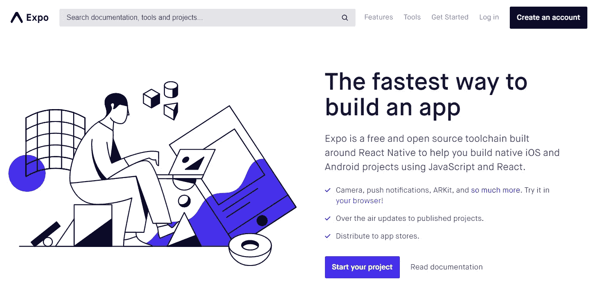

# 为什么我们为了博览会抛弃了我们的原生 Android 应用

> 原文：<https://medium.com/hackernoon/why-we-ditched-our-native-android-app-for-expo-36080f52690e>

A toolchain for React Native

在这个故事中，我想告诉你为什么我决定放弃我们的一个本地应用程序，**花粉聊天**，它是我们在 Android Studio 上使用 Java 构建的。

首先，让我告诉你一点这个应用程序的功能。[花粉聊天](https://pollenchat.com)是一款超本地消息应用。因此，基本上它帮助你发现和联系其他地方团体，如个人和企业。我们认为超本地通信是一个大问题，没有多少公司正在积极寻求解决方案。

 [## 花粉聊天

### 花粉聊天是一个文本信使，连接你和你的邻居。

pollenchat.com](https://pollenchat.com) 

回到 2014 年，当我们刚刚开始最初的原型时，我们选择了 Android Studio 和 Java，因为它们是当时任何严肃的 Android 开发的最佳选择。老实说，没有太多的选择。

我在[我的系统](http://www.dell.com/support/home/in/en/inbsd1/product-support/product/inspiron-15-3542-laptop/drivers)上安装了 Android Studio 2，它有一个 i5 Haswell，4g 内存和[一个 2 GB 显卡](https://www.geforce.com/hardware/notebook-gpus/geforce-gt-640m)，这不算。Android Studio 的启动时间长得令人讨厌。一旦启动，一个 gradle 进程就会启动，并使我的系统崩溃。

> 很痛苦。

现在有人可能会说，开发本地应用程序必须使用更强大的系统。事实上，这很正确，但从商业角度来看，这看起来不太符合逻辑。

> 为什么一个人要为了创造不保证赚钱的东西而投资购买呢？

这正是我当时的想法，我不准备仅仅为了开发一个 Android 应用程序而支付 6-7 万印度卢比，这可能不会产生利润。

> 因此，我坚持使用 Android Studio，它比使用 Expo (React Native)花费了我更多的时间来了解 5X。

虽然我有一个原生应用程序，它在 Play store 上运行良好，但使用 Android Studio 和 Java 开发和调试的整个周期非常慢。

去年，在我空闲的时候，我开始尝试把世博会作为兼职。我设法使用 Expo 开发了一个简单的计算器应用程序，以便获得一些关于工具链的第一手经验。写完这个计算器应用程序后，我对 Expo 能提供什么变得相当有信心。所以。

> 有一天天气很好，我决定退出，并决定使用 React Native 重新构建整个应用程序。

以下是 Expo 的一些特性，它们极大地改进了我的开发工作流程。

## 不依赖 Android Studio。

这意味着人们不需要雇用重型机器来编写 Android 应用程序。在运行 IDE 时，没有繁重的 [Gradle](https://gradle.org/) 构建过程，也没有 Java 的“停止世界”垃圾收集。在使用 Expo 进行开发时，我再也不会遇到系统运行缓慢的问题。

尽管我仍然在其他项目中使用 Android Studio，但我更喜欢使用 Atom 和 Expo 来编写跨平台的应用程序。

## 热重装

我知道这一点已经被反复强调了很多次，但是**真的有明显的不同吗？在 Expo (RN)上，我只需保存我的更改，这些更改几乎会立即加载到我的开发设备上。**

Android Studio 也有这个[即时运行](https://developer.android.com/studio/run/)功能，但我似乎从来没有让它正常工作，它仍然比 RN 的热重装版本慢一个数量级。

## 世博会的宣传短片

Expo 的其他 API，如推送通知 API，极大地帮助了我们以前所未有的速度将推送通知集成到我们的应用程序中。早些时候，我设计了一个定制的后端系统来与 Google Cloud Messaging (GCM)进行交互，并跟踪所有 GCM 消息的状态。

现在，我只需使用 Expo 的推送通知 API，它就能为我处理一切。

## 一个快速制作 iOS 副本的机会

通过使用 Expo，我们为在不久的将来推出花粉聊天的 iOS 版本做了更好的定位。截至目前，我们只有安卓系统，但我们可以轻松地在 iOS 上启动应用程序，只需做少量的更改。顺带一提，我们正在做。

## 可怕的免费支持

我想我爱上了世博会上那些活跃的家伙！当你陷入困境，需要帮助时，他们总会出现在你身边。你知道更有趣的是什么吗？他们甚至不为他们提供的支持收费。世博会的论坛是一流的，大多数时候，人们可能会从世博会工程师那里得到问题的答案。

我正在使用 Expo 编写更多的应用程序，希望很快会有一些消息出来。

如果你想听到更多我的消息，请务必关注我。此外，如果 Expo 帮助你快速编写更好的应用程序，推荐这篇文章。

## [推特](https://twitter.com/rajat1saxena) | [YouTube](https://www.youtube.com/channel/UCUmQhjjF9bsIaVDJUHSIIKw) | [瑞恩工作室](https://medium.com/rayn-studios)

直到下一次…