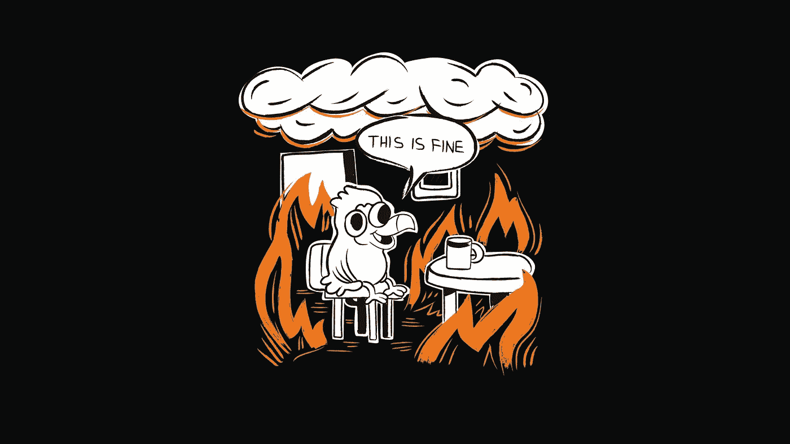

# 为什么我们不再在 Sprint 评审中收集反馈

> 原文：<https://medium.com/hackernoon/why-we-dont-gather-feedback-at-sprint-reviews-anymore-1a88ea81b54d>

最近，我们决定**不再在两周一次的 [sprint 评审](https://www.scrum.org/resources/what-is-a-sprint-review)中收集** [**反馈**](https://hackernoon.com/tagged/feedback) ，而是专注于使开发过程对利益相关者透明。

我们一直认为反馈是 sprint 评审的主要目标。那么，为什么我们停止了这种做法呢？

在最近[渡渡鸟披萨](https://dodopizzastory.com/)的 [sprint](https://hackernoon.com/tagged/sprint) 点评中，我们正在努力收集反馈。我们邀请了客人、经理和合作伙伴。我们的团队报告了他们收到的反馈。但我不能说这是成功的。

## 20 分钟不够

在 sprint 回顾中，每个团队在 20 分钟的简短会议中展示已经完成的工作。在演示客户端应用程序(网站、移动网站或移动应用程序)时，我们没有时间询问两到三个以上的客户端。这还不够。当我们演示后台应用程序时，我们会要求我们的经理和合作伙伴测试新功能。但是 20 分钟的时间不足以让你真正投入进去，甚至理解那里发生了什么，更不用说给出适当的反馈了。

但这还不是重点。关键是，我们的主题专家在 sprint 期间与团队合作收集的反馈更全面，更有价值，质量也更好。

例如，我们的移动应用产品负责人 Sergey 定期会见客户，向我们的用户提问，并在更舒适的环境中收集反馈。他经常坐在他居住的 Lyubertsy 的一家比萨饼店，与当地客人安静地交谈。在 sprint 期间，他会见了几十个客户，在 sprint 结束时，他获得了很多关于产品优点和我们需要改变的地方的信息。因此，当 sprint 评审开始时，反馈已经被收集、考虑，并且变更已经被实施。

## 冲刺评审不是收集反馈

你可能会感到惊讶，但是即使在 Scrum 指南中，也没有一个字是关于在 sprint 评审中收集反馈的。“在 Sprint 评审期间，Scrum 团队和利益相关者就 Sprint 中所做的事情进行合作”——这就是它是如何被放在那里的。Scrum 团队和利益相关者！而不是用户或客户。他们协作，而不是收集反馈！完全不是那么回事。

不是所有的涉众都有机会每天仔细考虑开发过程的所有细节，特别是如果有八个团队在一个项目上工作，就像他们在这里做的那样。但是几乎每个人每隔一周都能抽出两个小时。

sprint 评审是一件非常昂贵的事情，因为所有团队(总共 58 人)和关键涉众都参与其中。甚至公司的首席执行官也每两周抽出两个小时给我们。因此，以最大的效率进行会议，不要在对项目没有好处的事情上浪费时间，这很重要。

## 关注利益相关方的透明度

并非所有的利益相关者都积极参与开发过程，但是他们都希望随时了解开发过程中发生的事情。这就是我们需要 sprint 审查的原因。仅仅看到在一次冲刺中完成了什么是不够的。涉众不能理解 sprint 目标对团队来说是一个艰难的目标，还是轻而易举就实现了。他们甚至不知道我们队里有多少人。

你怎么知道哪个团队在疯狂地工作，哪个团队更喜欢设定一个简单的冲刺目标，而不是让自己过度劳累？你如何判断一个团队没有达到冲刺目标的原因——是他们动力不足，还是有更深层次的原因？团队如何对新出现的问题做出反应——他们是继续跋涉，还是寻找一个系统性的原因并试图消除它(也许 sprint 目标会因为这个原因的消除而受损)？

Scrum 指南里有 sprint 的评审技巧，而№3，“开发团队讨论了 Sprint 过程中哪些进展顺利，遇到了哪些问题，以及这些问题是如何解决的”，就是我在这里要说的。这就是我们在上次 sprint 回顾中决定关注的内容。

换句话说，我们已经决定使用我们的 sprint 评审来最大化开发过程的透明度。像往常一样，我们展示了我们所做的，但除此之外，我们的团队还讨论了新特性和功能的起源。

## 描述你迈向冲刺目标的旅程

我们的目标是什么？实现了吗？冲刺阶段发生了什么？什么分散了我们的注意力或阻碍了我们？我们采取了什么措施来达到我们的目标？我们做了什么来消除障碍？我们做了哪些测试？他们的结果如何？团队做了哪些决策？

例如，由于[停止线原则](https://dodopizzastory.com/2018/11/20/stop-the-line/)，几个团队无法实现他们的冲刺目标。利益相关者对团队在停止生产线期间所做的事情以及这将如何使整个项目受益很感兴趣。抽象的牵引力团队告诉我们一个真实的侦探故事，希望快速解决问题，一个令人失望的发现，这里不会有免费搭车，情节曲折，和一个快乐的结局:-)最后，团队设法增加网站的流量，增加一倍以上，这是一个成功！但是如果你知道成功的代价，你会对它有不同的看法。

## 结果

正如会议结束时的小型回顾所证明的，参与者喜欢这种新的 sprint 回顾形式。团队可以轻松地谈论失败的冲刺目标。他们的许多故事富有戏剧性，激动人心，令人印象深刻。利益相关者已经理解了为什么在带有星号的收据中隐藏客户的电子邮件地址根本不是一件小事，而不仅仅是他们之前认为的“半个小时的编程”。关于商业和软件开发者如何更紧密地合作以加速在其他国家的发布，有很多深入的讨论。反之亦然:软件开发人员如何与客户更多地合作，不要被他们想出的解决方案冲昏头脑，而是要考虑客户的问题。总的来说，还不错。

然而，一如既往，仍有改进的余地。所以我们继续我们的实验。