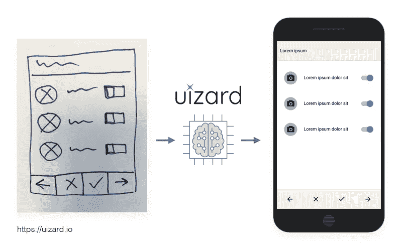
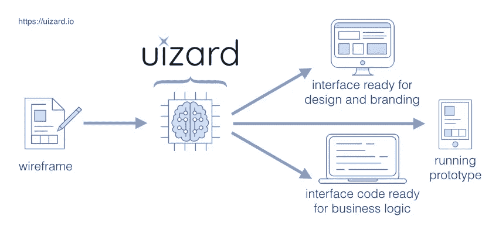

# 为什么我们投资 Uizard——线框原型的未来

> 原文：<https://medium.com/hackernoon/why-we-invested-in-uizard-the-future-of-wireframe-prototyping-86ed41383d36>

Draw your wirefram, upload it and magically get a working prototype and code!

创始人总是问我们为什么投资一家初创公司，所以我总是想试着澄清一下。有时你可以去寻找一个特定的公司投资，其他时候他们会找到你。

当你遇到的每个初创公司都在使用某种形式的人工智能、自然语言处理、机器学习、深度神经网络、深度学习、CNN、LSTMs 等时，行话主宰了我们的日常生活。无可否认，作为一个非技术人员，我无法亲自验证我被推销的大部分内容，尤其是在种子前期/种子阶段。这时，行业专家、投资伙伴和飞行员会非常有用。

我特别感兴趣的一个特定领域是机器视觉，如果上述所有术语可以比喻为大脑的不同部分，那么它将是任何谚语中机器人的眼睛。我很幸运能和 LDV Capital 的主要风投之一 Evan Nisselson 成为朋友，他专注于投资深度技术人才，建立机器视觉业务。

# **来自一位值得信赖的朋友、顾问和专家的热情介绍。**

我见过几十家试图解决各种问题的机器视觉初创公司，有些问题比其他问题更大。在审查了一些之后，我会将它们发送给 Evan，征求他的想法/反馈，事实证明这些想法/反馈总是很有见地。

几个月前，Evan 送来了 Uizard 的资料，仅从概念上来说，我就很感兴趣(我将在后面详述)，但我知道，至少从团队和专业背景来看，它们必须非常特别。所以我们安排了一次会面(视频聊天，因为他们在丹麦哥本哈根)。

# **出色的技术和全面的团队**

我们总是试图确保早期的创始团队涵盖大多数需要的业务角色，这样他们就可以在内部完成尽可能多的工作。四位联合创始人由三个技术和一个业务组成，这在这个非常早期的 pre-seed 阶段非常有帮助，仍然处于 Alpha 阶段，即将启动他们的 beta 阶段。

这三位技术联合创始人都拥有计算机科学硕士学位，他们的专业特长使他们互为补充，而非多余。一个专注于全栈工程和面向客户的技术，一个专注于云、基础设施和 devops，另一个专注于机器学习和计算机视觉。

[https://uizard.io/about](https://uizard.io/about)

# **伟大的理念和一致的愿景**

我亲身经历了这个问题，自己建立了应用程序/网站，也投资了很多，这是我想要解决的问题。我见过一些创业公司试图创建更好的应用程序，拖放/ DIY，但没有一个像上传一张图片那么简单，神奇的是这是代码和工作原型。点击这里查看他们的一些研究[https://uizard.io/research](https://uizard.io/research)

该公司仍处于非常早期的阶段(种子前期)，但像这样的技术在未来一定会存在:

*   线框和故事板是大多数开发过程的标准。我相信快速试验原型和迭代的能力会带来更好的 UX/用户界面。
*   如此多的时间花费在对非常相似的设计进行不同的迭代编码上，以查看哪个外观和感觉最好。通过大量减少多余的工作，每个人都可以腾出更多的时间在项目的其他方面。

> 较少编码💻=更多迭代周期🚀=促进创新💡

随着我们不断扩大网络，这是我们的第一笔国际投资。该公司总部位于哥本哈根，所以几周前我第一次见到托尼(首席执行官)本人，他在[埃文的 LDV 愿景峰会](http://www.ldv.co/visionsummit/)上做了一场精彩的演讲。我们聊了一会儿，我对尤扎德的潜力更加兴奋。作为一个好纽约人的回报，我向他推荐了当地最好的披萨和百吉饼。谁说投资人不增值？

就像 3D 打印如何改变硬件开发流程一样，Uizard 的技术将如何改变应用程序开发流程。我已经等不及年底公测的发布让大家尝试了。

*你可以在这里阅读他们的 Techcrunch 发布报道[https://Techcrunch . com/2018/05/21/uizard-raised-funds-for-its-the-turns-ai-design-mock ups-into-source-code/](https://techcrunch.com/2018/05/21/uizard-raises-funds-for-its-ai-that-turns-design-mockups-into-source-code/)

* *他们也在招人！[https://uizard.io/career](https://uizard.io/career)

*☞以后想听更多我的想法:* [*在 Twitter 上关注我*](https://twitter.com/Trace_Cohen)

*☞如果你喜欢这个帖子，* ***请“鼓掌”*** *帮助把这个作品推广给他人或者在评论里告诉我你的想法*