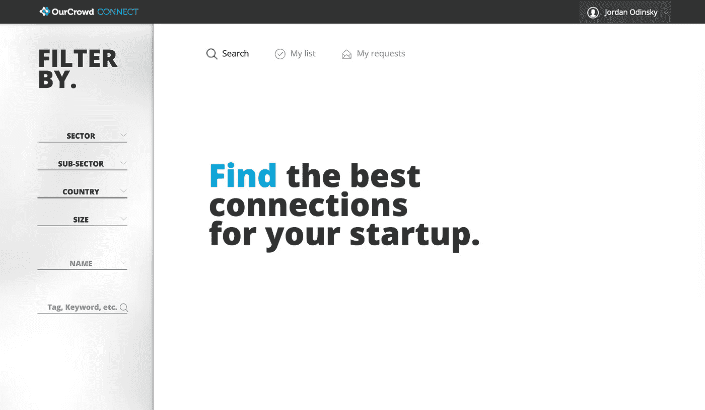
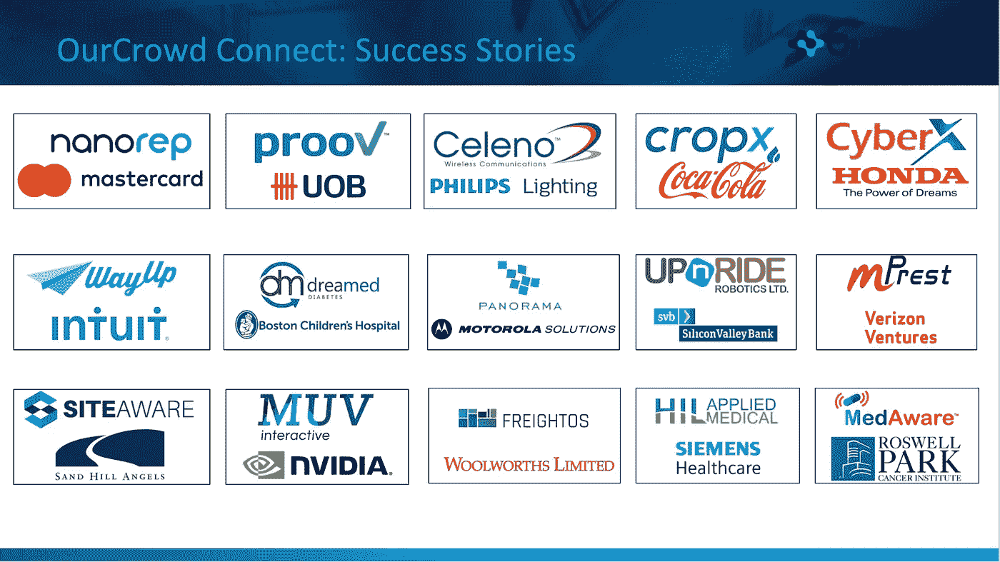

# 为什么我们推出了我们的 Crowd Connect

> 原文：<https://medium.com/hackernoon/why-we-launched-ourcrowd-connect-eb24b537890f>

## 向投资组合公司介绍我们的数据驱动业务开发平台

大约一年半前，我们开始集思广益，如何扩展我们的增值服务，以覆盖我们在全球的投资组合公司。向跨越不同时区、不同阶段和不同行业的 135 家以上投资组合公司提供业务发展、人才、社区和一些其他福利可能有点挑战性。

为了避免贪多嚼不烂，我们首先决定扩大我们的业务发展努力。为什么？因为作为一个主要的 A/B 轮投资者，在*正确的时间*向*正确的人*进行高度有针对性的介绍，有很大的潜力在这个阶段对企业产生有意义的影响。

在我们公司，我们坚信网络的力量。毕竟，我们的风险投资商业模式是由我们的投资组合公司、投资者、跨国公司、服务提供商和行业专家的核心网络驱动的。那么，你如何让不同的利益相关者共同利用“群众的力量”来使你不断增长的投资组合受益呢？

## 介绍我们的 Crowd Connect

两周前，我们在 2018 年 OurCrowd 全球投资者峰会上发布了 OurCrowd Connect。简而言之，OurCrowd Connect 是我们的数据驱动型业务开发平台，投资组合公司可以通过它请求热情介绍 OurCrowd 庞大网络中的战略联系人。以前，当一家投资组合公司要求我们介绍时，我们通常会通过 LinkedIn、Salesforce、Outlook 和其他工具逐个进行搜索，以确定我们是否能够提供帮助。这是一场混乱，产生了高质量的结果，但没有达到服务 135 家以上投资组合公司所需的规模。

如今，有了我们的 Crowd Connect，投资组合公司可以按照关键词、行业、位置或他们寻求的目标规模无缝过滤我们的网络，向愿望列表添加请求，并填写一份快速表格，说明他们为什么对连接感兴趣。之后，我们收到请求，询问相关联系人是否感兴趣，只有在双方同意的情况下才促成介绍。这一过程以前需要花费数天时间并中途多次停留才能完成，现在已经无缝、可访问并可扩展到我们不断增长的产品组合。

随着我们继续推进风险投资“增值”的边界，我们正在重新设想如何大规模提供高质量的介绍。我们正在重新定义给第一次创业者一个经验丰富的企业家的名人录意味着什么。我们正在重新发现如何将增值服务扩展到异常庞大的产品组合中。

在过去的几个月里，我们的公司访问了我们的 Crowd Connect，我们在我们的投资组合公司、跨国公司、风投和服务提供商之间促成了 500 多次介绍。我们期待着见证这些介绍超越最初的对话，并导致合作伙伴关系，销售，投资，等等。通过我们的 Crowd Connect，潜力是无限的。

如果你是大公司的创新型员工、服务提供商、投资者、行业专家或创业迷，我们邀请你加入这里的[人群，在创业生态系统中发挥作用。](http://www.ourcrowd.com/connect)

如果你是一家初创公司的创始人，正在筹集资金(种子，A，B)，或者在可预见的未来，我希望听到你的消息。给我发邮件[这里](mailto:jordan.odinsky@ourcrowd.com)。

*最重要的是，这是专注于帮助我们的创始人扩大业务的专业人才团队的重大努力。在这个激动人心的里程碑上，向我的队友 Eldad Postan、Ariela Lazan、Laly David、Yehoshua Zlotogorski 和 Rebeca Querub 致敬！*

*嗨！我叫乔丹，在以色列做 VC。风险投资/创业领域发生了很多事情，我想我应该在这里发表我的观察。* ***以上所有观点均为本人观点。*** *在 Twitter 上随意关注:*[*@ jordanodinsky*](https://twitter.com/jordanodinsky)*。*