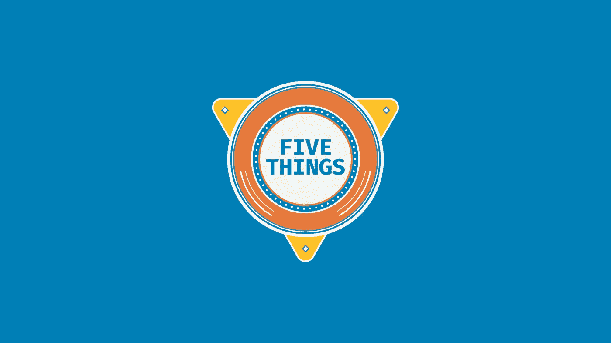

# 我们为什么制作“五件事”节目

> 原文：<https://medium.com/hackernoon/why-we-made-the-show-5-things-e64291f02377>

本周三，我们推出了一个名为“5 件事”的新网络展会。我想全世界的每个人都已经多次看过这个节目的第一集了，这里的某个地方有一个白天的艾美奖。我甚至会满足于夜间艾美奖。

如果你没看过这个节目(这怎么可能？)，基本前提是我们每周与一位来自技术社区的人坐下来，为您带来关于 [JavaScript](https://hackernoon.com/tagged/javascript) /web/Node 世界中某个特定主题的五件事。

# 为什么又是一场开发者秀

首先，我会说还没有足够的开发者展示。有很多播客，但我认为我们还没有充分饱和视频内容市场。嗯，我的意思是，如果你在谈论教程，我们有，但不是从人类兴趣的角度。信不信由你，开发商**确实有人类的兴趣。**

我们也希望这个节目有所不同。站在桌子后面谈论技术并不糟糕，它刚刚完成，我们想做一些意想不到的事情。

注意力持续时间很短，所以我们知道这个节目不仅要尽可能短，而且要快速进行。我们也希望这些节目有很高的制作价值——场景间的快速切换，多视角，高质量的音频和现场拍摄。

我们也有一些伟大的灵感。

## “两种蕨类植物之间”遇见科技

它的灵感来自很多不同的地方，但对我来说，它多少受到了“两种蕨类植物之间”这个节目的启发。如果你从未看过那个节目，现在就去做吧。不客气

虽然我不能像扎克·加利菲纳卡斯那样不敬(或幽默)，但我喜欢这个节目的不同形式。他有引人注目的客人，但是这个节目没有什么特别之处。它打破了你想象中的人和真正的人之间的界限。或者至少他们在节目中假装是谁。

我们也有不同的宿主。每个主持人都会带来一些不同的东西，所以形式可以从非常荒谬到非常翔实。这取决于那一周谁是客人，谁是主人。对每个人都有好处！

# 但是为什么呢

我们制作这个节目的核心原因是帮助开发者了解微软对 JavaScript 开发者的热爱。作为一名在微软工作的 JavaScript 开发人员，当我听到“Azure 是为了。NET 开发者”。这是完全正确的，但它也是 JavaScript 开发人员的一个[惊人的地方。微软给我们时间和金钱去制作这样的节目，这证明了微软是一家开发者公司；一家 JavaScript 开发公司。](https://docs.microsoft.com/en-us/javascript/azure/?view=azure-node-2.2.0&WT.mc_id=5-things-medium-buhollan)

# 五样东西的未来

很简单——现在询问未来还为时过早。这毕竟是第一集。然而，我可以向你保证一些伟大的客人，他们的名字与“肖恩·克拉克金”、“杰西·布拉泽尔”和“本·梅斯”押韵——其中一些人的名字让我觉得不舒服，变成了一个糟糕的押韵笑话。

我们也有不同的主持人，所以在未来的剧集中，你可能会看到[本人](https://twitter.com/burkeholland)、[约翰·帕帕](https://twitter.com/john_papa)、[新美乐股份公司·科廷](https://twitter.com/simona_cotin)或其他人担任主持人。

你可以在 YouTube 上观看该节目，也可以在 Twitter 上关注 9 频道的账号。你也可以跟着[我](https://twitter.com/burkeholland)走，但是你肯定已经这么做了。

现在我是一个正式的“优步”，我相信我不得不尖叫…

> 喜欢，评论，订阅！砸碎那个 LIKE 按钮！嘘嘘！
> 
> 我的孩子看的每一个 YouTube 视频

