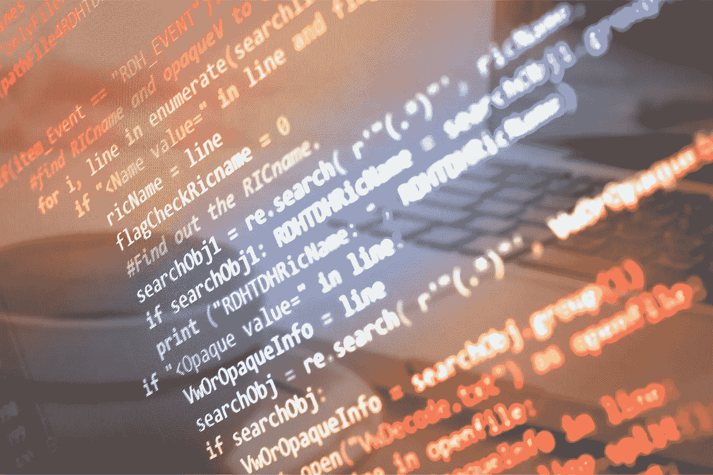
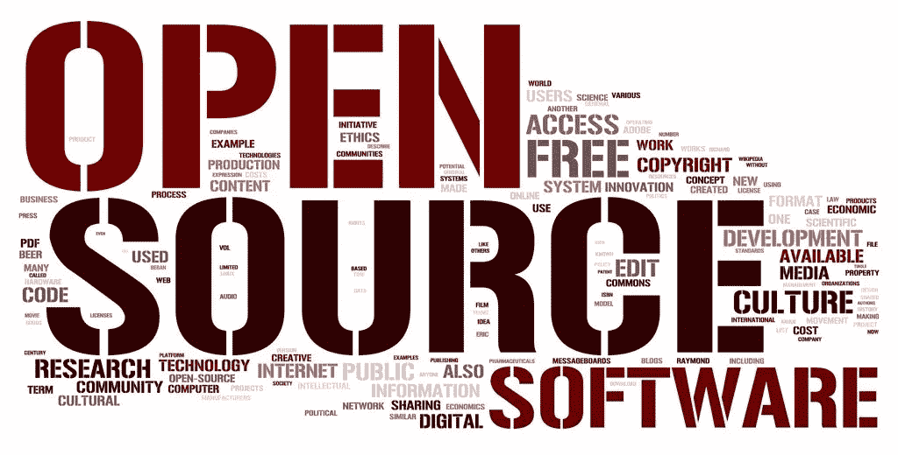
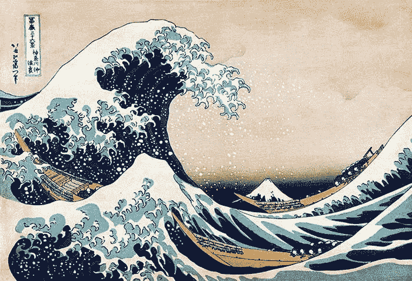
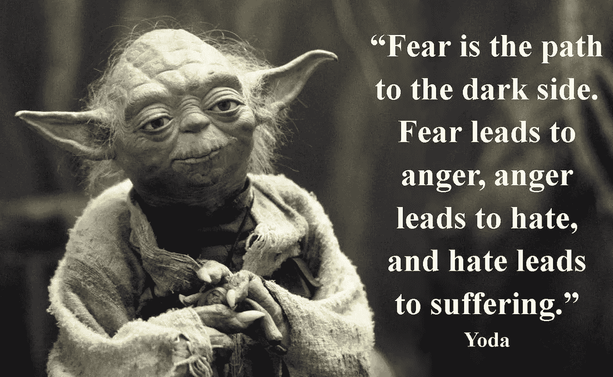
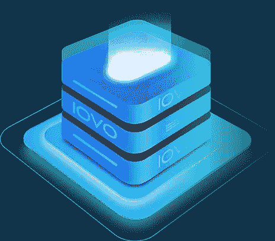

# 为什么我们比以往任何时候都更需要开源

> 原文：<https://medium.com/hackernoon/why-we-need-open-source-now-more-than-ever-bbf9496b35bb>

我第一次发现 Linux 是一次神圣的经历。

R. Crumb’s take on [PKD’s pink beam of illumination](https://philipdick.com/resources/miscellaneous/the-religious-experience-of-philip-k-dick-by-r-crumb-from-weirdo-17/).

它像一束粉红色的光照一样击中了我。我知道我看到了一些全新的、不同的东西，一些激进的、美妙的甚至危险的东西。危险是因为它拥有永远颠覆整个软件生态系统的力量。

最重要的是，我想成为其中的一员，因为我想改变世界。

它确实改变了世界。

回过头来看，这一切现在看来是如此明显。

但并不总是如此。

我已经老到可以记得开源是一场战争的时候了。

一位招聘人员曾经告诉我，Linux 这个东西简直是疯了，我应该学习 Solaris，因为他有一千倍于 Solaris 的工作机会。我告诉他，他疯了，十年后索拉里斯将不复存在。他看着我，好像我有两个脑袋。

那是在 Red Hat Linux 在 Fry's Electronics 盒装销售的时候，当时史蒂夫·鲍尔默称 Linux 为“[共产主义](https://www.theregister.co.uk/2000/07/31/ms_ballmer_linux_is_communism/)”和“[癌症”。](https://www.theregister.co.uk/2001/06/02/ballmer_linux_is_a_cancer/)

哦，时代变了。二十年后，就连鲍尔默也知道自己大错特错了。

开源吃了全世界。因此没有人住在公社里。

企业仍然赚钱，甚至更多。Linux 驱动一切，从网络的后端到世界上最强大的超级计算机，到你的手机，再到最前沿的人工智能应用。

今天，开源是默认的。每一项主要技术都是从那里开始的，无论是云、人工智能、移动还是容器。如果你还年轻，刚开始接触科技，开源就像一棵树或一条河一样一直在那里。你从来没有离开过它。遍布全球的 Github 和开发团队是常态，而不是例外。

这是如此普遍的现象，以至于曾经是专利或死亡咒语的大师的微软刚刚以 75 亿美元收购了 Github。

如果你和 Slashdot 一起长大，而那时 Reddit 在两个大学生眼里还只是一束微光，那么这对系统来说是一个巨大的冲击。过去，Slashdot 上微软的标准图标是长着博格人眼睛的比尔·盖茨。微软是开源的黑暗物质。他们是集博格人、索隆和达斯·维德于一身的人。

微软当时的哲学是“[拥抱、扩展和消灭](https://en.wikipedia.org/wiki/Embrace,_extend,_and_extinguish)”他们会采用任何开放的项目或开放的标准，慢慢地加入专有的扩展和挂钩，作为一种阴险的方式来破坏和利用它。像博格人一样，他们的目标是完全同化。用他们专有的病毒接管一切，从内部感染并完全控制它。

今天，微软公开拥抱其他操作系统，他们已经从“ [Windows everywhere](https://arstechnica.com/information-technology/2016/05/onecore-to-rule-them-all-how-windows-everywhere-finally-happened/) ”转移到游戏、人工智能和公共云，与所有其他孩子一起在沙盒中愉快地玩耍。你甚至可以在 Windows 上安装一个 [Linux 子系统。](https://docs.microsoft.com/en-us/windows/wsl/install-win10)

震惊了。

但是开源之战并没有结束。

这才刚刚开始。

今天，战争中出现了一条新战线，这是我从未预料到的，但它将使专有软件和开放软件之间的旧战争在核武器面前看起来像是一场棍棒和石头的战争。

唯一的风险就是一切。

# **开源作为一种生活方式**

开源不仅仅是我可以下载和修改的源代码。

这是一种存在方式和看待世界的方式。

但是让我们从代码开始。

开源早期的问题是封闭代码还是开放代码对世界更好？

我们会摧毁那些花费数十亿美元建立自己专利帝国的公司的竞争优势吗？开源能创造出任何东西，除了那些由多年 R&D 支持的封闭书库的蹩脚克隆，还是他们注定只能建造廉价的仿制品？

就像一个新兴经济体开始制造低技能产品，但发展到制造最先进的产品，创新需要很长时间才能开源。在早期，开源就像 20 世纪 60 年代和 70 年代的日本，“日本制造”意味着便宜。但是到了 80 年代和 90 年代，日本跃上了一个新的高度，发展了他们自己的杀手级公司。很快，他们制造了一些世界上最令人垂涎的东西，从汽车到电视，再到音乐播放器。

开源也是如此。在 90 年代早期，开源意味着便宜。唯一的卖点是它以牺牲许多功能为代价削减了成本。当时几乎所有的研发都是从封闭源代码开始的。大公司花费数十亿开发他们的想法，从网络服务器到数据库到分析引擎。

但是随着时间的推移，开源变得越来越复杂。Linux 帮助建立和传播了大规模、分布式、开放开发的模式。很快成千上万的项目涌现出来。占主导地位的网络服务器从 Netscape 的企业服务器和微软的 IIS 发展到 Apache 网络服务器。

然后有趣的事情发生了。项目开始时是开放的，而不是关闭的。

Already [AI](https://www.wired.com/story/ai-beat-humans-at-reading-maybe-not/) is taking the world by storm.

今天，这是做事情的主要方式。云、AI、大数据、移动和容器都是从开源开始的。在过去，他们会从大公司的研究实验室开始。

一路走来，公司发现分享效果更好。

好多了。

他们不能雇佣所有需要的人来开发软件。即使他们想这么做，那也需要数百万行代码。他们需要一个更广阔的生态系统，由不会被收买或欺负的前沿程序员组成，这些人非常有价值，他们可以在他们想去的任何地方工作。

取而代之的是，公司像友敌一样工作，在开放的环境中开发动态核心，它们共享并建立在这些核心之上。

公司可能会在开放核心的基础上建立专有框架，但越来越多的公司开始让位给纯粹的开源模式。在过去的几年里，许多大公司都因其对 OpenStack 的专有覆盖而破产。这些附加功能大多是更简洁的界面、更复杂的安装程序、升级和监控。他们利用了 OpenStack 的早期丑陋及其民主和混乱的开发模式。

起初，这些光滑的界面和安装程序似乎比庞大且难以配置的云平台有着巨大的优势。他们吹嘘更好更快的部署，更强的网络和更漂亮的界面。

然而，他们一个接一个地失败了，因为他们跟不上底层堆栈的快速变化，而底层堆栈是由世界各地成千上万的程序员团队构建的。他们最终不得不冻结旧版本的开发，并越来越多地处理新版本中长期修复的错误。

开放模式速度很慢，开始时断断续续，因为一群人在远处妥协并一起工作，但最终他们总是会赢。它们像海水一样移动，把石头冲刷成沙子。最终，没有一块石头能抵挡住大海的强大力量。

正如丘吉尔所说，“民主是最糟糕的政府形式，除了所有其他的。”

这也是社会发展和变化的方式。我们作为一个社会的发展是通过慢慢地开放自己去改变，去除旧的过时的结构和想法，用开放的框架来取代它们，允许更多的边缘而不是中间的创新。

这就是我们今天的处境。开源赢得了战争。

至少我们是这么认为的。

结果我们刚刚赢得了这场战斗。

但是，一系列全新的专有威胁即将出现。

# 人类经历的浩瀚海洋

封闭的数据和封闭的算法是未来十年甚至更久的战争。

[经济学家称数据为新石油。](https://www.economist.com/leaders/2017/05/06/the-worlds-most-valuable-resource-is-no-longer-oil-but-data)

像谷歌、亚马逊和脸书这样的大型科技公司积累了大量的人类经验。随着每一分钟的流逝，财富变得更深更广。

这是因为无论我们走到哪里，我们都会在数字以太中留下长长的痕迹。

那些足迹不仅仅是无辜的电子邮件和优步骑行到你喜欢的意大利小地方和你喜欢的乐队。它们是你是谁和你相信什么的数字指纹。

这些公司知道我们和谁说话，我们爱谁，我们恨谁，我们在哪里工作，我们说什么，想什么，做什么梦。他们的算法挖掘我们的生活，一层一层地解剖我们，每一天的每一秒都在了解我们越来越多。在不久的将来，他们可能会比我们自己更了解我们。

在许多方面，他们已经做到了。

在《T4 德乌斯人》一书中，尤瓦尔·诺亚·哈拉里写道，脸书对其算法进行了一项研究:

“脸书算法甚至比人们的朋友、父母和配偶更能判断人的性格和倾向……该算法的预测与同事、朋友、家庭成员和配偶的预测进行了比较。令人惊讶的是，为了超越同事的预测，该算法只需要十个赞。超过朋友需要 70 个赞，超过家人需要 150 个赞，超过配偶需要 300 个赞。换句话说，如果你碰巧在你的脸书账户上点击了 300 个赞，脸书算法可以比你的丈夫或妻子更好地预测你的意见和愿望！”

很少有人知道我们有多少时间是在网上度过的。

我们从 20 世纪 70 年代和 80 年代几乎没有数字技术的社会，发展到数字世界主宰我们生活的方方面面的社会。

我们交谈的每一个人，我们购买的每一件东西，我们去或停留的每一个地方，我们思考或梦想的每一件事都存在于网络上的某个数据库中，就像企业防火墙一样。大多数数据对你来说可能很无聊。也许你甚至会说“我不在乎他们知道什么，因为我没什么好隐瞒的。”但是，即使是最平凡的数据也可能具有巨大的启示性，告诉别人你是谁，你去哪里。

不管你是谁，也不管你知不知道，你确实有所隐瞒。

不相信我？

在一次著名的关于隐私的 Ted 演讲中，格伦·格林沃尔德说:“如果你真的认为你没有什么可隐藏的，那就告诉我你私人邮箱的密码。我会连续三个月每天浏览一遍，然后把我发现的任何有趣的东西都发到社交媒体上。”

还觉得自己没什么好隐瞒的吗？

你说了你的邻居或家人的坏话，或者说了一些其他人可能会觉得可怕的话吗？你是否骂你的老板是个混蛋，一周不洗澡，在朋友的浴缸里呕吐，在一个重要的会议上醉醺醺地出现，偷偷讨厌你重要的另一半的一些你从未告诉他或她的事情，吸毒，调戏同事或从工作单位偷笔？

或者也许你只是带着优步或 Lyft 到处走？

那些公司知道你去哪里，多久去一次。使用信用卡，你就创建了一个简单的链接，链接到你在特定时间点的位置。你买了什么？你去见谁了？你想要什么，你喜欢什么？你多久去一次市中心最喜欢的咖啡馆，在什么时间？

极权主义和民主政权都在津津有味地吸收这些数据，建立他们所有公民的大规模分布式档案。如果你生活在一个稳定的民主国家，这似乎没什么大不了的。毕竟他们只追捕“坏人”，对吗？

问题是谁是“坏人”随着时间和谁掌权而变化。

在更简单的时代，这可能只是像往常一样的政治:左派在掌权时瞄准枪支公司，右派在掌权时瞄准堕胎诊所。

但在像我们现在看到的更复杂的时代，所有这些数据都变成了隐藏在表面下的黑暗和邪恶的力量，随时准备爆发，将我们撕裂。当精神变态者控制了一个社会，他们不会像我们一样遵守同样的规则，这意味着我们只是给了他们完全控制的钥匙。

突然，这些数据让他们有系统地追捕和谋杀反对派，枪杀记者，折磨活动家，并在全国范围内传播恐惧。

也许你认为这不可能发生？你生活在一个复杂的民主社会里，对吗？

你错了。

[社会能够也确实会崩溃。](https://amzn.to/2Lu3RpJ)

这是历史的规律。不是例外。

今天，在每一个地方，民主似乎都因自然和非自然的原因而死亡，新一代的怪物发现了自可怕的第二次世界大战结束以来我们在基于规则的社会中所享受的好处。最伟大的一代正在迅速消亡。很少有人还记得法西斯和共产主义政权的恐怖和五千万人的死亡。当记忆褪色时，黑暗开始再次聚集，起初在低地，隐藏在视线之外，然后突然毫无预警地蔓延。一个精神变态者走上舞台，准备收获在世界的心脏下沸腾的恐惧和愤怒的旋风。

你看，精神病患者知道一些大多数人不知道的事情。

统治社会的规则是不真实的。

它们只是我们想象中的虚构物。

它们是一代又一代的男人和女人通过一个发生在无意识和人际层面的复杂过程含蓄和明确达成的共识。

随着时间的推移，这些规则就像胶水一样将社会凝聚在一起。他们给了我们一个共同的梦想和一个跨越我们巨大分歧共同努力的理由。它们是一个伟大的神话，激励着我们所有人，让我们在几十年或几个世纪里不断前进，让我们跨越时空，为一个共同的目标而努力。

但是精神变态者看到了规则的真实面目:一个伟大的神话。

他们让社会崩溃所需要的就是摧毁我们对他们的信任。

这正是他们所做的，他们发现内在的矛盾和漏洞，并无情地利用它们。他们做得越多，就越会侵蚀社会的根基。社会的裂缝变成裂隙，然后应力断裂。

很快我们不信任规则，然后规则崩溃，我们的世界也随之毁灭。

纵观历史，我们一次又一次地看到从自由到暴政的道路以可怕的速度前进，社会崩溃，新的强大的疯子占据了中心舞台，并“[埋葬了自由的腐烂尸体](https://en.wikiquote.org/wiki/Benito_Mussolini)

一旦那些人掌权，那就只是平稳的决定论了。

妄想症。讨厌。恐惧。混乱。血。

正如尤达所说“恐惧导致愤怒，愤怒导致仇恨，仇恨导致痛苦。”

这是一场猛烈的风暴，几十年来没有尽头，直到最后，就像癌症一样，它吞噬了宿主的大部分，以至于什么也没有留下，它令人震惊和恐怖地死去，带走了数万或数百万人的生命。

但是我们还有一次机会来阻止下滑。

我们必须快速行动，但这是可以做到的。

不管怎样，这都会实现的。要么我们现在就在混乱之前做，要么我们在剩下的灰烬和废墟中再一次重建我们的世界。

那我们该怎么办？

开源，一切去中心化。

数据。商业模式。源代码。算法。

# **获得自由**

开源和去中心化不仅仅是代码。

开源可以改变我们世界的工作方式，给我们一个更稳定和持久的系统，为我们所有人服务。

当爱沙尼亚政府想要通过革命性的数字民主来实现他们小国的现代化时，他们知道透明、开放、联合和分权是关键。

扪心自问，什么是真正健康的政府？

这是一个制衡体系。这些制衡机制是专门设计来防止一个集团在太长时间内夺取对其他人的权力。

当然，想要完全控制一切是人类的天性，但当这种情况发生时，灾难总是随之而来。

那是因为每个人都相信他们那一方是对的，但他们错了。

不不不你说。我这边其实是对的。我知道。

这就是问题的核心。

“发现的最大障碍不是无知，而是对知识的错觉，”历史学家丹尼尔·博斯廷说。

我们都认为我们已经想通了。但这不是真的，也永远不会是真的。

事实是我们中没有人是完全正确的。我们看不到现实的总和。差远了。我们只是巨大生物机器中的微小碎片。

我们不可能看到生活中所有要看的东西，或者知道所有要知道的东西。我们每个人都无可救药地受到限制。有太多的信息需要处理。如果我们试图用我们渺小的头脑来处理世界上所有的信息，我们会在颤抖中崩溃。

每一方都认为他们有所有的答案，但这完全是一种错觉。最明智的政治设计是允许不同的团体掌权一段时间，并确保他们在那之后温和地进入美好的夜晚。

但是今天，仅仅在政府层面上这样做是不够的。

我们在中央集权的道路上走得太远了。每个大型网站都是数据宝库，随时可能泄露。他们确实会泄密。在过去十年中，世界上没有一家大型组织(无论是国有还是私有)没有遭遇过大规模的数据泄露。一个都没有。

不相信我？

去[看看这个网站](http://www.informationisbeautiful.net/visualizations/worlds-biggest-data-breaches-hacks/)，看看到底有多少“可信的”中央资源丢失了你的数据。去吧。慢慢来。看看有没有一家与你做生意的大公司或政府实体没有被窃取你的所有个人信息，从社会安全号码到信用卡，到你住在哪里，你认识和爱的人。

是时候面对事实了:

没有可信的中央实体这种东西。

这是因为中心实体不是固定的。它们是流动的。他们随着管理他们的人而改变。想想 Equifax。他们泄露了半个美国的数据。

他们仍然是“可信的”

没错。我们不能将他们从信任链中移除。

尽管事实上他们有可怕的，破碎的安全，并设法失去了几乎整个国家的一半人口的数据，我们不能让他们离开那里。当你验证信用卡或有人对你进行背景调查时，它仍然是从旧的 Equifax 中提取的。见鬼，他们甚至可能会赚钱，因为他们拥有所有的信用监测公司，你现在需要付费来永远监测你的信用。

答案是我们必须把它们一起从等式中去掉。我们只能通过开放的系统，透明的系统，分散的系统做到这一点。

从系统层面考虑开源。

开源信托。

开源政府。

[开源身份](https://hackernoon.com/identity-without-authority-a-decentralized-id-system-for-the-whole-world-bf9aad1a096b)。

开源数据。

开源算法。

但要做到这一点，我们必须永远夺回对数据的控制权。

当爱沙尼亚决定建立他们的系统时，他们就是这么做的。他们并不认为他们所有的机构都不会犯错，需要完全控制他们公民的生活。事实上，[他们做的恰恰相反](https://www.newyorker.com/magazine/2017/12/18/estonia-the-digital-republic)。

“数据不是集中保存的，因此减少了 Equifax 级别违规的机会。相反，政府的数据平台 X-Road 通过端到端的加密路径将各个服务器连接起来，让信息在本地传播。你的牙医诊所拥有自己的数据；你的高中和银行也是如此。当用户请求一条信息时，它就像一艘船通过船闸通过运河一样被传递。”

我们不必等待像爱沙尼亚这样开明的政府来为我们做这些工作。事实上，我们不能。我们会等到世界末日，因为大多数政府不是倒退就是一团糟。

这就是像 [IOVO](http://iovo.io/) 这样的项目和其他十几个想把数据放回我们手中的项目的目的。该项目让我们重新控制我们的数据，并决定谁可以使用它，何时以及为什么。它从大公司手中夺走控制权，堆积起来，建立关于我们的人工智能模型，卖给我们更多我们不需要的东西。

是时候反击了。

让公司付费使用它。这就是加密货币能为我们做的。你不能用法定货币来编程微交易，但你可以用密码来编程。

哦，今天的庞然大物开始会抵抗，但最终海水会侵蚀石头。

最终企业会喜欢它。

为什么？

因为他们将不再需要构建庞大的安全基础设施来保护所有数据的安全，这无论如何都是一场失败的游戏。未来的分散式数据链将通过牢不可破的加密和基于角色的访问控制来存储我们的数据，并为我们管理这些数据。我会有一个个人资料和一个数字仪表板，让我可以和我想要的人分享我想要的东西。

想象一个分权的优步。他们没有身份识别系统和注册程序。你只需把你的个人资料发给他们，允许他们访问你，他们就会付钱给你。他们不必担心存储你的数据，这意味着没有人能够侵入并窃取这些数据。

当他们想要运行一个人工智能模型来了解你并为你设计更好的解决方案时，他们也会用微交易来支付你，否则你就会选择退出。

现在，当分散的 Lyft 出现时，你只需发布你的个人资料，他们就可以使用同一个系统，一个全球系统，不受单个公司的限制。

我们就是这样进化的。我们将抽象提升到栈顶。

互联网抽象出了做低层次事情的方法，比如在世界各地发送信息包。下一个层次是自动化更高层次的功能。当每个人都有一个分散的 ID 和一个个人信息钱包时，我们就有了一个可以共享的通用配置文件，大公司不需要为我们保留它。

起初，这些公司会抵制，纯粹是因为懒惰、无知和缺乏远见，或者是因为他们只是按照一贯的方式行事。

但很快他们将无法与新公司竞争，这些公司不会费心构建一个巨大的后端来容纳他们的专有 ID 系统。光是成本就足以杀死他们，所以他们别无选择，只能跟随开源和去中心化的未来。

解决隐私问题的关键不是乞求政府为我们做这件事。

我们只需要造一个更好的捕鼠器。

他们会找到一条通往我们家的路。

############################################

## 如果你喜欢我的作品，请访问我的个人主页，因为没有它，这个博客就不会存在。

## 顶级赞助人可以独享这么多东西:

*   **每篇文章、播客和私人谈话的早期链接。**你比任何人都先阅读和聆听！
*   **一个月月虚拟的和我见面并问&一个。**问我什么我都会回答。我也分享我正在做的一切，并给你一个幕后看我的过程。

## 访问传说中的硬币表 Discord，您会发现:

*   **市场来电**来自我和其他专业技术分析大师。
*   **币**只**私聊**。
*   **私人海龟滩频道，程序员们在这里分享各种版本的** [**密码海龟操盘策略**](https://hackernoon.com/my-super-secret-crypto-turtle-strategy-revealed-ae7492fb01a6) **等信号和交易软件**。
*   **幕后**看看我和其他专业人士是如何解读市场的。

###########################################

关于我:我是一名作家、工程师和连续创业者。在过去的二十年中，我涉及了从 Linux 到虚拟化和容器的广泛技术。

## [加入我的读者群，你可以免费得到一本我的第一部小说《蝎子游戏》。读者称之为“神经癌的第一次严重竞争”和“黑色侦探会见约翰尼记忆术。”](http://meuploads.com/join-my-readers-group/)

## 最后，你可以[加入我的私人脸书小组，Nanopunk Posthuman 刺客](https://www.facebook.com/groups/1736763229929363/)，在这里我们讨论所有的科技、科幻、幻想等等。