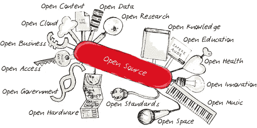

# 为什么我们需要 RISC-V

> 原文：<https://medium.com/hackernoon/why-we-need-risc-v-f94e3929891b>

Open Everything

RISC-V(精简指令集计算机)处理器是一种仍处于初级阶段的芯片，但它是一种每个人都应该支持的芯片。你可能想知道，是什么让这个芯片如此伟大？

RISC-V 架构非常棒，因为它是唯一拥有完全开源指令集的处理器，如果你想了解更多[请查看他们的网站](https://riscv.org/)。什么是开源指令集？通俗地说，就是处理器在 1s 和 0s 左右的运行方式，大家都有目共睹。可能是最严重的安全漏洞 Meltdown 和 Spectre 的出现归结于英特尔处理器指令集的一个缺陷。我不认为安全领域的任何人都完全震惊了，毕竟，在 BlackHat 会议上的一位 s [发言人展示了 x86 架构中存在未知指令，这不可避免地意味着存在隐藏的错误，发现真正毁灭性的错误只是时间问题，在我们的情况下，这就是 Spectre 和 Meltdown。](https://www.youtube.com/watch?v=KrksBdWcZgQ&t=1820s)

RISC-V 的另一个好处是，它使公司能够开发专门针对其工作负载的产品，因此他们可以从 RISC-V 内核开始，并可以添加他们特别需要的任何东西，从而节省时间和金钱。从理论上讲，这些节约可以通过降低成本或长期降低能源足迹的方式传递给消费者。然而，我相信 RISC-V 的最大好处是它给消费者和企业带来的内在的安全和安心。

Spectre 和 Meltdown bugs 是安全领域的巨大问题，因为超过 90%的服务器市场由英特尔所有，这意味着几乎每个云服务都运行在允许攻击者读取他们不应访问的数据的硬件上。更糟糕的是，早期的报告表明，在修补这些错误后，性能会受到 4-30%的影响，具体取决于工作负载。我希望这些毁灭性的新错误会让每个人重新思考如何设计硬件，并支持 RISC-V 等产品。

我承认，即使我们将来都改用 RISC-V，也并不意味着我们所有的安全问题都将成为过去，RISC-V 是 BSD 许可的，这意味着供应商可以根据自己的需要定制它，并闭门保存那些定制的代码，闭门不出意味着很可能有一个漏洞等待挖掘。前进的唯一道路是拥有一个开放和透明的未来，科技已经在我们的社会中变得如此根深蒂固，以至于不能闭门造车。

我是开源的坚定信徒，因为这是实现我们想要的乐观未来的唯一途径。负责驾驶汽车的人工智能应该对每个人开放，让他们看到它做什么和如何工作，人工智能运行的处理器应该是相同的。据我所知，RISC-V 是最新的开源处理器架构，目前正由多家知名公司用于或开发各种产品。(编辑:ARM 和 SPARC 是其他开源处理器设计)例如， [Nvidia 将在他们的 GPU 上使用 RISC-V 芯片，Western Digital 计划在即将到来的一年中发运 10 亿个 RISC-V 单元](https://www.barrons.com/articles/western-dig-nvidia-on-board-with-risc-v-so-pay-attention-says-benchmark-1515001875)。如果你是一个修补匠，或者是一个小主板电脑的粉丝，比如 Raspberry Pi 或 Arduino，SiFive，一家由发明 RISC 的人的前学生创立的公司，[现在出售 RISC-V 开发板](https://www.sifive.com/products/hifive1/)。

RISC-V 是一项现有的技术，有着聪明的头脑和独一无二的公司推动它向前发展，我希望有一天消费者和企业能够在他们的笔记本电脑、手机和台式机上轻松访问这种开放的架构。