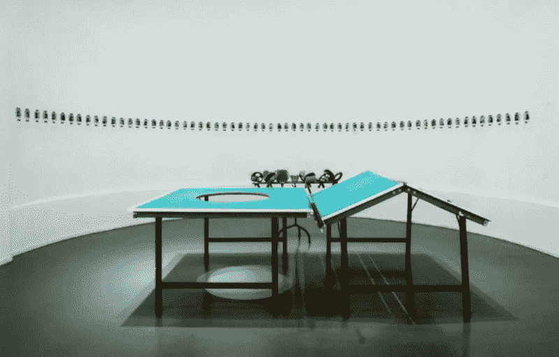
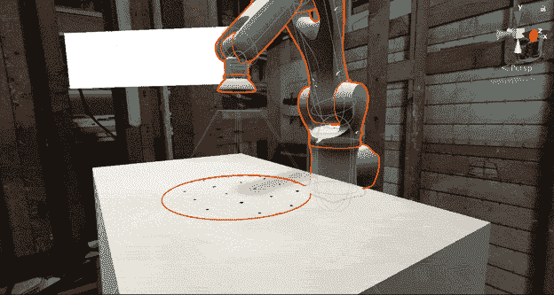
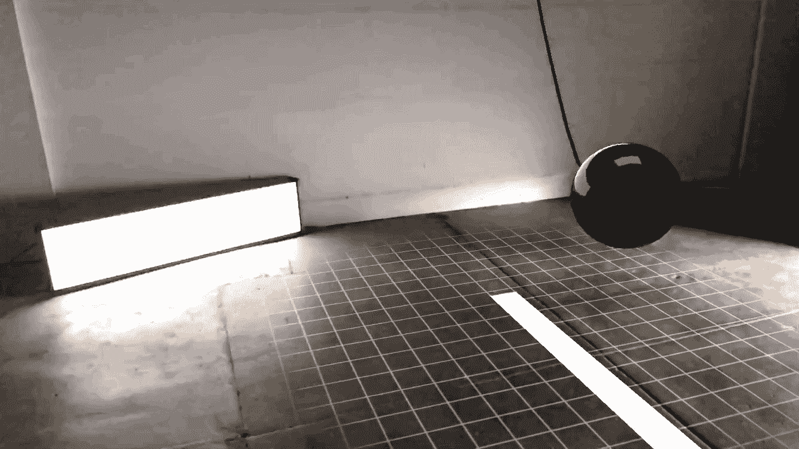

# 为什么我们用摄像机换游戏引擎

> 原文：<https://medium.com/hackernoon/why-we-traded-in-our-video-cameras-for-game-engines-51a922cb0c46>

作为一个专注于新媒体的设计工作室，我们过去常常花时间纠结于使用[机器人](https://vimeo.com/groups/333941/videos/75260457)的摄像机和视觉效果的同步。这需要仔细的计划，非常精确的机器，以及数小时的校准，试图自动完成拍摄现场的所有工作来完善一个镜头。从那以后，从计算机视觉算法到更强大的处理能力，许多技术进步让我们重新思考如何体验混合现实。这篇文章试图解释为什么我们把我们的摄像机换成了不同的媒介，即[游戏引擎](https://hackernoon.com/tagged/game-engine)。

电脑游戏已经成为当代数字文化中的一股主要的文化和经济力量，将我们带入了一个奇幻的虚拟世界。然而，没有创造这些世界的媒介，这些世界就不存在。媒介是一组有限的由算法生成的机器代码串，通常被称为“游戏引擎”。这个代码包含了游戏的基本规则系统，以及如何实时构建和玩游戏的程序指令。游戏引擎的应用最近已经超出了它们的预期用途，从建筑可视化、医疗和军事工业的模拟训练到电影的预视化。然而，所有这些都有一个共同点(这是这篇文章的主要重点)，它们都被限制在屏幕的空间内。

游戏引擎的品质是什么让它们在今天如此重要？游戏技术具有交互性、协作性、可定制性和可变性。图像是通过算法实时生成的。但是除了它们惊人的成像能力，它们天生就有一个结构。它们是基于规则的，仅仅是附加在虚拟物体上的一系列指令和行为。虽然我们像其他人一样对渲染能力的增加感到兴奋，但我们更感兴趣的是游戏引擎不仅影响虚拟和我们在屏幕上看到的东西，而且影响物理环境的潜力。

尽管复杂得多，我们的世界表现得很像一个游戏引擎。它只是一个真正好的游戏引擎。达尔文说最伟大的模拟是自然本身；无限变异，永不完结，永远 evolving⁴.《生命的游戏》(The game of life)是一款约 75 亿人的多人游戏，其中充满了约 870 万种不同物种的生物体之间的复杂互动。

游戏在艺术领域也有着悠久的历史，从 Dada 到 Fluxus。约翰·凯奇、杜尚和其他人通过构建一套指导方针或约束，并在他们设计的 rules⁵.中鼓励即兴行为，拥抱了类似游戏过程的生成性这些作品与游戏引擎模拟中发现的不可预测性和类似机会的行为相似。

Rotary Demisphere, Duchamp (left), Fluxus Table Tennis (middle), Play It By Trust, Yoko Ono (right)

这种想法突出了非线性互动体验的潜力，而不是由单一的观点或视角决定的。游戏作为一种艺术形式，常常能与观众产生更深层次的互动，它既是一种生成性的，也是一种参与性的。

随着像[增强现实](https://hackernoon.com/tagged/augmented-reality)这样的媒介越来越多地出现在我们的日常生活中，虚拟和现实将变得更加模糊。那么，为什么我们要把游戏引擎的能力限制在一个长方形的范围内呢？我们看到的未来是，物体可以同时具有虚拟和物理行为，这将从根本上改变我们对世界的体验。例如，虚拟互动实际上可以对你周围的物理环境产生影响，反之亦然。

在[小说](http://novel.af/)这里，我们在 Unity3d 内部开发了一个接口，用于机器人和物联网设备的实时控制。以下是我们认为游戏引擎是未来创意媒体的几个原因。

*   游戏是实时的。我们对仅仅由预先确定的关系支配的线性经验不感兴趣。
*   游戏是民主的。在几乎任何移动设备上构建 AR 应用程序都允许几乎任何人成为参与者。
*   游戏是互动的。我们对感动世界的游戏感兴趣。我们的虚拟世界和物理世界比以往任何时候都更加崩溃。通过双向交流，用户可以通过数字界面操纵物理世界，也可以通过物理交互影响虚拟体验。

Robotic Interactive Control inside Unity3d — Novel

# 新颖的项目

我们最近通过一系列实验测试了其中一些概念，这些实验旨在在数字和物理世界之间产生更有意义的体验。我们认为，真正的沉浸式体验需要两种现实之间的动态互动，即机械和数字的混合。每个实验都旨在通过卡在这两个世界之间来挑战用户的感知。为了证明这一理论，我们使用了由视频游戏软件驱动的机器和设备的组合与 AR 应用程序进行通信。一方面，用户面对的是他们所熟悉的物理环境，充满了由物质构成的、受物理定律支配的真实物体。覆盖在这个熟悉的世界上的是虚拟世界，由游戏引擎中编码的行为对象组成，并在模拟中播放。每个对象或实体都有自己的行为；有些存在于模拟中，有些对物理空间有影响(如音频、照明、运动)。我们称这些具有双重属性的对象为“非对象”。在我们的实验中，它们经常被视为光滑的黑色，行为神秘。[非物体](https://www.wired.com/2012/05/the-beauty-of-non-objects/)是有点像真实物体的物体，*但不是真正的*。它们可能类似于我们在日常生活中看到的东西，但行为与我们习惯的不同——这是半物理半数字的优势。这种二元性提供了独特的体验机会。

Example of a Non-Object — Novel

通过一系列简短的实验(可以在这里找到)，我们在小说中不断寻找在媒介之间的翻译中发现的有趣行为，从数字到物理，再从物理到数字。我们从一个简单的规则开始每个实验，每个 AR 应用原型必须突出一种独特的交互类型，一半是数字的，一半是物理的。例如，加速的虚拟钟摆摆动会影响房间中的灯光，驱动跳舞立方体运动的模块化合成器，或者由机器人操纵驱动的虚拟球体的正弦反应。

Reactive Lighting, Robotic Manipulation — Novel

另一个名为“ [There，Not Here](http://novel.af/project/therenothere) ”的新颖项目是一个原型多人游戏体验，旨在通过卡在虚拟和现实之间来挑战用户的感知。用户首先面对一个机器人和一张桌子，机器人在桌子上盘旋，好像在寻找什么。通过打开 AR 应用程序，用户可以解锁另一半的体验，并成为一个突出各种物理定律的游戏的积极参与者。机器人的实时控制由参与者的空间交互驱动。

There, Not Here — Novel

游戏引擎有潜力改变我们与矩形之外的世界互动的方式。上面显示的实验只是简单地触及了我们所看到的人类经验的丰富领域，我们相信它扩展了 AR 的潜力，使其不仅仅是一种视觉覆盖。AR 将越来越多地集成到我们日常生活中与之互动的空间和设备中，使我们的虚拟体验比以往任何时候都更加丰富和重要。我们对这个新领域感到兴奋，并打算继续追逐我们看不到的物体。

1.  Fossheim，Hallvard J，和 Tarjei Mandt Larsen。"电脑游戏是真实的吗？"*电脑游戏哲学*，作者约翰·理查德·萨根，施普林格出版社，2014 年，第 216 页。
2.  泰瑞欧，米奇。" Unity 的 5 个最佳用途(除了游戏开发)."cinema-suite.com/5-best-uses-for-unity/.，2017 年 5 月 6 日，*电影套房公司*
3.  保罗，克里斯蒂安娜。“艺术游戏。”【www.technologyreview.com/s/409557/art-games/.】麻省理工学院科技评论，麻省理工学院科技评论，2013 年 12 月 30 日
4.  程，伊恩，等*伊恩·程——现场模拟:*斯佩克特图书公司，2015 年。
5.  皮尔斯西莉亚。游戏的本质:作为艺术的游戏。游戏艺术史研讨会。佐治亚理工学院，亚特兰大。2010 年 2 月 5 日讲座。