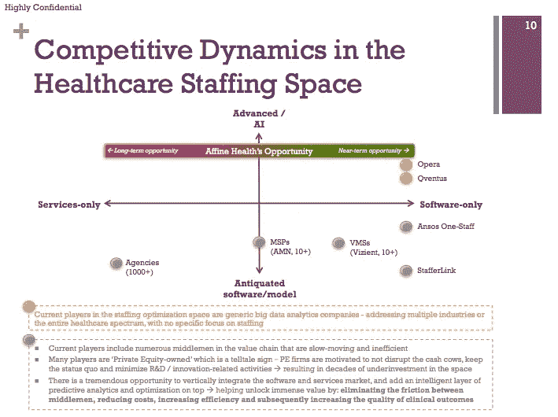

# 为什么我们对临时护士市场感到兴奋，但最终决定不去追求它

> 原文：<https://medium.com/hackernoon/why-we-were-excited-about-the-temp-nurse-staffing-market-but-ultimately-decided-not-to-pursue-it-e523ef19b92d>

## “汗水、血泪……还有市场验证！”

医院的临时护士配备大致有两种形式:每日**(*轮班/日*)和**出差** ( *更长时间的分配；通常持续数周，并且可能不在临床医生的家乡/家乡州*。在投身医疗保健人员配置领域的一年多前，我的团队赢得了 Cedars-Sinai Techstars hackathon 的按需每日护理人员配置理念/原型奖(评委第二名，观众投票第一名！).快进到 2017 年夏天，我和我的联合创始人忙于研究这个市场，最初对进入这个市场感到兴奋，但最终选择了其他方式。**

**从高层次的角度来看，市场统计数据看起来很棒。每日员工市场规模在 2016 年为 30 亿美元，年增长率为 5%。我们可以在短期内加入我们平台的辅助市场也相当大:旅行护理 22 亿美元(增长 7%)，联合医疗 32 亿美元(增长 6%)和 locum tenens 27 亿美元(增长 8%)。**

**市场动态看起来也非常有利于颠覆-我们对主导市场结构的理解:市场高度分散，没有护士注册持有超过 11%的市场份额-最大的参与者包括 AMN Healthcare (11%的份额)、CHG (8%)和 Cross Country Healthcare (6%)。许多注册机构收取高达 50%的佣金，实际上对医院收费过高，对护士收费过低，并且大部分匹配过程都是人工完成的(电话、电子邮件和一些使用传真)。许多较小的护士登记处是由退休护士发起的，他们有相当大的护士个人网络，也认识当地医院的工作人员。启动(和扩展)注册管理机构需要一些营运资金，当然你需要初始网络和连接，但总体进入壁垒相当低——因此市场上的玩家分数很高。**

****

**我们最初的愿景是成为按需每日人员配备平台，并有效地取代护士注册。医院的护士长点击她的手机屏幕，一个合格的护士就会过来轮班(*就像点一杯优步一样！*)。对于提供商来说，这意味着没有中介，没有管理/接触多个注册中心，更低的费率，以及智能匹配(*想要一个会说西班牙语或了解特定 EMR 的护士？您可以将它添加到过滤器中！*)。对护士来说:不用再在早上 5 点守在电话旁等登记处打电话给你，不用注册多个登记处并努力等待他们的电子邮件，更高的工资，更容易更新的日程表，更好地匹配你的偏好。**

**我们最初的市场研究和验证工作包括我们自己的研究，与其他登记处、护士、医院交谈，并从我们的网络和顾问那里寻求总体反馈。市场验证和深入研究带来了许多重要发现，这些发现在高水平研究中并不明显。我们了解了很多关于 MSP 和 VMs 的情况(通过研究，以及与注册中心和护士的交谈),他们是大多数提供商市场的看门人。提供商的销售周期是每年一次，提供商/ MSP 将每年评估其批准的注册管理机构列表，并确定付费价格。我们深入研究了经营传统注册业务的经济学，发现高佣金并不总是意味着高利润。处理过时 VMs 的注册管理机构除了其认证职责之外，还淹没在数据输入任务中(由于最小的互操作性/自动化)。**

**有了最初的研究和反馈，我们回到绘图板，开始“消化”信息——评估好的、坏的和丑陋的，并头脑风暴如何在这个生态系统中发挥作用，使我们的产品比传统机构更有粘性、更有价值和差异化。这导致我们的愿景扩大到包括一个 SaaS 平台，供提供商预测人员需求和优化人员配置水平，这将与我们的人员配置市场相关联。**

****

**长期愿景是，该平台可以预测未来的人员短缺，并相应地调动内部流动人才库或获取外部人才。这是有先例的——一个大型医院系统正在测试一个内部人员配置预测模型，一些医疗保健分析初创公司[不太突出]正在提供人员配置优化软件的试点。**

****

**我们随后同时启动了两项计划——我们开始研究初步预测模型，并为人员配备平台开发概念验证(PoC ),同时继续推动我们最新愿景的市场验证。在与护士长、医院内的员工团队(全国范围内的大型系统和小型医院)、从事/研究/撰写医院员工优化的其他人、机构所有者和一些天使投资者多次通话和会面后，我们了解到以下情况:**

*   **最初没有办法绕过 MSPs 我们也不能取代他们，因为我们没有信誉与提供商签署 SLA。**
*   **这意味着我们开始时是一个代理机构(2.0 版本，但仍然是一个注册中心)，然后进入首席信息官的办公室推销 SaaS 平台，并最终提升到代理机构的 MSP 级别。**
*   **许多医院没有丰富的(或任何)有意义的历史人员配备数据，这将我们实施模型的时间表往后推了一步。**
*   **这让我们想到:我们能与之交谈的大多数医院都不太关心人员配备预测和优化。他们有更重要的事情要做，而要添加到员工工作流程中的数据收集流程(用于预测模型)是行不通的。一些大型多设施系统具有足够高效的内部人才库(通常有专门的工作人员来管理人才库)，并且不认为临时人员配备流程(或高比率)是一个主要的棘手问题。**
*   **除了没有锁定提供商端，我们对市场另一端参与者(护士和其他有执照的临床医生)的价值主张还没有发展，当前的价值主张不足以赢得平台忠诚度，因此，我们仍需要在每次轮班/每次任务的基础上营销和获得护士。我们预计这将转化为与其他机构的丑陋营销战(*想想:优步/Lyft 争夺护理人才的战斗*)，侵蚀我们的利润，并最终使我们的“代理 2.0”商业案例无效。**

****

**因此，经过数周的市场验证和 PoC 工作，我们最终走到了十字路口，必须决定走哪条路。摆在我们面前的一些选择:**

1.  **继续寻找热衷于解决这一问题的医院(我们已经联系了数百家医院)，同时，花费时间和资源为人员配置预测和优化平台建立 MVP，同时建立人员配置市场— *我们对这条道路并不太感兴趣，因为我们正在寻找热情的早期采用者，他们会对测试 MVP 感到兴奋，并有可能帮助我们确定产品/愿景的方向—我们还没有从我们进行的多次电话和会议中找到任何线索。***
2.  **建立一个独立的人事市场，并将其扩展到临界规模，最终瞄准 MSP 角色，并取代 MSP、VMs 和机构 *—鉴于上述挑战，这在很大程度上也是不可行的—在提供者和临床医生眼中没有忠诚度和真正的差异；由于单位经济性不太好，扩展将是一个挑战。在这条道路上，我们也在一些根本性的问题上挣扎——我们的长期目标是什么？我们真的比当前的解决方案/其他新兴数字玩家“颠覆”了市场/10 倍吗？我们是想做大还是想做点什么卖给更大的代理商？我们甚至一度考虑向私募股权基金伸出援手，引领小型人事代理机构的“发展”——但最终这不是我们当初打算要做的事情(那就是建立一个有意义且具有颠覆性的业务)！***
3.  **继续——回到提供商那里，关注其他痛点，或者聚焦于我们可能已经遇到的特定痛点——并尝试验证这一点。我们同时也在考虑其他一些问题(主要是运营效率低下、提供商的后台自动化等)，我们可以开始评估这些问题。这最终归结为资源分配——我们是想把时间和金钱花在继续追求人才市场上，还是寻找其他机会来创造一个颠覆性的业务？你可能已经猜到了，我们最终选择了这个选项。**

****

****经验教训**:虽然你很可能已经听到了下面的全部或大部分内容，但对于我们这些第一次创业的人来说，这些经验教训令人大开眼界，我们以前只在书籍、文章和博客帖子中读到过，但现在却亲身经历了。**

1.  **您的问题是您客户的**主要问题**吗，即前 3 名？在我们的案例中，我们得出的结论是，拥有更好/更便宜/更快的临时护士人员配备解决方案和人员配备预测&优化平台并不是大多数提供商的第三大优先事项。**
2.  **你能直接接触到你的客户吗？如果不能，谁是**把关人**？你能成为看门人吗？虽然大多数行业都很难接触到客户，但医疗保健行业在守门人方面尤其臭名昭著，初创公司很难接触到供应商、付款人和其他利益相关者。在这个具体的例子中，除了向首席信息官办公室推销并获得人力资源/人员配备/护理团队的认可之外，我们还必须与第三方 MSP 和 VMs 打交道。**
3.  ****单位经济**需要从一开始就顺利地工作，并且您还需要在您的业务模式中考虑营运资本，因为它在扩展时会变得很重要(对于临时护士员工，我们需要在护士轮班后立即支付他们的工资，而许多医院每季度结算一次代理账户)。如果你正在模拟长期的规模经济，你需要清楚企业的单位经济如何/何时/是否会随着时间的推移而改善。**
4.  ****客户忠诚度**是一个重要的考虑因素，缺乏忠诚度可能意味着大量的费用和 CAC。我们内部意识到，我们更喜欢具有长期客户承诺/锁定的业务模式，以及在这些承诺基础上建立的机会(“登陆和扩张”战略)。虽然很可能有机会创造性地锁定该市场的一方或双方(并使我们的平台成为护士或提供商长期使用的默认选择)，但我们无法自信地指出一个或多个可以为我们的平台带来有意义的客户忠诚度的想法。**
5.  ****市场动态**:我们决定不追求这个市场的原因之一是，我们将进入一个拥挤的(成熟的)市场，而不是一个新兴市场。我们的数字人员配置解决方案与许多玩家已经开始做的并没有根本的不同，并且现有玩家可以很容易地构建(*和* *)提供商对我们提议的根本解决方案不感兴趣！*)，而且进入门槛低，生态系统会在一场逐底竞赛中结束。**
6.  **知识产权和**构建防御能力的重要性**:虽然这一点对我们来说并不陌生，但这一经历确实强化了定义和规划防御能力的重要性。我之前在一家对冲基金任职期间，我们对每一笔潜在投资的可辩护性进行了一丝不苟的尽职调查——这是我在投资生涯中就已经根深蒂固的。我们假设随着时间的推移，我们的护城河将建立在一个双边市场上，并且在我们的概念和产品开发的杂草中，我们将我们的目光从可防御性上移开(*在我们的愿景中缺乏有意义的知识产权的电话中，我们也从一些顾问和天使那里得到了反馈*)。**
7.  ****区分任务的优先顺序**:在这个过程中，我学到了许多新东西(建立线框，深入研究预测模型，创建讲解视频和其他营销材料，创建一个机器人来帮助护士成为独立承包商！)，但我认为，我们在许多没有直接导致市场验证的活动上浪费了大量时间，这些活动本来是完全可以避免的。**

**我们做了正确的决定吗？只有时间会证明一切！我不断遇到新的创业公司，它们在我们决定退出后跳进了这个市场，但我对我们的分析充满信心，很高兴我们做出了明智的决定，并对自那以后出现的(和正在出现的)其他机会感到兴奋。**

***来源:***

*   ***2016 年哈里斯·威廉姆斯医疗保健人力资源市场概述***
*   ***招聘行业分析师***