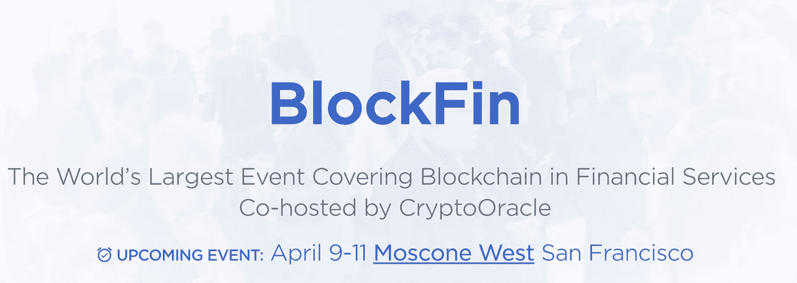

# 为什么我们联合主办，为什么你应该参加，BlockFin 世界上最大的加密金融科技会议

> 原文：<https://medium.com/hackernoon/why-were-co-hosting-why-you-should-attend-blockfin-the-world-s-largest-crypto-fintech-55ac341431df>

我们的公司 [CryptoOracle](https://goo.gl/qkpv4z) 的核心是风险投资，但我们也有咨询服务和媒体资产，目的是为我们投资的公司提供 ***深远的*** 价值。我们的目标是将我们的媒体资产(即我们的博客、YouTube 频道、在线电话会议和 Meetups)与一个大型加密会议结合起来，这样我们就可以邀请整个全球加密社区参加一个盛大的活动。在这个活动中，我们可以向我们认识的最聪明的加密人员学习，做这个星球上最引人注目的加密工作。一个事件，其中唯一超越史诗般的学习，是传奇的网络。这就是为什么我如此兴奋地宣布 CryptoOracle 与三大洲领先的金融科技会议 LendItFintech 合作，举办[block fin 峰会。](http://www.lendit.com/usa/2018/blockfin?utm_source=CryptoOracle&utm_medium=website&utm_campaign=usa-20)

BlockFin 峰会将于 4 月 9 日至 11 日在旧金山 Moscone Center 举行，这将是世界上涵盖金融服务业[区块链](https://hackernoon.com/tagged/blockchain)的最大盛会。BlockFin 将汇集来自整个 [Crypto](https://hackernoon.com/tagged/crypto) 生态系统的顶级创新者和专家，包括技术平台、加密货币、投资者和其他人，进行为期三天的学习、交流和交易。

BlockFin 的独特功能之一是我们的 Vision Stage，它将以 TED 风格的演示为特色，由众多通过加密改变世界的个人进行超过 40 小时的发人深省的演讲。我们将通过主题演讲、小组讨论和炉边谈话来补充愿景阶段的内容，同时留出世界一流网络所需的大量时间和空间。

BlockFin 是一个会议中的会议，因为它与世界上最具国际性和影响力的金融科技会议 LendItFintech USA 2018 同时举行。超过 5000 人将参加 LendItFintech 和 Blockfin。

我很高兴你能加入我的 BlockFin！早点跳上车，在这里买票[！要享受早鸟价格 10%的优惠，请在退房时输入密码 CryptoOracle10%。第一批发言者将很快宣布。但我们刚刚宣布，《大空头》和《骗子的扑克》的著名作者迈克尔·刘易斯将成为 BlockFin/LendIt 的主题演讲人，谈论监管、比特币、人工智能和他的书！请访问 http://blockfinsummit.com](https://register.lendit.com/events/lenditfintech-usa-2018/registration-ff3010edd5f743a183a33ed34be02c71.aspx?utm_source=CryptoOracle&utm_medium=website&utm_campaign=usa-2018)获取定期更新。

如果你想被认为是 BlockFin 扬声器，请[点击这里](http://www.lendit.com/usa/2018/speakers/signup)。如果您有兴趣赞助 BlockFin 或有任何其他问题，请发送电子邮件至 [BlockFin@CryptoORacle.io](mailto:BlockFin@CryptoORacle.io)

***为了帮助传播关于区块链的信息，请在下面“鼓掌”！***