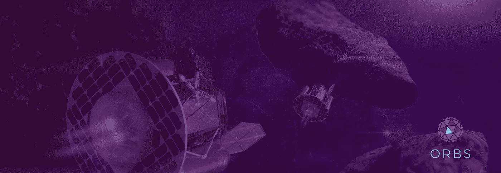

# 为什么一家区块链公司会收购一家卫星公司？康赛斯也是一家数据公司。

> 原文：<https://medium.com/hackernoon/why-would-a-blockchain-company-buy-a-satellite-company-well-consensys-is-also-a-data-company-3a253c8ab323>

Banner by Rachel Skiba (Image from Planetary Resources)

康赛斯进入卫星业务已经两周了。让该公司的观察者感到困惑的是，一家负责推广以太坊用途的区块链公司，可能会斥资数亿美元收购世界一流的太空初创公司之一。但答案可能在于 ConsenSys 可以为数据和信息做些什么，而不仅仅是区块链技术或以太坊。

然而，ConsenSys 的这次收购做了更具革命性的事情。如果区块链看到政府、行业和公众大量采用，那么哪个区块链(或区块链)将是最被接受的？哪个区块链将拥有关于土地登记、汽车所有权、供应链、出生记录和专业证书等最不可变和最可信的数据？？考虑到该公司刚刚吸收的大量数据，ConsenSys 可能已经将以太坊确立为*不可避免的区块链记录。*

[我当时提出，ConsenSys 正在借鉴另一家区块链初创公司 SpaceChain](/@gedalyahreback_49565/how-consensyss-acquisition-of-planetary-resources-puts-the-blockchain-at-the-center-of-the-99d781f6d359) 的想法，希望让区块链成为商业太空基础设施的基础元素。我不会收回这个建议，但议会可能会做一些更直接的事情。

这个行业需要灌输的一条公理在这里也适用:

*区块链不一定需要加密货币。加密货币不一定需要区块链。*

区块链在金融之外有大量的潜在用例，正是因为它是一种新型的更高效的数据库。

# 卫星保存着新服务的关键数据

由行星资源公司(Planetary Resources)、Terra Bella(前身为 Skybox)、Planet(前身为 Planet Labs)和 SpaceX 的私人发射服务公司领导的纳米卫星热潮产生了直接面向市场的卫星成像和通信。考虑到谷歌实际上在 2014 年以 5 亿美元收购了 Terra Bella，然后在 2017 年 2 月以约 5 亿美元的价格将其出售给 Planet。作为后一项协议的一部分，谷歌获得了 Planet 的股权，并同意在未来五年成为 Planet 卫星服务的客户。给你一个概念，一个 Terra Bella 的投资者曾经说过，该公司的卫星每天处理[“1tb 的数据。”](https://www.forbes.com/sites/rakeshsharma/2014/02/26/all-set-for-take-off-silicon-valley-startups-redefine-space-imaging-market/#19335f946840)

谷歌完成了最初的交易，并保持了与 Terra Bella 的关系，原因只有一个:数据。具体来说，Consensys 的目标可能是行星资源公司的数据处理能力。早在 2014 年谷歌收购 Terra Bella 后的几周，Ellen Huet 就曾猜测过类似的事情。

在 2017 年的一次会议上，Planet 的 from 安德鲁·怀尔德说，他们从卫星上获取原始数据，然后将其转化为可操作的东西，作为“洞察经济”的一部分，并且已经“与各种垂直行业的各种客户进行了深入的对话”事实上，2017 年的专家小组甚至预测了卫星公司与大数据公司不可避免的“垂直整合”。

# 层层叠叠

“就像千层面一样。一层一层一层。在 2016 年芬兰 Slush tech 大会上，欧洲航天局企业孵化中心(BIC)主任弗兰克·萨尔茨格伯(Frank Salzgeber )告诉我，根据你在哪里，你可能会有不同的品味。“未来将会把它放在云端，SAP Hana，然后用它做一个很酷的逻辑商店，并通过微支付”来访问它。

2013 年，谷歌开始从[地球资源卫星 8 号](https://techcrunch.com/2016/06/27/google-earth-and-maps-get-sharper-satellite-imagery-with-new-update/)收集图像，用于谷歌地球和谷歌地图。除了公司项目的其他高级用途外，这种数据在帮助谷歌的自动驾驶汽车原型导航道路方面也至关重要。谷歌在 2015 年推出的项目天窗使用这些照片来统计使用私人太阳能电池板的家庭数量，估计细节，例如作为城市发展和社区规划的一部分的最佳安装位置。

# 直接使用案例:土地注册和数据存储

谷歌的数据可以被关键地用于帮助微电网的扩张，这是记录区块链能源交易的一个潜在用例。已经有一些飞行员专注于此。

但有些情况下，观察家们甚至更加确定。一些国家——包括荷兰、印度和瑞典——正在向区块链寻求更好的土地记录。可以记录最新的陆地状况，并记录轨道上的变化。这种空间数据可以与其他记录相结合，并在单个区块链上正确注册。Arup Dasgupta 在 2017 年末的一篇文章中很好地涵盖了这一点，他强调了区块链公司的地理空间影响，并很好地强调了瑞典和印度的案例。他让人们注意到一种协议，[泡沫](https://foam.space/)，该协议宣称它将是“位置证明的未来”

联合创始人克里斯托佛·约瑟夫松[称](https://www.spar3d.com/blogs/all-over-the-map/foam-puts-geospatial-data-on-the-blockchain-without-gps/)他的项目是“彭博终端和谷歌地图的混搭”，然而他并不是镇上唯一的游戏。GeoUnderground 使用谷歌地图应用编程接口开发了它的平台，它已经与[地理空间公司](https://eijournal.com/news/business-2/geospatial-corporation-to-integrate-blockchain-technology-with-gis-platform-to-serve-the-global-oil-gas-industry?doing_wp_cron=1542196122.9437880516052246093750)签订了“地下和地上资产管理和定位需求”协议。

# ConsenSys 可以自动用权威数据填充区块链

考虑到所有的因素，ConsenSys 能够很好地将所有这些原始数据转化为可操作的和*可认证的*见解。通过以太坊智能合约，地理空间信息可以在以太坊区块链或任何数量的第二层或侧链上记录和确认，然后作为公共记录或私人业务的依据。地面或地下资产的注册、土地评估、地理定位、标有时间戳的卫星图像和摄影地图突然成了*连锁*公共记录的问题。人们会向哪家连锁店寻求这种权威呢？以太坊。

谷歌和其他数据巨头并没有被超越，但这样的举动预示着在不久的将来，区块链将成为新的和翻新的信息和技术基础设施的中心。除此之外，ConsenSys 现在控制着一个可以出售的数据仓库，并且非常好地扩展了其产品和服务组合——对任何公司来说都是明智之举，不管是不是区块链公司。

更进一步，随着我们继续分析这一出人意料的举动，或许阅读其他令人惊讶的头条新闻，我们可能会对区块链的发展方向有一个更成熟的看法。除了对这项技术及其伴随的加密货币或代币的长期宣传之外，区块链最终是一种新型的数据库，可能会取代或补充传统数据库，这取决于其适用性。

谁知道呢。萨尔茨基伯先生提到的小额付款。也许它们会被加密。

喜欢你读的吗？查看我们的 GitHub 项目并加入社区:

 [## orbs-网络/orbs-网络-go

### Go 中 Orbs 平台参考实现。为 orbs-network/orbs-network-go 开发做出贡献，创建一个…

github.com](https://github.com/orbs-network/orbs-network-go)  [## orbs-网络/orbs-规范

### Orbs 平台协议和服务规范。为 orbs-network/orbs-spec 开发做出贡献，创建一个…

github.com](https://github.com/orbs-network/orbs-spec)  [## orbs-network/orbs-network-type script

### Monorepo for Orbs 平台参考实现—Orbs-network/Orbs-network-typescript

github.com](https://github.com/orbs-network/orbs-network-typescript)  [## 球体-网络/精益-螺旋-go

### 精益螺旋一致性算法的 Go 实现——orbs-network/Lean-Helix-go

github.com](https://github.com/orbs-network/lean-helix-go) 

*加入 Orbs 社区:*

*   *GitHub:*[https://github.com/orbs-network](https://github.com/orbs-network)
*   *电报*:[https://t.me/orbs_network](https://t.me/orbs_network)
*   *推特*:[https://twitter.com/orbs_network](https://twitter.com/orbs_network)
*   *Reddit*:[https://www.reddit.com/r/ORBS_Network/](https://www.reddit.com/r/ORBS_Network/)
*   *阅读宝珠白皮书【https://www.orbs.com/white-papers】:*
*   [*报名参加宝珠快讯*](https://orbs.com/#boxzilla-126)