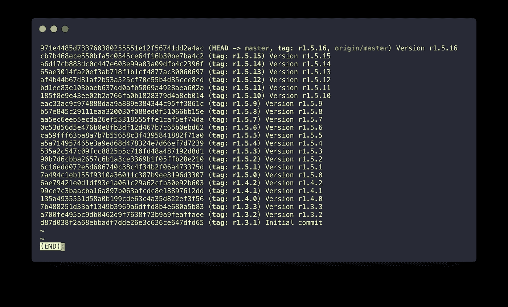

# 为什么写开源如此有益。

> 原文：<https://medium.com/hackernoon/why-writing-open-source-is-so-beneficial-1f290bc90a58>

## 一个花了半个晚上的一个小时的兼职项目的故事。

> 轻松点。这听起来像是最多一个小时的工作！

一切就是这样开始的。

快进到午夜后，我正在考虑如何为我在存储库中的 22 个提交中的每一个上传一个库快照。


## 故事背景。

好吧，我们倒回去一点。

听说过 ExoPlayer 吗？这是一个非常棒的谷歌播放器库。是的，它有一个演示应用程序，过去可以在后台播放 Youtube 视频(任何人都可以为这个功能付费)😉？).

当谷歌开发人员发布 ExoPlayer 2.x.x 时，他们考虑用不同的包名发布 ExoPlayer 2，但他们似乎忘记了更改已发布快照的`artifactId`。这一切成就了它:

1.  可以同时使用 ExoPlayer 1 和 2(在迁移到新版本时)。
2.  无法同时导入 ExoPlayer 1.x.x 和 ExoPlayer 2.x.x😐。所以你不能这样做:

```
compile ‘com.google.android.exoplayer:exoplayer:r1.3.1’
compile ‘com.google.android.exoplayer:exoplayer:r2.5.3’
```

即使这两个依赖项中的代码是在两个不同的包中发布的(分别是`com.google.android.exoplayer1`和`com.google.android.exoplayer2`)。

我当时正在开发的一个应用程序(发生在大约 10 个月前)使用的是 ExoPlayer 1。我真的想以尽可能小的代码增量将其迁移到 ExoPlayer 2(这是一个相当大的应用程序)。我不想一次全部迁移。

我想:

> 这实际上很容易解决。最终，谷歌确实以不同的包装发布了 ExoPlayer 2。所以代码中没有任何工作要做。我将创建我自己的“库”，它将重新打包原始代码，没有我的任何添加，并将在不同的`artifactId`下发布它。
> 
> 轻松点。这听起来像是最多一个小时的工作！

所以我开始这样做…但是以一种对我来说非常典型的方式，在工作中我想:

> 如果我需要，其他人可能也会需要。而且我真的不能确定对方使用的是和我移植的 ExoPlayer 1 一模一样的版本。我需要从每个发布的 ExoPlayer 1 版本创建快照…

## 手工开始。

我用 ExoPlayer 依赖项创建了一个库项目+一个样本项目来测试它是否有效。示例项目依赖于库`project`和 ExoPlayer 2 的官方工件。一切都在顺利地并行运行。我手上有一个重新包装的 ExoPlayer 1。

为此，我决定采用一个非常简单的 [git](https://hackernoon.com/tagged/git) 结构:只有一个分支，每个 ExoPlayer 1 版本一次提交。这意味着整个回购中有 22 次提交(现在是 23 次)。

让我先告诉你一件事。我不是饭桶大师。我越来越了解它，但我不知道每一个可能的命令。在头脑中进一步阅读…

所以我开始添加提交。

1.  我把版本上传到了 Bintray。
2.  做了`Initial commit`。
3.  在 repo 中添加了一个 git 标签`r1.3.1`。

然后我往前走。

1.  代码更改为`r1.3.2`。
2.  上传到 Bintray。
3.  新提交:`Version r.1.3.2`。
4.  在回购中增加了一个 git 标签`r1.3.1`。

## 问题的开始。

然后我又重复了 4 到 5 个版本的相同步骤。土拨鼠日…直到我发现了我的提交命名的问题。你发现`r`后面多出来的`.`了吗？是的，我在这里写这个故事并没有犯错误……当我提交我的修改时，我就这么做了。

我可以保持原样，只是确保下一次提交是正确的，但是我想:

> 这些只是少数几个提交，让我们纠正这一点，让回购变得干净利落。

感谢上帝我相对熟悉`git rebase -i`。我很快就改错了名字。没问题…直到我发现我在路上丢了我的标签。

> 好的，没问题，让我们重新标记这些提交。

我也那样做了。我需要确保下一次提交是正确的。我开始寻找一种“自动化”提交名称的方法。提交模板对于我的情况来说是最简单和完美的解决方案。

我创建了一个简单的`Version r1.`模板，并将其添加到 repo 的`/.git/config`中。

```
[commit]
 template = /path/to/my/simple/template.txt
```

只要我能够在提交时稍微思考一下，这个解决方案就能确保我未来的提交遵循相同的规则。

从那以后，我真的觉得一切都在我的掌控之中。虽然我做了一些我本可以避免的工作(重定基础和重新标记)，但总体来说，我并没有偏离这个“库”的初始时间表太远。

## 方法改变了。

实际上，我已经手动完成了所有 22 个提交的添加…我知道，对吗？



然后我看到我在我的`Initial commit`里搞砸了一些事情……搞砸了大时间。

显然，`aar`库不会简单地通过添加到依赖项中而捆绑到另一个`aar`中。一些我当时不知道的事情。不知何故，示例项目工作正常，但是组装的`aar`不包括 ExoPlayer 1。

😐 🔫

这正是我对整件事的想法。我知道我必须:

1.  校正`Initial commit`。
2.  重新上传每个版本的**库快照。**
3.  重新标记**一切**。

第一步并没有让我太担心。我很快找到了解决方案。这就是所谓的“肥胖”。谢天谢地，这并不难创造。这解决了问题，并使其正常工作。

我知道我必须为第 2 步找到其他解决方案。和 3。

我不能再次手动操作，因为我知道最终“库”根本不会被运送。我懒得做所有的体力劳动。我知道，如果我必须做第三次(如果事情再次出错)，我会把我的笔记本电脑扔出窗外。

你需要至少有点懒惰才能成为一个好的开发者…

## 上传库快照

我必须先弄清楚。如果在修正了`Initial commit`之后，任何上传都有问题，我将再次丢失标签(当再次修正基本代码时)。

我正在使用一个脚本来上传文件夹。这就像运行终端命令一样简单。“简单”如果您不必做 22 次。在这种情况下，与其说是“简单”，不如说是“令人讨厌”。

幸运的是，我很快发现您可以使用`x`选项使用`git rebase -i`运行提交的终端命令。

此时，即使使用`git rebase -i`并添加要在提交时运行的命令也是太多的工作。幸运的是，你也可以使用带有方便的`--root`参数的非交互版本的 rebase，它将在每次提交时执行相同的操作，直到达到`root`。这正是我所需要的:

```
git rebase -x "./gradlew clean bintrayUpload" --root
```

片刻之后，一切都结束了。我希望在最初添加提交时就知道这一点。

## 添加 git 标签

这有点困难。我需要提交消息信息。我需要能给我提交正文的格式化版本的东西。在一次快速的“谷歌搜索”后，我想到了这个:

```
git log -1 --pretty=format:”%B”
```

这给了我当前提交的主体(例如`Version r1.3.2`)。我只需要修剪前 8 个字符(我想要一个简单的`r1.X.Y`标签)。

除此之外，我还需要一个提交散列来添加标签(虽然不太确定为什么…我应该能够将标签添加到当前的提交… nvm)。

```
git log -1 --pretty=format:”%h”
```

一个简单的 bash 脚本中的这两个命令:

```
#!/bin/bashmessageName=$(git log -1 --pretty=format:"%B")
shortHash=$(git log -1 --pretty=format:"%h")if [ "$messageName" = "Initial commit" ]; then
  tagName="r1.3.1"
else
  tagName=${messageName:8}
fi;git tag $tagName $shortHash
```

我可以简单地再次使用`git rebase -x "script.sh" --root`。

几秒钟后…所有的标签都被添加了。我希望我以前也知道这一点。

## 最后的想法。

再看一遍这个故事，我觉得是这个过程中最耗时的部分，似乎是我刚刚轻松经历过的事情。嗯，不是那样的。实际上，我花了大部分时间试图弄清楚如何上传 22 个快照，以及如何自动标记所有提交。让我们明确这一点。

虽然我晚上花了很长时间搜索和测试我需要的不同解决方案，但我并不认为这些时间是“浪费”的。

最初我认为本质上这是一个简单的项目，上传一个具有单一依赖关系的库。

我最终在这个过程中学到了:

1.  什么是“胖子”。
2.  如何在 git 存储库中使用提交模板。
3.  如何使用`git rebase -x "cmd"`。
4.  如何在`--root`之前重置所有提交。
5.  如何格式化`git log`输出。
6.  如何在 bash 中进行子串？

如果我没有决定写[库](https://github.com/blipinsk/ExoPlayer1)，这是我不会“接触”的 6 件事。

我不得不做的很大一部分是因为我不想让这个库显得不优雅(更不用说“不完美”)。我想让回购尽可能干净。

虽然我意识到没有人会看到这个项目投入了多少工作，但潜意识里我知道这代表了我在工作时可以保持我的存储库有多整洁和优雅。

这就是[开源](https://hackernoon.com/tagged/open-source)的好处:它向世界展示你的技能。一方面，它会让你感到不舒服和脆弱。另一方面:它给你制造了做得更好的压力，并迫使你在发货的时候改进。有了更好的质量，你就能为你所做的赢得更多的观众。受众越多，对更多产品及其质量的期望就越大。

这一切就像使用自动手表一样。只需手腕轻轻一动，你就可以让手表走上好几天。

自我提升的永恒之旅。

# 如果你喜欢这篇文章，请表示你的支持！拍手，关注，评论，分享。

# 这真的意义重大！

