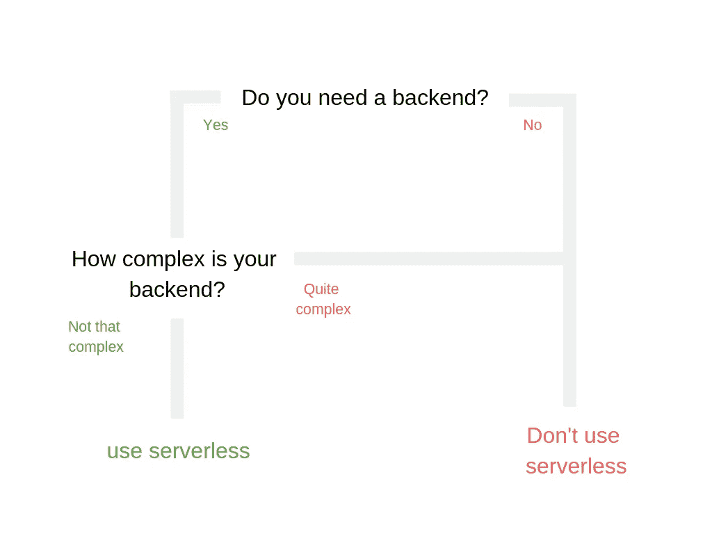

# 为什么您应该为您的创业考虑无服务器

> 原文：<https://medium.com/hackernoon/why-you-could-use-serverless-for-your-startup-79d7b0ef111a>

Photo by [Marius Masalar](https://unsplash.com/photos/CyFBmFEsytU?utm_source=unsplash&utm_medium=referral&utm_content=creditCopyText) on [Unsplash](https://unsplash.com/search/photos/server?utm_source=unsplash&utm_medium=referral&utm_content=creditCopyText)

我认为，对于开始创建一个技术工具/产品/创业公司，或者随便你怎么称呼它，最常见的障碍之一就是创业成本。我从来都不喜欢让一台服务器在不做任何事情的时候全天候运行。在那一刻，你基本上是在为可能发生的事情买单，这只是在浪费金钱。(我知道 AWS 和其他 PaaS 解决方案上有免费服务，但它仍然是一个 24/7 运行的原型，对我来说听起来有点傻)。

Throwing out money. Giphy

让我们现实一点，你的应用不会一夜成名，你不必担心使用高峰，即使它发生了，无服务器将随之扩展。免费层在 PaaS 服务(AWS、Azure、Google Cloud 等)上也相当慷慨。正如你所见(见下图), AWS Lambda 每月为你提供一百万个请求和 400，000 GB 秒的计算时间(或多达 320 万秒的计算时间)。我编写的处理条带事务的函数需要 1，100 到 1，400 毫秒才能完成。以这样的速度，我一个月可以处理超过 100，000 个电话，这远远超过了我制作一个原型所需的时间。这里有一些比较和计算价格的资源。[http://serverlesscalc.com](http://serverlesscalc.com)比较不同的 PaaS 解决方案，[https://servers.lol/](https://servers.lol/)比较 EC2 实例与无服务器。

The AWS Lamba Pricing

# 这个无服务器魔法是什么？

使用无服务器，你不需要在你的服务器上部署一个后端，但是你可以从你的后端独立地部署每一个功能。你可以把它看作一个微服务后端，但是没有服务之间的通信。无服务器函数相互调用在技术上是可能的，但这不是最佳实践。对于无服务器，你总是会尝试做[关注点分离](https://en.wikipedia.org/wiki/Separation_of_concerns)。一个功能做一件事。这不仅是从设计哲学的角度来看，也是从财务的角度来看，因为调用不同的函数会延长函数的执行时间，这是不好的。您在自由层中只有有限的计算时间，因此在这种情况下越快=越好。现在，我们已经将这些功能部署在亚马逊的服务器群中。但是现在呢？我们如何与他们互动？有两种选择:

1.  休息电话
2.  由事件触发

其余的调用和往常一样。例如，您想要创建一个用户。对于普通服务器，您可以对/users 端点进行 POST 调用。对于无服务器功能，情况完全相同。您可以在部署特定功能时为该功能定义端点。REST 调用将触发端点后面的函数，当这个函数完成时，REST 调用返回，实例将再次关闭。您的 PaaS 解决方案将计算这次执行的开始时间和结束时间之间的差异，然后您将收到以毫秒表示的该时间的账单。

对于事件来说，这是非常直接的。您可以将事件绑定到函数。例如，你有一个压缩图像的功能。您可以将此功能设置为每次图像上传到 S3 存储桶时触发。然后，我之前提到的相同过程将开始。函数将执行，实例关闭，您只需支付执行时间的费用。

# 我什么时候使用无服务器？

在决定使用无服务器后端之前，我做了两个简单的检查。首先我问自己:“我需要后端吗？”我的意思是，你真的需要一个后台来验证你的想法吗？如果你不需要后端，那就不要用后端！那些有后端的好特性仍然可以在以后添加。你只是在制造你暂时不需要的开销。

我问自己的下一个问题是:“我的后端会有多复杂？”这是一个更难回答的问题，因为当事情太复杂时，没有简单的是/否答案或明确的指导。你必须自己决定什么会太复杂。假设我们有一个后端处理以下功能的应用程序:用户身份验证，与数据库交互以提供服务和支付该服务的支付功能。好吧，让我们看看我们需要什么。为了保存一些数据并提供登录和注册，我们只需要在例如 DynamoDB 上进行基本的 CRUD(创建、读取、更新、删除)操作，如果您在 AWS Lambda 上运行的话。如果您使用 Stripe，支付可以通过一个函数来处理。正如你所看到的，这个后端基本上有五个函数长，没有那么多。我想说，这肯定是可能的，无需担心费用。

现在你可以说必须有第三个问题，类似于“你的后端需要处理多少访问者？”。虽然这肯定是一个重要的问题，但我将把它留在这里，因为我们正在谈论的原型实际上不会在开始时获得那么多的流量。即使会出现峰值，无服务器也会随之扩展。

A short decision tree for Serverless

# 我如何开始？

你现在可能会想:“好吧，这很酷，但我该如何开始呢？”。我将在下一篇文章中写一个小教程，介绍如何在 AWS Lamda 上编写 nodejs 无服务器后端。请务必在[媒体](/@DePrestige)和[推特](https://twitter.com/JeroenDePrest)上关注我，以便在我发布这篇文章的续集时得到通知。

如果你喜欢这篇文章，请随时在[媒体](/@DePrestige)上关注我，以便在我发布另一篇文章时得到通知，并在[推特](https://twitter.com/JeroenDePrest)上关注我，以了解我正在做的事情/建设的最新进展。