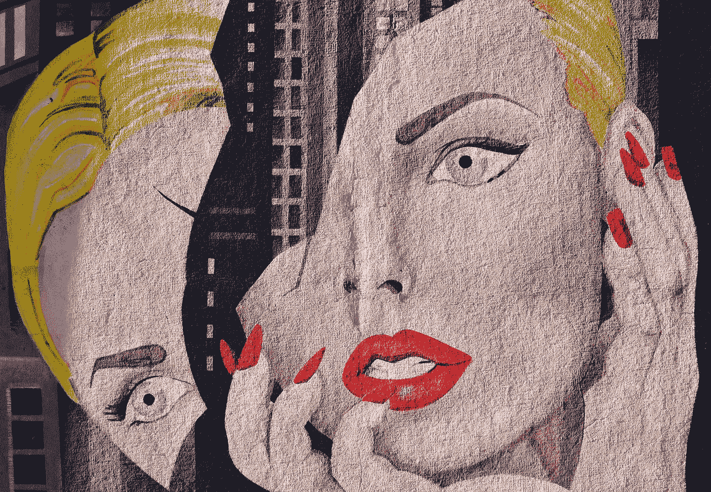

# 为什么你可能不需要数字排毒

> 原文：<https://medium.com/hackernoon/why-you-may-not-need-a-digital-detox-c0d681acc185>

## 社交媒体常识方法的案例

Chris Barbalis on Unsplash.com

> 生活就像骑自行车。要保持平衡，你必须不断前进——阿尔伯特·爱因斯坦
> 
> 不会了。不会了。不会了。别再找借口了。不再:“我明天开始。”不再:“就这一次。”不再接受自己意志的不足。别再走捷径了。我不再屈从于任何不健康或无益的想法。不，不会了。不再等待最佳时机，不再犹豫不决，不再说谎。不再软弱。不，不会了。现在是力量的时候了。通过力量，通过意志，通过坚定不移的纪律，我将成为我想成为的人。我会成为我想成为的人。然后——也只有到那时——我才会停下来说:《纪律等于自由:野外手册》

社交媒体是我生活中不可或缺的一部分，但它也是我生活中许多问题的根源。听起来很熟悉，对吧？从来没有像现在这样。我每天都在观察报纸和更广泛的媒体 [*关于社交媒体巨头如脸书、推特和其他对社会的责任的持续辩论。*](https://www.wired.com/story/inside-facebook-mark-zuckerberg-2-years-of-hell) *有一些减少人们对社交媒体上瘾的运动，如* [*人道技术中心*](http://humanetech.com/) *以及关于需要远离社交媒体的运动。很难平衡你花在社交媒体上的时间和现实生活，但也许一些常识性的方法可以帮助你，就像它们帮助我一样。我必须承认，我是并且继续是一个正在康复的社交媒体成瘾者。然而，我已经开始了我的改革之旅。这篇文章记录了我处理社交媒体的简单方法。希望他们对你有帮助。我决不是完美的平衡，但开始是胜利的一半。*

# 首先，看这个视频

# 然后，这个视频

# 推特迷惑了我

老实说，我与一家电视新闻公司的编辑团队进行了一次对话，才说服我注册 Twitter 并拥有一个 Twitter 账号。

在很长一段时间里，脸书对我来说意味着一种与我的朋友、家人和同事联系的简单方式，尽管他们相隔时间和空间。换句话说，我可以理解创建脸书账户背后的原因。我在 Twitter 上的经历完全不同。如果我不能提炼出“我为什么这样做？”这个问题的答案用一个词或一句话来说，很明显我不需要从事有疑问的活动。Instagram 于是变成了分享图片，脸书与人联系。Instagram 和脸书的链接有助于避免重叠。

Twitter，始于杰克·多西第一次看到即时通讯的实现。多尔西想知道该软件的用户状态输出是否可以在朋友之间轻松共享。多尔西和比兹·斯通认为 SMS 文本适合状态信息的想法，并在大约两周内建立了 Twitter 的原型。这吸引了来自 Ev Williams 的资金。其余的如他们所说是历史(来源:维基百科)。

Twitter 成立于十多年前的 2006 年。然而，直到四年前，我才真正发现。我正在和一个电视新闻节目的制作人谈话。我们正在讨论优化户外转播车使用的解决方案。这些货车顶部装有碟形天线，可以被派往突发新闻事件的现场，随着事件的展开，将信号传回演播室现场。

这位制片人一开始就表示，在未来，O/B 货车的使用率将会越来越低，因为普通人将会使用手机捕捉新闻事件，并使用 Twitter 向他们的粉丝广播新闻。事实上，主流媒体将使用来自 Twitter 的这些反馈，将社交媒体无意义地整合到主流媒体中，从而避免了使用 O/B van 的需要。

就在那时，我意识到 Twitter 就是新闻，是人们消费新闻的方式。于是，我开通了我的第一个 Twitter 账户。

这个故事的寓意是，就像任何其他创新一样，人们也需要社交媒体。从这个意义上说，它是不可或缺的。我们所能做的就是改变我们的反应。许多人会声称我们应该完全摆脱社交媒体。我不知道正确答案是什么，但我知道我可以控制自己的反应。这适用于更广泛的互联网，事实上也适用于任何创新。需要是发明之母，我们对发明的反应是最重要的。

# 是孩子们和千禧一代，不是我们

脸书于 2018 年 2 月 14 日在安卓平台上推出了面向儿童的 [Messenger，此前于 12 月在](https://www.theverge.com/2018/2/14/17012052/facebook-messenger-kids-android-app-now-available)争议声中在 iOS 平台上推出。

越来越多的人认为千禧一代(千禧一代有很多定义，但他们大致在 18-34 岁之间)，青少年和儿童是社交媒体的最大上瘾者。因此，所有的注意力都应该集中在他们身上。

[然后，围绕致命应用蓝鲸](http://fortune.com/2017/10/27/online-game-blue-whale-suicides/)的绝对残酷的事实促使全球数百名玩家自杀。

然而，作为成年人，我们有责任成为榜样，身体力行。作为第一步，许多学校已经开始禁止在学校使用智能手机。仅支持通信的哑手机是另一种选择。

# 说来容易做起来难

我之所以用我在 Twitter 上的经历作为例子，是为了说明为什么我认为社交媒体对我们的生活变得如此不可或缺。正如我所说的，我对社交媒体的反应在我的控制之下，并且是对抗其有害的、有时是意想不到的后果的最大武器。下面，我概述了我的反应的成分。除此之外,[还有“时间花得其所”倡议及其创始人特里斯坦·哈里斯(Tristan Harris)倡导的高效工具，后者现在被称为人道技术中心(Center For human Technology)](http://humanetech.com/take-control/)。

1.  限制社交媒体应用的数量，基于帕累托原则清除不想要的和很少使用的应用(我对社交媒体需求的 80%被限制在我应用的 20%)。就我而言，它有 5 个应用程序:我用脸书与不在 WhatsApp 上的人保持联系(或任何有助于建立更私人联系的 VoIP 应用程序，如与居住在外国的父母进行视频通话)；Instagram，用于在云端创建我自己的可视化剪贴簿或相册；Twitter 用于新闻订阅和创建列表； [Medium](https://medium.com/u/504c7870fdb6?source=post_page-----c0d681acc185--------------------------------) 用于博客，WhatsApp 用于 VoIP 视频通话。
2.  一天中的某些时间应该是神圣不可侵犯的排毒时间，即在工作/学习、锻炼、吃饭、阅读和户外活动(包括与孩子玩耍)期间没有社交媒体，没有特定的顺序。当然，我偶尔会用手机或 GoPro 来录制视频或拍照留念。我以后分享它们。除了享受自然和周围的风景，我也不会花更多的时间来拍照。
3.  一般来说，早上 15 分钟的瑜伽之后是早餐，然后是阅读新闻。然后，去上班，接着是户外活动、社交活动和家务、晚餐和去健身房。健身时间可以在早上，但我很少能坚持晨练。在一天结束时，我会给自己一个小时的时间来阅读、看电视、阅读和社交媒体。老实说，阅读各种题材的书籍胜过电视和社交媒体。我的阅读习惯比电视或社交媒体带给我更多的乐趣。如果有一种习惯有能力以健康的方式强烈减少对社交媒体的沉迷，那就是阅读。
4.  阅读也有助于处理困惑和社交媒体对个人信仰的不当影响，不断提醒我研究争论的双方。即使那样，我也总是牢记在心，我可能永远也不会发现真正的真相。历史是不断修正的，你的观点也应该根据新的证据和事实来修正。这是科学的方法。此外，要有各种各样的新闻来源和国际文献，从多个角度来看问题。
5.  旅行是理解和调和不同观点的好方法。假期应该是理想的数字排毒。然而，首先，试着在一天快结束时限制花在社交媒体上的时间。
6.  社交媒体上的广告可能非常诱人。问问你自己这个问题是否是绝对必要的。就 B 计划而言，如果你无法避免通过点击诱饵购买，那么使用 Albert、Mint 甚至你的网上银行应用等个人财务应用来审查每月支出是避免下次不必要支出的好方法。一般来说，经常性费用和未取消的订阅可能占费用的大部分。制作个人现金流量表和资产负债表也很有帮助。
7.  睡觉时远离手机，并远离卧室。
8.  不要打开来自社交媒体的通知。通常情况下，一切都可以等到以后。也许，一周中的某一天可以成为社交媒体自由日。
9.  单调可能是焦虑、抑郁和社交媒体成瘾的一大原因。改变常规，尝试不同的活动，例如学习一门新的语言，游泳，跳舞和数百万种其他选择的组合都是可能的。并不是所有的东西都很贵，尤其是在公园散步。
10.  最后，请记住，这些不是硬编码的解决方案，而是我试图坚持的原则或指导方针。所以，有时候，我会制造例外或者不遵守它们，这就是为什么它们更现实，更简单。此外，我一直试图想出更好的方法来应对我的社交媒体成瘾。你可能会有不同的途径达到同样的结果。

最终，如果生活本身让你兴奋，工作和娱乐等其他活动成为兴奋和多巴胺释放的来源，那么尽量减少甚至在某些情况下不使用社交媒体是完全可能的。

# 试图生活在一个破碎的世界里

今天的世界绝非完美，但也不是完全没有希望。关键是通过决定我们对不完美的反应来接受不完美。我并不是说没有人需要数字排毒。有些可能。这就是为什么我在这篇文章的标题中用了“可能”而不是“不要”。然而，采用一种更常识性的适度方法意味着每天进行排毒，而不是每年一次。有时候，一年一度的社交媒体之旅会让你更加需要重返网瘾。

一个显而易见但不那么容易的解决办法是开始没有社交媒体的生活。如果你把一只手放在心上，质疑自己对反馈的需求，也质疑自己对轻松与国外亲人联系的需求，那就更难做到了。就像资本市场或加密货币一样，每一项创新都是一把双刃剑。我们握剑的方式决定了天平向哪个方向摆动。股票市场可能很快变成赌场，区块链可能成为无政府状态的最大例子。控制有害影响是一场持续的战斗。这比完全摆脱创新要困难得多，那将意味着完全没有任何创新。

另一种选择是继续不稳定地生活，把谨慎抛在脑后，喂饱社交媒体已经成为的自恋、多巴胺生成机器。基因编辑可能是一件好事，但也可能进一步加剧不平等。

常识的方法是达到难以捉摸的平衡，即控制你的思想，不让你的思想控制你。

能做到吗？是的。正如健康饮食一样，坚持健身养生法，每天做瑜伽也是。我正在努力做到以上所有的事情。我可能会失败很多次，但总的来说，我正朝着正确的方向前进。有时候，一个老师或者一个伙伴会帮很多忙。最终，责任总是在你身上。

平衡很难吗？依我拙见，这是最难的选择，但也是最理想的回应。