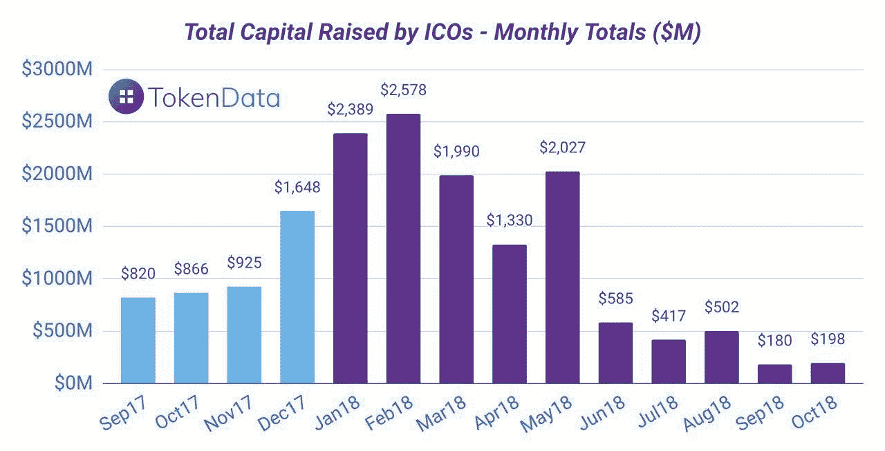
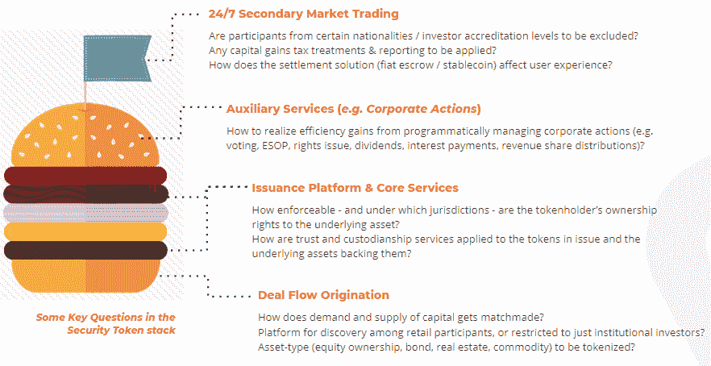
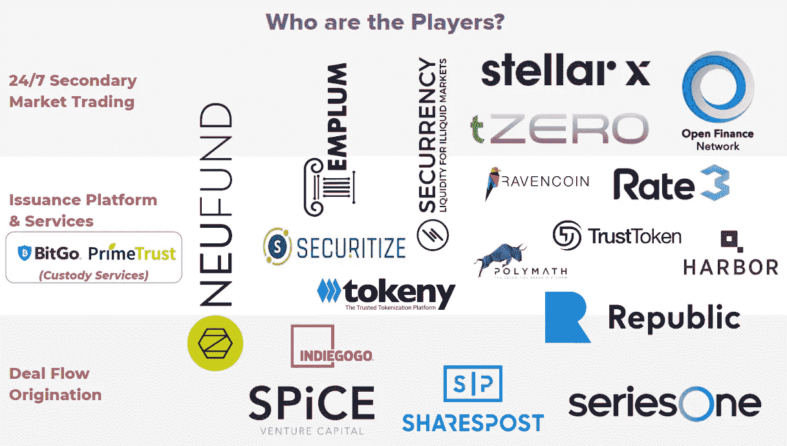

# 为什么您需要了解安全令牌价值链

> 原文：<https://medium.com/hackernoon/why-you-need-to-know-the-security-token-value-chain-aka-yet-another-stack-7e210d0a2a68>

## ICO 几乎完全退出了舞台。输入安全令牌？

随着 2018 年伟大的加密货币冬天又延长了一个月，[在世界各地的区块链会议上，坊间证据](https://whitepapertrail.com/a-few-words-about-malta/)已经普遍认为一场*安全令牌浪潮*即将形成。这种新型数字资产是一种寻求遵守现有监管机构、而非颠覆现有监管机构的资产。安全令牌是以编程方式设计的，符合相关法规。用颇具影响力的加密播客和基金经理安东尼·庞普利亚诺的话说:

> 如果比特币等加密货币被视为“可编程货币”，那么你可以将安全令牌视为“可编程所有权”的一种版本。

随着最近资产被令牌化的例子从[圣里吉斯阿斯彭度假村](http://fortune.com/2018/08/23/hotel-real-estate-aspen-blockchain-ethereum-st-regis-indiegogo/)，到[纽约房地产基金](https://cryptovest.com/news/new-york-based-leaseum-partners-teams-up-with-tokeny-to-launch-250m-tokenized-real-estate-fund/)，到毕加索的一幅画(由某个[约翰麦卡菲](https://twitter.com/officialmcafee/status/1063569238072414208)促成)，到来自[德国](https://global.handelsblatt.com/finance/german-eto-blockchain-startup-neufund-936882)和[巴西](https://br11.io/)的初创公司的私人股份，势头显然有利于这一新生的发展。小声点，但我们甚至可能正在见证从疯狂的西部向“证券代币发行(STO)之春”转变的第一个萌芽。

*(Will STOs step in to fill the ICO void? Figures obtained from* [*TokenData*](https://www.tokendata.io/)*)*

**设置场景**

在我继续深入之前——并不是说 sto 一定会介入推动另一轮市场牛市(超出了本文的范围),我强烈建议您重温这篇关于标记化的伟大的介绍性文章:

 [## 无论如何，标记化是如何工作的？

### 不是所有的东西都会被令牌化，但能被令牌化的都会被令牌化。

hackernoon.com](https://hackernoon.com/how-does-tokenization-work-anyway-e07533650379) 

接下来是另一篇有说服力的文章，展示了安全令牌空间的全部变革潜力:

 [## 安全令牌理论

### 去年夏天，我写了《传统的资产令牌化》,我在其中假设了一系列资产将会转移到…

hackernoon.com](https://hackernoon.com/the-security-token-thesis-4c5904761063) 

> 简而言之，推动安全令牌理论被主流采用的好处有很多，包括 24/7 市场、部分所有权、快速结算、自动化合规性和资产互操作性。

本文的目的是让读者了解我们所定义的*安全令牌价值链*——将其视为创建和交易安全令牌所必需的一系列生产线步骤——以及生态系统如何围绕这些层形成的概述，特别是在与 s to 相关的监管框架更为发达的市场中，如美国。

**安全令牌价值链(又名另一个堆栈)**

下面的*汉堡*提供了一个分层结构，展示了我们如何对当今各种安全令牌生态系统参与者进行分类(从下到上):

1.  交易流程发起
2.  发行平台
3.  服务
4.  二级市场交易

*Defining The Security Token ‘Ecosystem Stack’ Today*

虽然上述内容提供了某种形式的流程通用结构，但请注意，一些活动(如辅助服务)可能会跨多个其他层重叠，和/或完全不同于平台利益相关方设计的各种其他风格。

**交易流程发起**

我们从安全令牌的最底层开始。

> 简而言之，交易流发起是指为投资匹配资金需求和供应的过程。

客户对这些投资的可及性程度因人而异。一方面，有更多的开放平台，如 Kickstarter，普通散户投资者乔可以参与资助酷产品创意的开发；而在另一端，有像 AngeList 这样的平台，只有合格的投资者才能参与硅谷科技初创公司的股权投资。

根据经验，随着交易排他性、目标资本筹集、平均支票规模和融资复杂性等因素的增加，对有抱负的投资者参与的一般要求变得更加苛刻。这些要求通常包括获得投资者资格认证、更多的披露要求以及有时更高的费用。

目前 STO 领域涉及的著名交易流发起平台包括 [Republic Crypto](https://republic.co/crypto) 、 [SeriesOne](https://seriesone.com/) 和 [Indiegogo](https://www.indiegogo.com/) 。Indiegogo 是在传统众筹领域存在了大约十年的最著名的例子，它凭借其可信的声誉支持了雄心勃勃的[ST . Regis Aspen Resort token ization 项目](https://blockchain.indiegogo.com/projects/aspen/)，成为投资者可以参与初始 STO 的平台。大多数平台都回避了传统证券发行的申请要求，只允许合格投资者参与，而 Republic 等一些平台则通过依赖 [SEC 监管豁免](http://www.mondaq.com/unitedstates/x/701594/Securities/Offering+Exemptions+Available+To+Companies+Issuing+ICOs)的字母汤允许普通散户参与。

*Fancy purchasing a fraction of a fancy ski resort?*

**发行平台和核心&辅助服务**

继续讨论安全令牌堆栈中的核心内容，我们来看发行平台。

> 这些公司专门提供主要发行可编程安全令牌所需的智能合约技术知识。

他们提供解决方案，处理诸如投资者资格鉴定、KYC/反洗钱要求、资本筹集税收以及无数其他更具体的股东条款(如优先拒绝权、居住要求、股东所有权集中规则等)。).它们旨在尽可能满足大多数资产发行人的共同需求。

> 这些解决方案的目标是在保持不变性和流程透明性的同时实现法规遵从的自动化。

如果实施得好，这些解决方案将确保类似[都乐食品案](https://www.bloomberg.com/opinion/articles/2017-02-17/dole-food-had-too-many-shares)的情况不会浪费地发生，在该案中，各种分类账对账过程中的人为错误导致在各种分类账中重复发放都乐食品股份。

大多数发行平台都捆绑了服务，旨在满足潜在 STO 发行者的共同要求，以构成一个全方位服务的解决方案。这将包括代币发行者的仪表板，以及允许他们在代币持有者的文档签名工具的帮助下，轻松执行公司行为的功能，如股东投票、配股、股息、利息支付、收入份额分配和 ESOPs。例子包括 [Templum](https://templummarkets.com/aspen) ，它在 Indiegogo 上实现了 Aspen 项目的令牌化，以及比特币基地支持的初创公司[证券化](https://techcrunch.com/2018/11/26/securitize-raises-12-75-million-digital-security-offering/)，它促进了两个区块链投资基金[区块链资本](https://blockchain.capital/)和 [SPiCE VC](https://spicevc.com/) 的令牌化。

完成必要服务列表的是信托公司和托管人——这是一类对实现令牌化绝对不可或缺的公司，尤其是在大多数资产不是*原生数字*(即今天的“*现实世界*”资产，如股票、房地产和艺术品)的情况下。他们作为保管人的工作是确保这些资产——无论是股票证书、财产所有权证书、实物绘画——被保存在一个安全的地方，令牌持有者的所有权得到明确定义和法律支持，并且代表它们的发行令牌始终以 1:1 的比例与基础资产相平衡。为自己建立这个利基市场的关键玩家是 PrimeTrust 和 BitGo。

**二级市场交易**

最后，在最顶端，二级市场交易是提供证券代币的一层，这些代币具有流动性和 24/7 交易和结算的诸多好处。

如今，直观、易用的交易界面构成了任何形式的数字资产交易产品的筹码。任何 STO 交易所要想为用户体验带来实质性的增值，就必须了解其运营所在的法律管辖区的规则，以及其客户群的规则。例如，它们可以自动地为适用于通过二级市场交易获利的美国用户的资本利得税报告提供便利，但不适用于新加坡用户(在新加坡，资本利得税不适用于零售投资)。

其他差异化因素与用户体验之旅有关。可以建立交易所，让用户选择自行保管自己的数字资产，或者——对于那些在管理私钥方面技术不太熟练的人来说——只为他们提供一个简单的用户账户加密码系统。交易所还可以通过使用 stablecoins 来帮助减少他们平台上的贸易结算时间。Stablecoins 将允许此类交易自动发生，这意味着当我的卖单与感兴趣的买家配对时，我就会收到我的销售收入，而我的安全令牌会在一个单一的同时发生的动作中向另一个方向移动。这是对现有证券交易结算速度的指数级改进，其中 T+2 代表黄金标准(跨境股票交易结算有时甚至需要 T+5 天！).

一些巨头已经崭露头角。 [OpenFinance Network](https://www.openfinance.io/trade.html) 已经在合作伙伴关系方面走在了前面，形成了[一整套合作](/@openfinance)来列出由各种利基发行平台发行的代币。纳斯达克上市公司 Overstock 的区块链子公司 tZERO 在 8 月结束了自己的 1 . 34 亿美元的 STO 回合[后，已经建立了一个相当大的战争基金。代币的购买者被承诺定期支付与他们的交易业务产生的利润挂钩的股息。](https://cryptovest.com/news/overstocks-tzero-issues-preferred-security-tokens-after-raising-134m-via-sto/)

**抢地赛正在进行**

Calling the space fragmented would be an understatement at this point in time; slide not an exhaustive representation of all notable players

目前的格局在很大程度上仍然是碎片化的，玩家们找到了自己的定位，并逐渐建立起合作关系。虽然有一些独特的项目，如 [Neufund](https://neufund.org/) 寻求为潜在的 STO 发行人提供完整的端到端解决方案，或者更确切地说，是 ETO(股票代币发行)发行人，因为他们选择了这个术语，但大多数项目都专注于堆栈中的某一层，然后与补充它们的其他项目合作。例如，[SPiCE VC](https://spicevc.com/)——一家专门投资区块链初创公司(deal-flow)的令牌化基金，已经与 Securitize 合作发行他们的令牌，还与 OpenFinance Network 合作，使他们的令牌能够在[未来进行后续交易](/securitize/first-ever-security-tokens-traded-with-a-decentralized-compliance-protocol-5cf4266bcd34)。

另一个观察结果是，大多数区块链初创公司的结构与“传统”科技初创公司非常相似，以基于服务收入的商业模式运营。例外情况包括利用 s to 协调平台激励措施和/或从投资者处筹集资本(如 Neufund、SPiCE 和 tZero)以换取未来分红承诺的公司，以及其他几个已经完成 ico 的公司(如 Polymath、TrustToken)或通过采矿激励措施分发令牌的公司(如 Ravencoin)。

最后，还值得一提的是，这些参与者中的大多数都位于美国，这凸显了其他市场的资产令牌化空间的不成熟性以及由此带来的潜力。

**监管方面仍处于早期阶段**

虽然承认最近有几个前瞻性的、*【现实世界】*令牌化项目登上了新闻头条，但不能过分强调整个安全令牌空间的初期阶段。到目前为止，大多数引人注目、举着旗帜的令牌化概念验证项目都只是面向一小部分[合格](https://blog.maecenas.co/blockchain-art-auction-andy-warhol)[投资者中的](/harborhq/harbor-launch-and-hub-e76908207680)精选群体出售的概念验证项目，目的是为了站在监管者的正确一边。大众零售的采用还有很长的路要走。

话虽如此，但显而易见且令人振奋的是，美国国内监管豁免的明确性导致了许多安全令牌生态系统项目和合作伙伴关系在美国蓬勃发展。Republic 创始人兼首席执行官 Ken Nguyen 最近在一个很棒的播客中接受了采访，在此过程中，他解释了 STO 项目可能寻求的各种美国监管豁免:

不久之后，新加坡和日本等其他亚洲“支持加密”的司法管辖区也开始接受 STO 的创新，允许散户投资者群体——***而不仅仅是合格投资者***——投资组合暴露于作为投资代理的证券，否则他们可能永远无法获得这些证券。

这是一个真正让我兴奋的想法；想象一下，能够投资于 Grab 或 Gojek 等初创公司的早期股权融资之一，会有多倍的回报。想想发行者可以用来提高客户参与度和忠诚度的全新设计空间，例如，允许代币持有者优先预订。

随着像美国这样的司法管辖区为其他人的观察和适应奠定基础，曾经只属于富人和有联系的人的领域可能很快就会在不久的将来变得触手可及。