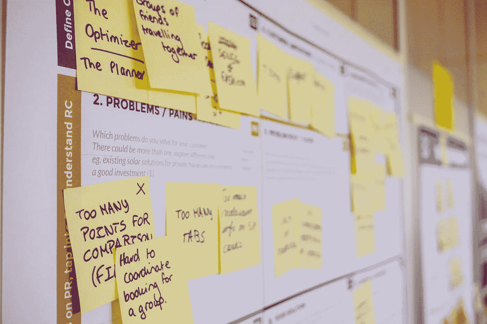

# 为什么您可能需要不止一个生产力应用程序和系统。

> 原文：<https://medium.com/hackernoon/why-you-probably-need-more-than-one-productivity-app-and-system-5036f76d33e>

## 有时候少即是多。但是，有时候只是少了点。

网上和[书籍中有数不清的生产方法和应用。](https://hackernoon.com/tagged/books)

大多数生产力建议说坚持一个系统和应用程序。如果你不这样做，你的系统会变得太复杂而失败。

Photo by [Simson Petrol](https://unsplash.com/photos/-3wygakaeQc?utm_source=unsplash&utm_medium=referral&utm_content=creditCopyText) on [Unsplash](https://unsplash.com/search/photos/chaos?utm_source=unsplash&utm_medium=referral&utm_content=creditCopyText)

然而，由于这样或那样的原因，我们并不都能够全天只使用一个系统和/或应用程序。

如果你在一份不相关的日常工作中朝着个人目标努力，你可能会发现你工作的公司有自己的系统。

IT 部门可能会限制你一整天都能使用的[软件](https://hackernoon.com/tagged/software)(说真的，我们什么时候才能切换到 [G 套件](https://gsuite.google.com/)？).因此，如果你的个人系统没有使用相同的软件，你会发现自己从一开始就处于困境。

最有可能的是，你的团队有一个系统来帮助每个人跟踪所有移动的部分。

此外，你朝九晚五的工作可能与你在工作之外努力追求的目标大相径庭。

那么，有了所有这些障碍，你应该如何在工作中富有成效，同时在个人生活中也做到这一点呢？

# 问题是

Photo by [Daria Nepriakhina](https://unsplash.com/photos/zoCDWPuiRuA?utm_source=unsplash&utm_medium=referral&utm_content=creditCopyText) on [Unsplash](https://unsplash.com/search/photos/post-it?utm_source=unsplash&utm_medium=referral&utm_content=creditCopyText)

现在是四月，在一月，你会设定一些目标。

有些是一样的——看着你减肥。其他人更有野心。这将是你[插入:写小说，开始做生意，等等]的一年。]!

你从变得有条理开始。然后，你意识到你并不真正知道那是什么意思。

[Lifehacker](https://lifehacker.com/) 来救援了！在阅读了 10-12 篇关于不同生产力系统和应用的文章后，你最终决定买一台笔记本，还是 Evernote？不，绝对是神童。

你下载应用程序，一切都刚刚好。然后，你在周一早上上班时发现前面提到的一个问题阻碍了你新完善的系统。

1.  它屏蔽了神童榜网站。
2.  你的老板现在在你的办公室中间有一个写有大量便利贴的公告板。
3.  您意识到您需要一种方法来跟踪由于任何原因而挂起的项目。

在所有这些场景中，您有两种选择。

你可以调整你的系统，也可以创建一个单独的系统来处理你日常工作的所有需求。

# 如何使用两套系统

Photo by [rawpixel.com](https://unsplash.com/photos/O9Xe1lRFRSs?utm_source=unsplash&utm_medium=referral&utm_content=creditCopyText) on [Unsplash](https://unsplash.com/search/photos/phone-and-computer?utm_source=unsplash&utm_medium=referral&utm_content=creditCopyText)

## 第一步:决定你需要每个系统做什么。

你在工作中完成的任务需要与你正在写的小说不同的计划和跟踪。

例如，我通过与其他部门的各种人合作来创建文档。此外，我会定期同时处理多个文档。

经过几周的反复试验，我决定我需要知道一些事情:

1.  我目前正在处理什么文档？
2.  它们什么时候到期？
3.  这份文件在哪里？换句话说，是我发给别人了，还是他们给我退了？

我发现我的个人[神童列表](https://www.wunderlist.com/)系统并没有帮助我回答这些问题。

 [## 如何真正利用神童列表取得成功

### 我找不到一个简单的系统来在线使用这个特定的应用程序，所以我创建了自己的应用程序。

hackernoon.com](https://hackernoon.com/how-to-actually-use-wunderlist-for-success-be8681d892c3) 

## 第二步:识别你的系统。

在确定我的需求并意识到它们与我当前的系统不兼容之后，我开始审查系统。

我问自己，“什么系统能给我所有我需要的信息？”

作为一个效率极客，我已经知道[看板](https://en.wikipedia.org/wiki/Kanban)是我问题的答案。

任务状态的可视化正是我所需要的。

我一眼就能看出:

1.  我在做的事情，
2.  每项任务何时到期，以及
3.  文档在流程中的位置。

一旦我决定了看板，就到了第三步。

## 第三步:实现你的新系统。

当我第一次决定用看板来解决我的生产力问题时，我为它的实现创建了一个愿景。

不幸的是，这个愿景包括在我桌子的一部分放满三列不同颜色的便利贴。突然，一个完全不同的形象跃入我的脑海…

所以，我决定用[特雷罗](https://trello.com/)。

是同一个系统，但是在我的手机上。因此，我不需要买便利贴。

更重要的是，我不会淹没一大堆不同颜色的便笺条。

# 最后一步

Photo by [Alex](https://unsplash.com/photos/VxtWBOQjGdI?utm_source=unsplash&utm_medium=referral&utm_content=creditCopyText) on [Unsplash](https://unsplash.com/search/photos/win?utm_source=unsplash&utm_medium=referral&utm_content=creditCopyText)

点睛之笔是简单的习惯训练。

当我在思考个人目标和与这些目标相关的任务时，打开 [Wunderlist](https://www.wunderlist.com/) 并使用那个系统。

当我在思考与工作相关的项目和与这些项目相关的任务时，打开 [Trello](https://trello.com/) 并使用那个系统。

事实证明，这种训练非常简单，原因只有一个:

如果我在思考个人目标/任务，打开 [Trello](https://trello.com/) ，我只会看到与工作相关的任务；因此，这意味着我需要使用另一个应用程序，反之亦然。

如果你发现工作和个人生活很难有效率，试着把两者分开。

我想你会发现你更能专注于手头的任务。

Photo by [Pana Vasquez](https://unsplash.com/photos/8EbLRFu6USc?utm_source=unsplash&utm_medium=referral&utm_content=creditCopyText) on [Unsplash](https://unsplash.com/search/photos/start?utm_source=unsplash&utm_medium=referral&utm_content=creditCopyText)