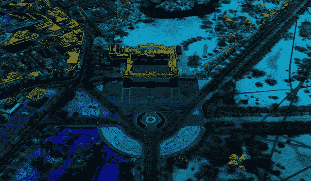

# 你为什么会对激光雷达技术感兴趣？

> 原文：<https://medium.com/hackernoon/why-you-should-be-interested-in-lidar-technologies-62cada5919d>

Buckingham Palace LiDAR point cloud by [Environment Agency](https://www.flickr.com/photos/environment-agency/) [published at Flickr](https://www.flickr.com/photos/environment-agency/27489358013).

激光雷达技术正在飞速发展！由 [Inkwood Research](https://www.inkwoodresearch.com/reports/lidar-technology-market/) 、 [Grand View Research](https://www.grandviewresearch.com/press-release/global-automotive-lidar-market) 、 [Markets And Markets](https://www.marketsandmarkets.com/PressReleases/lidar.asp) 和 [Research And Markets](https://www.researchandmarkets.com/research/cvwt57/lidar?w=5) 发表的研究证实了这一点。

随着激光雷达技术成为关键推动者，汽车行业正在发生变化。研究和市场公司的报告称，到 2020 年，汽车激光雷达市场的收入将超过 1 亿美元，并在 2050 年增长到 440 亿美元。高级驾驶辅助系统(ADAS)和自动驾驶汽车使用激光雷达技术。自动紧急制动(AEB)和自适应巡航控制(ACC)是 ADAS 中使用激光雷达[技术](https://hackernoon.com/tagged/technology)的两个主要组件。根据 Markets 和 Markets 的数据，ADAS 无人驾驶汽车的市场估计将在此期间增长最快。

虽然[著名的汽车制造商正在对这项技术](https://www.businessinsider.in/Automakers-are-making-big-investments-in-a-key-piece-of-self-driving-car-technology-that-Tesla-is-avoiding/articleshow/61345439.cms)、 [Autonomoustuff](https://autonomoustuff.com/) 、 [BLOM](http://www.blomasa.com/) 、 [Raymetric LiDAR 系统](http://www.raymetrics.com/)进行巨额投资，但 FARO Technologies 是主要参与者。福特、英伟达和博世是最大的竞争者。美国、加拿大、英国、德国、日本、印度、中国、巴西和墨西哥正在以比世界其他地区更快的速度在自动驾驶汽车和新型移动设备中采用这些技术。

广泛寻求的激光雷达服务是地图生成和注记。[自动驾驶汽车初创公司 Voyage](https://voyage.auto/) ，与 [Scale API](https://www.scaleapi.com/) 合作进行标注需求，与 [Renovo](https://renovo.auto/) 合作进行地图生成。点云处理工具[像](https://hackernoon.com/tagged/tools)[视觉激光雷达](http://www.geo-plus.com/point-cloud-software/)大约花费 4032 美元，而[激光工具](https://rapidlasso.com/lastools/)大约花费 4000 欧元。

因此，未来几天对激光雷达技术专家的需求将会上升，这并不奇怪。尽管激光雷达传感器非常昂贵，但有许多数据集可供开发人员使用。一些值得注意的数据集是 [KITTI 数据集](http://www.cvlibs.net/datasets/kitti/)、[伯克利 DeepDrive](http://bdd-data.berkeley.edu/) 和[百度 Apollo 数据集](http://data.apollo.auto)。这篇由 Prerak Mody 发布的[帖子有一个自动驾驶汽车数据集的精选列表。那么，你还在等什么？](https://blog.playment.io/list-of-lidar-datasets-for-autonomous-vehicles-till-2018/)