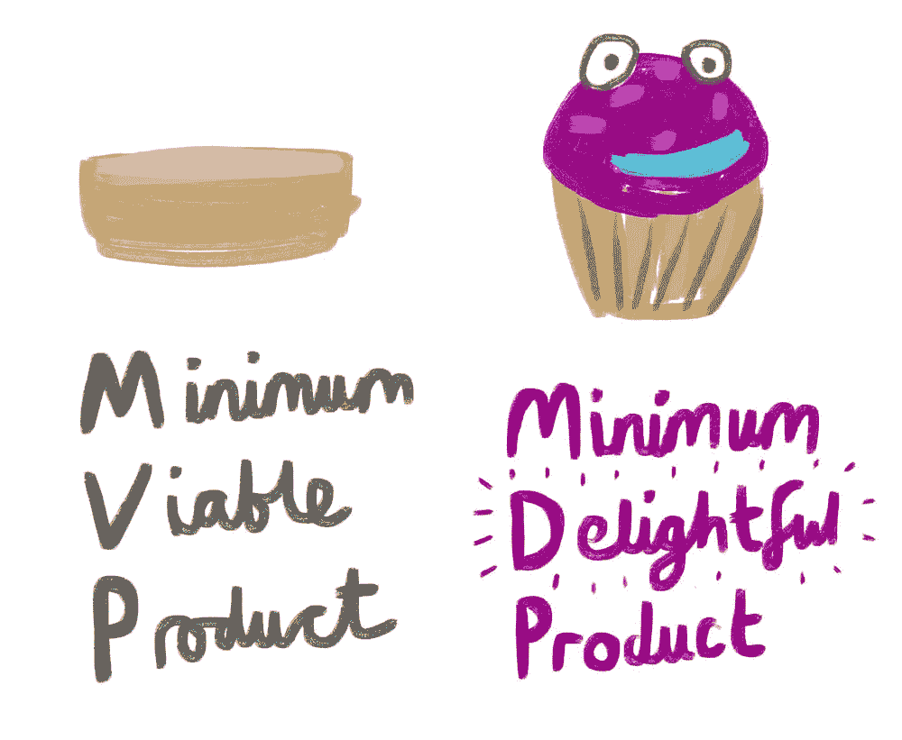
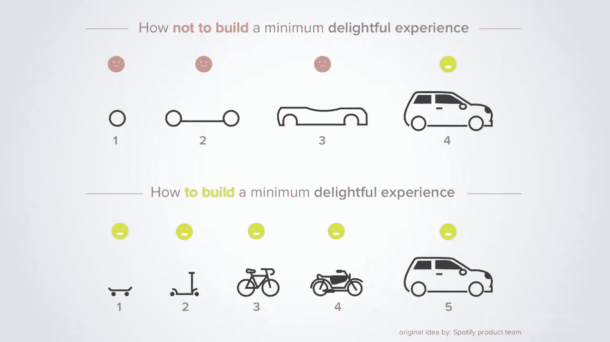
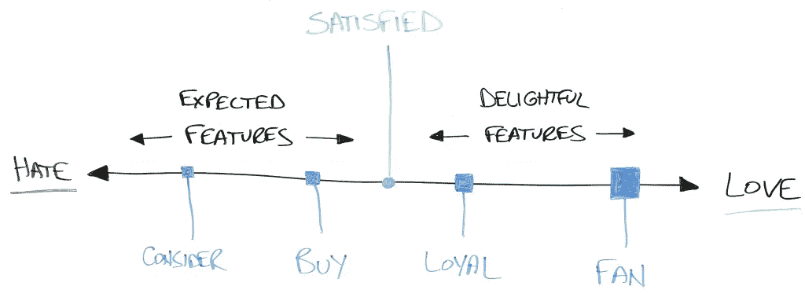
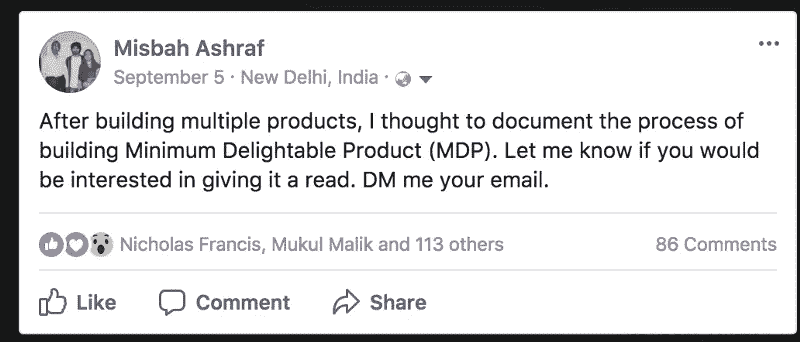
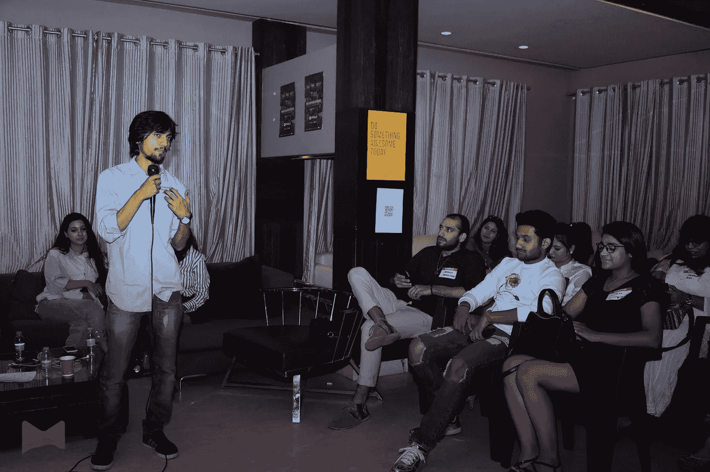
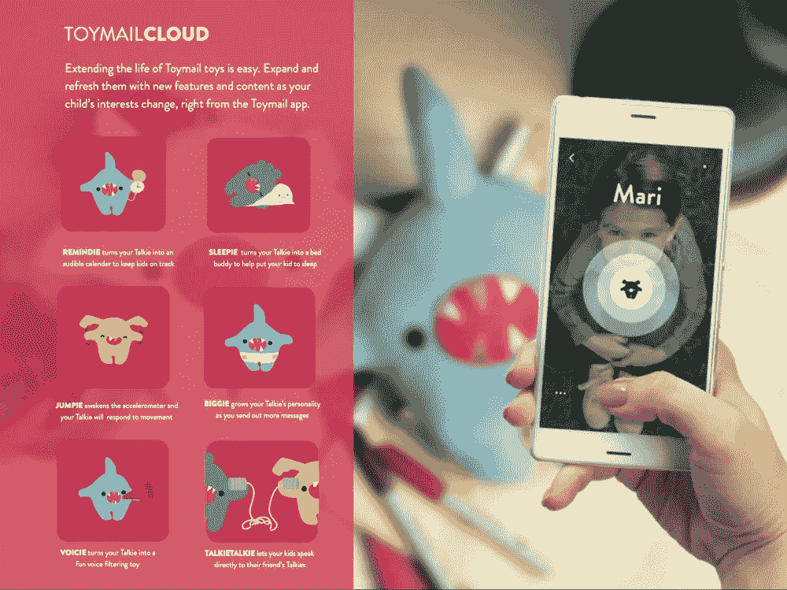
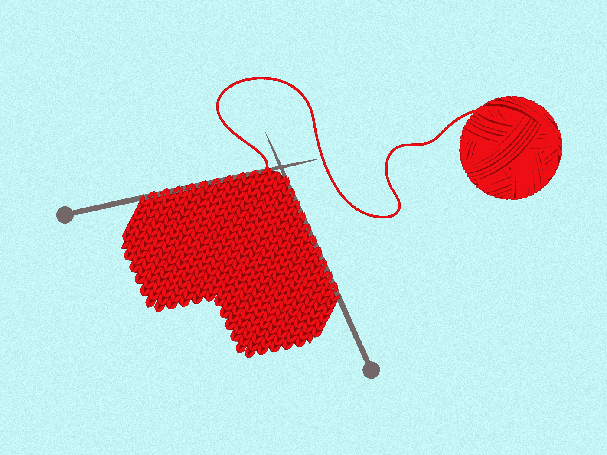
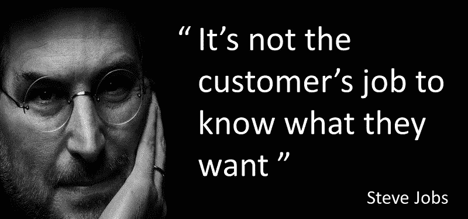

# 为什么你应该建立一个最低限度的令人愉快的产品(MDP)

> 原文：<https://medium.com/hackernoon/why-you-should-build-minimum-delight-able-product-mdp-a2d27897b5a4>

What it takes to build products that make users say ‘wow’ ?

要打造让用户满意的伟大产品，到底需要什么？如何在不过度开发特性的情况下实现这一点呢？

你如何找到对每个企业都至关重要的基本点——制造人们想要的东西。

大多数公司倒闭仅仅是因为他们不能解决这个问题。

事实是——制造优秀的消费品总是很难。这就是我写这篇文章的原因。

在我过去六年为三大洲的初创公司开发产品的经历中，我最大的收获是这个——**你需要让你的用户‘惊叹’。**

为什么？

**因为如果一个人有愉快的第一次经历，他们会告诉其他人！**没有更好的增长方式，公司必须在初期利用这种以人为中心的增长方式。

虽然这听起来很简单，但很少有公司在构建 MVP 时遵循这种方法。我看到过勉强可用的产品被推到用户手中收集反馈。

或者有时候，能够真正改变用户整体体验的特性不见了！

我给你举个例子。

在使用 Spangle 构建多个消费者社交应用时，我们忽略了一个基本点——通过在平台上播种我们希望用户内部创建的内容来建立内容基调。

但是，我们意识到，如果这个基调没有定下来，人们就会来创建任何类型的内容和垃圾邮件社区！由于他们不会对这个平台的基本概念有所了解，这将导致一个混乱和破碎的体验。

这只是一个例子。

人们在推出他们产品的第一个版本时，通常会错过这样的事情。

许多人围绕构建产品进行写作。有成千上万的文章，但没有人谈论基本的基本面。

对我来说，我相信一件简单的事情——创造令人难以置信的产品体验。

当我开始建造 Marsplay 时，这个信念是一切的核心。该团队花费了无数时间来开发工具，允许用户标记他们穿着的确切产品，而不必去任何第三方购物平台获取链接。

虽然这是一个很大的挑战，但我们知道，使内容创建过程尽可能简单和愉快是让我们的用户说“哇”!

在 500 多份个人 DM 和数百个问题之后，我写下了我从构建最低限度的令人愉快的产品而不仅仅是 MVP 中学到的东西。

这些是我实现目标的几个策略—

# 与客户交谈

这是你收集大部分知识来塑造你的产品的步骤。你的一些假设可能会被证明是错误的。

但是，你会明白谁会使用你的产品，为什么。

你会明白最大的痛点，以及如何解决。如果你做得好，你就会知道你的前 100 个潜在客户是谁。

所有这些都将帮助你理解你需要优先考虑哪些产品特性。

在建立 Marsplay 之前，我们安排了与 50 多位时尚博主和网购常客的会面。我们最有洞察力和最好的学习来自这些对话。

例如，我们通过与人交谈了解到哪些购物平台使用最广泛，并将其整合到我们的 APL 中。如果我们没有做任何用户研究就走自己的路，我们可能会选择错误的平台。

# 在发布前建立受众

很多人认为，只有当他们手中有了第一个版本的产品时，他们才能开始与人交流。但我的想法完全相反。

一旦你知道你在制造人们想要的东西，是时候开始建立观众群，接触前 100 名顾客了。

建立受众就是建立关系——与他们互动，让他们成为你社区的一部分。

你可以通过活动、合作等方式做到这一点，这样一旦你发布了产品，他们就会成为第一个传播你的人，并给你关于产品的真实反馈。

在 Marsplay，我们推出了一个 Creator Studio，并向我们的社区免费开放。这个简单的步骤帮助我们在两个月内与 100 多位时尚博主建立了联系。

# 与您的社区一起迭代

我再怎么强调这一点的重要性也不为过。在制作玩具邮件的时候，通过用户的反馈，我们了解到人们想要的不仅仅是发送语音信息

他们希望获得能让他们开心的功能，但他们没有获得这种体验！因此，我们推出了[玩具邮件云](https://toymail.co/blogs/news/introducing-toymail-cloud-for-talkies)，让他们可以访问多种有趣的应用程序。

我们发现的另一件事是，人们对存储语音信息缺乏信任。在那段时间，围绕儿童玩具的语音信息发生了许多黑客攻击。

为了建立信任，我们推出了一个客户评论页面，在那里我们收集了大量的客户评论。而且，这非常有效！

# 为您的用户提供独特的价值

你需要给你的顾客一些别人没有的东西。或者以一种无人知晓的方式。那将是你的三角洲哇。这就是人们对你的印象。

否则，你会迷失在所有的噪音中。

这方面最好的例子是 HQ 琐事。他们推出了一个名为 Cameo 的独特节目，比现场直播更进了一步。它让观众真正参与到这个过程中。

这是前所未有的。这是他们的“哇”的因素。不出所料，他们最大的增长渠道变成了口口相传，3 天内就创下了 120 万并发玩家的记录！

独特的价值并不总是令人兴奋的功能。对你来说，这可能是一个令人惊讶的人性化的登机体验，让你的用户感到特别。也可能是你在平台上播种的内容。

例如，我们花了两个月的时间为我们的应用程序创建了高质量的有意义的内容，这样当用户第一次使用该应用程序时，他们就会看到所有最好的时尚博主是如何定期使用该应用程序并分享有用的内容的！

# 将您的关键功能作为副产品推出

将你的关键特性作为副产品发布，可以让你在从错误中学习的过程中不断重复，而不必完全依赖它的成功来维持你的产品。

这就是我们在 Marsplay 所做的。我们的 APL 是我们的关键功能，但我们确保我们的应用程序本身是一个完整的产品。即使我们的 APL 由于某种原因没有达到我们的预期(事实并非如此)，我们仍然有一个测试该特性的平台。

这对我们帮助很大。通过我们的应用程序，我们能够从应用程序上的用户那里收集内容。这帮助我们建立了一个巨大的数据库，帮助我们试验和改进 APL 工具。

如果我们把它作为一个独立的产品推出，我们就不会有自由多次重新构建它，直到我们对最终产品感到满意，让我们的用户‘惊叹’为止。

虽然构建伟大的产品总是需要大量的时间和耐心，但知道最终目标是让用户满意可以确保我们朝着那个方向前进。最终，我们是为人们制造产品的。因此，我们一直在努力增加“delta wow”。

正如史蒂夫常说的

