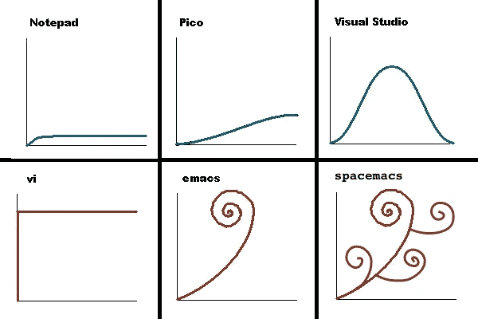

# 你应该学习 Vim 的 6 个理由

> 原文：<https://medium.com/hackernoon/why-you-should-learn-vim-8085cfab1c7f>

[Source](https://www.flickr.com/photos/peronimo/16527803010/in/photolist-rbvj1S-6VUNoH-7YUS2e-ag2BSZ-pFaAN8-8JJvWG-9D3mpN-nA7FdQ-g1EVG-5eD6jB-9D6E2o-2X39ED-85TD5Q-9D6Ew1-eL9dx6-FB2cQ-ChSyqf-7osCsp-4ME9e2-e8uBT3-cKS4nJ-js3tS-BJuPX4-2uB8UY-f9t16z-qEexfj-8Tpdne-qEnfN2-4w8xS9-5BTPDv-7osCsg-4GkToh-eyJgZj-7tM1i5-q9uiq3-e7Za33-6DiSpR-pogxp-8TfqUF-85Qt8F-9Y49BX-bwywQW-7YNGVJ-n5R6BV-7YV16g-ct5T3Q-47vbfe-7YYehh-fjRUoC-7nHZuU) of the photo

# 1 —速度快，重量轻

[Vim](https://hackernoon.com/tagged/vim) 是[最轻的](https://hackernoon.com/tagged/lightest)文本编辑器之一，它可以在任何*nix 终端上运行。我同意你，我们真的不在乎启动时间，我们也不在乎它在硬盘上占用的空间。
但是[轻巧](https://hackernoon.com/tagged/lightweight)也意味着它可以在任何地方运行。在你的开发机器上，在你的服务器上，在你的 raspberry Pi 上，等等…这是一个巨大的优势，同样的代码/浏览日志/配置网络服务器的环境。你只需要一个终端(通过或不通过 ssh)你克隆几个*点文件*你就大功告成了！

# 2 —它无处不在

Vim 是过去 40 年来最流行的文本编辑器之一，所以它已经在各地实现。你的 IDE 可能嵌入了“Vim 模式”，你也可以在搜索引擎中使用 Vim 快捷方式，Emacs 中甚至有 Vim 模式！…因为围绕 Vim 的社区非常庞大，一旦你知道了 Vim 是如何工作的，你就可以将所有基于计算机的工作移植到它上面。

# 3 —符合人体工程学

是的，它无处不在，但这有什么意义呢？
我的主要回答大概是人体工程学。作为一名程序员，我每天花 10 个小时用手指敲键盘。而且，年复一年，你必须有一些好习惯，否则会有伤害！
Vim 一直认为要把手指放在中间一排( *asdfghjkl* )。(几乎)没有 Ctrl + …或者 Alt + …。一键一个动作，尽量少组合。
好吧，这有点难学，要记住十几个快捷键，但是一旦你知道了它们，就很难再回到 Ctrl + whatever 的世界了！

# 4 —它是模态的

等等，如果你在键盘上打字，你怎么能把键盘上的键当作快捷键呢？它被称为“模态编辑器”，这意味着如果你处于*插入*模式或*正常*模式，你的键盘不会以同样的方式工作。让我解释一下这一点。在插入模式下，你的键盘是“正常的”你输入它写。但是如果你退出插入模式(通过键入 *Esc* )，那么你就不能再写下任何东西，但是你可以与光标下的文本进行交互。
w 会将光标移动到下一个世界，r 会将字母替换为下一个你输入的字母，u 会取消上一次编辑等……
这是因为这种“模态”范式，你可以找到很多关于逃避 vim 的笑话。

是的，这很难学——你必须 10 次抄 10 条捷径——但是它非常强大

# 5 —它是现代的、多语言的

Vim 首先是一种处理/编写文本的真正强大的方法。但是它也很强大，它基本上可以做你在最新的文本编辑器(Atom，Sublime)上能找到的任何功能。其中很多是原生的——着色、标签、分割、拼写检查
,但是作为一个老的开源项目，也有很多社区制作的插件。每一种语言都有自己的 Vim 社区和插件，可以处理代码、验证语法、编译代码等等！你甚至可以在 Vim 中做比文本编辑器更多的事情，它支持本地 ssh 隧道、嵌入式终端等

# 6—它是免费的(就像在《自由》中一样)

最后，Vim 是一个开源项目。这意味着您可以扩展它，创建新的组件，共享它，并帮助构建更好的 Vim！因为，这个神奇软件的每一部分都是由社区构建的，几十年来，许多人都在努力创造更好的文本编辑器，为什么不使用它呢？