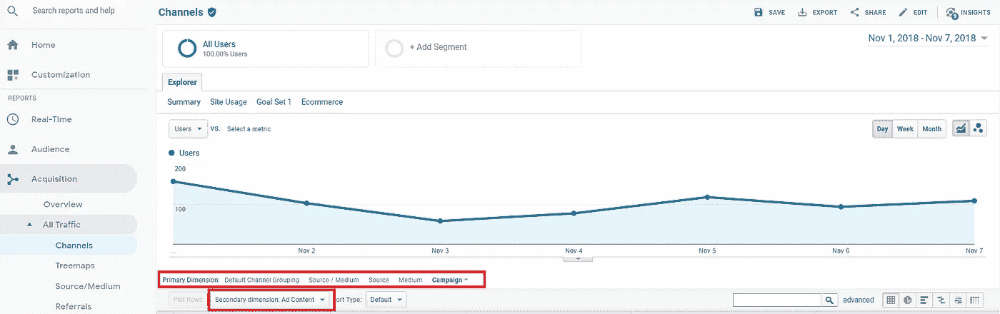
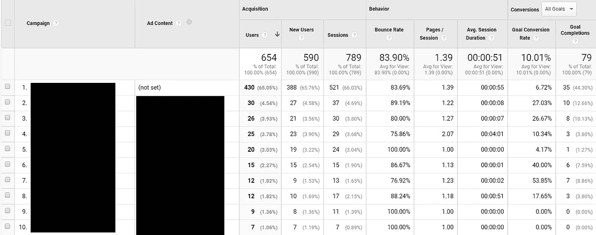
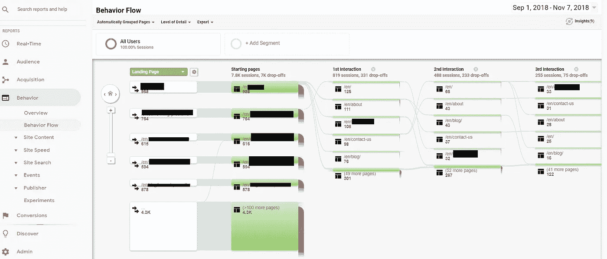
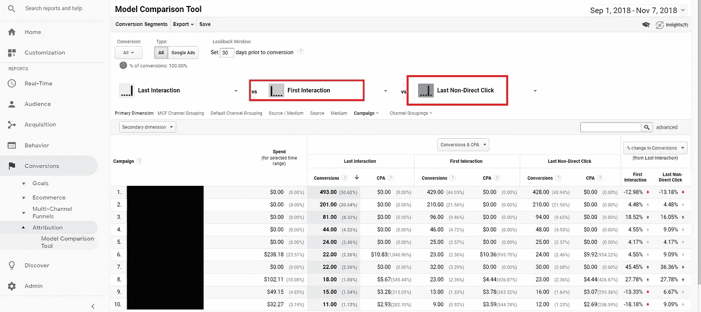

# 为什么你在花一美元做广告之前应该掌握分析

> 原文：<https://medium.com/hackernoon/why-you-should-master-analytics-before-you-spend-a-dollar-on-ads-4f67c8d88594>

## 和谷歌分析速成班

“person holding pen” by [rawpixel](https://unsplash.com/@rawpixel?utm_source=medium&utm_medium=referral) on [Unsplash](https://unsplash.com?utm_source=medium&utm_medium=referral)

我不是一个喜欢数字的人。

在我高中的第三年，我几乎(或许应该)数学不及格。

我没有上微积分，我在不完全基础但仍是入门级的代数课上遇到了对手。

然而，作为一名数字营销人员，我不仅与数字打交道，我还依赖它们每天拯救我。

当我试图提高广告活动的效果，延长广告费用时，数字是我最大的盟友。

只要看一眼数据，就能完全消除猜测，否则这将是一项费时费力的挑战。

我们应该在哪个领域测试新的地方级活动？

数据有答案。(无论你是想提高已经工作的效率，还是试图弥补没有工作的效率。)

当然，你更喜欢广告 X，但是哪个实际上卖得更多&应该被推向全国范围的运动？

数据有答案。

新的 t 恤图案应该印成什么颜色？

数据有答案。

有时候，仅仅是我，一个人，看着这些数据，就能让活动绩效提高 2-300%。

没有数据，达到相同的性能水平总是需要更长的时间和更多的成本..如果真的发生了。

即使有一个才华横溢的营销专业团队。(虽然如果他们真的有才华，他们会坚持追踪结果。)

即使你还没有开始网上广告，你开始跟踪和测试，你可以在你犯错误之前抓住你自己，在你认为有效但实际上无效的宣传活动之后，几周、几个月甚至几年内损失数千美元。

你将能够根据实际用户的真实反馈，实时修正路线，更快更便宜地到达你想去的地方。

最棒的是，这个星球上最强大的分析工具之一是 100%免费的。(当然，除了那些讨厌的数据。)

## 谷歌分析速成班

下面的教程和操作指南将向你展示谷歌分析的重要部分是如何工作的，或者如何设置谷歌分析的关键元素。

(如果你想要一个如何使用谷歌替代品的指南，请留下你的评论。如果我得到一些，我会写一个。)

*   [如何在你的网站上安装谷歌分析代码。](https://support.google.com/analytics/answer/1008080?hl=en)(WordPress 的[替代品](https://www.youtube.com/watch?v=mXcQ7rVn3ro)/[Shopify 的](https://help.shopify.com/en/manual/reports-and-analytics/google-analytics/google-analytics-setup)替代品)
*   [如何设置目标/转换点](https://www.monsterinsights.com/how-to-create-a-goal-in-google-analytics-to-track-conversions/)
*   [UTM 参数:它们是什么&如何使用它们](http://blog.rafflecopter.com/2014/04/utm-parameters-best-practices/)
*   [如何将谷歌广告与 GA 同步](https://www.youtube.com/watch?v=IQ1sDbeJ9ds)(重要提示:如果您将谷歌广告帐户与 GA 帐户连接，则无需设置谷歌广告活动的参数。)
*   (如果你是电脑通；大部分内容可以在[谷歌分析](https://www.youtube.com/watch?v=lZf3YYkIg8w)视频中快速总结

要深入了解整个过程，您也可以参加 [Google 官方免费的 GA 课程。](https://analytics.google.com/analytics/academy/)

## 确保您获得最大价值数据的简短清单:

1.  在花一美元做广告之前，一定要建立转换跟踪(那很有效)。
2.  确保您正确设置 UTM 参数，以准确跟踪流量来源及其质量/结果。确保您分别为每个活动和广告更改 UTM 活动和 UTM 内容。(如果您将 Google ads 帐户与 GA 关联，则不需要用于 Google Ads 活动。)
3.  不要盲目地做广告，测试你对产品和业务的假设和理论。(向男性推销一种产品，但认为它可能会在某个地区受到女性的欢迎？测试一下。以为自己的销售大部分来自某个平台？测试一下。感觉某个州可能很适合你的产品？测试一下。)

## 如何理解数据——3 个简单的视图将成为你最好的朋友

现在你已经开始收集这些数据，你如何理解它呢？

你怎么能让它指导你未来做出更好的营销决策？

您应该从使用以下 3 个视图开始。

**通过活动获取&广告内容维度。**

转到获取>所有流量>渠道，选择活动作为主要维度，然后(可选)选择广告内容作为第二个维度。

这给了你下面的分解。

你应该注意的最重要的事情是目标转化率和总体目标完成情况。

除此之外，跳出率，平均。在你真正开始销售之前，会话持续时间&页面/会话可以是流量质量的良好指标(也就是一个可能有效的广告)。

最好的事情是，为了获得相同的关于登陆页面的见解，你需要做的就是改变登陆页面的主要维度，瞧。

(如果你使用谷歌广告，你应该依靠谷歌广告，类似的结果，但也包括广告支出和利润的统计数据。)

想知道人们从哪里离开你的网站？行为流程

如果你想知道人们通过各种活动进入你的网站后会离开你的网站，你可以去行为>行为流。

在那里你可以看到你的访问者最常用的路径，包括他们最常离开的页面。

如果你有一个退出率非常高的页面，考虑实施一个退出调查，或者简单地改进页面的设计/UX 来降低它。

**怀疑一场运动是否值得？比较归因模型。**

如果你不确定一个活动是否值得，你应该用不同的归因模型来检查这些数字。

默认情况下，Google Analytics 根据转换前的“最后一次点击”对转换进行积分..即使用户最初点击了一个广告，几天后再搜索谷歌回来购买。

我喜欢把最后一次交互和第一次交互&最后一次非直接点击进行比较。

对于需要更长时间(更大的购买量)的渠道，你经常会看到第一次互动的转化率大幅上升。

## 当你不能使用标准的 AnalyticsーGo 老学校。

在某些情况下，您可能无法使用 GA 全程跟踪转换。

例如，如果你不自己处理订单(像亚马逊 FBA)，你可能无法安装谷歌分析代码和转换动作。

在这种情况下，如果你决定尝试一个新的广告平台，你需要用老方法:

*   测试销售稳定的产品，并测量前后的差异
*   基于地区/城市的测试(例如，脸书广告在一个州，谷歌广告在另一个州，检查来自每个地区的订单以衡量 roa。)

去守旧派还是比只是盲目的开始大规模的竞选，抱最好的希望强很多。

从小处着手，进行测试，审查数据，然后在达到有利可图的 ROAS 时进行扩展。

## 还在迷茫？想要更多吗？

你还在迷茫还是想要更多？你应该[加入我的电子邮件简讯。](https://ragnarmiljeteig.com/join-the-newsletter/)您不仅可以第一时间获得更深入的营销内容，还可以全面了解 AMA 的数字营销。