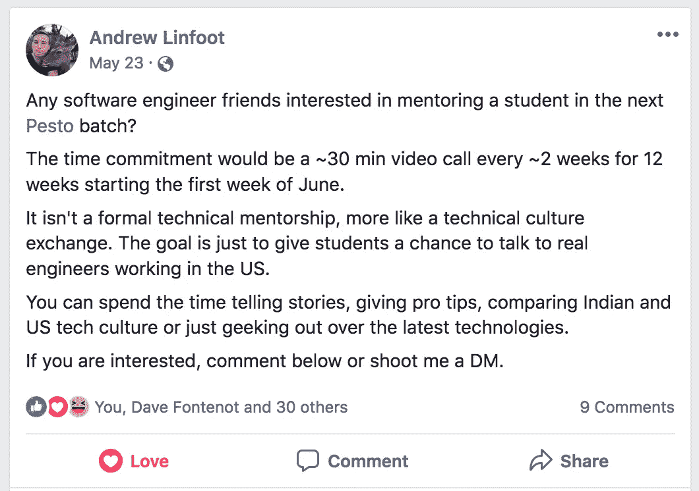
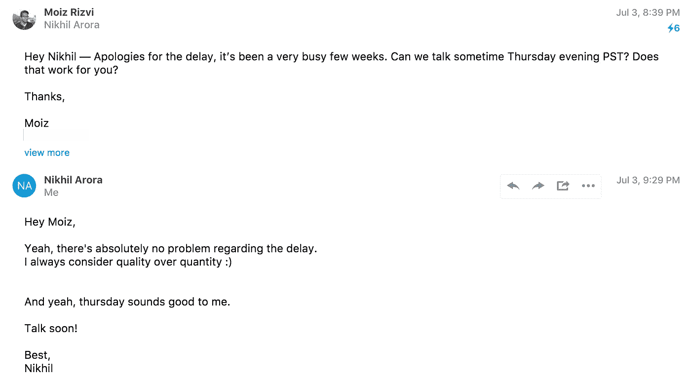

# 为什么您应该指导初级开发人员

> 原文：<https://medium.com/hackernoon/why-you-should-mentor-a-junior-developer-d6c51ab95c75>

## 老师也应该是学习者。

Even that coach probably learned something from teaching that boxer

## 一些背景

今年夏天，我看到了我的朋友 Andrew 发来的脸书邮报:

I messaged him pretty much immediately.

我最初的想法是“我喜欢导师项目，我自己在奥斯汀启动了一个导师项目[无耻的]橙色代码插件]。”

> 但我没有意识到指导一名 Pesto 学生的经历会如何影响我对科技和世界现状的看法。

作为背景介绍，Andrew 在[创立了 Pesto，他个人的旅程](https://hackernoon.com/how-a-kid-from-san-francisco-ended-up-starting-a-school-in-india-a868606a6f0c)根植于学习的精神。

本着自己学习的精神，我已经同意成为 Pesto 第一批学生的“硅谷专业开发者”导师。

我出生在巴基斯坦的卡拉奇。我有机会多次回去，但从未去过印度。(成为香蒜酱导师的一个潜在好处是，也许有一天我可以去印度参加婚礼。)

尽管如此，我始终坚信，如果我没有那么幸运地拥有我的父母，如果我们没有搬到加拿大并最终搬到美国，那么我今天仍然会在卡拉奇。今天我不太可能有机会写这篇文章。我不可能有今天的成就。

所以在某种程度上，我一直觉得我有责任回到我来的地方。(印度和巴基斯坦曾经是一个国家，即使它们不是，我也会有类似的被迫感。)

对于那些无法理解的人，简单地说:

> 如果你认为你的出生地是完全随机的，你有多大可能会喜欢你现在的生活？

这是我不断问自己的一个问题。

如果我是别人的孩子我会怎么活？这是一个沉重的问题。但作为任何一种利他主义者，这是一个值得深思的问题，不管这有多不舒服。

## 体验

在参加导师计划后不久，我就被分配给了我的学员。和任何新的经历一样，我不确定会发生什么。我想对别人的生活产生影响，无论是职业上还是个人方面，但我甚至不确定我能提供多少。这可能是我长期以来的骗子综合症的一个症状，因为我的职业生涯的证据将证明，我可以为一个刚刚开始职业生涯的初级开发人员提供很多东西。

我的学员 Nikhil 是通过电子邮件介绍给我的，我们很快安排了一次介绍电话。诚然，尽管我计划通过搜索 Nikhil 过去的职业历史和项目来提前进行尽职调查，但我最终没有抽出时间这样做。然而，这不是问题。Nikhil 非常兴奋能有机会与美国一位经验丰富的开发人员交谈。

同样，我已经为有机会成为导师而兴奋不已。所以这很合适。但是程序中需要做什么的细节起初看起来是自由的和流动的。这令人望而生畏，但幸运的是，我作为创始人的经历让我为手头的任务做好了准备。在这个项目的早期，我意识到一个简单的指导原则:

> 指导某人类似于管理某人。在管理中，你公司的收入是你的底线。在导师项目中，共同的个人成长是你的底线。

第一个电话是简单的介绍。我向 Nikhil 概述了我迄今为止的职业经历，他也为我做了同样的事情。根据我过去的经验，我与我的学员关系越好，我就越能成功地对他们产生影响。所以我试着去理解 Nikhil。这并不困难，因为在我们的职业生涯中，我们都有创业的愿望，并且意识到，为了达到我们想要的目标，我们需要攀登经验的阶梯。

在整个导师项目中，我以富有成效和有益的方式向他讲述了我过去的发展经历。最初，我想尊重老师们打算让 Nikhil 在编码实践和框架方面学习的东西，但我很快意识到他渴望更多的知识和经验。

在整个项目过程中，我对 Nikhil 在电子邮件中的专业反应负责。每周，不管我们是否计划好了电话，他都会发邮件来确认后续会议的安排。他甚至主动为我们将要举行的下一次会议制定了议程。不用说，我被彻底打动了。

首先，我会在一般意义上从技术上提出建议。然而，在项目的后期，我决定共享我们正在开发的代码库是了解彼此工作和编码风格的最好方式。这成了每次通话的标准，因为我们会检查彼此的进度，并准备好演示。

我们以大约两周一次的频率进行了近一个小时的通话。当我在某周没有时间或者我们不得不重新安排一个计划好的电话时，Nikhil 总是会跟进。在某个特定的星期，我完全忘记了几天前我们应该有的一个电话。我感到内疚；Nikhil 非常理解:

随着项目的进行，每次会议的自由形式的流动性变得更加结构化和富有成效。我们有时会结对编程。我给了他关于 npm 包、UI 工具包、React 组件策略、样式方法的建议，以及更多关于如何成为一名更好的开发人员的建议。然而，它并不完全僵硬和正式。我们聊了聊硅谷文化、科技的未来以及我们的日常生活。一点都不无聊。

在项目结束时，Nikhil 向我演示了他的最终项目，作为一名产品工程师，我对他的成长和进步感到震惊。他不仅利用了我提供的每一点建议，还创造了一个对任何远程员工都有帮助的工具，名为 [The Remotants](https://github.com/pesto-students/project-the-remotants-frontend) 。我真的为他能在如此短的时间内完成而感到骄傲。虽然他给了我很多荣誉，但他学习和成长的意愿仍然是他自己的。

## 它如何塑造了我

在项目结束时，当我回头看 Nikhil 提出的有见地的问题以及我想如何彻底地回答这些问题时，我意识到作为一名开发人员和导师，我提高了多少。我开始深入研究我推荐的框架。Pesto 教授他们学生的技术实践，有时超出了我在自己的工作中费心学习和运用的范围。例如，我决定是时候认真深入地理解 Webpack 的复杂性了，而不是完全依赖 create-react-app 来为我进行配置。我决定是时候在设计产品原型时进一步发挥我的 UI 创造力了。总的来说，我认为我需要名副其实地成为一名 Pesto 导师。

在很多时候，我意识到我们对软件开发的观点完全一致。我们为 React 应用程序使用了相同的 PrivateRoute 包装组件。我们认为 [antd](https://ant.design/) 是启动新项目的一个非常有用的 UI 套件。我们利用了类似的数据获取机制和错误处理。但是我从指导初级开发人员中学到的最重要的一课不是技术性的。

在许多方面，看到一个我负有部分责任的初级开发人员的个人成长帮助我认识到，我在职业生涯中学到了很多我没有主动意识到的东西。

> 我发现自己是一个比我想象的更好的开发者和管理者。我的冒名顶替综合症开始缓解。

我一直认为自己是一个可靠的开发人员，但从来没有一个人能够提供我最终意识到自己有能力提供的指导水平。Nikhil 向我表达的感激之情会让在早期创业公司工作并从头开始开发产品的疲惫日子变得更加美好。Nikhil 也在做着同样的事情，但是他学习和成长的态度和激情是有感染力的。我变得渴望学习比我已经知道的更多的东西。我变得渴望变得更好，不仅是为了自己，也是为了别人。教学一直是我的激情所在。学习，一种通常在一个人从学校毕业后终止的渴望，变成了一种重新获得的激情。对此我非常感激。

我也开始意识到我是多么幸运，仅仅因为我在美国的地理位置，我就获得了四处学习和成长的机会。我意识到，就选择和支持而言，并不是每个人都像我一样幸运。

> 尽管我在职业生涯中努力寻找机会，但我意识到我在科技界的地位仍然是全世界范围内的特权之一。

特权伴随着责任。指导和教导下一代开发人员对我来说很重要，我计划继续下去。这样做的时候，我觉得我好像在履行我的一个重要职责。

这个过程对个人来说总是有益的。终身教学是通向终身学习的最简单的途径。

## 为什么是导师？

指导初级开发人员不仅仅是减轻你对自己特权的良知的一种方式。指导下一代是一种了解你如何融入一个比你更大的世界的方式。这是学习新思想和重新评估长期信念的一种方式。

作为成熟的开发人员，我们对技术的想法通常是通过我们阅读的文章、与我们一起工作的同事以及我们精心筛选的文档在一个持续的过程中形成的。但是不管你是有 20 年的经验还是只有几年，当你和那些经历了和你今天一样的过程的人交往时，你经常会想起学习令人兴奋的时候。你可以将这种兴奋带入你的职业甚至个人生活。

> 从你的学员那里学习的兴奋感反过来会重新激发你学习的兴奋感。

指导初级开发人员会让你成为更好的开发人员。这将有助于你了解将来某一天你可能管理的开发人员的观点。它会让你具备作为创始人所需的耐心、理解和同情心。在许多层面上，你的个人成长将远远超出你的职业生涯。