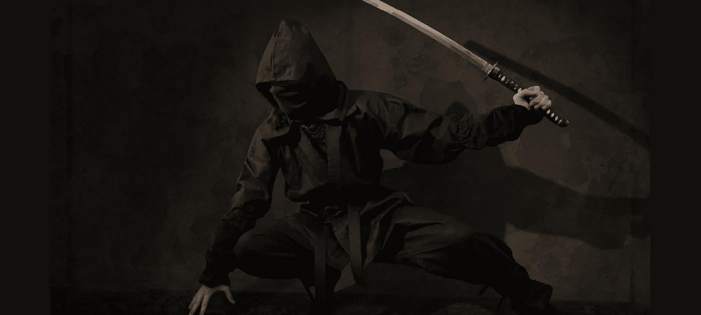

# 为什么你永远不应该是一个秘密模式的启动

> 原文：<https://medium.com/hackernoon/why-you-should-never-be-a-stealth-mode-startup-71bb019c6ac6>

## 任何建议你成为其中一员的人，与他们断绝关系！



Sure, be a ninja, but in the swiftness, the agility and precision of things. Not in your propensity to stay hidden in the shadows. ([Credit](https://pixabay.com/en/ninja-warrior-japan-assassin-sword-2007576/))

```
[**Originally published on Quora**](https://www.quora.com/What-are-the-advantages-and-disadvantages-of-being-in-stealth-mode-as-a-start-up-versus-being-more-open-and-public/answer/Abhishek-Anand-1)Reproduced for HackerNoon. Some minor edits for improved readability.**The original question on Quora:**
What are the advantages and disadvantages of being in stealth mode as a start-up versus being more open and public?
```