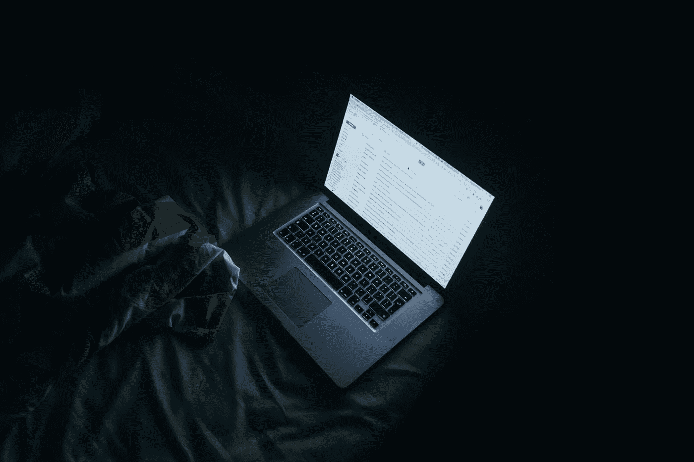
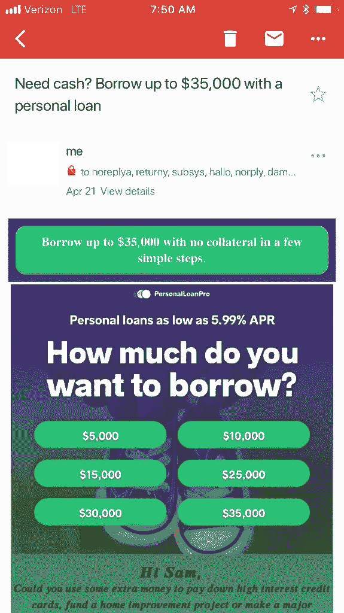
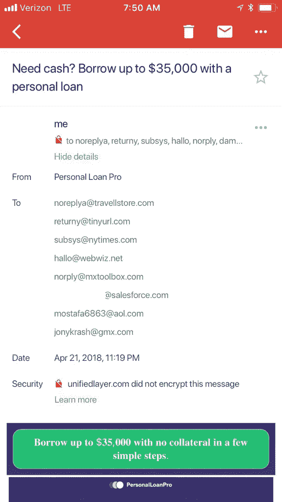
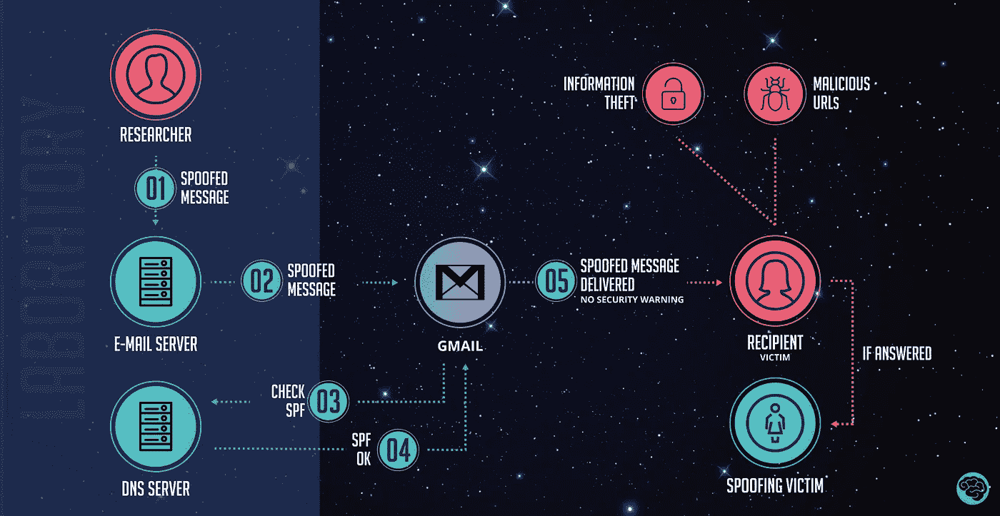
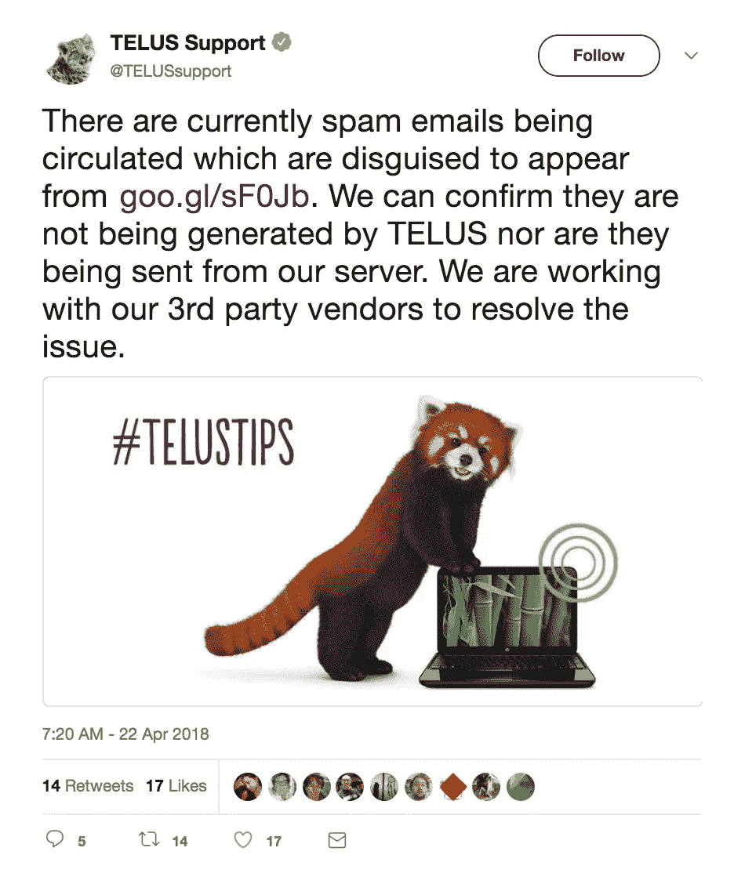

# 为什么你认为你的 Gmail 账户被黑了

> 原文：<https://medium.com/hackernoon/why-you-think-your-gmail-account-was-hacked-645e4d72845e>

周六早上，我醒来发现我的 gmail 账户收件箱里有一些看起来像垃圾邮件的邮件……是我发的。只是，这些我都没寄过。

起初我以为有人给我发垃圾邮件，只是把发件人的名字设置为“我”，但知道 Gmail 在过滤来自未知电子邮件地址的垃圾邮件方面做得非常好，我决定调查一下。

在这个过程中，我发现这种情况已经发生在数百个(如果不是更多)其他人的 Gmail 账户上。

*(旁注:如果你对生产力、技术和产品话题感兴趣，* [*在 Twitter 上关注我*](https://twitter.com/carmenhchung) *，我会以简单有趣的方式发布这些话题。我也刚刚开始了一个小小的时事通讯，谈论所有关于科技的事情，你可以在这里订阅***。)**

**

***人格分裂垃圾邮件发送者***

*你瞧，当我点击发件人查看更多详情时， ***我的*** 电子邮件出现了。更令人担忧的是，这些垃圾邮件实际上也出现在我的“已发送邮件”文件夹中，这表明我确实从我的电子邮件帐户中发送了这些邮件。*

*除非我有某种人格分裂，我的一个角色在半夜起床给自己发垃圾邮件(即使对我来说也很牵强)，否则我的 Gmail 账户似乎被黑了。*

**

*Sample image of the spam email (not mine).*

*自然，我做的第一件事是检查我的谷歌账户是否有任何可疑活动，比如有人从新设备登录(它没有)，但为了安全起见，我重置了密码，并注销了所有设备。然后我把这些邮件标记为垃圾邮件(这让我很担心，因为这可能意味着我以后再也收不到我发给自己的邮件了)，然后上床睡觉。*

*第二天早上，我醒来发现完全相同的事情又发生了。我收到的电子邮件通常围绕着加密货币诈骗、减肥诈骗和金融贷款诈骗——所有这些都是我发来的。*

*我进一步研究了一下，发现有一堆虚假的电子邮件地址收件人(比如我的全名@salesforce.com，我很确定这不是一封真实的电子邮件，还有其他虚假的电子邮件，比如 norply@mxtoolbox.com)，发件人肯定是我的 Gmail 帐户……**，只是在发件人的末尾加了“via Telus”几个字。**此外，在邮件的安全标签下，Gmail 警告说这封邮件没有加密——这一信息通常不会出现在我自己发送的邮件中。*

**

*Sample image of the spam email (again — not mine).*

*说出真相*

*周一去办公室的时候，我问我们的工程负责人，他有没有遇到同样的事情。给他看了邮件后，他解释说，事情的经过是我的邮件被欺骗了，而不是被黑客攻击了，这要感谢一家名叫 Telus 的加拿大电信公司。*

*长话短说，Telus 似乎允许所有 IP 地址发送欺骗邮件，就好像它们来自其服务器一样。结果，黑客可以让电子邮件看起来像是从 Telus 服务器发出的，但在邮件标题内部，把发件人改成了我的 Gmail 地址。当 Gmail 服务器被告知我的收件箱收到了一封电子邮件(列出了其他收件人，可能会使电子邮件看起来更真实，尽管电子邮件地址看起来很明显是假的)时，它查询 Telus 的域名 DNS 服务器，以查看发送该电子邮件的电子邮件服务器是否被允许代表它发送邮件(由于 Telus 的设置，回答是肯定的)…然后将邮件直接发送到我的收件箱。点击[此处](https://lifehacker.com/how-spammers-spoof-your-email-address-and-how-to-prote-1579478914/amp)获得更深入的解释。*

**

*Image source: [here](https://www.linkedin.com/pulse/aware-sender-spoofing-amongst-gmail-users-renato-marinho/?irgwc=1).*

*在收到一封显示*似乎是由我发送的*邮件时，Gmail 自动在我的已发送邮件中归档了一份副本——这就是为什么它们也会出现在那里。*

*这种欺骗 Gmail 服务器的能力显然是去年一名研究人员向谷歌提出的——但该公司回应称，因为它“没有实质性影响谷歌用户数据的保密性或完整性”，所以不会采取任何行动。*

*然而，这一最新事件在网上引起了轩然大波，**数百名 Gmail 用户在众多帖子上发帖讨论这个问题**——包括那些已经实施了高级安全设置和双因素认证的用户(这表明这不是一个[黑客攻击](https://hackernoon.com/tagged/hacking)问题)。*

*最初的报道表明，Telus 否认与该问题有任何关系，并表示这是谷歌的问题——但这一立场很快被放弃，到周一晚上，问题已经得到解决。*

**

***停止恶搞***

*为了判断一封看起来来自合法来源的电子邮件(比如你自己的 Gmail 帐户！)是一封[欺骗](https://hackernoon.com/tagged/spoof)的电子邮件，请始终检查发件人标签上是否有类似“via [xx]”的泄密标志，还要检查安全标签以查看电子邮件是否被加密。*

*如果你想更加小心，在 Gmail 中打开邮件，点击右上角的下拉菜单箭头，选择“显示原件”。这将打开邮件头，您可以搜索返回路径来查看谁是邮件的实际发件人。*

*像往常一样，不要点击邮件本身的任何内容——事实上，我很快就把这些邮件报告为垃圾邮件，并在 Gmail 中清空了它们。最后，考虑启用双因素身份验证(使用强密码)，并监控您的帐户是否有可疑活动。*

> *对于如何识别恶搞邮件，你有什么建议或窍门吗？在下面留言评论或者拍我推文([*@ Carmen chung*](https://twitter.com/carmenhchung)*)！**