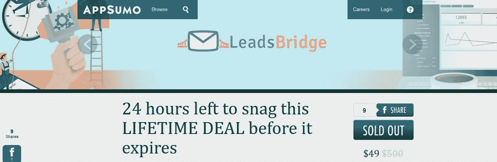
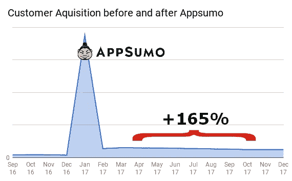
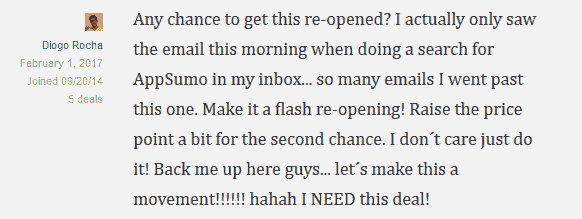
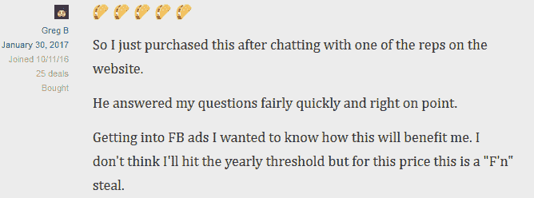

# 为什么你想成为 AppSumo 的主角(即使有风险)

> 原文：<https://medium.com/hackernoon/why-you-want-to-be-featured-on-appsumo-even-if-its-risky-f6b60c8c0ab1>

在创业的最初几个月，你需要做出许多“生死攸关”的选择。

每一个选择都可以引导你的创业公司进入下一个发展阶段，也可以导致不良后果，并很快将其摧毁。

事情是… **清晰不是一个选项**。您做出的大多数选择，您并不真正知道它们将如何影响项目的健康发展。你唯一能做的就是计算风险，做决定，处理后果。

这是一个选择在 Appsumo 上出现的故事，以及它如何改变了我们的旅程。

## **太小而不能成功**👶

在我们推出 [LeadsBridge](http://leadsbridge.io/2yiAiMf) 几个月后，这项业务已经产生了可观的销售额，并得到了客户的积极反馈。数字很清楚:由于这个想法得到了市场的认可，我们希望在我们的资产上投入更多，以开始将我们的业务提升到一个新的水平。

但是我们有一个问题。

即使我们的软件运行良好，我们的客户也很满意… **仍然很少有人知道它。**

我们完全缺乏知名度，这阻碍了我们的发展。

如果一些公司“太大而不能倒”，我们就太小而不能成功。

如果我们有很多钱投资，在这一点上，我们会简单地开始向我们的目标受众大规模宣传我们的服务。但是你可以想象，事实并非如此。

由于没有大量的营销活动预算，我们需要找到另一种(更聪明的)增长方式。因此，我们开始寻找可靠的可见性来源:一个平台或网站，可以让我们接触到成千上万的目标电子邮件订户和潜在客户。

就在那时，我们发现了相扑。

## **怎么回事？**🤝🏻

如果你不熟悉它，我会给你一点背景知识。

Appsumo 是一个日常交易网站，由最杰出的企业家之一诺亚·卡根创建。在此之前，诺亚曾为几家大公司(包括脸书)工作，并共同创立了 Gambit，这是一个非常成功的社交游戏支付引擎。

2010 年 3 月左右，他决定推出 Appsumo，其理念是帮助企业大规模分发他们的网络应用程序，同时帮助专业人士在业务上取得成功。

最初，这只是一个兼职项目，在环游世界期间每月赚 5000 美元。他通过在 Reddit 上发布广告交易开始了[，仅仅一年半后就管理着一家 7 位数的企业。](https://tim.blog/2011/09/24/how-to-create-a-million-dollar-business-this-weekend-examples-appsumo-mint-chihuahuas/)

今天，AppSumo 在[发展得更加成功](https://okdork.com/what-i-learned-growing-an-8-figure-business/)，它受到了许多个人、初创公司和已建立企业的欢迎，他们被吸引到它这里来发展自己的事业。

该平台上提供的交易专注于技术世界和创业社区，范围从软件应用程序到营销工具，再到学习课程，以改善开发人员、中小企业所有者、营销人员和其他任何人的工作流程、生产力和产出。

提供的交易对用户非常有利:他们通常保证一次性购买 39 美元或 49 美元的产品或服务，并每月通过电子邮件发送给 750，000 多名专业人士。

这个数字特别诱人，不仅因为它代表的金额，还因为——由过去的商业经验塑造的[——诺亚和 Appsumo 团队付出了额外的努力，通过关注与订户的关系而不是交易本身来扩大名单。](https://okdork.com/what-i-learned-about-email-marketing-after-losing-135000-a-day/)

事实上，除了是一个交易网站，Appsumo 也是一个充满活力的社区——被称为“sumo-lings”——他们积极参与平台上和私人脸书小组上提供的每笔交易。

这种高度曝光的受众是优质(但仍处于地下)数字产品获得知名度和新客户的巨大机会。

考虑到我们一年前的处境，这正是我们一直在寻找的机会。

所以我们跳上了 Appsumo 列车，以 49 美元/年的价格(几乎比原价低了 90%)提供了终身访问 [LeadsBridge Hero 订阅计划](http://leadsbridge.io/2AUXP7w)的机会。

Our deal on Appsumo.

事情进行得怎么样？

**很好**。

让我们来谈谈数字，并探讨一下为什么你也想成为 Appsumo 的一员。

## **为什么是**💪

让我们弄清楚一件事:如果你期待非凡的短期收入，那就忘了它吧，因为这不是 Appsumo 的真正目的。

事实上，为了适应他们的销售模式，并在很短的时间内达成数千笔交易，你的报价必须*非常*有优势。考虑到数字分销商品的生产成本极低，这并不是什么大不了的事情。但考虑到你还需要与 Appsumo 分享你销售额的很大一部分，很明显最终的净利润不会很大。

那么什么是真正的*交易呢？🤔*

根据我们的经验，根据不同的变量，这种交易可以产生从最低 500 到最高 45000 的销售额。

短短两周内获得的新客户数量惊人。

成千上万的新客户意味着数百条关于产品的新反馈，数百个改进产品的新想法，以及通过社区中的口碑传播提升品牌知名度。如果你还考虑到在 Appsumo [上推出的公司的平均客户保留率达到了 80-85%](https://therisetothetop.com/interviews-guests/noah-kagan-appsumo-interview/)，**这对于一个企业来说是真正的福音**。

但这还不是最精彩的部分，也不是你应该关注的。

事实上，一旦您的交易到期，真正的衡量标准是客户获得量的增长。发布会产生的销售和知名度长尾效应会持续相当长的时间，直到最终消失。对我们来说，它持续了大约 10 个月，我们的每月客户获取增长率增加了+165% 。

这是真正的交易。

这就是*真正帮助我们将业务提升到一个新水平的原因。*

> 从长远来看，这笔交易得到了回报，我们通过它给我们的业务带来的疯狂牵引力收获了它的果实。

听起来*很神奇*对吧？

那么，科技领域的任何初创公司难道不应该尽快登陆 Appsumo 吗？？

良好的..没那么快。

在你这么做之前，重要的是要考虑在 Appsumo 上出现的风险。

## **风险**🚩

这一战略决策的不利之处在于，将你的品牌定位为“低成本”。

当你以如此大的折扣价格提供你的产品或服务时，人们可能会忘记它的真正价值。

Appsumo 的人对此非常公平公开。事实上，是他们告诉你不要在太短的时间内太多次贬低你的产品，从而损害你的整个业务。

如果你试图通过过于频繁地推出 Appsumo 交易来获得好处，人们将不会再为它的实际市场价值付费，而是宁愿等待下一次报价。

我们有很多人通过聊天询问他们是否能以我们在 Appsumo 上销售的价格购买我们的产品，因为他们认为这不值它的实际市场价格。

例如，如果你想将自己定位为高端产品/服务，或者你的主要目标受众是企业，在 Appsumo 上展示你的产品可能是一把双刃剑，会损害你的品牌形象。但这同样适用于所有其他种类的产品。

为了避免任何可能的风险，你的提议必须是“一夜情”。

一旦你考虑到这一点，并且你仍然想加入 Appsumo，这就是如何准备你的发布。

## **准备发射**🚀

Appsumo 上新交易的推出是字面上的意思🔥🔥🔥。

它通常会在社区中引起很多关注，并为您的网站带来大量流量:

**你必须做好准备。**

在你的报价生效之前和之后，有三件重要的事情需要小心处理:

*   **✔的推出策略**

要做的最重要的事情之一是彻底计划你的投放策略。在这方面，Appsumo 团队对我们非常慷慨。在我们合作的整个过程中， [Olman J.](https://appsumo.com/profile/OlmanSumo/) 和团队的其他成员帮助我们计划发布日期、交易报价、销售文案以及其他各个方面。根据他们的见解调整我们的策略是我们交易成功的关键。

*   **客户支持** ✔

你必须让你的客户支持为几周的疯狂做好准备。如果可能的话，在交易进行期间，让更多的人参与进来是一个好主意。事先和你的团队成员一起做好准备，排练你的所有产品/服务特点，并尝试预测可能出现的疑问。如果在交易启动后，你设法妥善处理了涌入你网站的数百名访客的请求，他们会在交易线索上留下好的评论，而**你将创造大约 8 倍的销售额**。

*   **订婚** ✔

另一个需要注意的关键方面是，通过回答他们的问题、回应批评、提供关于您的产品功能的更新以及交付(如果可能的话)他们期望的集成或改进，出现在 sumo-ling 社区中。例如，在我们发布期间，许多用户问我们是否可以将 [Pipedrive](https://medium.com/u/d79fb25c8c80?source=post_page-----f6b60c8c0ab1--------------------------------) 和其他集成添加到[我们的平台](http://leadsbridge.io/2yiAiMf)中，我们按照他们的要求“现场”做了。对用户的要求表现出这种态度和迅速性对于产生更多的销售是绝对重要的。

现在，如果你做对了这三件事，你会做得很好，并把我上面提到的所有好处带回家。

## **结论**

总而言之，我们对 Appsumo 的体验是非凡的。🙌

在 14 天内，我们的客户群翻了一番，每月客户获取率翻了一倍多，改进了我们的产品，增加了我们的年收入。因此，我们设法通过雇用新人来扩大规模，从营销人员到开发人员，再到客户英雄，他们让我们得以扩大业务。

可以肯定地说，Appsumo 交易在 2017 年将 LeadsBridge 提升至 100 万美元的过程中发挥了重要作用。

这就是为什么，如果你是一家初创公司的创始人，提供很棒的产品或服务，但你需要大幅增加你的客户群，**我会建议你考虑使用 Appsumo 来遏制你的增长**。放聪明点，不要为了短期的结果而妥协你的长期战略。

为了下一个选择，为了我们冒险的下一个篇章。✌️

## 嘿！感谢您的阅读。如果你喜欢这个故事，给我们鼓掌！我们很感激。谢谢你。💜

