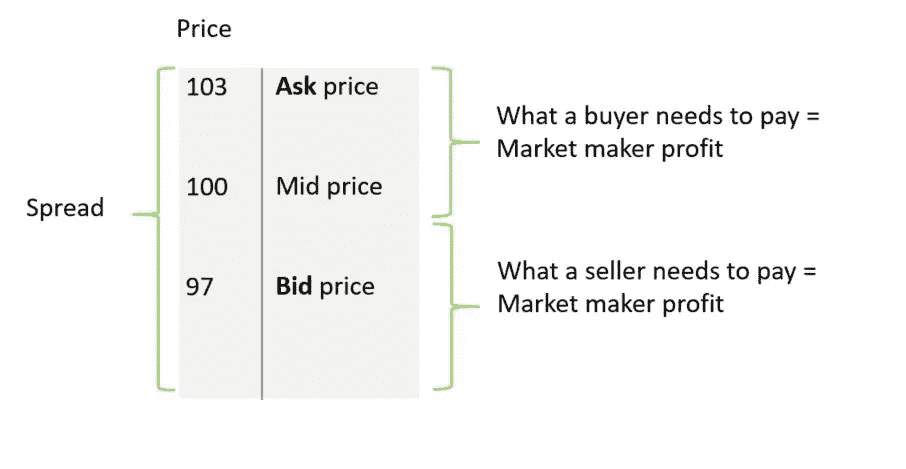
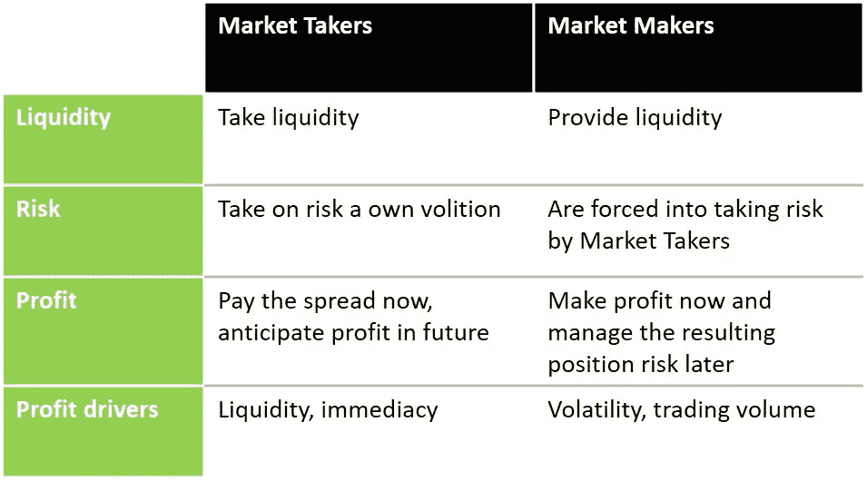
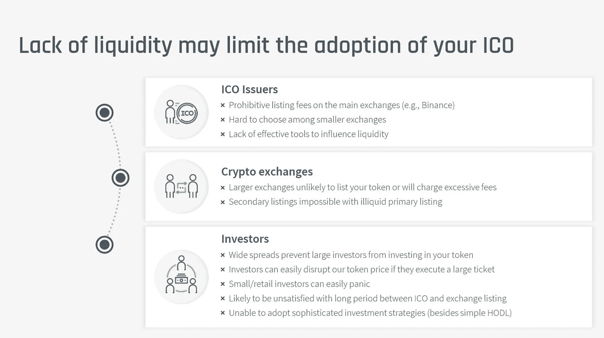
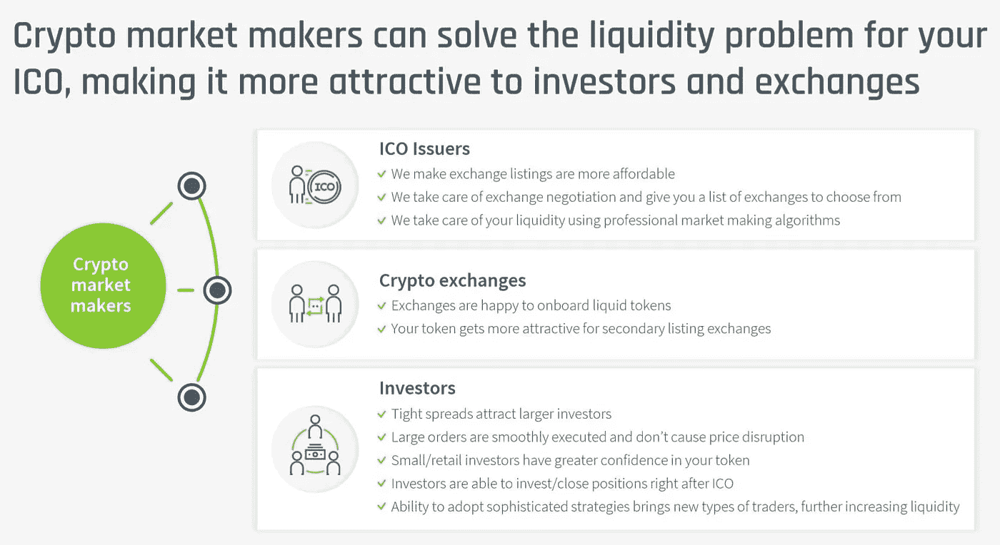

# 为什么你的 ICO 需要做市商

> 原文：<https://medium.com/hackernoon/why-your-ico-needs-a-market-maker-e42afd837b7a>

Market makers are professional market players who provide liquidity to the crypto market and help guide the “invisible hand” of the ICO economy

只有区块链才能实现的绝妙想法。检查。精心设计和精心编写的白皮书击中了投资者的痛处。检查。明星[密码](https://hackernoon.com/tagged/crypto)顾问团队。检查。一堆加密基金和家族办公室急切地等待你的预售开始。检查。加密交易所，愿意列出你的令牌一小部分币安的费用。检查。听起来你一切都做对了，你最大的问题是必须合理预算你将要筹集的这些 [ICO](https://hackernoon.com/tagged/ico) 百万资金。

然而，当你在你的代币上观察市场时，有些事情是不对的。你选择的那个伟大的交易所里没有交易发生，无论是谁开始从没有投资你的代币得到 FOMO，现在都被 10%的买卖差价吓跑了。更糟糕的是，你的早期投资者第一次试图卖出他的部分头寸时，他会导致价格暴跌 50%，这是由几个看着你的令牌的日内交易者下的一堆止损单帮助的。尽管价格缓慢反弹，但足够多的交易者被这一事件烧伤，使交易量几乎完全消失。你不断更新你的 Git 和电报频道，但是空气中有一种大批离去的感觉。你的 ICO 之旅似乎停止了，你不知道如何启动这个垂死的引擎。

好吧，可能有点太暗了。但我想说明的一点是，加密市场的流动性很重要，而且它将继续重要，直到你的令牌在比特币基地免费上市。在这之前，你需要考虑流动性，并意识到它与你的产品、团队和营销一样重要。

众所周知，大多数 ico 缺乏流动性。在加密领域不为人知的是，有经过时间考验的工具来创建它。这种情况不是加密市场独有的，而是大多数新的或“奇异”资产的基础。你在“传统”资本市场看不到流动性不足的原因是，有一个完整的行业可以解决这个问题。这叫做做市。

如果你正在计划一个 ICO，而你还没有一个做市计划，这篇文章是给你的。

# **谁是做市商**

在我们深入探讨 ICO 流动性问题以及做市商可能如何解决它之前，了解做市商的基础知识很重要。如果你不是交易者，很可能你只看到市场的一面——投资者、日内交易者、投机者。他们都被称为市场参与者。他们从市场上获取流动性。他们的目标是在交易后赚钱，不管是几分钟、几天还是几年。对市场参与者来说，有两件事很重要:

流动性，或者能够以尽可能低的价格执行他们想要的规模。

即时性，意味着能够尽可能快地执行交易。

市场接受者有意承担与其头寸相关的风险。他们购买或出售不同的金融工具，因为他们愿意承担相关的风险并预期未来的利润。

**做市商**在等式的另一边，他们是金融市场的“看不见的手”。无论你在买卖什么资产，你都有可能与其中一种资产进行交易。做市商提供流动性，通过收取市场[利差](https://www.investopedia.com/terms/s/spread.asp)来赚钱。差价是市场上买价和卖价之间的差额，或者仅仅是买价和卖价之间的差额，就像你在货币兑换亭兑换货币一样。区别在于兑换亭如何赚钱。同样，价差是做市商赚钱的方式。

Spread is the difference between the buying and selling price of a trading financial instrument. In this example, if you’d like to buy this asset, you’ll have to pay 103\. If you are selling this asset, you’ll get 97\. A market maker will get 6 as profit.

在有许多买方、卖方和做市商的流动性市场中，差价很小。做市商需要进行非常大量的交易才能获利。他们使用非常先进的定量算法来建立非常短期的头寸——可能是几小时、几分钟或几秒钟。资产波动性越高(即市场中有足够的波动)和交易量越高，做市商能够进行的交易就越多，他们获得的利润也就越多。

然而，做市并非没有风险。ICO 做市商根据外部市场参与者的突发奇想承担风险。他们最初盈利，但之后管理风险。如果屏幕上有偶数个买家和卖家，他们在当天结束时几乎没有风险，而没有卖家或恐慌性抛售的 FOMO 反弹对他们来说通常是一个挑战。

市场参与者的成本是做市商的主要收入来源。与许多其他业务一样，做市商面临着利润和交易量之间的权衡。和其他行业一样，如果利润率高，竞争就会出现。不幸的是，这也可能导致鸡生蛋还是蛋生鸡的局面，因为价差太大而没有交易量，做市商不愿意通过收紧价差来承担更多风险，直到他确认将有足够的交易量通过。在这种情况下，对产生流动性最感兴趣的各方(资产发行人和交易所)会激励做市商提供更好的价格。交易所通常通过降低或取消交易费用为做市商创造更有利的条件。对于资产发行者来说，在一定时期内支付货币津贴是激励提供流动性的最直接方式。

现在，这是很多信息，所以我将在下面的简单表格中再次总结一下。

Market takers and market makers in capital markets

# **为什么加密市场缺乏流动性，或“ICO 流动性陷阱”**

前 20 名加密货币有足够的交易量供做市商免费相互竞争。**另一方面，较小的代币和 ICO 面临我所说的“ICO 流动性陷阱”。这是因为没有足够的做市商为他们提供流动性。**

ico**需要其他参与者——加密交易所和投资者——来增加它们的代币流动性。与此同时，加密交易所和加密投资者希望确保市场的流动性，以便参与其中。这就造成了恶性循环。让我们更详细地检查一下。**

*   **在试图获得交易所上市时，ICO 发行者面临一个瓶颈。像币安这样的顶级密码交易所可以轻松收取 7 位数的费用。即使有更便宜的，你仍然要支付可观的 6 位数金额。**
*   ****加密交易所**面临列出新令牌的巨大设置成本(尽职调查、设置冷存储等。因此，如果他们不确定潜在的流动性，他们就不会对新上市的前景感到兴奋。交易所只是不希望他们的平台上出现另一个“鬼城”代币，几乎没有任何交易在进行，一群不满的投资者试图摆脱他们剩下的代币。**
*   **投资者(市场参与者)认为缺乏流动性也是一大障碍。首先，利差确实限制了他们可以采取的策略数量。15%的价差意味着他们必须支付 7.5%来启动交易，再支付 7.5%来结束交易。其次，流动性差的市场更容易被扰乱。即使是相对较小的卖家也可能造成严重破坏，可能引发其他投资者的止损单，导致恐慌性抛售。你可能认为买家不会制造类似的问题，但请三思。一种非流动性代币的突然上涨可能会引发一群 FOMO 投资者加入，最终导致不可持续的上涨和抛售指控。**

**正如你所看到的，ICO 发行者、交易所和投资者之间存在巨大的鸿沟。下面的信息图对此进行了总结。**

****

**How the lack of crypto market liquidity limits the adoption of your ICO**

# ****做市商如何解决 ICO 流动性问题？****

> ****与传统市场一样，加密市场需要做市商通过帮助引导市场的“看不见的手”来解决 ICO 流动性陷阱。获得专业 ICO 做市商的服务可以刺激代币市场。** **一旦 ICO 引入做市商，奇迹就会发生:****

1.  ****交易所对上市过程变得更加宽松****

**如果 ICO 与做市商联系在一起，交易所就少了一个问题。如果他们知道专业做市商参与为新股创造流动性，他们就更有可能收取更低的上市费。**

****2。流动性增加吸引了新的更老练的投资者****

**你的 ICO 市场越紧张，新投资者进出他的头寸就越便宜。这反过来可以吸引更加多样化的交易群体(包括机构投资者)，采用非常不同的策略，否则这是不可行的。与我上面解释的 15%的价差不同，将市场收紧到 2%的价差将吸引更多成熟的投资者，他们可以进行技术分析，相对于其他令牌进行相关性套利。这些都是在 15%利差市场不可行的策略。**

**除此之外，一个流动的市场可以防止大订单的干扰，从而增强对代币的信心。**

**因此，就像有一个做市商可以帮助你在一个秘密交易所上市一样，它可以帮助你吸引投资者的兴趣。[这篇关于 crypto 做市的](https://hackernoon.com/there-is-a-huge-necessity-for-market-makers-in-the-crypto-industry-and-most-crypto-projects-still-725d9487f155)优秀文章还解释了为什么做市应该是“所有 cryptoprojects 在交易所上市前需要向投资者提供的一项基本服务”。**

****3。流动性孕育流动性****

**一旦投资者生态系统开始增长，惊人的事情就会发生——在[订单簿](https://www.investopedia.com/terms/o/order-book.asp)中有更多的订单，这意味着对市场参与者来说更好的流动性。由于市场参与者的数量增加，做市商开始增加他们的订单数量(记住，数量是他们的朋友)。随着交易量的上升，更多的做市商将免费出现，受到有希望的数字的诱惑。在交易所方面，当第一个上市具有流动性时，ICO 在协商第二个交易所上市时将具有更大的优势。**

**所以，好消息是——你永远不需要秘密做市服务。你通常需要做市商的支持，直到交易量大到足以让他们自己维持交易生态系统。顺便说一下，密码市场的这个神奇数字大约是每天 100 万美元。**

****4。成交量和投资者信心推动代币价格上涨****

**更高的数量必然会让 ICO 项目引人注目，带来爱好者(和憎恨者)。这种兴趣的绝大部分将导致更多的人把代币当作一种投资。更高的需求会推动价格上涨。价格不会突然波动，这进一步增强了投资者的信心和需求。高交易量也将有助于代币经济，因为当有大量交易在后台进行时，更容易向消费者或新的商业伙伴出售你的项目。**

**这里有一张信息图，总结了如何通过聘请专业的加密做市商来避免 ICO 的流动性问题。**

****

**How a professional crypto market maker can solve market liquidity problem for your ICO**

# ****总之，如果你是一个 ICO 或加密项目，不要忘记在你的预算计划中包括一个专业的做市商！****

**要使 ICO 正常工作，您需要做好几件事情。流动性就是其中之一。它使你的代币经济成为可能，并帮助交易所和投资者为你的 ICO 创造最好的结果。但秘密流动性很少会自己出现。为了给你的 ICO 创造一个流动的市场，你需要专业做市商的支持，他们拥有启动你的代币交易的工具。当您计划 ICO 预算时，请务必考虑市场开发要求，并将此服务考虑在内。**

*******

**[*Evgeny gae voy*](https://www.wintermute-trading.com/about)*是全球领先的密码做市商*[*winter mute Trading*](https://www.wintermute-trading.com/)*的创始人兼首席执行官。***