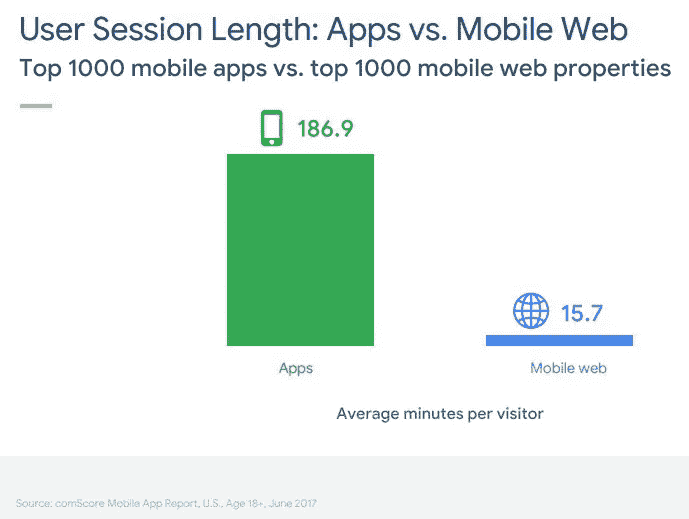
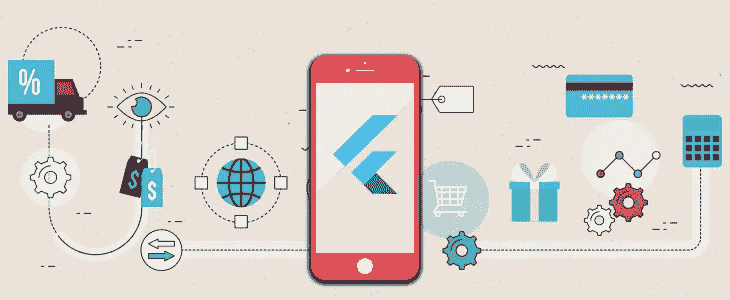
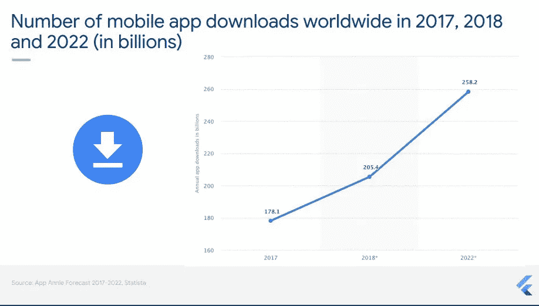

# 为什么您的 Shopify 网站需要一个移动应用程序？

> 原文：<https://medium.com/hackernoon/why-your-shopify-website-needs-a-mobile-app-ffeb115bcf38>

***几年前，一个 Shopify 网站就足以让每个零售商经营他们的网上商店。***

然后，就发生了！移动商务或移动商务的重要性开始上升。

在全球范围内，53%的互联网用户使用智能手机进行网上购物。64%的全球移动商务订单来自 iOS 设备。

如今，2016 年至 2022 年间，全球应用经济将从 1.31 万亿美元增长至 6.35 万亿美元。随着这一新趋势的出现，你的 Shopify 网站需要一个大伙伴。

就是向往一个直观的手机 app！

# 将您的 Shopify 商店转换为移动应用程序的原因

从上图可以看出，前 1000 个移动应用和移动网络属性之间的用户会话比较证明了这一点。移动应用程序上的会话持续时间明显更长，表明这是用户最喜欢的购物平台。

当一个网站吸引新客户时，一个移动应用程序有能力留住忠诚的客户。此外，一个直观的移动应用程序抓住了客户的注意力，并及时向他们提供最新产品的更新(这可能是非常诱人的很多次！).

如果你的客户对某个产品已经关注了很长时间，那么你的移动应用程序会向他们突出显示，最终导致购买。

你还需要什么理由将你的 Shopify 商店转换成移动应用程序？

列表如下:

*   移动应用程序可以更好地访问本机功能，并且被认为更加灵活和易于访问。
*   移动应用提供更好的多渠道和用户体验。
*   移动应用增加了用户参与度和转化率。
*   移动应用为忠诚度计划提供了更大的空间。
*   移动应用促进社交分享。
*   移动应用在顾客和卖家之间建立了一种持续的关系。
*   你可以通过移动应用程序获得更深入的分析数据和客户行为模式分析。
*   由于移动应用可以接触到更广泛的受众，它很容易传播关于你的品牌的好消息。

# 有哪些挑战？

现在，您知道将您的 Shopify 商店转化为移动应用程序的重要性了。但是有那么简单吗？

嗯，不是的。很多次，我们面对我们的客户分享他们对移动商务转型的一些主要关注。尽管他们知道为他们的 Shopify 网站提供移动应用程序的优势，但他们经常因为这些担忧而落后。

其中一些列举如下:

*   他们最近开始使用 Shopify 网站。
*   他们的 Shopify 网站运行良好，所以他们不想扩大规模。
*   他们没有资源和带宽。
*   他们担心在 iOS 和 Android 上分别开发应用程序所需的成本和时间。
*   他们关心的是 App Store 和 Play Store 提交。
*   他们怀疑它是否能在 SEO 方面产生更好的结果。
*   他们期待立竿见影的效果(高期望！).

要关注的问题可能是无止境的。移动应用为零售企业提供了广泛的优势。尽管如此，糟糕的移动体验可能会让用户不再访问。

在所有情况下，您对移动平台和技术的选择最为重要。如果你想专注于一个单一的平台，如 iOS 或 Android，那么你可以选择任何利基技术，如 Swift，Objective-C 或 Java 等。然而，如果您需要通过多种方式征服更广泛的细分市场，那么最终的选择是使用跨平台技术。

我们的答案总是常青技术之一——颤振。

作为一家 Flutter 开发公司，SayOne 如今是顶级的数字解决方案提供商之一(你可以在这里阅读我们的 Clutch 评论[)。从一开始，我们就对 Flutter 及其优势着迷。](https://clutch.co/profile/sayone-technologies)

今天，我们的大部分移动应用程序开发解决方案都运行在这个现代化的反应式框架上。你可以从我们的 [GitHub Repo](https://github.com/sayonetech) 进一步了解我们对 Flutter 的贡献。

# 为您的 Shopify 网站摇旗呐喊

那么，Flutter 有什么特别之处呢？它能解决所有这些挑战吗？

是的，可以。所有与将您的 Shopify 网站转换为移动应用程序相关的难题都可以使用 Flutter 解决。

Flutter 坚持只写一次就到处运行的原则。在这种情况下，更快的上市时间无疑是一个有利因素。单一代码库对 QA 和开发团队来说也意味着更少的麻烦。

早些时候，我们还认为它只是另一种边缘改进的跨平台技术。但是当我们使用 Flutter 开发应用程序时，它确实被证明是非常有益的。

质量差的用户界面(UI)和对本地特性的有限访问的概念在实践中开始随着颤动而逐渐消失。它为小工具提供了简单的定制功能，因此很快赶上了原生应用。

第二个是关于管理费用。我们中的许多人认为，如果 Flutter 像它看起来那样好，那么它肯定很贵。不尽然！每样好东西都不需要很贵。Flutter 是一项开源且完全免费的技术。这都要感谢谷歌！

此外，为两个平台租用独立资源的额外成本也随着 Flutter 消失得无影无踪。Flutter 可以让你更快地构建漂亮的应用程序，同时保持高效和免费。

谈到应用商店提交和优化，我们有了 Flutter，一切都变得简单而容易。一旦你熟悉了应用商店优化(ASO)技术，你的移动应用就不会被落下。在 SayOne，我们从一开始就将 ASO 作为最佳实践。

关于 Flutter 还有很多要说的。你也可以看看我们最近的一些博客，比如[为什么我们选择 Flutter 进行移动应用开发](https://www.sayonetech.com/blog/why-we-chose-flutter-mobile-app-development/)来快速了解一下。另一方面，如果你正在寻找一些使用 Flutter 的高端技术，我们这里有:[如何在 Flutter 中创建自定义布局](https://www.sayonetech.com/blog/how-create-custom-layout-widgets-flutter/)和[如何使用 Flutter 构建 iPhone 计算器](https://www.sayonetech.com/blog/how-build-iphone-calculator-using-flutter/)。

# 结论:是时候让你的 Shopify 商店飘起来了

你现在知道统计数据了。从上图可以看出，全球移动应用下载量在逐年增加。事实证明，Flutter 是许多行业专家的首选。

电子商务巨头阿里巴巴已经使用 Flutter 来增强其应用程序的某些部分。中国人称赞 Flutter 跨平台的一致性、直观的 UI 设计和易学性。

因此，Flutter 正致力于打造卓越的移动商务体验。

你准备好了吗？那么，[我们开始吧！](https://www.sayonetech.com/contact/)

*最初发布于*[*https://www . sayone tech . com/blog/why-your-shopify-website-needs-mobile-app/*](https://www.sayonetech.com/blog/why-your-shopify-website-needs-mobile-app/)*。*