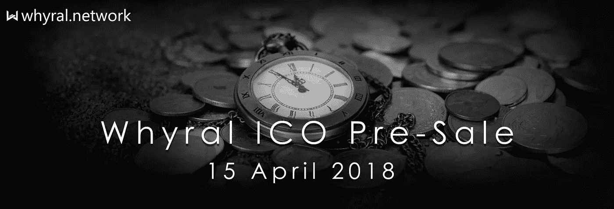

# Whyral ICO 预售将于 2018 年 4 月 15 日上线

> 原文：<https://medium.com/hackernoon/whyral-ico-pre-sale-to-go-live-on-15-april-2018-c34fa22264b1>

Whyral Token 将于 2018 年 4 月 15 日(世界协调时上午 9 点)开始预售。预售将于 2018 年 5 月 31 日结束。在预售期间，买家将有机会以非常低的价格购买 Whyral Token，因为有很大的折扣。以太坊将用于执行所有的交易。1 ETH 在预售期间可以获得 7000 Whyral Token，而在 ICO 的最后阶段，1 ETH 只能获得 4667 Whyral Token，因此在预售期间提供 50%的奖金。为了购买代币，必须进行至少 0.1 ETH 的交易。

总共有 1.5 亿 Whyral 代币可供使用。这 1.5 亿中，69%(1.035 亿)可供出售。预售期间，最多可销售 4200 万个代币。最后阶段，ICO 第三阶段，将于 2018 年 8 月 15 日结束。在 ICO 产生的所有收益中，42%将用于产品营销，35%将用于研发，20%将用于运营成本，3%将用于支付法律费用。

关于 Whyral

Whyral 是一个基于人工智能的去中心化社交媒体影响者营销和影响者评估平台，由[区块链](https://hackernoon.com/tagged/blockchain) [技术](https://hackernoon.com/tagged/technology)提供支持。这是一个将品牌和影响者联系在一起的平台。Whyral 利用智能合同使系统变得简单可靠。智能合同用于以 Whyral 令牌(一种 ERC20 令牌)的形式向影响者付款。Whyral 是世界上唯一一个采用智能分析&人工智能的影响者营销平台，用于评估影响者的渠道和优化活动。

要查看我们的网站，请访问 [https://whyral.network](https://whyral.network)

要查看 Whyral 的测试版，请访问 [https://whyral.io](https://whyral.io)

[脸书](https://www.facebook.com/Whyralofficial/) [推特](https://twitter.com/whyral_official) [领英](https://www.linkedin.com/company/whyral/) [电报](https://t.me/joinchat/F4jtxhI7hvtbP48aGpINDw) [不和](https://discordapp.com/invite/atG8R9K) [Youtube](https://www.youtube.com/channel/UCrjc0sGAhsZSFzeRWM4Lpog)