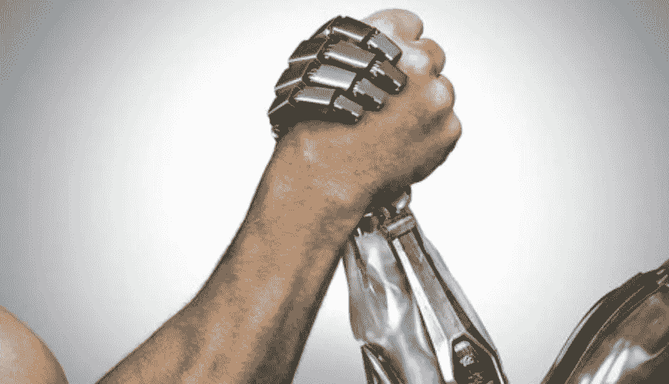
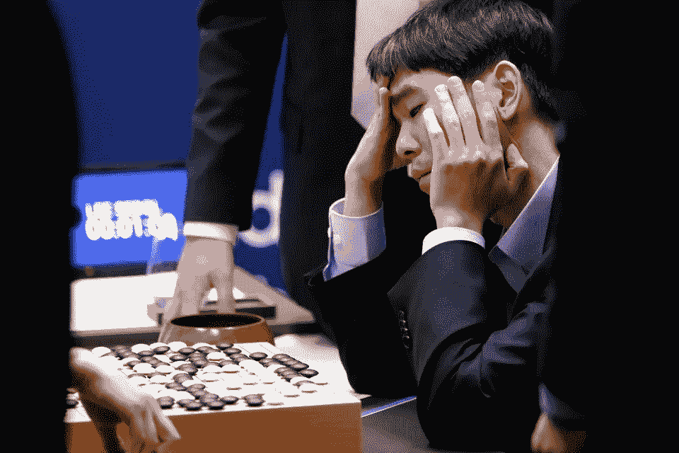

# ‘AI’会接管我们的工作吗？

> 原文：<https://medium.com/hackernoon/will-ai-take-over-our-jobs-1c6e2ebdb7b0>

> [你可以在 Twitter @bhutanisanyam1](http://twitter.com/bhutanisanyam1) 上找到我，在 [Linkedin 上联系我](https://www.linkedin.com/in/sanyambhutani/)

安艾和[自动驾驶汽车爱好者](https://becominghuman.ai/a-self-driving-new-year-33284e592f35)对[未来](https://hackernoon.com/tagged/future)的憧憬

[Source](https://www.linkedin.com/pulse/robots-vs-humans-ai-bring-advertising-apocalypse-dr-marcio-borlenghi/)

随着“深度[学习](https://hackernoon.com/tagged/learning)”、“机器 T10 学习 T11”、“数据科学 T12”或“人工智能革命”的大肆宣传，我们的社会中有一些常见的重复担忧，它们以不同的形式不断出现:

*   AI 会接管我们的工作吗？
*   机器人会偷走我的收入吗？
*   会出现大规模的“工作萧条”吗？
*   我是一名司机，自动驾驶汽车会取代我吗？
*   (举个极端)未来机器人会统治我们吗？

我将尝试陈述我作为一个人工智能爱好者的观点(对不起，人类😜).

# 人工智能会取代我们的工作吗？

首先，这需要一个全面而强大的智能，而这至少需要几十年的时间。

> 我们离制造一台完美的智能洗衣机真的很近了
> ——费李非

截至 2018 年，人工智能似乎擅长非常具体的任务，这些系统非常脆弱，在非常有限的情况下，可以应用于不同的领域。这些任务本身对于给定的条件来说是极其特殊的。

在现实世界中，没有了等式的约束，我怀疑一个普遍的智力变量是否会成立(在不久的将来)。

[我们离完全自动驾驶的世界还有多远？](https://hackernoon.com/how-far-are-we-from-a-fully-autonomous-driving-world-89fde97b5352)

# 会出现大规模的“工作萧条”吗？

这似乎是最大的担忧，既然 AI 可以更好地完成我们的任务，我们会怎么做？

我坚决不同意这种普遍的看法，首先是因为这样一个系统并不近在咫尺，原因如下:

*   到目前为止，这个系统非常脆弱。
*   这些任务不是完全自动化的:超参数调整是手动完成的。
*   缺乏理解:“深度”神经网络大多是黑盒(即使在我们将引擎盖下的过程可视化之后)。
*   边缘案例:DL 不擅长处理边缘案例。(特别是涉及到自动驾驶的时候)。

第二，纵观人类历史，每当我们看到技术以高效的方式取代人类从事我们的工作时，它就使我们能够担心更重要的任务。

自动呼叫路由取代了电信交换局的工作人员吗？

**是的**，他们‘抢走’了他们的工作(或者取代了他们)。但是我确信自动化是必要的。我无法想象等几天一个运营商来发布我的 Instagram 故事。有了互联网和全球连接，任务需要即时完成。因此，人类被取代了。

Technology acceptance curve. Source: MIT 6.S094 Lecture Slides

每个“创新”的接受曲线。注意:1900 年以前几乎没有技术，随着时间的推移，曲线变得越来越陡，越来越近。

每次我们引入新的“技术”，它都有取代某些工作的趋势。

汽车取代了马车，马车司机。

电视取代了街头剧院。

媒介正在取代报纸(如果我敢这么说的话)。

所有这些都带来了工作萧条吗？
我不这么认为。
(例子不全面，但希望你能明白)。

# 自动驾驶汽车会取代司机吗？

是的，确实如此。但是你的通勤自由呢？

我们一生中很大一部分时间都花在通勤上。不再堵车怎么样？还是在旅途中想做什么就做什么的自由？

没有车，只在需要通勤的时候召唤一辆怎么样？

通过让它自动解决问题来解决停车问题怎么样？

我认为对于每一项大规模影响世界的技术来说，利总是大于弊。毕竟，我们称之为“创新”是有原因的。

> 我是巴斯蒂安·特龙愿景的坚定信徒:
> AI 让我们更好地完成任务，它将允许人类从事创新任务。我们天生擅长的领域。
> 
> 人工智能将用自动化取代我们所有的‘无聊’任务，并允许我们从事更好、更重要的任务。

Sebastian 在他的 Ted 演讲中认为，在我们一生中的大部分时间里，我们的工作包括做同一项任务的不同部分。同样“无聊”的工作。

关于人类的事情是，我们非常好胜。如果给予正确的推动，我们倾向于推动我们生物智能的极限。

总的来说，人工智能是作为一种技术为我们服务的。任何技术都只有一个目的:帮助我们更好地完成任务。

一旦我们有了创新的竞争意识，我无法想象会发生什么奇迹。如果人工智能取代我们的工作。我们会推回去，找到更好的问题来解决。

这里有一个证据:

Source: AlphaGo Movie

DeepMind 的 AlphaGo 以 4 比 1 的比分令人尴尬地击败了 Lee Sedol。

然而，AlphaGo 推动了 Lee-Sedol 的创新。对于他赢得的第一场比赛，他走了一步 AlphaGo 自己都没有预料到的棋，审查这场比赛的专家也这么认为。

机器神，把人类神推得更好玩了！

失败后，李·塞多尔继续赢得所有与(人类)选手的比赛。

AlphaGo 不是催他提高了吗？

一旦你到了顶端，你会继续工作，但往往会失去竞争意识。Lee Sedol 面对 AlphaGo 的一场失败比赛，这促使他成为一名更好的选手。

我们的创新总是帮助我们提高创新能力。

这就是人性的真相。

# 那么，你认为人工智能会夺走我们的创新工作还是仅仅是我们的‘无聊工作’？

这就是我如何帮助人工智能把世界联系在一起。

你怎么想呢?

> [如果你想要一份深度学习和计算机视觉文章的每周精选列表，请订阅我的时事通讯](http://tinyletter.com/sanyambhutani/)。
> 
> [你可以在 Twitter @bhutanisanyam1](http://twitter.com/bhutanisanyam1) 上找到我，在 [Linkedin 上联系我](https://www.linkedin.com/in/sanyambhutani/)