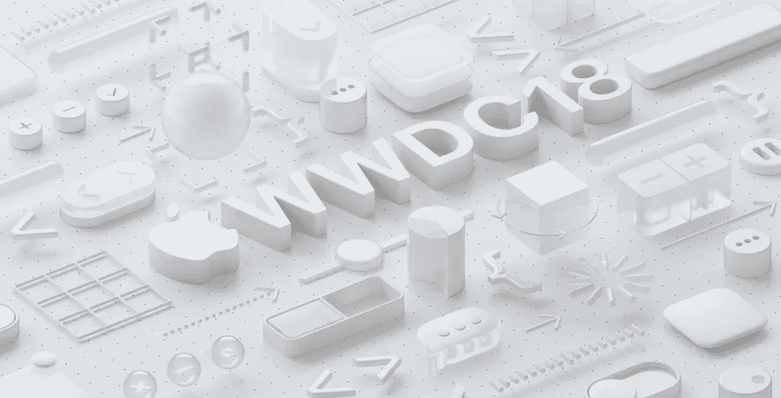

# 苹果会在 2018 年 WWDC 奥运会上推动新的生态系统吗？

> 原文：<https://medium.com/hackernoon/will-apple-drive-new-ecosystems-with-wwdc-2018-9e5a81606ae2>

## 向开发者提供新的功能，可以把苹果手表或 HomePod 从 iPhone 配件变成他们自己的类别

苹果将于 6 月 4 日的一周在[举行今年的开发者大会。围绕](https://www.apple.com/newsroom/2018/03/apples-worldwide-developers-conference-kicks-off-june-4-in-san-jose/)[新设备发布](https://www.forbes.com/forbes/welcome/?toURL=https://www.forbes.com/sites/ewanspence/2018/03/13/apple-macbookair-wwdc-macos-macbook-new-leak-rumor-release-date/&refURL=https://www.google.es/&referrer=https://www.google.es/)有几个传言，但对我来说，这个事件的相关方面实际上是在它的名字:**开发者**。

苹果将在不同的会议上谈论今年晚些时候发布的操作系统(iOS、Mac OS、Watch OS、TV OS)的新功能。他们还将向开发者展示如何使用它们从苹果的平台中提取更多价值，这也将增加苹果设备对其客户的价值。

这是苹果的[生态系统](https://hackernoon.com/tagged/ecosystem)优势:**让开发者进入他们的平台，以便更多的消费者(和更多的开发者)被吸引到他们那里，创造一个强化的良性循环。**

# 生态系统挑战

目前，[苹果的主要收入来源和主要生态系统是围绕 iPhone](https://www.ft.com/content/552f3eee-0799-11e8-9650-9c0ad2d7c5b5) 及其操作系统 iOS 构建的。iPhone 的吸引力正在被目前主要是配件的新设备所利用:Apple Watch、AirPods 甚至 HomePod 智能音箱。

但包括 iPhone 在内的智能手机销售正在达到一定的饱和点，更多的是由更换周期而不是新的收购推动的，正如蒂姆·库克自己所承认的那样:

因此，对于苹果来说，进入一个新的设备周期变得越来越重要，不再受手机的驱动。我在这里看到了两个相关的部分:**苹果手表和 Siri。**

# Apple Watch 生态系统

正如我之前在其他帖子中[所讨论的那样，由于 Apple Watch 是 iPhone 配件的地位，它很难成为一个生态系统。iPhone 的出现降低了开发者创造手表专用体验的动力。这就是为什么许多开发者停止了他们的手表应用程序，像](https://hackernoon.com/the-lte-apple-watch-virtuous-cycle-for-a-new-ecosystem-a9211c608f54)[谷歌和亚马逊](https://www.theverge.com/2017/5/1/15509148/apple-watch-apps-discontinued-google-maps-ebay-amazon)或者[甚至 Slack](http://appleinsider.com/articles/18/01/31/slack-is-latest-major-service-to-drop-standalone-apple-watch-app) ，还有许多其他人甚至从未尝试过。

苹果手表的蜂窝版本可能会推动无手机使用，从而为开发者创造正确的激励，使其成为一个独立的生态系统。但是目前对此有两个主要的限制:

*   蜂窝版本的实际使用。虽然苹果手表本身被大多数分析师认为是成功的，但手机版本的渗透率仍然很小，最近的报告估计其占出货量的 13%。
*   WatchOS 中可供开发者使用的功能，仍然没有 iOS 中可用的功能灵活。

这两个限制实际上是相关的。例如，当它仅限于 Apple Music 时，能够在手机版手表上播放音乐的优势就消失了，这就是目前的情况。但 Spotify 无法向其用户提供类似的体验，因为 WatchOS 不向开发者提供流媒体功能。

# 通话是一项重要功能

另一个相关限制是手表在无电话模式下拨打和接听电话的能力。该手表的蜂窝版本支持通话，但仅适用于常规通话服务(由运营商提供)和苹果的 FaceTime 音频。像 WhatsApp 或 Skype 这样的应用程序无法提供同样的功能。事实上，由于苹果 CallKit 产品的[限制，即使你的手机就在附近，你也无法在手表中接听 WhatsApp 的来电。](/@jorge.serna/wwdc-2017-social-comms-4-webrtc-and-callkit-enhancements-c6d35c4dc41)

呼叫可能听起来像一个非常具体的用例，可能对许多用户来说并不相关，并且肯定只对少数开发人员相关。但是[苹果将太多的注意力放在了手机版的营销方式上，这也影响了设备的渗透率:目前很少有运营商能够提供苹果手表手机版。](https://hackernoon.com/so-in-the-end-the-lte-apple-watch-is-about-calls-29dcdf59be0a)

[我在之前的一篇文章](https://hackernoon.com/why-most-apple-watch-users-will-not-get-lte-calls-on-it-and-why-some-will-2e7a39aad379)中谈到了在蜂窝手表中提供常规通话的复杂性(即使我在一些具体的预测中失败了)，所以我在这里不会深入这些细节，但影响是在美国以外，蜂窝手表的可用性非常有限。

但是**如果苹果允许第三方服务在没有手机的情况下在手表中提供通话，他们可以继续从营销的角度推动这一用例(以及音乐流媒体)，同时让运营商更容易支持设备**，增加其潜在的影响力，因此对开发者具有吸引力。

# 电池问题

当然，苹果不推动无手机使用，因此限制流媒体和通信服务的一个原因可能是因为手表的电池寿命只允许有限的无手机使用。虽然独立使用对于手表成为一个真正的生态系统至关重要，但今天的情况是**考虑将手机长时间留在家里而仅仅依赖这款设备**并不实际。Apple Watch 蜂窝选项只是在跑腿、去健身房或短途散步时偶尔使用。

如果苹果在 WWDC 发布的关于 Watch OS 的公告为开发者提供了流媒体和语音通信功能，或者甚至是其他选项，可以在没有手机的情况下促进与用户的互动，这将指向两件事:

*   下一代 Apple Watch 将在电池寿命方面有重大改进，因此我们应该对 Series 4 感到兴奋。
*   苹果真的在推动 Watch OS 成为一个新的生态系统，最终蚕食 iOS 本身。

# Siri 生态系统

苹果在 2018 年 WWDC 大会上应该改进的另一个生态系统是围绕 Siri 的。本周[Information](https://www.theinformation.com/articles/the-seven-year-itch-how-apples-marriage-to-siri-turned-sour)的一篇文章不仅强调了 Siri 的困境，还强调了其许多问题的核心是缺乏战略方向。

其中一些问题出现在 HomePod 的[评论中，强调尽管该设备的音频质量体验令人惊叹，但其作为智能扬声器的性能远远落后于亚马逊为其 Echo line](https://daringfireball.net/linked/2018/03/05/hackett-homepod) 提供的 Alexa。

这在某种程度上与 Siri 在各种设备上表现出的“精神分裂”行为有关，这表明[多设备生态系统仍然是一个难以解决的问题](https://hackernoon.com/multi-device-is-hard-and-not-even-apple-gets-it-right-b647f0a2f890)。例如，HomePod 强调的[功能之一是，它在说“嘿 Siri”时不会与其他苹果设备(例如，iPhone)发生冲突。不会有冲突，因为只有最近的设备会实际处理语音交互，这在理论上听起来是一个很好的选择。但由于 Siri 在每台设备上提供的功能略有不同，这就成了一个用户体验问题。**如果我试图通过 Siri 呼叫优步，并期望 iPhone 选择请求，但我的请求被不支持该功能的 HomePod 选择，则该功能并不特别有用。**我还在另一篇文章](https://support.apple.com/en-us/HT208472)中讨论了[我所看到的 HomePod 依赖于 iPhone 来实现 iCloud 功能的问题，特别是由于仅限于支持单个用户的限制。所有这些问题意味着 Siri 在各种设备上的体验是不可预测和令人困惑的。](https://hackernoon.com/some-answers-about-the-homepod-c96c7ce93589)

最后，但同样重要的是，开发者增加 Siri 功能的能力非常有限。苹果在 iPhone 中为希望使用语音提供部分功能的应用程序提供了 SiriKit，但用例非常有限(打电话和发消息、乘车预订和餐馆预订、笔记听写和[更多](https://developer.apple.com/documentation/sirikit))，而且在 HomePod 根本不可用。

所有这些加在一起，Siri 对今天的开发者来说并不是一个真正可持续的生态系统，因此对苹果来说也没有它应有的价值。

# 苹果能为 Siri 做些什么

苹果可以在 2018 年 WWDC 大会期间为 Siri 宣布许多事情，这将有助于解决这个问题，并使它成为一个对用户和开发者都更可行的平台。我最喜欢的是:

*   **HomePod**基于语音认证的多用户支持。向开发人员开放这一功能(目前 Alexa 没有为其技能提供这一功能)也可能推动安全语音应用的新趋势，这种应用只会在说话者被正确识别的情况下提供某些选项或信息。
*   【Siri 在所有设备上的一致行为。允许用户以同样的方式做同样的事情，不管他们是在 iPhone、Apple Watch、HomePod、Mac 还是 Apple TV 上使用 Siri。这种基础必须使行为独立于设备，或者至少允许设备相互通信来完成任务。但这也意味着 iPhone 应用程序提供的 SiriKit 功能，如发送 WhatsApp 消息或拖动优步，将可以在各种设备上使用，这反过来使 SiriKit 对开发者更具吸引力。
*   更加灵活的 SiriKit ，从新功能到开发者可获得的无应用体验。如果 Siri 应用程序变得独立于设备，为什么不完全采用某种“iCloud 的 SiriKit ”,这将允许开发人员提供 Siri 功能，而用户不必在 iPhone 上安装应用程序，或者如果他们只是从 Mac 上使用 Siri，甚至不用 iPhone。这也将使 Apple Watch 生态系统变得更有价值，因为越来越多的开发者可以在不实际创建 Watch OS 应用程序的情况下为其提供价值，用户也可以在没有手机的情况下访问这一功能。这基本上是复制亚马逊的 Alexa 技能模式，但苹果设备生态系统提供的规模可能是挑战亚马逊目前在智能助理领域的领导地位的真正方式。

**如果苹果真的抓住机会，通过增强 Apple Watch 和 Siri 周围的(目前只是潜在的)生态系统，进入 iPhone 之后的下一波浪潮，我们可能很快就会看到开发者创造出令人惊叹的新东西。我希望我们能在几个月后的 2018 年 WWDC 奥运会上看到一些。**